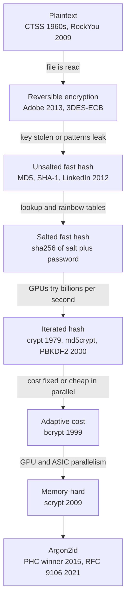
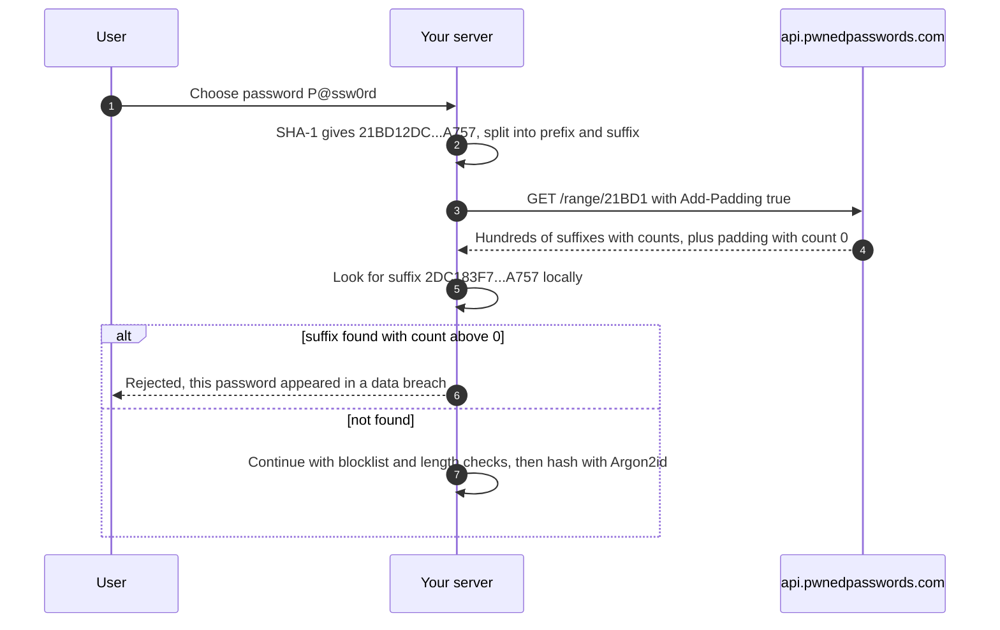
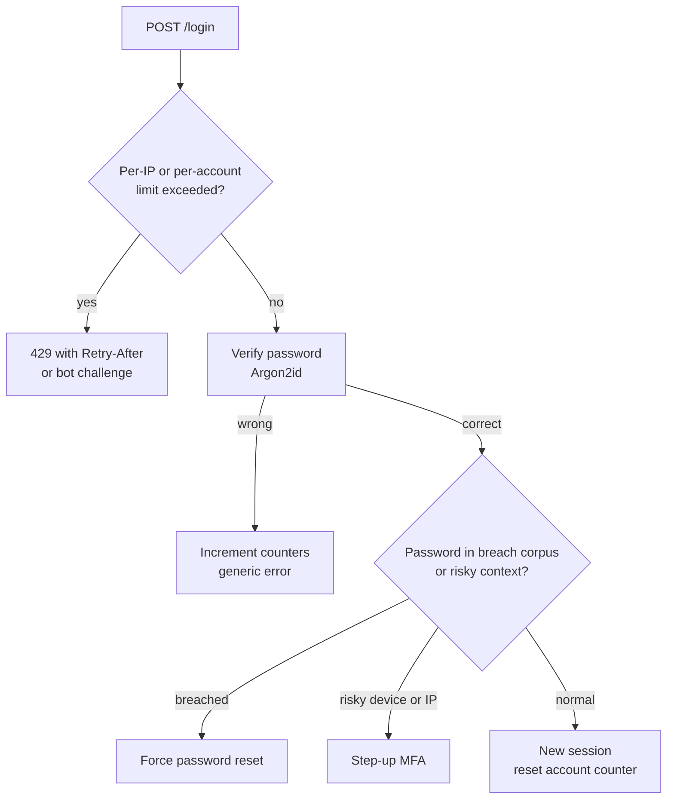
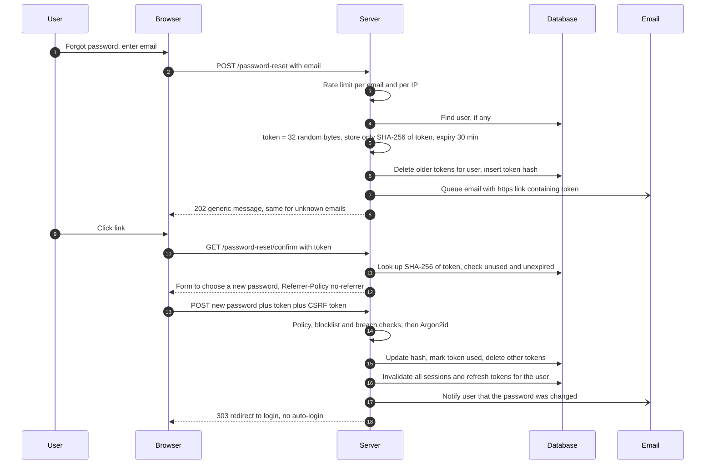
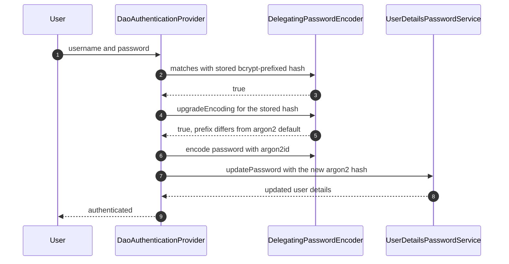

# 02 — Passwords and Credential Storage

Passwords are the oldest authentication method still in daily use, and the one most often implemented badly. This chapter covers the whole lifecycle from a backend developer's point of view: how password storage evolved from plaintext files to memory-hard functions (and which breach forced each step), how to choose and tune Argon2id, bcrypt, scrypt or PBKDF2 today, what NIST SP 800-63B-4 actually requires, how to check passwords against breach corpuses without leaking them, how to stop online guessing and credential stuffing without enabling lockout attacks, how to build a password reset that is not a back door, and how to do all of it in Spring Boot 4 / Spring Security 7, including upgrading old hashes transparently at login.

> **Where this fits in the evolution**
>
> - **Before:** The first time-sharing systems (CTSS, early 1960s) kept passwords in a plaintext file, and it leaked. See [the evolution chapter](01-evolution-of-authentication.md).
> - **What it solved:** One-way, salted, deliberately slow hashing means a stolen credential database does not directly reveal passwords, and each guess costs the attacker real time and memory.
> - **What came next:** Storage only protects against *offline* attacks. Phishing, reuse and online guessing pushed the industry to [MFA and passkeys](11-mfa-passwordless-and-passkeys.md), and to delegating authentication to identity providers via [OpenID Connect](10-openid-connect.md). Passwords remain everywhere, though, so you still need to get this chapter right.

---

## Table of contents

1. [What password storage protects (and what it does not)](#1-what-password-storage-protects-and-what-it-does-not)
2. [The evolution of password storage and the attacks that forced it](#2-the-evolution-of-password-storage-and-the-attacks-that-forced-it)
3. [Core concepts: salt, pepper, work factor, encoded hash formats](#3-core-concepts-salt-pepper-work-factor-encoded-hash-formats)
4. [Choosing an algorithm and parameters in 2026](#4-choosing-an-algorithm-and-parameters-in-2026)
5. [NIST SP 800-63B-4 password rules](#5-nist-sp-800-63b-4-password-rules)
6. [Breached-password checks (HIBP k-anonymity)](#6-breached-password-checks-hibp-k-anonymity)
7. [Online attacks: throttling, lockout and credential stuffing](#7-online-attacks-throttling-lockout-and-credential-stuffing)
8. [User-enumeration-safe responses](#8-user-enumeration-safe-responses)
9. [Secure password reset](#9-secure-password-reset)
10. [Upgrading legacy hashes](#10-upgrading-legacy-hashes)
11. [Spring Boot 4 / Spring Security 7 implementation](#11-spring-boot-4--spring-security-7-implementation)
12. [Production best practices (2026)](#12-production-best-practices-2026)
13. [Common attacks and mistakes](#13-common-attacks-and-mistakes)
14. [Interview questions](#interview-questions)
15. [References](#references)

---

## 1. What password storage protects (and what it does not)

There are two very different ways to attack passwords:

| | Online attack | Offline attack |
|---|---|---|
| Where | Against your live login endpoint | Against a copy of your password database |
| Speed limit | Your rate limiting (a few guesses per account per minute) | Only the attacker's hardware |
| Typical forms | Brute force, password spraying, credential stuffing | Dictionary + rules cracking, GPU/ASIC brute force |
| Main defenses | Throttling, breached-password checks, MFA, bot detection | **Slow, salted, memory-hard hashing**; optional pepper |

Password *storage* is entirely about the offline case: the day your database, a backup, or a log file with hashes leaks (through SQL injection, a misconfigured bucket, a stolen laptop, an insider), how many passwords can the attacker recover, and how fast?

Storage does **nothing** against phishing, password reuse on other sites (credential stuffing), malware on the user's device, or online guessing. Those need the controls in sections 6-8 and, ultimately, [phishing-resistant MFA](11-mfa-passwordless-and-passkeys.md).

---

## 2. The evolution of password storage and the attacks that forced it

### 2.1 Step by step



| Stage | Example | What it looked like | The attack that broke it |
|---|---|---|---|
| Plaintext | CTSS (1960s); RockYou (2009, about 32 million passwords) | `alice:hunter2` | Anyone who reads the file or database has every password |
| Reversible encryption | Adobe (2013) | 3DES in ECB mode with one key for all users | Key compromise reveals everything; ECB made identical passwords produce identical ciphertexts, and plaintext hints did the rest |
| Unsalted fast hash | LinkedIn (2012, unsalted SHA-1); many MD5 sites | `5f4dcc3b5aa765d61d8327deb882cf99` (MD5 of `password`) | Precomputed lookup tables; identical passwords share hashes, so cracking one cracks all |
| Rainbow tables | Oechslin (2003), based on Hellman's 1980 time-memory trade-off | Compact precomputed chains covering huge password spaces | Defeated by **salts**: a table would have to be rebuilt per salt |
| Salted fast hash | `SHA-256(salt + password)` | Unique per user | GPUs compute **billions** of MD5/SHA-1/SHA-256 hashes per second; dictionary + rules attacks crack most human passwords anyway |
| Iterated (key stretching) | Unix `crypt` (25 DES rounds, 1979), md5crypt (1,000 rounds, 1994), PBKDF2 (2000) | Hash repeated thousands of times | Cost is pure computation, which GPUs and ASICs parallelize cheaply; fixed cost in older schemes |
| Adaptive | bcrypt (1999) | Configurable cost factor, `$2b$12$...` | Uses only 4 KiB of memory, so GPUs still parallelize it reasonably; 72-byte input limit |
| Memory-hard | scrypt (2009), Argon2 (2015) | Each guess needs a configurable amount of RAM | This is the current state of the art: RAM per guess limits how many guesses run in parallel on GPUs and ASICs |

### 2.2 Why "slow" and "memory-hard" matter

A defender verifies one password per login. An attacker with a stolen database wants to try billions of guesses. A password hashing function exploits that asymmetry:

- **Slow (time cost):** If one verification takes 100 ms on your server, that is unnoticeable to a user and 10 guesses per second per core for an attacker, instead of billions.
- **Memory-hard (memory cost):** GPUs have thousands of cores but limited memory per core. If every guess needs 19-64 MiB of RAM, the attacker can run far fewer guesses in parallel per device, and custom ASICs become expensive.

The cost knobs must be **raisable over time** as hardware improves, and each stored hash must record its parameters so old and new hashes can coexist.

---

## 3. Core concepts: salt, pepper, work factor, encoded hash formats

### 3.1 Comparison

| | Salt | Pepper | Work factor |
|---|---|---|---|
| What | Random value unique to each password hash | Secret key shared by all hashes | Parameters that make hashing expensive |
| Secret? | No. Stored next to the hash | **Yes.** Stored outside the database (HSM, KMS, secret manager) | No. Stored in the hash string |
| Defeats | Precomputed tables; cracking identical passwords together; tells you nothing about other users | Offline cracking when *only* the database leaks | Brute force speed |
| Size / value | NIST: at least 32 bits; libraries use 16 bytes (128 bits) | At least 112 bits of strength (use 256-bit keys) | Tuned to your hardware (section 4) |
| Rotation | New salt on every password change | Hard: requires rehash at next login or forced resets | Raise over time; rehash on login |

### 3.2 Salt

A salt is generated with a cryptographically secure random generator for **each** password (and regenerated whenever the password changes). It guarantees that two users with the password `Summer2026!` get different hashes, and that an attacker must attack each hash separately. Every modern password hashing function generates and embeds the salt for you. **Never** use the username, user ID or a constant as the salt.

NIST SP 800-63B-4 wording: the salt *SHALL* be at least 32 bits and chosen to minimize collisions among stored hashes, and both salt and hash *SHALL* be stored for each password.

### 3.3 Pepper

NIST SP 800-63B-4 says verifiers *SHOULD* perform an additional iteration of a keyed hashing or encryption operation using a secret key known only to the verifier, stored separately from the hashed passwords, ideally inside an HSM or trusted execution environment. If an attacker steals the database through SQL injection but not the key, the hashes are useless to them.

Two ways to apply it:

| Strategy | How | Trade-off |
|---|---|---|
| **Post-hash pepper** (recommended) | `stored = HMAC-SHA256(pepper, argon2id(password, salt))`, or encrypt the Argon2id output with a KMS key | Pepper can be rotated by re-wrapping stored values without knowing passwords (with encryption); clean separation |
| Pre-hash pepper | `argon2id(HMAC(pepper, password), salt)` | Rotating the pepper requires every user to log in or reset |

A pepper is defense in depth, not a substitute for a strong password hash. If you cannot manage a key properly (rotation, backup, access control), skip it rather than do it badly; losing the pepper locks every user out.

### 3.4 Encoded hash formats

Modern hashes are self-describing strings, which is what makes migration possible.

```text
PHC string format (Argon2id):
$argon2id$v=19$m=19456,t=2,p=1$c2FsdHNhbHRzYWx0c2FsdA$Qm9ndXNoYXNoQm9ndXNoYXNoQm9ndXNoYXNo
 |         |    |                |                      |
 algorithm version  memory KiB, iterations, parallelism  salt (Base64)  hash (Base64)

bcrypt:
$2b$12$R9h/cIPz0gi.URNNX3kh2OPST9/PgBkqquzi.Ss7KIUgO2t0jWMUW
 |   |  |                     |
 ver cost  22-char salt          31-char hash

Spring Security DelegatingPasswordEncoder adds an id prefix:
{argon2}$argon2id$v=19$m=19456,t=2,p=1$...
{bcrypt}$2a$10$...
{pbkdf2@SpringSecurity_v5_8}...
```

(The salts and hashes above are illustrative.) The `{id}` prefix tells Spring which encoder verifies the hash; the parameters inside tell the encoder how to recompute it. Store the full string in a column wide enough for future formats (`VARCHAR(255)` or `TEXT`).

---

## 4. Choosing an algorithm and parameters in 2026

### 4.1 Decision table

| Algorithm | When to use | Minimum parameters (OWASP Password Storage Cheat Sheet) | Notes |
|---|---|---|---|
| **Argon2id** | **Default for new systems** | m=19 MiB (19456 KiB), t=2, p=1 | Equivalent alternatives: m=46 MiB/t=1, m=12 MiB/t=3, m=9 MiB/t=4, m=7 MiB/t=5 (all p=1). Use the *id* variant. |
| scrypt | When Argon2id is unavailable | N=2^17 (128 MiB), r=8, p=1 | Memory-hard; tuning is less intuitive |
| bcrypt | Legacy systems already using it | Cost ≥ 10 (12 is common in 2026) | **72-byte input limit**; never pre-hash with a plain fast hash (see 4.3) |
| PBKDF2-HMAC-SHA256 | Only where FIPS 140 validation is required | 600,000 iterations | Not memory-hard. PBKDF2-HMAC-SHA512: 220,000. PBKDF2-HMAC-SHA1: legacy only. |
| MD5, SHA-1, SHA-256 (single or few iterations) | **Never** for passwords | n/a | Fine for high-entropy tokens, never for human passwords |

NIST SP 800-63B-4 says an approved password hashing scheme from the latest revision of SP 800-132 (which currently specifies PBKDF2) or updated NIST guidance *SHOULD* be used, with a cost factor that *SHOULD* be "as high as practical" and increased over time. (The previous revision, SP 800-63B-3, explicitly recommended memory-hard functions.) NIST announced in 2023 that it will revise SP 800-132 to approve an additional memory-hard function. Unless you are bound to FIPS-validated modules, Argon2id is the stronger practical choice, and it is what this guide uses.

### 4.2 Tuning for your hardware

The OWASP minimums are a floor. Tune upward on your production hardware:

1. Start from m=19 MiB, t=2, p=1.
2. Benchmark verification on a production-sized instance under realistic concurrency.
3. Increase memory first (it hurts attackers most), then iterations, until a single verification takes roughly 100-500 ms and stays well under 1 second (OWASP: calculating a hash should take less than one second).
4. Check the **capacity math**: memory per hash × peak concurrent logins must fit comfortably in RAM. At 19 MiB per hash, 50 simultaneous verifications need about 950 MiB. At 64 MiB, the same peak needs 3,200 MiB (about 3.1 GiB).
5. Record the parameters (they are in the hash string) and revisit them every year or two.

Login is an expensive endpoint by design, which makes it a denial-of-service target. Protect it:

- Rate limit **before** hashing (section 7).
- Bound concurrency of hash computations (a semaphore or dedicated executor), returning `503`/`429` instead of exhausting memory.
- Cap password length at something generous but finite (for example 128 or 256 characters) to bound pre-processing cost; NIST says verifiers *SHOULD* permit at least 64 characters.

### 4.3 bcrypt's 72-byte problem

bcrypt only uses the first **72 bytes** of input. With UTF-8, a 30-character password in some scripts already exceeds that. Silently truncating violates NIST's rule that the verifier *SHALL* verify the entire submitted password. Real consequences: Spring Security's CVE-2025-22228 (March 2025) was a `BCryptPasswordEncoder.matches` flaw where inputs longer than 72 characters could match on their first 72 characters; fixed versions now refuse to *encode* passwords longer than 72 bytes.

Options if you must keep bcrypt:

- Enforce a maximum of 72 bytes (not characters) and tell users.
- Pre-hash with a **keyed** HMAC (a pepper) and Base64-encode the result before bcrypt: `bcrypt(base64(HMAC-SHA384(pepper, password)))`. Pre-hashing with a plain unkeyed hash enables "password shucking" (attackers test leaked unsalted hashes from other breaches against your bcrypt hashes) and raw binary digests can contain NUL bytes that truncate input in some implementations.
- Better: migrate to Argon2id (section 10).

---

## 5. NIST SP 800-63B-4 password rules

NIST SP 800-63B-4 (final, July 2025) is the most widely referenced password policy standard. These are its verifier requirements for passwords (section 3.1.1.2), quoted closely:

| Requirement | NIST SP 800-63B-4 |
|---|---|
| Minimum length, password is the only factor | *SHALL* be at least **15 characters** |
| Minimum length, password only used as part of MFA | *MAY* be shorter but *SHALL* be at least **8 characters** |
| Maximum length | *SHOULD* permit at least **64 characters** |
| Character set | *SHOULD* accept all printing ASCII and space; *SHOULD* accept Unicode; each Unicode code point counts as one character |
| Composition rules | *SHALL NOT* impose them (no "must contain a digit and a symbol") |
| Periodic change | *SHALL NOT* require it; *SHALL* force a change if there is evidence of compromise |
| Hints | *SHALL NOT* store hints accessible to an unauthenticated claimant |
| Security questions | *SHALL NOT* prompt users to use knowledge-based authentication when choosing passwords |
| Full verification | *SHALL* request the full password and verify all of it (no truncation, no "enter characters 3, 7 and 9") |
| Unicode normalization | *SHOULD* apply NFC normalization before hashing |
| Blocklist | *SHALL* compare new passwords against a blocklist of commonly used, expected or compromised values (breach corpuses, dictionary words, context-specific words like the service name or username); *SHALL* tell the user why a password was rejected |
| Guidance | *SHALL* offer guidance to help users choose a strong password |
| Password managers | *SHALL* allow password managers and autofill; *SHOULD* allow paste |
| Show password | *SHOULD* offer an option to display the password while typing |
| Rate limiting | *SHALL* limit failed attempts (section 7) |
| Transport | *SHALL* use approved encryption and an authenticated protected channel |
| Storage | *SHALL* salt and hash with a suitable password hashing scheme; salt ≥ 32 bits; *SHOULD* add a keyed hash/encryption step with a separately stored secret key |

### 5.1 Why NIST dropped composition rules and rotation

Both rules sound strict but make passwords *weaker* in practice:

- **Composition rules** produce predictable patterns: capital first letter, digit and symbol at the end (`Password1!`). Attackers' cracking rules model these patterns exactly. Length and a blocklist do more.
- **Forced rotation** makes users choose a base password and increment it (`Spring2026!` → `Summer2026!`). An attacker who cracks one version guesses the next. Rotation also encourages writing passwords down. Change passwords when there is *evidence* of compromise, not on a calendar.

### 5.2 Practical policy for an application in 2026

| Rule | Value |
|---|---|
| Minimum length | 15 code points if password-only accounts exist; 8 if every account must also use a second factor |
| Maximum length | At least 64; cap at 128-256 to bound hashing cost (bcrypt: 72 bytes max) |
| Allowed characters | All Unicode, NFC-normalized; count code points, not bytes or UTF-16 chars |
| Blocklist | Breached passwords (HIBP), the top common passwords, the app name, the username/email and simple variants |
| Composition / rotation | None / only after compromise |
| UX | Strength meter or guidance; show-password toggle; allow paste and password managers; explain rejections |

In Java, count code points, not `String.length()` (which counts UTF-16 units, so many emoji count as 2):

```java
int length = password.codePointCount(0, password.length());
```

---

## 6. Breached-password checks (HIBP k-anonymity)

### 6.1 Why

Credential stuffing works because users reuse passwords that already leaked elsewhere. NIST requires checking new passwords against compromised values. The largest public corpus is Have I Been Pwned's **Pwned Passwords**, which can be queried without revealing the password, or downloaded and hosted yourself.

### 6.2 How k-anonymity works

The client never sends the password or even its full hash:

1. Compute `SHA-1(password)` (uppercase hex). Example: `P@ssw0rd` → `21BD12DC183F740EE76F27B78EB39C8AD972A757`.
2. Send only the first **5 hex characters** (`21BD1`) to the range API.
3. The API returns every hash **suffix** in its corpus that starts with that prefix (typically several hundred), each with a count.
4. The client checks locally whether its own suffix (`2DC183F740EE76F27B78EB39C8AD972A757`) is in the list.

SHA-1 is used here as a lookup key, not as password storage; collision weaknesses do not matter for this purpose. Because each prefix is shared by hundreds of different hashes, the service cannot tell which password you checked. With the `Add-Padding: true` header, responses are padded with random fake suffixes (count `0`) so their size does not leak the prefix either.



### 6.3 The raw HTTP

```http
GET /range/21BD1 HTTP/1.1
Host: api.pwnedpasswords.com
Add-Padding: true
User-Agent: example-auth-service/1.0
```

```http
HTTP/1.1 200 OK
Content-Type: text/plain

0018A45C4D1DEF81644B54AB7F969B88D65:<n>
00D4F6E8FA6EECAD2A3AA415EEC418D38EC:<n>
...
2DC183F740EE76F27B78EB39C8AD972A757:<n>
...
FFE0E8A7B6D8E7D6C5B4A39281706F5E4D3:0
```

Each line is `SUFFIX:COUNT` (counts shown as `<n>`; the `:0` lines are padding). Every one of the 16^5 possible prefixes returns `200`, so a `404` should never happen.

### 6.4 Operational decisions

| Decision | Recommendation |
|---|---|
| When to check | At registration, password change and reset (required). Optionally at login, then force a reset for compromised passwords. |
| Hosted API vs self-hosted | The API is free for the range endpoint and fine for most apps. High-volume or air-gapped systems can download the corpus and serve the same range lookup internally. |
| Fail open or closed | Most apps fail **open** on API errors at registration (accept the password, log, re-check later) to avoid outages blocking sign-ups. Spring's `HaveIBeenPwnedRestApiPasswordChecker` fails open: on a `RestClientException` it logs and treats the password as not found. Decide deliberately. |
| Threshold | Reject any count above 0. A password seen once in a breach is in attackers' wordlists. |
| Privacy | Never log the password, the full hash or the prefix together with a user identifier. |
| Timeouts | Use short timeouts (1-2 s) and cache nothing that identifies users. |

---

## 7. Online attacks: throttling, lockout and credential stuffing

### 7.1 Three attack shapes

| Attack | Shape | Why per-account lockout alone fails |
|---|---|---|
| **Brute force** | Many passwords against one account | Lockout works, but lets attackers lock out any user whose username they know |
| **Password spraying** | One common password (`Winter2026!`) against many accounts, slowly | Each account sees one or two failures, below any lockout threshold |
| **Credential stuffing** | Real username/password pairs from other breaches, distributed across thousands of IPs (residential proxies) | Each account sees one attempt; each IP sends few requests |

### 7.2 Lockout vs progressive delays

| Strategy | Pros | Cons |
|---|---|---|
| Hard lockout after N failures (until admin unlock) | Strongly stops brute force | Trivial denial of service against known usernames; support load |
| Timed lockout (e.g. 15 min after 10 failures) | Simple | Still a DoS lever; attackers simply wait |
| **Progressive delay / exponential backoff** | Little DoS impact on real users; makes brute force impractical | Needs shared state across instances |
| Bot challenge (CAPTCHA, proof-of-work) after a few failures | Raises cost for automation | Solvable by farms and AI; accessibility concerns; defense in depth only |
| Risk-based step-up (require MFA or email confirmation on suspicious logins) | Best user experience | Needs signals (device, IP reputation, velocity) |

NIST SP 800-63B-4 sets a hard ceiling: unless an authenticator type says otherwise, the verifier *SHALL* limit consecutive failed attempts on a single account to **no more than 100**, after which that authenticator is disabled and must be re-bound (recovery). It explicitly allows lower limits and suggests bot challenges, increasing wait times (for example 30 seconds up to an hour) and risk-based techniques to avoid locking out legitimate users. After a successful authentication, the failure count *SHOULD* be reset.

### 7.3 An example policy

| Counter | Key | Action (example values, tune to your traffic) |
|---|---|---|
| Per account | Normalized username, **whether or not the account exists** | Failures 1-4: none. 5+: exponential delay starting at 1-2 s, capped at 15 min. Optional bot challenge from failure 5. At 100 consecutive failures: disable password login, require recovery, notify the user. Reset on success. |
| Per IP | Client IP (correctly derived behind proxies) | E.g. more than 20 failures per minute: bot challenge or temporary block; consider IP reputation and hosting-provider ranges |
| Global | Whole login endpoint | Alert when the failure ratio or volume spikes (credential stuffing campaign); enable stricter challenges globally |
| Notification | Per account | Email the user on new-device login, lock events, and password or MFA changes |

Two subtle rules:

- **Apply the per-account counter to non-existent usernames too.** If only real accounts get throttled, the throttling response itself enumerates users.
- **Do not reset the IP counter on a successful login.** Otherwise an attacker with one valid account can reset their counter between guesses against others.

### 7.4 Credential stuffing defenses, ranked

1. **MFA**, ideally phishing-resistant passkeys. Stolen passwords alone stop working.
2. **Breached-password checks** at registration, change and (optionally) login.
3. **Bot and automation detection**: IP reputation, residential-proxy and hosting-range detection, TLS/HTTP fingerprinting, request velocity across accounts.
4. **Per-IP and global rate limits** plus the per-account policy above.
5. **Monitoring**: login success ratio, failures per account and per IP, new-device logins, alerting on spikes.
6. **User notifications** for new devices and security changes, so victims can react.



---

## 8. User-enumeration-safe responses

User enumeration lets attackers build target lists for spraying, stuffing and phishing. It leaks through messages, status codes, response time and side effects.

### 8.1 Login

**Bad:** different messages or codes.

```http
HTTP/1.1 401 Unauthorized
Content-Type: application/json

{"error":"user_not_found"}
```

```http
HTTP/1.1 401 Unauthorized
Content-Type: application/json

{"error":"wrong_password"}
```

**Good:** one message, one status, similar timing.

```http
HTTP/1.1 401 Unauthorized
Content-Type: application/json
Cache-Control: no-store

{"error":"invalid_credentials","message":"Invalid username or password."}
```

Timing matters: if non-existent users return instantly while real users take 150 ms for Argon2id, the clock enumerates accounts. Spring Security's `DaoAuthenticationProvider` handles this by running `matches` against a dummy password hash (encoded with your current encoder) when the user is not found, and by default it converts "user not found" into the same `BadCredentialsException` as a wrong password.

### 8.2 Registration

"This email is already registered" is enumeration. Instead, always respond the same way and send an email:

```http
HTTP/1.1 202 Accepted
Content-Type: application/json

{"message":"Check your inbox to continue."}
```

If the address is new, the email contains a verification link. If it already has an account, the email says "someone tried to register with your address; if it was you, sign in or reset your password".

### 8.3 Password reset request

```http
HTTP/1.1 202 Accepted
Content-Type: application/json

{"message":"If an account exists for that address, we have sent a password reset link."}
```

Send the email asynchronously (queue) so response time does not depend on whether a user was found.

### 8.4 Where perfect is impractical

Some products must reveal account existence (for example, a login form that routes users to their company's SSO by email domain). In that case, rely on strong rate limiting and bot detection on that endpoint, and keep the reveal to the minimum needed.

---

## 9. Secure password reset

Password reset is an authentication mechanism in disguise: whoever completes it controls the account. It is often weaker than the login it bypasses.

### 9.1 The flow



### 9.2 Rules

| Rule | Why | Value |
|---|---|---|
| Generate tokens with a CSPRNG | Predictable tokens can be guessed | 32 random bytes (256 bits), Base64URL |
| Store only a hash of the token | A database leak must not yield usable reset links | SHA-256 is fine (high-entropy secret) |
| Single use | A leaked, used link must not work again | Mark `used_at`, reject reuse |
| Short-lived | Limits the window for email compromise or link leakage | 15-60 minutes is typical; NIST caps emailed recovery codes at 24 hours |
| One active token per user | Old emails in an inbox should not stay valid | Delete previous tokens when issuing a new one |
| Bind to the user and purpose | A reset token must not work as an email-verification token, or for another account | Separate tables or a `purpose` column |
| Rate limit requests | Prevents inbox flooding and token-guessing | E.g. 3-5 requests per email per hour; per-IP limits too |
| Do not change the account on request | Locking the account or changing state on "forgot password" is a DoS lever | Only act when a valid token is presented |
| Build links from configuration | Host header injection can send victims a link to the attacker's domain | Fixed base URL from config, HTTPS only |
| Keep the token out of referrers and logs | Third-party scripts or analytics could receive the URL | `Referrer-Policy: no-referrer`; strip query strings from access logs; consider exchanging the token for a short-lived reset session on first GET |
| Respect MFA | A reset must not be an MFA bypass | If the account has a second factor, require it before or after setting the new password |
| After reset, revoke everything | The attacker who knew the old password may still have a session | Invalidate all sessions, refresh tokens and "remember me" cookies; notify the user on all channels |
| No auto-login after reset | Reduces complexity in session handling (OWASP) | Redirect to the normal login |
| No security questions as the only factor | Answers are guessable or public | NIST: *SHALL NOT* use KBA when choosing passwords; OWASP: never as the sole reset mechanism |

NIST SP 800-63B-4 also notes that replacing a forgotten password when the user can still authenticate with another bound authenticator is treated as **binding a new authenticator**, not account recovery, and that every account recovery event must trigger a notification to the user.

### 9.3 The raw HTTP

```http
POST /password-reset HTTP/1.1
Host: app.example.com
Content-Type: application/x-www-form-urlencoded
Cookie: SESSION=anon-7Zp2...
X-CSRF-TOKEN: 4bd8f1c2-...

email=alice%40example.com
```

```http
HTTP/1.1 202 Accepted
Content-Type: text/html; charset=UTF-8
Cache-Control: no-store

<p>If an account exists for that address, we have sent a password reset link.</p>
```

The email link (token shown truncated):

```text
https://app.example.com/password-reset/confirm?token=Vb1y3k0Q6m2...h8Jw
```

```http
POST /password-reset/confirm HTTP/1.1
Host: app.example.com
Content-Type: application/x-www-form-urlencoded
Cookie: SESSION=anon-7Zp2...
X-CSRF-TOKEN: 4bd8f1c2-...

token=Vb1y3k0Q6m2...h8Jw&newPassword=correct+horse+battery+staple+2026
```

```http
HTTP/1.1 303 See Other
Location: /login?reset
Cache-Control: no-store
Referrer-Policy: no-referrer
```

### 9.4 Schema

```sql
CREATE TABLE password_reset_token (
    token_hash  BYTEA        PRIMARY KEY,          -- SHA-256 of the token, never the token itself
    user_id     BIGINT       NOT NULL REFERENCES user_account (id) ON DELETE CASCADE,
    expires_at  TIMESTAMPTZ  NOT NULL,
    used_at     TIMESTAMPTZ,
    created_at  TIMESTAMPTZ  NOT NULL DEFAULT now()
);
CREATE INDEX password_reset_token_user_idx ON password_reset_token (user_id);
```

### 9.5 Authenticated password change

Changing a password from inside a logged-in session is lower risk but still needs care:

- Require the **current password** (or a fresh re-authentication / step-up) so a stolen session cannot silently take over the account.
- Apply the same length, blocklist and breach checks.
- Invalidate all *other* sessions and refresh tokens; keep the current one (rotating its ID).
- Notify the user through an independent channel.
- Support the `/.well-known/change-password` URL so password managers can send users to the right page (Spring Security: `http.passwordManagement(...)`).

---

## 10. Upgrading legacy hashes

You will inherit databases with MD5, SHA-1, unsalted SHA-256 or low-cost bcrypt. You cannot recompute a stronger hash without the plaintext, and you only see the plaintext when the user logs in. The standard approach combines two techniques.

### 10.1 Rehash on login

When a user logs in successfully, you have the plaintext password in memory. If the stored hash uses an old algorithm or weak parameters, compute a new hash and replace it. Spring Security automates this: `DelegatingPasswordEncoder.upgradeEncoding(...)` returns `true` when the stored hash's `{id}` is not the current default, or when the current encoder reports weaker parameters (Argon2: lower memory or iterations; bcrypt: lower cost), and `DaoAuthenticationProvider` then calls your `UserDetailsPasswordService.updatePassword(...)`.



### 10.2 Wrap dormant hashes immediately

Users who never log in would keep weak hashes forever. Wrap them now:

1. For every legacy `md5(password)` value, compute `argon2id(md5_hex)` and store it with a distinct id, for example `{argon2-md5}`.
2. At login, verify by computing `argon2id(md5(password))`, then rehash to plain `{argon2}` (step 10.1).
3. After a deadline (for example 12 months), expire remaining wrapped hashes and require a password reset for those accounts.

Wrapping protects dormant accounts immediately, but nested hashes are weaker than direct ones (attackers who know the inner hash from another breach can shuck it), which is why you still convert at the next login.

### 10.3 Migration checklist

- Inventory every hash format in the database (look at prefixes and lengths).
- Add `{id}` prefixes to existing values (a one-time SQL update), for example `{bcrypt}` in front of `$2a$...` values.
- Deploy a `DelegatingPasswordEncoder` with Argon2id as the default and the legacy encoders registered for matching.
- Implement `UserDetailsPasswordService`.
- Wrap dormant weak hashes.
- Monitor the distribution of hash ids over time and set a deadline.

---

## 11. Spring Boot 4 / Spring Security 7 implementation

The complete runnable version of this section is in [../examples/01-session-auth/](../examples/01-session-auth/).

### 11.1 Dependencies

Spring Security's `Argon2PasswordEncoder` uses Bouncy Castle, which Spring Boot does not manage, so declare it explicitly (1.85 is the version Spring Security 7.1.1 builds against):

```xml
<dependency>
    <groupId>org.springframework.boot</groupId>
    <artifactId>spring-boot-starter-security</artifactId>
</dependency>
<dependency>
    <groupId>org.bouncycastle</groupId>
    <artifactId>bcprov-jdk18on</artifactId>
    <version>1.85</version>
</dependency>
```

Spring Security 7 also ships optional encoders backed by the Password4j library (`Argon2Password4jPasswordEncoder`, `BcryptPassword4jPasswordEncoder` and others in `org.springframework.security.crypto.password4j`) if you prefer it over Bouncy Castle.

### 11.2 PasswordEncoder: Argon2id by default, legacy formats still verified

Out of the box, `PasswordEncoderFactories.createDelegatingPasswordEncoder()` encodes new passwords with **bcrypt** (cost 10). To follow this guide's position (Argon2id, OWASP parameters), build the delegating encoder yourself:

```java
package com.example.auth.passwords;

import java.text.Normalizer;
import java.util.HashMap;
import java.util.Map;

import org.jspecify.annotations.Nullable;
import org.springframework.context.annotation.Bean;
import org.springframework.context.annotation.Configuration;
import org.springframework.security.crypto.argon2.Argon2PasswordEncoder;
import org.springframework.security.crypto.bcrypt.BCryptPasswordEncoder;
import org.springframework.security.crypto.password.DelegatingPasswordEncoder;
import org.springframework.security.crypto.password.PasswordEncoder;
import org.springframework.security.crypto.password.Pbkdf2PasswordEncoder;

@Configuration
class PasswordConfig {

    @Bean
    PasswordEncoder passwordEncoder() {
        String idForEncode = "argon2";
        Map<String, PasswordEncoder> encoders = new HashMap<>();
        // Argon2id: 16-byte salt, 32-byte hash, p=1, m=19456 KiB (19 MiB), t=2 (OWASP minimum).
        // Spring's own defaultsForSpringSecurity_v5_8() uses 16 MiB, slightly below OWASP's floor.
        encoders.put(idForEncode, new Argon2PasswordEncoder(16, 32, 1, 19_456, 2));
        // Legacy formats: verified at login, then transparently upgraded to Argon2id.
        encoders.put("bcrypt", new BCryptPasswordEncoder(12));
        encoders.put("pbkdf2@SpringSecurity_v5_8", Pbkdf2PasswordEncoder.defaultsForSpringSecurity_v5_8());

        DelegatingPasswordEncoder delegating = new DelegatingPasswordEncoder(idForEncode, encoders);
        return new NfcPasswordEncoder(delegating);
    }

    /** Applies Unicode NFC normalization before hashing and verifying, as NIST SP 800-63B-4 recommends. */
    static final class NfcPasswordEncoder implements PasswordEncoder {

        private final PasswordEncoder delegate;

        NfcPasswordEncoder(PasswordEncoder delegate) {
            this.delegate = delegate;
        }

        @Override
        public @Nullable String encode(@Nullable CharSequence rawPassword) {
            return this.delegate.encode(nfc(rawPassword));
        }

        @Override
        public boolean matches(@Nullable CharSequence rawPassword, @Nullable String encodedPassword) {
            return this.delegate.matches(nfc(rawPassword), encodedPassword);
        }

        @Override
        public boolean upgradeEncoding(@Nullable String encodedPassword) {
            return this.delegate.upgradeEncoding(encodedPassword);
        }

        private static @Nullable String nfc(@Nullable CharSequence raw) {
            return (raw != null) ? Normalizer.normalize(raw, Normalizer.Form.NFC) : null;
        }
    }
}
```

Why the id is `argon2` and not something new: Spring's own factory uses `{argon2}` too, so any existing Argon2 hashes keep verifying, and `Argon2PasswordEncoder.upgradeEncoding` returns `true` when a stored hash has lower memory or iterations than the configured ones, so older, weaker Argon2 hashes get upgraded as well. If you raise the parameters later, existing users are upgraded at their next login automatically.

> Introducing NFC normalization into a system that previously hashed raw input can lock out users whose passwords contain characters that NFC changes. If you add it to an existing system, verify against both the raw and normalized forms during a transition period.

### 11.3 UserDetailsService + UserDetailsPasswordService (hash upgrades)

```java
package com.example.auth.passwords;

import org.jspecify.annotations.Nullable;
import org.springframework.security.core.userdetails.User;
import org.springframework.security.core.userdetails.UserDetails;
import org.springframework.security.core.userdetails.UserDetailsPasswordService;
import org.springframework.security.core.userdetails.UserDetailsService;
import org.springframework.security.core.userdetails.UsernameNotFoundException;
import org.springframework.stereotype.Service;
import org.springframework.transaction.annotation.Transactional;

@Service
class AccountUserDetailsService implements UserDetailsService, UserDetailsPasswordService {

    private final UserAccountRepository accounts;

    AccountUserDetailsService(UserAccountRepository accounts) {
        this.accounts = accounts;
    }

    @Override
    @Transactional(readOnly = true)
    public UserDetails loadUserByUsername(String username) {
        UserAccount account = accounts.findByEmailIgnoreCase(username)
                // Spring converts this into the same BadCredentialsException as a wrong password
                // and spends a dummy hash computation, so neither message nor timing reveals existence.
                .orElseThrow(() -> new UsernameNotFoundException("not found"));
        return User.withUsername(account.getEmail())
                .password(account.getPasswordHash())        // e.g. "{argon2}$argon2id$v=19$m=19456,..."
                .authorities(account.getAuthorities())
                .disabled(!account.isEnabled())
                .build();
    }

    /** Called by DaoAuthenticationProvider after a successful login when upgradeEncoding(...) is true. */
    @Override
    @Transactional
    public UserDetails updatePassword(UserDetails user, @Nullable String newEncodedPassword) {
        accounts.updatePasswordHash(user.getUsername(), newEncodedPassword);
        return User.withUserDetails(user).password(newEncodedPassword).build();
    }
}
```

Spring Boot wires this automatically: when exactly one `UserDetailsService` bean, a `PasswordEncoder` bean, a `UserDetailsPasswordService` bean and (optionally) a `CompromisedPasswordChecker` bean are present, Spring Security configures a `DaoAuthenticationProvider` that uses all of them.

### 11.4 Breached-password checking

```java
package com.example.auth.passwords;

import java.time.Duration;

import org.springframework.context.annotation.Bean;
import org.springframework.context.annotation.Configuration;
import org.springframework.http.client.SimpleClientHttpRequestFactory;
import org.springframework.security.authentication.password.CompromisedPasswordChecker;
import org.springframework.security.web.authentication.password.HaveIBeenPwnedRestApiPasswordChecker;
import org.springframework.web.client.RestClient;

@Configuration
class BreachCheckConfig {

    @Bean
    CompromisedPasswordChecker compromisedPasswordChecker() {
        SimpleClientHttpRequestFactory requestFactory = new SimpleClientHttpRequestFactory();
        requestFactory.setConnectTimeout(Duration.ofSeconds(1));
        requestFactory.setReadTimeout(Duration.ofSeconds(2));

        HaveIBeenPwnedRestApiPasswordChecker checker = new HaveIBeenPwnedRestApiPasswordChecker();
        checker.setRestClient(RestClient.builder()
                .baseUrl("https://api.pwnedpasswords.com/range/")
                .requestFactory(requestFactory)
                .defaultHeader("Add-Padding", "true")              // hide the prefix in the response size
                .defaultHeader("User-Agent", "example-auth-service")
                .build());
        return checker;
    }
}
```

With this bean present, `DaoAuthenticationProvider` also checks the password **at login** and throws `CompromisedPasswordException` if it is breached, even though it was correct. Handle that by sending the user to a reset flow (section 11.6). Use the same checker at registration and password change:

```java
package com.example.auth.passwords;

import java.text.Normalizer;
import java.util.Locale;
import java.util.Set;

import org.springframework.security.authentication.password.CompromisedPasswordChecker;
import org.springframework.stereotype.Component;

@Component
class PasswordPolicy {

    static final int MIN_LENGTH_PASSWORD_ONLY = 15;  // NIST SP 800-63B-4, single-factor
    static final int MAX_LENGTH = 128;               // NIST: permit at least 64; cap to bound hashing cost

    private static final Set<String> CONTEXT_WORDS = Set.of("example", "exampleapp", "password");

    private final CompromisedPasswordChecker breachChecker;

    PasswordPolicy(CompromisedPasswordChecker breachChecker) {
        this.breachChecker = breachChecker;
    }

    /** Throws WeakPasswordException with a user-facing reason (NIST: tell the user why). */
    void validate(String rawPassword, String email) {
        String pw = Normalizer.normalize(rawPassword, Normalizer.Form.NFC);
        int length = pw.codePointCount(0, pw.length());   // Unicode code points, not UTF-16 units
        if (length < MIN_LENGTH_PASSWORD_ONLY) {
            throw new WeakPasswordException("Use at least " + MIN_LENGTH_PASSWORD_ONLY + " characters. A short phrase works well.");
        }
        if (length > MAX_LENGTH) {
            throw new WeakPasswordException("Use at most " + MAX_LENGTH + " characters.");
        }
        String lower = pw.toLowerCase(Locale.ROOT);
        String localPart = email.toLowerCase(Locale.ROOT).split("@", 2)[0];
        if (lower.equals(localPart) || CONTEXT_WORDS.contains(lower)) {
            throw new WeakPasswordException("Don't use your email address or the name of this service.");
        }
        if (breachChecker.check(pw).isCompromised()) {
            throw new WeakPasswordException("This password has appeared in a data breach. Please choose a different one.");
        }
    }
}
```

`WeakPasswordException` is a plain application exception that the registration controller turns into a form error. Note that there are **no composition rules** here, by design.

### 11.5 Login throttling with authentication events

Spring Boot auto-configures a `DefaultAuthenticationEventPublisher`, so failed and successful logins arrive as application events. Because `DaoAuthenticationProvider` hides "user not found" behind `BadCredentialsException`, failures for non-existent usernames are counted exactly like real ones, which keeps the throttle enumeration-safe.

```java
package com.example.auth.passwords;

import java.time.Duration;
import java.time.Instant;
import java.util.Locale;
import java.util.Map;
import java.util.Optional;
import java.util.concurrent.ConcurrentHashMap;

import org.springframework.context.event.EventListener;
import org.springframework.security.authentication.event.AuthenticationFailureBadCredentialsEvent;
import org.springframework.security.authentication.event.AuthenticationSuccessEvent;
import org.springframework.security.web.authentication.WebAuthenticationDetails;
import org.springframework.stereotype.Component;

/**
 * Progressive delays per username and per IP. In-memory for clarity: in production keep this
 * state in Redis (or another shared store) with TTLs so every instance sees the same counters.
 */
@Component
class LoginAttemptService {

    private static final int FREE_ATTEMPTS = 5;
    private static final long MAX_DELAY_SECONDS = Duration.ofMinutes(15).toSeconds();

    private record Attempts(int failures, Instant blockedUntil) {}

    private final Map<String, Attempts> counters = new ConcurrentHashMap<>();

    Optional<Duration> retryAfter(String key) {
        Attempts a = counters.get(key);
        if (a == null) {
            return Optional.empty();
        }
        Duration wait = Duration.between(Instant.now(), a.blockedUntil());
        return wait.isNegative() || wait.isZero() ? Optional.empty() : Optional.of(wait);
    }

    @EventListener
    void onFailure(AuthenticationFailureBadCredentialsEvent event) {
        recordFailure(userKey(event.getAuthentication().getName()));
        if (event.getAuthentication().getDetails() instanceof WebAuthenticationDetails details) {
            recordFailure(ipKey(details.getRemoteAddress()));
        }
    }

    @EventListener
    void onSuccess(AuthenticationSuccessEvent event) {
        // Reset only the account counter. Resetting the IP counter would let an attacker with
        // one valid account clear their own throttling between guesses against other accounts.
        counters.remove(userKey(event.getAuthentication().getName()));
    }

    private void recordFailure(String key) {
        counters.compute(key, (k, previous) -> {
            int failures = (previous == null ? 0 : previous.failures()) + 1;
            long delay = failures <= FREE_ATTEMPTS ? 0
                    : Math.min(MAX_DELAY_SECONDS, 1L << Math.min(failures - FREE_ATTEMPTS, 20));
            return new Attempts(failures, Instant.now().plusSeconds(delay));
        });
    }

    static String userKey(String username) {
        return "user:" + (username == null ? "" : username.trim().toLowerCase(Locale.ROOT));
    }

    static String ipKey(String ip) {
        return "ip:" + ip;
    }
}
```

The filter that enforces it runs before Spring's form-login filter, so throttled attempts never reach the (expensive) password hash:

```java
package com.example.auth.passwords;

import java.io.IOException;
import java.time.Duration;
import java.util.Optional;

import jakarta.servlet.FilterChain;
import jakarta.servlet.ServletException;
import jakarta.servlet.http.HttpServletRequest;
import jakarta.servlet.http.HttpServletResponse;
import org.springframework.web.filter.OncePerRequestFilter;

class LoginThrottleFilter extends OncePerRequestFilter {

    private final LoginAttemptService attempts;

    LoginThrottleFilter(LoginAttemptService attempts) {
        this.attempts = attempts;
    }

    @Override
    protected boolean shouldNotFilter(HttpServletRequest request) {
        return !("POST".equals(request.getMethod()) && "/login".equals(request.getServletPath()));
    }

    @Override
    protected void doFilterInternal(HttpServletRequest request, HttpServletResponse response, FilterChain chain)
            throws ServletException, IOException {
        // getRemoteAddr() is only the real client IP if forwarded headers are handled correctly
        // (server.forward-headers-strategy) and only trusted proxies may set them.
        Optional<Duration> wait = attempts.retryAfter(LoginAttemptService.userKey(request.getParameter("username")))
                .or(() -> attempts.retryAfter(LoginAttemptService.ipKey(request.getRemoteAddr())));
        if (wait.isPresent()) {
            response.setStatus(429);
            response.setHeader("Retry-After", String.valueOf(Math.max(1, wait.get().toSeconds())));
            response.setContentType("text/plain;charset=UTF-8");
            response.getWriter().write("Too many attempts. Please wait and try again.");
            return;
        }
        chain.doFilter(request, response);
    }
}
```

### 11.6 The security filter chain

```java
package com.example.auth.passwords;

import java.util.LinkedHashMap;

import org.springframework.context.annotation.Bean;
import org.springframework.context.annotation.Configuration;
import org.springframework.security.authentication.password.CompromisedPasswordException;
import org.springframework.security.config.annotation.web.builders.HttpSecurity;
import org.springframework.security.core.AuthenticationException;
import org.springframework.security.web.SecurityFilterChain;
import org.springframework.security.web.authentication.AuthenticationFailureHandler;
import org.springframework.security.web.authentication.DelegatingAuthenticationFailureHandler;
import org.springframework.security.web.authentication.SimpleUrlAuthenticationFailureHandler;
import org.springframework.security.web.authentication.UsernamePasswordAuthenticationFilter;

@Configuration
class SecurityConfig {

    @Bean
    SecurityFilterChain securityFilterChain(HttpSecurity http, LoginAttemptService attempts) throws Exception {
        http
            .authorizeHttpRequests(auth -> auth
                .requestMatchers("/login", "/register", "/password-reset/**", "/error", "/css/**").permitAll()
                .anyRequest().authenticated())
            .formLogin(form -> form
                .loginPage("/login").permitAll()
                .failureHandler(loginFailureHandler()))
            .addFilterBefore(new LoginThrottleFilter(attempts), UsernamePasswordAuthenticationFilter.class)
            // Serves /.well-known/change-password for password managers.
            .passwordManagement(pm -> pm.changePasswordPage("/account/password"));
        // CSRF protection and session fixation protection (new session ID on login) are on by default.
        return http.build();
    }

    private AuthenticationFailureHandler loginFailureHandler() {
        LinkedHashMap<Class<? extends AuthenticationException>, AuthenticationFailureHandler> handlers = new LinkedHashMap<>();
        // Correct password, but found in a breach corpus: send the user to reset it.
        handlers.put(CompromisedPasswordException.class,
                new SimpleUrlAuthenticationFailureHandler("/password-reset?compromised"));
        // Everything else (unknown user, wrong password, disabled account) gets one generic message.
        return new DelegatingAuthenticationFailureHandler(handlers,
                new SimpleUrlAuthenticationFailureHandler("/login?error"));
    }
}
```

### 11.7 Password reset service

```java
package com.example.auth.passwords;

import java.nio.charset.StandardCharsets;
import java.security.MessageDigest;
import java.security.NoSuchAlgorithmException;
import java.security.SecureRandom;
import java.time.Clock;
import java.time.Duration;
import java.time.Instant;
import java.util.Base64;

import org.springframework.security.crypto.password.PasswordEncoder;
import org.springframework.session.FindByIndexNameSessionRepository;
import org.springframework.session.Session;
import org.springframework.stereotype.Service;
import org.springframework.transaction.annotation.Transactional;

@Service
class PasswordResetService {

    private static final Duration TOKEN_TTL = Duration.ofMinutes(30);
    private static final SecureRandom RANDOM = new SecureRandom();

    private final UserAccountRepository accounts;
    private final PasswordResetTokenRepository tokens;
    private final PasswordEncoder passwordEncoder;
    private final PasswordPolicy policy;
    private final FindByIndexNameSessionRepository<? extends Session> sessions;  // Spring Session (JDBC or Redis)
    private final RefreshTokenRevoker refreshTokens;
    private final Mailer mailer;                 // sends asynchronously; base URL comes from configuration
    private final Clock clock;

    PasswordResetService(UserAccountRepository accounts, PasswordResetTokenRepository tokens,
            PasswordEncoder passwordEncoder, PasswordPolicy policy,
            FindByIndexNameSessionRepository<? extends Session> sessions,
            RefreshTokenRevoker refreshTokens, Mailer mailer, Clock clock) {
        this.accounts = accounts;
        this.tokens = tokens;
        this.passwordEncoder = passwordEncoder;
        this.policy = policy;
        this.sessions = sessions;
        this.refreshTokens = refreshTokens;
        this.mailer = mailer;
        this.clock = clock;
    }

    /** Always returns normally: the caller shows the same message whether or not the account exists. */
    @Transactional
    public void requestReset(String email) {
        accounts.findByEmailIgnoreCase(email).ifPresent(account -> {
            byte[] raw = new byte[32];                                  // 256 bits from a CSPRNG
            RANDOM.nextBytes(raw);
            String token = Base64.getUrlEncoder().withoutPadding().encodeToString(raw);
            tokens.deleteByUserId(account.getId());                      // only one live token per user
            tokens.save(new PasswordResetToken(sha256(token), account.getId(), Instant.now(clock).plus(TOKEN_TTL)));
            mailer.sendPasswordResetLink(account.getEmail(), token);     // link = configured base URL + token
        });
    }

    @Transactional
    public void resetPassword(String token, String newPassword) {
        PasswordResetToken stored = tokens.findById(sha256(token))
                .filter(t -> t.getUsedAt() == null)
                .filter(t -> t.getExpiresAt().isAfter(Instant.now(clock)))
                .orElseThrow(InvalidResetTokenException::new);           // generic "link invalid or expired"
        UserAccount account = accounts.findById(stored.getUserId()).orElseThrow(InvalidResetTokenException::new);

        policy.validate(newPassword, account.getEmail());                // length, context words, breach check
        account.setPasswordHash(passwordEncoder.encode(newPassword));   // "{argon2}$argon2id$..."
        stored.setUsedAt(Instant.now(clock));
        tokens.deleteOtherTokensForUser(account.getId(), stored.getTokenHash());

        // Revoke everything an attacker might still hold.
        sessions.findByPrincipalName(account.getEmail()).keySet().forEach(sessions::deleteById);
        refreshTokens.revokeAllFor(account.getId());

        mailer.sendPasswordChangedNotice(account.getEmail());
    }

    private static byte[] sha256(String token) {
        try {
            return MessageDigest.getInstance("SHA-256").digest(token.getBytes(StandardCharsets.US_ASCII));
        } catch (NoSuchAlgorithmException e) {
            throw new IllegalStateException(e);
        }
    }
}
```

Notes on the design:

- Looking up by the SHA-256 of the token is safe: the token has 256 bits of entropy, so the hash cannot be reversed, and a leaked table contains no usable links.
- If you do not use Spring Session, keep a per-user `credentials_changed_at` timestamp and reject any session or refresh token issued before it.
- If the account has MFA enabled, require the second factor before accepting the new password (see [../examples/04-mfa-totp/](../examples/04-mfa-totp/)).

---

## 12. Production best practices (2026)

| Area | Practice | Concrete values |
|---|---|---|
| Algorithm | Argon2id for new systems; bcrypt only for legacy; PBKDF2 only for FIPS | Argon2id m ≥ 19 MiB, t ≥ 2, p = 1; bcrypt cost ≥ 10; PBKDF2-HMAC-SHA256 ≥ 600,000 |
| Tuning | Benchmark on production hardware; raise over time | 100-500 ms per verification, < 1 s; review yearly |
| Salt | Per password, CSPRNG, handled by the library | 16 bytes (NIST minimum 32 bits) |
| Pepper | Optional; key in HSM/KMS, never in the database or repo | 256-bit key; post-hash HMAC or encryption |
| Format | Self-describing hash with algorithm id and parameters | Spring `{id}` prefix + PHC string; column `VARCHAR(255)`/`TEXT` |
| Migration | Rehash on login; wrap dormant weak hashes; deadline for the rest | `DelegatingPasswordEncoder` + `UserDetailsPasswordService` |
| Policy | NIST SP 800-63B-4 | Min 15 (password-only) or 8 (always with MFA); accept ≥ 64; no composition, no rotation; blocklist |
| Breach checks | At registration, change, reset; optionally at login | HIBP range API with `Add-Padding: true`, 1-2 s timeouts |
| Throttling | Per account (including unknown usernames), per IP, global; progressive delays | Free attempts ~5, exponential delay capped ~15 min; NIST hard cap 100 consecutive failures |
| Enumeration | Same message, status code and timing for every failure | `DaoAuthenticationProvider` timing mitigation; async email sending |
| Reset tokens | Random, hashed, single-use, short-lived, one per user | 256-bit token; 15-60 min; revoke sessions and refresh tokens after reset |
| DoS | Rate limit before hashing; bound concurrent hashes; cap input length | Semaphore around hashing; max password length 128-256 |
| Logging | Log events, not secrets | Never log passwords, hashes, reset tokens or reset URLs |
| Long term | Add MFA and passkeys; consider delegating to an IdP | [Chapter 11](11-mfa-passwordless-and-passkeys.md), [chapter 10](10-openid-connect.md) |

---

## 13. Common attacks and mistakes

| Attack / mistake | What goes wrong | Mitigation |
|---|---|---|
| Plaintext or reversibly encrypted passwords | One breach reveals every password; insiders can read them | One-way password hashing (Argon2id); never encryption for storage |
| Fast hashes (MD5, SHA-1, SHA-256), even salted | GPUs test billions of guesses per second; most human passwords fall | Argon2id/scrypt/bcrypt with tuned cost |
| No salt, or a constant/username salt | Rainbow tables; identical passwords cracked together | Library-generated random salt per hash |
| Pepper stored in the same database or repository | A database dump includes the pepper; no added protection | Keep it in a KMS/HSM or secret manager with separate access control |
| bcrypt with long passwords silently truncated | Different passwords sharing the first 72 bytes match; violates NIST full verification | Enforce 72-byte max, HMAC pre-hash with pepper, or migrate to Argon2id; patch CVE-2025-22228 |
| Unkeyed pre-hash before bcrypt | Password shucking with hashes from other breaches; NUL-byte truncation | Keyed HMAC + Base64, or Argon2id |
| Parameters never revisited | Hashes get cheaper to crack every year | Store parameters, raise them, rehash on login |
| Composition rules and forced rotation | Predictable passwords (`Spring2026!`), user frustration | NIST: length + blocklist; change only on compromise |
| Truncating or limiting passwords to short maxima (e.g. 16) | Blocks passphrases and password managers | Accept at least 64 characters |
| Blocking paste in password fields | Discourages password managers, leads to weaker passwords | NIST: allow password managers and paste |
| Different errors for unknown user vs wrong password | User enumeration for targeted attacks | Generic message, same status and timing |
| Hard account lockout | Attackers lock out users at will | Progressive delays, bot challenges, risk-based step-up; NIST ≤ 100 cap |
| Throttling only real accounts | The throttle itself reveals which accounts exist | Count failures per submitted username regardless of existence |
| Resetting the IP counter on any successful login | Attacker uses one valid account to keep guessing others | Reset only the account counter on success |
| Reset tokens stored in plaintext | Database read access becomes account takeover | Store SHA-256 of the token |
| Long-lived or reusable reset links | Old emails or leaked links take over accounts | Single use, 15-60 min, one active token per user |
| Reset link built from the `Host` header | Host header injection sends a link to the attacker's domain | Base URL from configuration |
| Reset that bypasses MFA | Email compromise skips the second factor | Require the existing second factor during reset |
| Sessions left alive after a reset | The attacker's existing session keeps working | Invalidate all sessions and refresh tokens; notify the user |
| Security questions for recovery | Answers are guessable or researched on social media | Recovery codes, verified email/phone with rate limits, identity re-proofing |
| Logging request bodies on `/login` or reset URLs | Passwords and tokens in log storage | Redact; exclude sensitive endpoints from body logging |

---

## Interview questions

1. **Why shouldn't you store passwords with SHA-256, even with a salt?**
   SHA-256 is designed to be fast, so an attacker with a stolen database can test billions of guesses per second on GPUs, and salting only prevents precomputation and cracking many users at once. Password hashing needs a deliberately slow, memory-hard function such as Argon2id with a tunable cost.

2. **What is the difference between a salt and a pepper?**
   A salt is a random, non-secret value unique to each hash, stored with it, that defeats precomputed tables and makes identical passwords hash differently. A pepper is a secret key shared by all hashes and stored outside the database (HSM/KMS), so a database-only leak is not enough to crack the hashes.

3. **Which password hashing algorithm and parameters would you choose in 2026?**
   Argon2id with at least m=19 MiB, t=2, p=1 (OWASP minimum), tuned upward on production hardware to roughly 100-500 ms per verification. bcrypt with cost ≥ 10 is acceptable for legacy systems; PBKDF2-HMAC-SHA256 with 600,000 iterations only when FIPS validation is required.

4. **What does NIST SP 800-63B-4 say about password length and complexity?**
   At least 15 characters when the password is the only factor, at least 8 when it is only used with MFA, and verifiers should accept at least 64. Composition rules and periodic rotation must not be required; instead, check against a blocklist of common and breached passwords and force a change only on evidence of compromise.

5. **How does the HIBP Pwned Passwords range API avoid learning the password you check?**
   You send only the first 5 hex characters of the password's SHA-1 hash; the API returns all suffixes with that prefix, and you compare your suffix locally. With `Add-Padding: true`, responses include random fake suffixes so the response size does not reveal the prefix either.

6. **How do you migrate a database of unsalted MD5 hashes to Argon2id without forcing a mass reset?**
   Immediately wrap each MD5 value as `argon2id(md5)` with a distinct id so dormant accounts are protected, verify wrapped hashes at login by computing `argon2id(md5(password))`, then rehash the plaintext directly with Argon2id at that login. In Spring, `DelegatingPasswordEncoder` plus `UserDetailsPasswordService` automates the rehash; set a deadline and require resets for accounts that never return.

7. **Why is hard account lockout a bad default, and what does NIST allow instead?**
   It lets anyone lock out a user by guessing wrong repeatedly, and it does not stop password spraying or credential stuffing, where each account sees few attempts. NIST caps consecutive failures at 100 per authenticator and suggests bot challenges, increasing delays and risk-based techniques; combine per-account, per-IP and global limits with MFA and breach checks.

8. **How can a login endpoint leak which users exist, and how do you prevent it?**
   Through different messages or status codes, response timing (no hash computed for unknown users), throttling only real accounts, and registration or reset responses. Prevent it with one generic message and status, a dummy hash computation for unknown users (Spring's `DaoAuthenticationProvider` does this), throttling per submitted username, and identical "check your email" responses with asynchronous email sending.

9. **What properties should a password reset token have?**
   Generated by a CSPRNG with at least 128 (preferably 256) bits, stored only as a hash, single-use, short-lived (15-60 minutes), one active token per user, bound to that user and purpose, delivered via a link built from configuration, and followed by revocation of all sessions and refresh tokens plus a notification. It must not bypass an enrolled second factor.

10. **Why is bcrypt's 72-byte limit a security concern?**
    Input beyond 72 bytes is ignored, so long passphrases (or multi-byte UTF-8 passwords) are silently truncated, which violates NIST's full-verification rule and caused CVE-2025-22228 in Spring Security. Enforce a byte limit, use a keyed HMAC pre-hash, or prefer Argon2id.

---

## References

- NIST SP 800-63B-4, *Authentication and Authenticator Management*, section 3.1.1 (passwords), 3.2.2 (rate limiting), 4.2 (account recovery): https://pages.nist.gov/800-63-4/sp800-63b/
- NIST SP 800-63-4 suite: https://pages.nist.gov/800-63-4/
- NIST SP 800-132, *Recommendation for Password-Based Key Derivation*: https://csrc.nist.gov/pubs/sp/800/132/final
- RFC 9106, *Argon2 Memory-Hard Function for Password Hashing and Proof-of-Work Applications*: https://www.rfc-editor.org/rfc/rfc9106
- RFC 7914, *The scrypt Password-Based Key Derivation Function*: https://www.rfc-editor.org/rfc/rfc7914
- RFC 8018, *PKCS #5: Password-Based Cryptography Specification Version 2.1* (PBKDF2): https://www.rfc-editor.org/rfc/rfc8018
- Provos and Mazières, *A Future-Adaptable Password Scheme* (bcrypt), USENIX 1999: https://www.usenix.org/legacy/event/usenix99/provos/provos.pdf
- Percival, *Stronger Key Derivation via Sequential Memory-Hard Functions* (scrypt), 2009: https://www.tarsnap.com/scrypt/scrypt.pdf
- PHC string format: https://github.com/P-H-C/phc-string-format/blob/master/phc-sf-spec.md
- OWASP Password Storage Cheat Sheet: https://cheatsheetseries.owasp.org/cheatsheets/Password_Storage_Cheat_Sheet.html
- OWASP Authentication Cheat Sheet: https://cheatsheetseries.owasp.org/cheatsheets/Authentication_Cheat_Sheet.html
- OWASP Forgot Password Cheat Sheet: https://cheatsheetseries.owasp.org/cheatsheets/Forgot_Password_Cheat_Sheet.html
- OWASP Credential Stuffing Prevention Cheat Sheet: https://cheatsheetseries.owasp.org/cheatsheets/Credential_Stuffing_Prevention_Cheat_Sheet.html
- Have I Been Pwned, Pwned Passwords API: https://haveibeenpwned.com/API/v3#PwnedPasswords
- Cloudflare, *Validating Leaked Passwords with k-Anonymity* (2018): https://blog.cloudflare.com/validating-leaked-passwords-with-k-anonymity/
- Spring Security reference, Password Storage: https://docs.spring.io/spring-security/reference/features/authentication/password-storage.html
- Spring Security advisory CVE-2025-22228 (bcrypt maximum password length): https://spring.io/security/cve-2025-22228
- W3C WebAppSec, *A Well-Known URL for Changing Passwords*: https://w3c.github.io/webappsec-change-password-url/
