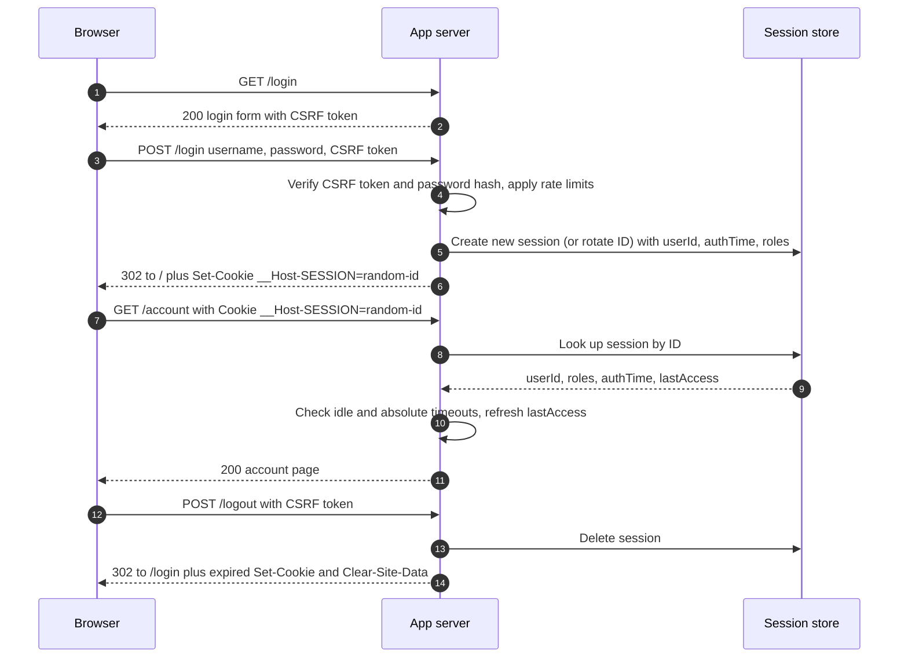
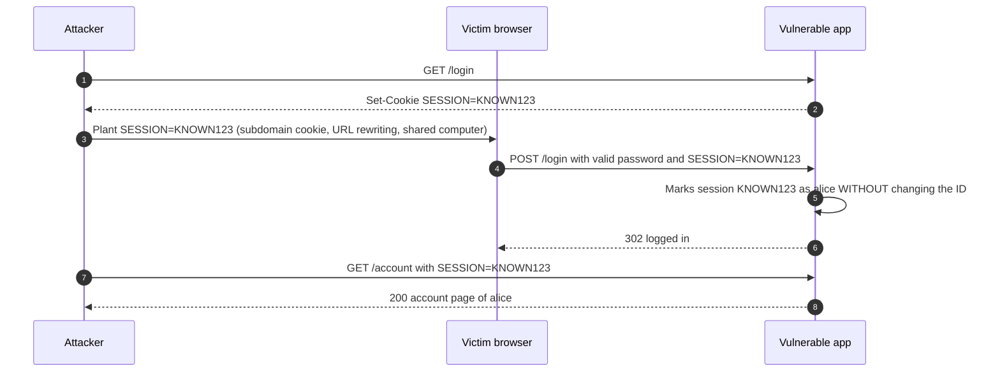
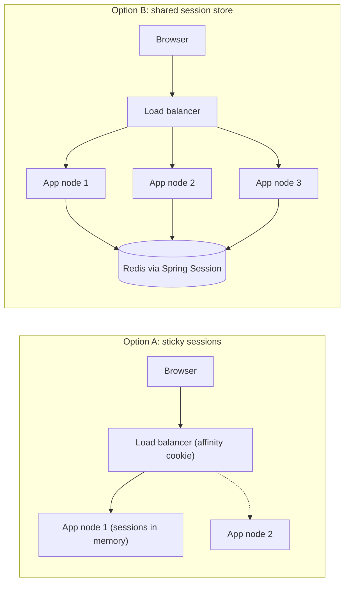
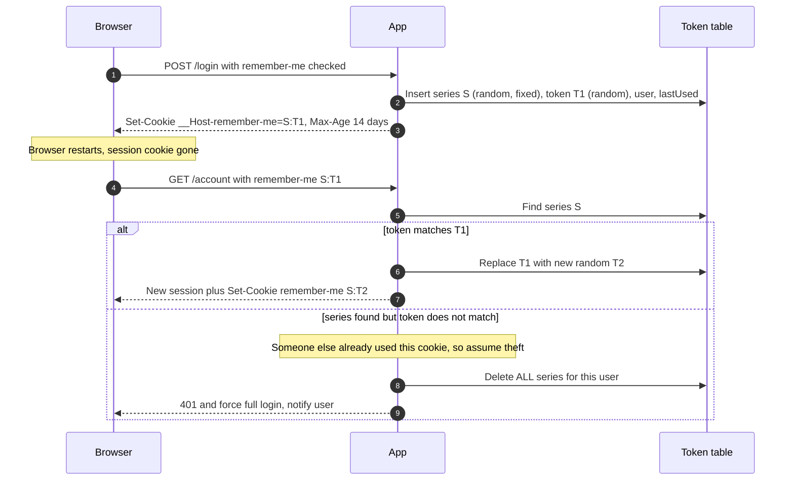
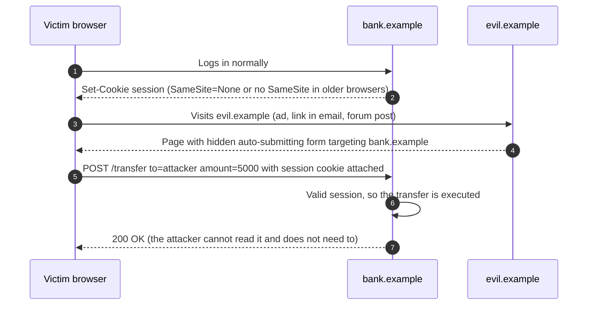

# 04 — Server-Side Sessions, Cookies and CSRF

HTTP is stateless, so after a user logs in, the server needs a way to recognize the next request from the same browser. The classic answer, still the best answer for most first-party web apps in 2026, is a **server-side session**: the server keeps the login state and gives the browser only a random, meaningless **session ID** in a cookie. This chapter covers sessions end to end — ID generation, cookie attributes, fixation, hijacking, timeouts, logout, scaling, and remember-me — and then **CSRF**, the attack that exists precisely because browsers attach cookies automatically.

> **Where this fits in the evolution**
>
> - **Before:** [HTTP Basic/Digest](03-http-basic-digest-and-api-keys.md) re-sent credentials on every request, with no logout and an ugly browser dialog. Early sites also put session IDs in URLs.
> - **What it solved:** Netscape introduced cookies in 1994; standardization followed (RFC 2109 in 1997, RFC 6265 in 2011). Cookies let sites build their own login forms and keep a session with real logout, timeouts, and server-side control.
> - **What came next:** Cookies created CSRF, which led to anti-CSRF tokens (2000s), the `SameSite` attribute (Chrome 51, 2016) and Fetch Metadata headers. Stateless tokens ([JWT](06-tokens-and-jwt.md)) became popular for APIs and mobile, and [OAuth 2](08-oauth-2.md)/[OIDC](10-openid-connect.md) moved login to identity providers. But for browsers the industry came back to cookies: the **BFF pattern** keeps tokens on the server and gives the browser an HttpOnly session cookie. The cookie spec revision "rfc6265bis" was approved by the IESG as a Proposed Standard in December 2025 and was in the RFC Editor queue at the time of writing (check whether it has an RFC number yet).

---

## Table of contents

1. [Why sessions exist](#1-why-sessions-exist)
2. [How a server-side session works end to end](#2-how-a-server-side-session-works-end-to-end)
3. [Session ID requirements](#3-session-id-requirements)
4. [Cookie attributes in depth](#4-cookie-attributes-in-depth)
5. [Session lifecycle and attacks](#5-session-lifecycle-and-attacks)
6. [Scaling sessions and remember-me](#6-scaling-sessions-and-remember-me)
7. [CSRF in depth](#7-csrf-in-depth)
8. [Sessions vs JWT](#8-sessions-vs-jwt)
9. [Production best practices (2026)](#9-production-best-practices-2026)
10. [Common attacks and mistakes](#10-common-attacks-and-mistakes)
11. [Spring Boot 4 / Spring Security 7 configuration](#11-spring-boot-4--spring-security-7-configuration)
12. [Interview questions](#interview-questions)
13. [References](#references)

---

## 1. Why sessions exist

Each HTTP request is independent. Without some shared state, a user would have to send their password with every click — which is exactly what Basic auth does, with all its problems.

A **session** is server-side state associated with one browser for a period of time. The browser holds only a **handle** to it.

| Approach | Where the login state lives | What the browser holds |
|---|---|---|
| Basic/Digest | Nowhere (re-authenticate every request) | The password (cached by the browser) |
| **Server-side session** | Server memory or a shared store (Redis, database) | A random session ID in a cookie |
| Signed cookie / stateless token | Inside the cookie or token itself, signed (and maybe encrypted) | All the claims (user ID, roles, expiry) |

The server-side session is the simplest model to reason about: the session ID is just a random lookup key, the server is the source of truth, and **revocation is instant** — delete the session and the user is logged out everywhere that ID was used.

---

## 2. How a server-side session works end to end



The raw HTTP of the important steps:

```http
POST /login HTTP/1.1
Host: app.example.com
Content-Type: application/x-www-form-urlencoded
Cookie: __Host-SESSION=Zk3Jv0pQ2mVb7XcR1sTn9uWy4AeHdLgK
Origin: https://app.example.com
Sec-Fetch-Site: same-origin

username=alice&password=correct+horse+battery+staple&_csrf=mR4xTq9bLw2vY7kP0sNc
```

```http
HTTP/1.1 302 Found
Location: /
Set-Cookie: __Host-SESSION=8sJq2LxN0vR4tYb6mWc1ZpK9eHdUaFgT; Path=/; Secure; HttpOnly; SameSite=Lax
Cache-Control: no-store
```

Notice that the session ID **changed** at login (`Zk3J...` before, `8sJq...` after). That is the session fixation defense covered in [section 5.1](#51-session-fixation).

```http
GET /account HTTP/1.1
Host: app.example.com
Cookie: __Host-SESSION=8sJq2LxN0vR4tYb6mWc1ZpK9eHdUaFgT
```

What the store holds (illustrative):

```json
{
  "id": "8sJq2LxN0vR4tYb6mWc1ZpK9eHdUaFgT",
  "principal": "alice",
  "authorities": ["ROLE_USER"],
  "authTime": "2026-10-08T09:00:12Z",
  "createdAt": "2026-10-08T09:00:12Z",
  "lastAccessedAt": "2026-10-08T09:41:55Z",
  "maxInactiveInterval": "PT30M",
  "csrfToken": "b1f0c2..."
}
```

Keep session data **small** (identifiers, auth time, a few flags). Load larger user data from the database or a cache when needed.

---

## 3. Session ID requirements

The session ID is a **bearer credential**: anyone who has it is logged in as that user. Its only job is to be impossible to guess and safe to transport.

| Requirement | Detail |
|---|---|
| **Entropy** | OWASP: at least **64 bits of entropy**. In practice use **128 bits or more** — it costs nothing. Tomcat's default generator uses 16 random bytes (128 bits); Spring Session's default is a random UUID (122 random bits). |
| **CSPRNG** | Generate with a cryptographically secure random generator (`SecureRandom`), never `Math.random()`, timestamps, counters, or hashes of user data. |
| **Meaningless** | The ID must contain no user data. All meaning lives server-side. |
| **Unique** | Collisions must be practically impossible (guaranteed by the entropy above). |
| **Neutral name** | `JSESSIONID`, `PHPSESSID` reveal the stack. A neutral name such as `__Host-SESSION` or `__Host-sid` is slightly better and lets you use cookie prefixes. |
| **Cookies only** | Never put the session ID in URLs (`;jsessionid=...` URL rewriting). URLs leak through logs, `Referer` headers, browser history, and shared links. Spring Security disables URL rewriting by default; in Spring Boot also set `server.servlet.session.tracking-modes=cookie`. |
| **Regenerate on privilege change** | New ID at login, at step-up authentication (MFA), and when roles change. |
| **Server-side validation** | Accept only IDs the server issued and that still exist. Reject unknown IDs; never create a session with a client-chosen ID ("strict" session management). |

Why 64 bits is the floor: OWASP's estimate is that with 64 bits of entropy, an attacker making many thousands of guesses per second against an application with a large number of live sessions would still need centuries on average to hit a valid one. With 128 bits, the question disappears.

---

## 4. Cookie attributes in depth

### 4.1 The attributes

```http
Set-Cookie: __Host-SESSION=8sJq2LxN0vR4tYb6mWc1ZpK9eHdUaFgT; Path=/; Secure; HttpOnly; SameSite=Lax
```

| Attribute | What it does | Recommendation for a session cookie |
|---|---|---|
| `Secure` | Browser sends the cookie only over HTTPS (and, in modern browsers, a non-Secure cookie cannot overwrite a Secure one). | **Always.** Combine with HSTS so the first request is never plain HTTP. |
| `HttpOnly` | JavaScript cannot read the cookie via `document.cookie`. | **Always.** Limits damage from XSS (the script can still make requests *as* the user, but cannot steal the ID for use elsewhere). |
| `SameSite=Lax` | Cookie is not sent on cross-site subresource requests or cross-site POSTs, but **is** sent on top-level cross-site GET navigations (clicking a link to your site). | **Default choice** for session cookies. Users arriving from an email link stay logged in. |
| `SameSite=Strict` | Cookie is never sent on any request initiated from another site, even a link click. | Good for high-value apps (banking admin), or for a second "write" cookie. Users clicking a link from email appear logged out on the first page. |
| `SameSite=None` | Cookie is sent in all cross-site contexts. **Requires `Secure`.** | Only when you truly need cross-site use (embedded iframes, some SSO front-channel flows). Then CSRF protection is mandatory. |
| `Domain` | If **omitted**, the cookie is **host-only** (sent only to the exact host that set it). If set to `example.com`, it is sent to `example.com` **and every subdomain**. | **Omit it.** Setting `Domain` exposes the cookie to every subdomain, including forgotten ones vulnerable to takeover. |
| `Path` | Limits which URL paths receive the cookie. | `Path=/`. Path is **not** a security boundary (scripts on other paths of the same origin can still reach it). |
| `Max-Age` / `Expires` | Without them, the cookie is a **session cookie** (deleted when the browser session ends — though "continue where you left off" can restore it). With them, it persists until the date. `Max-Age` wins if both are present. | Session cookie (no `Max-Age`) for the session ID; enforce real expiry **server-side**. Chrome caps persistent cookies at **400 days**, as rfc6265bis specifies. |
| `Partitioned` | CHIPS: in a third-party context, store the cookie in a jar keyed by the top-level site. | Only for embedded third-party widgets. Not relevant for first-party sessions. |

### 4.2 Cookie name prefixes

Prefixes are enforced by the browser: a `Set-Cookie` that breaks the rules is **rejected**. They protect against cookie injection ("cookie tossing") from subdomains or plain-HTTP responses.

| Prefix | Browser enforces | Protection |
|---|---|---|
| `__Secure-` | Must have `Secure` and be set from an HTTPS origin. | A network attacker on plain HTTP cannot set or overwrite it. |
| `__Host-` | Must have `Secure`, must have `Path=/`, must **not** have `Domain`, must come from HTTPS. | Additionally, a subdomain (for example `evil.example.com`) cannot set a cookie with this name for `app.example.com`. The cookie is locked to one host. |

**Use `__Host-` for session, remember-me, and CSRF cookies** whenever the app lives on a single host.

### 4.3 SameSite behavior table

"Site" means scheme + registrable domain (`https://example.com`). `app.example.com` and `api.example.com` are **same-site** (but not same-origin). `example.com` and `example.org` are cross-site.

| Request from another site | `Strict` | `Lax` | `None; Secure` |
|---|---|---|---|
| User clicks a link (top-level GET navigation) | not sent | **sent** | sent |
| Cross-site form POST (top-level) | not sent | not sent* | sent |
| ``, `<script>`, `<iframe>`, `fetch()` from another site | not sent | not sent | sent |
| Any same-site request | sent | sent | sent |

\* Chrome treats cookies **without** a `SameSite` attribute as `Lax` by default (since Chrome 80, 2020), with a temporary 2-minute "Lax+POST" exception for freshly set cookies. Firefox and Safari did not adopt Lax-by-default in the same way (they rely on their own tracking protections). **Always set `SameSite` explicitly.**

### 4.4 Third-party cookie context

Browsers increasingly restrict cookies in cross-site contexts (Safari and Firefox block most third-party cookies by default; Chrome kept them available but with user controls and partitioning options). For authentication this means: do not design login flows that depend on third-party cookies in iframes (classic "silent SSO in a hidden iframe" breaks). Use top-level redirects, the [BFF pattern](10-openid-connect.md), and first-party cookies.

---

## 5. Session lifecycle and attacks

### 5.1 Session fixation

In a **session fixation** attack, the attacker does not steal the victim's session ID — they **plant** a known one before the victim logs in. If the server keeps the same ID after login, the attacker's copy becomes authenticated.



How the attacker plants the ID: URL rewriting (`;jsessionid=KNOWN123` in a link), a cookie set from a compromised or user-controlled subdomain with `Domain=example.com`, XSS, or physical access to a shared computer.

**Mitigation: always issue a new session ID on authentication** (and on any privilege change). Then `KNOWN123` stays anonymous. Additional layers: `__Host-` prefix (subdomains cannot plant it), cookies-only tracking, and rejecting server-unknown IDs.

Spring Security does this automatically. The strategies:

| Strategy | Behavior | When |
|---|---|---|
| `changeSessionId` (**default**) | Keeps the session object and attributes but assigns a new ID (Servlet 3.1 `HttpServletRequest.changeSessionId()`). | Almost always. |
| `newSession` | Creates a brand new, empty session (Spring Security keeps only its own attributes). | When pre-login session data must not carry over. |
| `migrateSession` | Creates a new session and copies all attributes. | Legacy (pre-Servlet 3.1). |
| `none` | Does nothing. | **Never** in production. |

### 5.2 Session hijacking

**Hijacking** is stealing a valid, already-authenticated session ID.

| Theft vector | Defense |
|---|---|
| Network sniffing (Wi-Fi, proxies) | TLS everywhere, `Secure`, HSTS (`max-age` >= 1 year, `includeSubDomains`) |
| XSS reading `document.cookie` | `HttpOnly`, output encoding, Content Security Policy. (XSS can still act as the user in that tab — HttpOnly limits theft, not abuse.) |
| Session ID in URLs, logs, or analytics | Cookies only; never log `Cookie` headers |
| Infostealer malware copying the browser's cookie store | Short idle timeouts, re-authentication for sensitive actions, anomaly detection, and device binding: **Device Bound Session Credentials (DBSC)**, a W3C Web Application Security WG draft, binds sessions to a non-exportable device key. Chrome made it generally available on Windows in 2026 (Chrome 146). |
| Subdomain takeover plus `Domain=` cookies | Host-only cookies (`__Host-`), clean up dangling DNS records |
| Predictable IDs | CSPRNG, >= 128 bits |

**Binding the session to the client IP** is usually a bad idea (mobile users change networks constantly, and many users share carrier-grade NAT IPs). Use IP, ASN, or user-agent changes as **risk signals** for step-up authentication, not as hard rules.

### 5.3 Idle and absolute timeouts

A session must end even if the user never clicks "log out".

- **Idle (inactivity) timeout**: the session ends after N minutes without requests. Limits exposure on unattended computers.
- **Absolute (overall) timeout**: the session ends N hours after login **no matter what**. Limits the lifetime of a stolen ID that an attacker keeps alive with periodic requests.
- **Renewal**: optionally rotate the session ID periodically (for example every 15–30 minutes) during long sessions.

| Source | Idle timeout | Absolute timeout |
|---|---|---|
| OWASP Session Management Cheat Sheet, high-value apps | 2–5 minutes | Based on how the app is used (a working day, 4–8 hours, is common) |
| OWASP, low-risk apps | 15–30 minutes | Same |
| NIST SP 800-63B-4 (2025), AAL1 | Optional | No more than 30 days (recommended) |
| NIST SP 800-63B-4, AAL2 (typical MFA-protected app) | No more than 1 hour (recommended) | No more than 24 hours (recommended) |
| NIST SP 800-63B-4, AAL3 | No more than 15 minutes (recommended) | No more than 12 hours (recommended) |

Practical defaults for a business web app in 2026: **idle 30 minutes, absolute 8–12 hours**, plus **re-authentication** (password or passkey prompt) before sensitive actions such as changing email, password, MFA settings, or payout details — regardless of session age. Enforce both timeouts **server-side**; a cookie `Max-Age` is only a hint the browser can ignore or an attacker can change.

Servlet containers and Spring Session implement only the **idle** timeout. You must add the absolute timeout yourself (see [section 11.3](#113-absolute-session-timeout)).

### 5.4 Logout

A correct logout:

1. Is a **POST** with CSRF protection (a GET logout can be triggered by any `` tag on another site — "logout CSRF").
2. **Invalidates the session server-side** (deletes it from the store). Deleting only the cookie is not logout: the old ID would still work if stolen.
3. Expires the cookie with the **same** attributes it was set with (`Path`, `Secure`, prefix rules), otherwise the browser ignores the deletion.
4. Revokes remember-me tokens for that device.
5. Optionally sends `Clear-Site-Data: "cookies"` (and `"storage"`, `"cache"` where appropriate) so the browser wipes site data.
6. If the user logged in through an IdP, optionally performs **RP-initiated logout** at the IdP ([OIDC chapter](10-openid-connect.md), [SAML SLO](05-enterprise-sso-ldap-kerberos-saml.md)).

```http
POST /logout HTTP/1.1
Host: app.example.com
Cookie: __Host-SESSION=8sJq2LxN0vR4tYb6mWc1ZpK9eHdUaFgT
Content-Type: application/x-www-form-urlencoded

_csrf=mR4xTq9bLw2vY7kP0sNc
```

```http
HTTP/1.1 302 Found
Location: /login?logout
Set-Cookie: __Host-SESSION=; Path=/; Secure; HttpOnly; SameSite=Lax; Max-Age=0
Clear-Site-Data: "cookies"
```

Also provide **"log out of all devices"** (delete every session for the principal) and do it automatically when the user changes their password or resets MFA.

### 5.5 Concurrent session control

Limiting simultaneous sessions per user helps detect credential sharing and limits the value of stolen credentials.

| Policy | Behavior | Trade-off |
|---|---|---|
| Unlimited (default) | Any number of sessions | Simple; no signal on account sharing |
| Max N, oldest expires | New login succeeds; the oldest session is expired | Good default (N = 3–5). Users never get locked out. |
| Max N, new login refused | New login fails until a session ends | Risky: a stolen session can lock out the real user |
| Show active sessions | UI lists device, location, last activity, with "revoke" buttons | Best UX and security; needs a session index by user |

Spring Security implements this with `maximumSessions(...)` and a `SessionRegistry`. In a cluster, the registry must be shared — Spring Session provides `SpringSessionBackedSessionRegistry` backed by an indexed store.

---

## 6. Scaling sessions and remember-me

### 6.1 Sticky sessions vs a shared store



| | Sticky sessions (in-memory) | Shared store (Redis, JDBC, Hazelcast) |
|---|---|---|
| Setup | Load balancer affinity only | Add Spring Session + a store |
| Node failure or deploy | Users on that node are **logged out** | Transparent |
| Autoscaling and rolling deploys | Uneven load, drained nodes keep sessions | Any node serves any request |
| Latency | In-process lookup | One network round trip (sub-millisecond on Redis in the same zone) |
| "Log out everywhere", admin revocation, session listing | Hard (sessions spread over nodes) | Easy (query by principal) |
| Recommendation | Small, single-node or legacy apps | **Default for production clusters** |

Securing the store:

- Redis with **TLS and authentication (ACLs)**, in a private network, not shared with unrelated workloads.
- Configure memory so **sessions are not evicted** under pressure (dedicated instance, an eviction policy that does not drop live sessions, and alerts on memory usage). Evicted sessions mean random logouts.
- Prefer **JSON serialization** over Java serialization for session attributes (avoids deserialization gadget risks and makes upgrades easier).
- Remember that whoever can read the store can impersonate every user: treat it like a credentials database.

### 6.2 Spring Session

Spring Session replaces the container's `HttpSession` with one stored in Redis, JDBC, or Hazelcast, transparently to application code. With Spring Boot 4, adding `spring-boot-starter-session-data-redis` auto-configures a Redis-backed session repository. To list sessions per user (for concurrent session control and "log out everywhere"), use the **indexed** Redis repository, which maintains a principal-name index. See [section 11.4](#114-spring-session-with-redis-concurrent-sessions-and-log-out-everywhere).

### 6.3 Remember-me (persistent login)

"Remember me" keeps users logged in across browser restarts for days or weeks **without** making the session itself long-lived. It issues a separate long-lived cookie that can **re-create** a session.

Two approaches:

| Approach | Cookie contents | Verdict |
|---|---|---|
| Simple hash-based (Spring `TokenBasedRememberMeServices`) | `username:expiry:signature`, where the signature is a hash over the username, expiry, password hash, and a server key | Stateless, but cannot revoke one device; changing the password revokes all. Acceptable for low-risk apps. |
| **Persistent token** (Spring `PersistentTokenBasedRememberMeServices`) | `series:token`, both random; stored server-side | **Recommended**: per-device revocation and theft detection. |

The persistent token approach (based on Barry Jaspan's "improved persistent login cookie" design):



Production rules for remember-me:

- Lifetime **14–30 days**; cookie `__Host-` prefixed, `Secure`, `HttpOnly`, `SameSite=Lax`.
- A remember-me login is **weaker** than an interactive login: require full re-authentication (and MFA if enrolled) for sensitive actions. In Spring Security, `fullyAuthenticated()` rejects remember-me authentications while `authenticated()` accepts them.
- Revoke all remember-me tokens on password change, MFA reset, and "log out everywhere".
- **Hash the token at rest.** Spring's built-in `JdbcTokenRepositoryImpl` stores the token value as-is. If a database leak is in your threat model (it should be), implement the "split token" variant: a public selector to find the row plus a validator whose SHA-256 hash is stored, compared in constant time.

---

## 7. CSRF in depth

### 7.1 The attack

**Cross-Site Request Forgery** abuses the fact that browsers attach cookies to requests **automatically**, no matter which site triggered the request. If `bank.example` authenticates with a cookie, any other site can make the victim's browser send an authenticated request to `bank.example`.



The attacker's page:

```html
<form action="https://bank.example/transfer" method="POST" id="f">
  <input type="hidden" name="to" value="attacker-account">
  <input type="hidden" name="amount" value="5000">
</form>
<script>document.getElementById("f").submit();</script>
```

Key points:

- The attacker **cannot read** the response (same-origin policy). CSRF is a **write** attack: it changes state.
- It works against **any ambient credential**: cookies, HTTP Basic/Digest cached by the browser, Kerberos/Negotiate, and client TLS certificates.
- It does **not** work against credentials the client code must attach explicitly, such as `Authorization: Bearer ...` headers set by JavaScript (but storing those tokens in JavaScript exposes them to XSS — which is why this guide prefers cookies plus CSRF protection, or the BFF pattern).

### 7.2 What is vulnerable

| Case | Vulnerable? |
|---|---|
| State-changing POST/PUT/PATCH/DELETE authenticated by cookie | **Yes** — needs protection |
| State-changing **GET** (`GET /delete?id=5`) | **Yes**, and SameSite=Lax does not help (top-level GET carries Lax cookies). Never change state on GET. |
| Login form | **Yes — "login CSRF"**: the attacker logs the victim into the **attacker's** account, then the victim's activity (saved cards, searches, uploaded documents) lands in the attacker's account. Protect login forms too. |
| Logout | Annoyance-level CSRF; use POST + token anyway. |
| JSON API that accepts `Content-Type: text/plain` or form encodings | **Yes**. HTML forms can send `text/plain` bodies that look like JSON. |
| JSON API that strictly requires `Content-Type: application/json` | A cross-origin request with that content type triggers a CORS **preflight**, which blocks it unless your CORS policy allows the origin. Helpful, but treat it as defense in depth, not the primary control. |
| API authenticated only by `Authorization` header | Not vulnerable to CSRF |
| Webhook or server-to-server endpoint with no cookies | Not vulnerable to CSRF (use signatures instead — [chapter 03](03-http-basic-digest-and-api-keys.md#7-webhook-signature-verification)) |

### 7.3 Defense 1: synchronizer token pattern (primary)

The server generates a random **CSRF token**, stores it in the session, and embeds it in every form (or exposes it to the SPA). Each state-changing request must include it in a form field or header. The attacker's site cannot read the token (same-origin policy), so it cannot forge a valid request.

```http
GET /transfer HTTP/1.1
Host: bank.example
Cookie: __Host-SESSION=8sJq2LxN...
```

```http
HTTP/1.1 200 OK
Content-Type: text/html; charset=utf-8

<form method="post" action="/transfer">
  <input type="hidden" name="_csrf" value="mR4xTq9bLw2vY7kP0sNcJ8hD3fGq">
  <input name="to"> <input name="amount">
  <button>Send</button>
</form>
```

```http
POST /transfer HTTP/1.1
Host: bank.example
Cookie: __Host-SESSION=8sJq2LxN...
Content-Type: application/x-www-form-urlencoded

to=DE89370400440532013000&amount=120.00&_csrf=mR4xTq9bLw2vY7kP0sNcJ8hD3fGq
```

Missing or wrong token:

```http
HTTP/1.1 403 Forbidden
```

Requirements: token >= 128 bits from a CSPRNG, tied to the session, compared in constant time, sent in a body field or custom header (never in a URL), regenerated at login.

**Spring Security's default** is exactly this: `HttpSessionCsrfTokenRepository` stores the token in the session, and `XorCsrfTokenRequestAttributeHandler` sends a **freshly masked** (XOR with random bytes) version of the token on each response. Masking means the token bytes differ on every page, which defeats compression side-channel attacks such as BREACH that try to recover a constant secret from compressed HTTPS responses. Thymeleaf and Spring's form tags insert the hidden field automatically. CSRF protection is **on by default**; safe methods (GET, HEAD, OPTIONS, TRACE) are not checked.

### 7.4 Defense 2: double-submit cookie (signed)

When storing a token in the session is inconvenient (stateless servers), the **double-submit** pattern puts the token in a cookie and requires the request to repeat it in a header or form field. An attacker's site can make the browser *send* the cookie but cannot *read* it to copy the value into the header.

| Variant | How | Weakness |
|---|---|---|
| Naive double-submit | Random token in a cookie; request header must equal the cookie value | If an attacker can **write** a cookie for your domain (from a compromised or user-controlled subdomain, or via a plain-HTTP response), they can set both values. |
| **Signed double-submit (OWASP recommended variant)** | Token = `HMAC(server_secret, sessionId + random)` plus the random part; server recomputes and checks the binding to the current session | Injected cookies fail because the attacker cannot produce a valid HMAC for the victim's session. |

Hardening for any cookie-based token: `__Host-` prefix (subdomains cannot set it), HSTS with `includeSubDomains` (no plain-HTTP responses to inject from).

Spring Security's `CookieCsrfTokenRepository` (used by `csrf.spa()`) implements the **naive** double-submit pattern. That is acceptable when you control every subdomain and use HSTS; otherwise prefer the session-backed default.

### 7.5 Defense 3: SameSite cookies (defense in depth)

`SameSite=Lax` stops the classic cross-site form POST, and `Strict` stops even link-click navigations. It is now the single most effective **baseline**, but not sufficient on its own:

| Gap | Why SameSite does not cover it |
|---|---|
| Same-site, cross-origin attackers | `evil.example.com` and `app.example.com` are **same-site**; SameSite cookies flow freely between sibling subdomains (user-generated content hosts, a compromised marketing subdomain). |
| State-changing GET | Lax cookies are sent on top-level GET navigations. |
| Browser differences | Lax-by-default exists only in Chromium-based browsers; older browsers ignore SameSite. Explicit attributes help but legacy clients remain. |
| Chrome's Lax+POST window | Cookies **without** an explicit SameSite attribute can still be sent on top-level cross-site POSTs for 2 minutes after being set. |
| On-site gadgets | An open redirect or a client-side redirect on your own site can turn a cross-site request into a same-site one. |
| `SameSite=None` requirements | Some SSO and embedded flows need `None`, removing the protection entirely. |

Use SameSite **and** a token (or the Fetch Metadata/Origin checks below).

### 7.6 Defense 4: Origin, Referer and Fetch Metadata checks

Browsers attach headers that page scripts cannot forge:

| Header | Values | Use |
|---|---|---|
| `Origin` | `https://app.example.com`, or `null` | Sent on cross-origin requests and on all POSTs in modern browsers. Reject unsafe methods whose `Origin` is not in your allowlist. |
| `Referer` | Full or trimmed URL | Fallback when `Origin` is missing; may be stripped by `Referrer-Policy` or privacy tools. |
| `Sec-Fetch-Site` | `same-origin`, `same-site`, `cross-site`, `none` | Fetch Metadata. `none` means the user typed the URL or used a bookmark. Supported by all major browsers released since early 2023 (Safari added it in 16.4). |
| `Sec-Fetch-Mode`, `Sec-Fetch-Dest` | `navigate`, `cors`, `no-cors`, `document`, `image`... | Finer-grained resource isolation policies. |

A Fetch-Metadata-based policy for unsafe methods:

```text
if method is GET, HEAD or OPTIONS            -> allow
if Sec-Fetch-Site is same-origin             -> allow
if Sec-Fetch-Site is none                    -> allow (user-initiated)
if Sec-Fetch-Site is same-site               -> allow only if you trust every sibling subdomain
if Sec-Fetch-Site is cross-site              -> reject 403 (unless the path is an explicit
                                                cross-site endpoint, e.g. SAML ACS, OIDC form_post)
if Sec-Fetch-Site is absent (old browser)    -> fall back to Origin check, then to CSRF token
```

This approach is gaining ground: Go 1.25 (2025) added `http.CrossOriginProtection` to its standard library, built on `Sec-Fetch-Site` and `Origin`. In Spring, keep the CSRF token as the primary control and add a Fetch Metadata filter as an extra layer ([section 11.5](#115-fetch-metadata-defense-in-depth-filter)).

### 7.7 Why CORS is not CSRF protection

A very common misunderstanding: "We configured CORS to allow only our origin, so we are safe from CSRF." Not true.

| CORS does | CORS does not |
|---|---|
| Decide whether **JavaScript on another origin may read** a response | Stop the browser from **sending** the request |
| Trigger a preflight for "non-simple" requests (custom headers, `application/json`, PUT/DELETE) | Apply to "simple" requests: GET/HEAD/POST with `application/x-www-form-urlencoded`, `multipart/form-data`, or `text/plain` — exactly what HTML forms send |
| | Apply to plain HTML form submissions or `` tags at all |

The forged form POST in section 7.1 is a simple request: no preflight, it reaches your server with cookies, the side effect happens, and CORS only prevents the attacker from reading the response — which they do not need.

A **misconfigured** CORS policy makes things worse: reflecting any `Origin` with `Access-Control-Allow-Credentials: true` lets attacker pages **read** authenticated responses, including CSRF tokens, which defeats token protection entirely.

### 7.8 CSRF for SPAs and the BFF

A single-page app served from the same origin as its backend, using a session cookie (or a BFF that holds OAuth tokens server-side):

1. The server sets a readable (non-HttpOnly) CSRF cookie, for example `XSRF-TOKEN`.
2. The SPA reads it and copies it into a header (`X-XSRF-TOKEN`) on every unsafe request. Angular does this automatically; for React/Vue a fetch wrapper does it.
3. The server compares header and cookie (and the session cookie stays `HttpOnly`).

```http
POST /api/orders HTTP/1.1
Host: app.example.com
Cookie: __Host-SESSION=8sJq2LxN...; XSRF-TOKEN=4b0f2c9e-7d1a-4e8b-a6f3-2c5d9e1b7a40
X-XSRF-TOKEN: 4b0f2c9e-7d1a-4e8b-a6f3-2c5d9e1b7a40
Content-Type: application/json
Origin: https://app.example.com
Sec-Fetch-Site: same-origin

{"sku":"BOOK-42","qty":1}
```

In Spring Security 7, `csrf(csrf -> csrf.spa())` configures this pattern (cookie repository readable by JavaScript plus a request handler that accepts the raw header value while still masking tokens rendered in HTML). See [section 11.6](#116-spa-or-bff-variant).

### 7.9 Choosing CSRF defenses

| Situation | Recommended defenses |
|---|---|
| Server-rendered app with sessions | Synchronizer token (Spring default) + `SameSite=Lax` + Fetch Metadata filter |
| SPA on the same origin, session or BFF | Cookie-to-header token (`csrf.spa()`) + `SameSite=Lax` or `Strict` + `__Host-` cookies + strict CORS |
| Stateless app with cookie-held tokens | Signed double-submit cookie + SameSite + Origin/Fetch Metadata checks |
| Pure API with `Authorization` header, no cookies | CSRF not applicable; disable CSRF **only for that filter chain** |
| Endpoints receiving legitimate cross-site POSTs (SAML ACS, OIDC `form_post`, payment callbacks) | Exempt only those paths from CSRF; they are protected by signatures and `state`/`InResponseTo` checks instead |

---

## 8. Sessions vs JWT

| Aspect | Server-side session (opaque ID in cookie) | Self-contained JWT (often in `Authorization` header) |
|---|---|---|
| Where state lives | Server/store | In the token |
| Revocation | **Instant** (delete the session) | Hard: valid until `exp` unless you add a denylist or introspection (which reintroduces state) |
| Size on the wire | ~30–50 bytes | Often 500 bytes to several KB, on every request |
| Server lookup per request | Yes (fast in Redis or memory) | No for validation (signature + claims); keys cached from JWKS |
| XSS exposure | `HttpOnly` cookie cannot be read by scripts | If stored in `localStorage`, any XSS can steal it for use elsewhere |
| CSRF exposure | Yes (ambient cookie) — needs CSRF defenses | No when sent in a header; yes if put in a cookie |
| Cross-domain / multiple services | One domain; other services must call back or share the store | Designed for many independent verifiers (APIs, microservices) |
| Mobile and third-party clients | Awkward | Natural (via [OAuth 2](08-oauth-2.md)) |
| Data freshness (roles, account disabled) | Always current | Stale until the token expires (keep it 5–15 min) |
| Operational complexity | Session store to run | Key management, rotation, refresh tokens, revocation strategy |
| Logout | Real logout | "Logout" is mostly client-side unless you track refresh tokens |

**Sessions are the better choice when:**

- The client is a **browser** and the app is **first-party** (your frontend, your backend, one site).
- You need **immediate revocation** (admin disables an account, user logs out everywhere, fraud response).
- You want to avoid putting tokens anywhere JavaScript can read them.
- You run a monolith or a small set of services behind one gateway.

**Tokens are the better choice when:** third parties or mobile apps call your APIs, many independent resource servers must verify identity without calling a central service, or you federate across organizations. Even then, **for browsers**, put the tokens behind a **BFF** that keeps them server-side and gives the browser a session cookie — the best of both. See [chapter 06](06-tokens-and-jwt.md), [chapter 10](10-openid-connect.md), and [chapter 14](14-production-architecture-and-checklist.md).

---

## 9. Production best practices (2026)

| Area | Recommendation |
|---|---|
| Session ID | CSPRNG, >= 128 bits (OWASP floor 64 bits of entropy), opaque, cookies only |
| Cookie | `__Host-SESSION=...; Path=/; Secure; HttpOnly; SameSite=Lax` (Strict for high-value apps); no `Domain`; no `Max-Age` on the session cookie |
| TLS | HTTPS everywhere, HSTS `max-age=31536000; includeSubDomains` (add `preload` once you are sure) |
| Fixation | Rotate session ID on login, MFA step-up, and role change (Spring default `changeSessionId`) |
| Timeouts | Idle 15–30 min for typical apps (2–5 min for high-value), absolute 8–12 h, enforced server-side; re-authentication for sensitive actions |
| Logout | POST + CSRF, invalidate server-side, expire cookie with matching attributes, `Clear-Site-Data`, revoke remember-me, "log out everywhere" |
| Concurrency | Max 3–5 sessions per user with oldest-expires, plus an "active sessions" UI |
| Store | Redis with TLS + ACLs, private network, no eviction of live sessions, JSON serialization |
| Remember-me | Persistent token (series + rotating token), 14–30 days, hashed at rest, theft detection, never sufficient for sensitive actions |
| CSRF | Synchronizer token (or signed double-submit), `SameSite=Lax` baseline, Fetch Metadata / Origin checks, no state change on GET, protect login forms |
| CORS | Explicit origin allowlist; never reflect arbitrary origins with credentials |
| Login | Rate limiting and throttling per account and per IP, generic error messages, breached-password checks ([chapter 02](02-passwords-and-credential-storage.md)), MFA ([chapter 11](11-mfa-passwordless-and-passkeys.md)) |
| Headers | CSP to reduce XSS, `Cache-Control: no-store` on authenticated pages, `X-Content-Type-Options: nosniff`, `frame-ancestors` to prevent clickjacking |
| Monitoring | Log session creation, login, logout, fixation rotation, theft detection events, and concurrent-session evictions (never log the session ID itself; log a hash prefix if you must correlate) |

---

## 10. Common attacks and mistakes

| Attack / mistake | What goes wrong | Mitigation |
|---|---|---|
| Session fixation | Attacker-planted ID becomes authenticated at login | New session ID on login; `__Host-` cookies; reject unknown IDs; no URL rewriting |
| Session hijacking via XSS | Script steals the session cookie | `HttpOnly`, CSP, output encoding; short idle timeouts |
| Hijacking via network | Cookie sniffed on plain HTTP | `Secure`, HSTS, TLS only |
| Infostealer cookie theft | Malware exports cookies and replays them from another machine | Short timeouts, re-auth for sensitive actions, anomaly-based step-up, DBSC where supported |
| Session ID in URL | Leaks via logs, `Referer`, shared links | `tracking-modes=cookie`; never accept IDs from query strings |
| Predictable session IDs | Attacker guesses valid IDs | CSPRNG, >= 128 bits |
| `Domain=example.com` on session cookie | Every subdomain (including taken-over ones) receives the cookie | Host-only cookie, `__Host-` prefix |
| Logout deletes cookie only | Stolen ID still valid server-side | Invalidate the session in the store |
| Logout via GET | Any site can log users out | POST + CSRF token |
| No absolute timeout | Stolen session kept alive forever by periodic requests | Absolute timeout tracked from authentication time |
| Sticky sessions without failover | Deploys and node crashes log users out | Shared store via Spring Session |
| Sessions evicted from Redis | Random logouts under memory pressure | Dedicated instance, memory alerts, eviction policy that preserves live sessions |
| Remember-me token stored in plaintext | DB leak gives long-lived login cookies for every user | Split token with hashed validator; rotate on use; theft detection |
| Remember-me allows sensitive actions | Stolen persistent cookie can change email/password | Require `fullyAuthenticated()` plus re-auth |
| CSRF: state change on GET | `` works even with SameSite=Lax | Only safe methods for GET; protect POST/PUT/PATCH/DELETE |
| CSRF disabled globally "because we use JSON" | Forms and `text/plain` bodies still forge requests with cookies | Keep CSRF on for cookie-authenticated chains; disable only on header-token-only chains |
| Relying on CORS for CSRF | Simple requests bypass preflight and still execute | Tokens + SameSite + Fetch Metadata; CORS is about reads |
| Reflecting `Origin` with credentials | Attacker reads authenticated responses and CSRF tokens | Explicit allowlist; never `*` or reflection with credentials |
| Login CSRF | Victim silently logged into attacker's account | CSRF token on the login form; SameSite; Origin checks |
| Naive double-submit with subdomain cookie injection | Attacker sets both cookie and header value | Signed, session-bound token; `__Host-` prefix; HSTS `includeSubDomains` |
| Constant CSRF token in compressed responses | BREACH-style recovery of the token | Per-response masking (Spring's `XorCsrfTokenRequestAttributeHandler`) |

---

## 11. Spring Boot 4 / Spring Security 7 configuration

A complete runnable version of this chapter (form login, server-side sessions, Argon2id password hashing, CSRF, session fixation protection, login throttling) is in [`../examples/01-session-auth/`](../examples/01-session-auth/).

### 11.1 Cookie and session properties

```yaml
# application.yml
server:
  servlet:
    session:
      timeout: 30m                 # idle timeout (container or Spring Session)
      tracking-modes: cookie       # never ;jsessionid in URLs
      cookie:
        name: __Host-SESSION
        path: /
        secure: true
        http-only: true
        same-site: lax
  forward-headers-strategy: framework   # behind a TLS-terminating proxy, so request.isSecure() is correct
```

`__Host-` requires `Secure`, `Path=/`, and no `Domain`, so do not set `server.servlet.session.cookie.domain`.

### 11.2 Security filter chain

```java
@Configuration
@EnableWebSecurity
class WebSecurityConfig {

    @Bean
    SecurityFilterChain web(HttpSecurity http, PersistentTokenRepository rememberMeTokens) throws Exception {
        var savedRequestHandler = new SavedRequestAwareAuthenticationSuccessHandler();
        http
            .authorizeHttpRequests(auth -> auth
                .requestMatchers("/login", "/error", "/css/**", "/js/**").permitAll()
                .requestMatchers("/account/security/**").fullyAuthenticated() // no remember-me logins
                .requestMatchers("/admin/**").hasRole("ADMIN")
                .anyRequest().authenticated())
            .formLogin(form -> form
                .loginPage("/login")
                .successHandler((request, response, authentication) -> {
                    // remember when the user actually authenticated, for the absolute timeout
                    request.getSession().setAttribute(AbsoluteSessionTimeoutFilter.AUTH_TIME, Instant.now());
                    savedRequestHandler.onAuthenticationSuccess(request, response, authentication);
                })
                .permitAll())
            .sessionManagement(session -> session
                .sessionFixation(fixation -> fixation.changeSessionId())   // the default, made explicit
                .maximumSessions(3)
                    .maxSessionsPreventsLogin(false)                      // oldest session is expired
                    .expiredUrl("/login?expired"))
            .rememberMe(remember -> remember
                .tokenRepository(rememberMeTokens)                        // persistent-token approach
                .tokenValiditySeconds((int) Duration.ofDays(14).toSeconds())
                .rememberMeCookieName("__Host-remember-me")
                .useSecureCookie(true))
            .csrf(Customizer.withDefaults())                              // session-backed, masked tokens
            .logout(logout -> logout
                .logoutUrl("/logout")                                     // POST only while CSRF is enabled
                .logoutSuccessUrl("/login?logout")
                .deleteCookies("__Host-SESSION", "__Host-remember-me")
                .addLogoutHandler(new HeaderWriterLogoutHandler(
                        new ClearSiteDataHeaderWriter(ClearSiteDataHeaderWriter.Directive.COOKIES))))
            .headers(headers -> headers
                .contentSecurityPolicy(csp -> csp
                        .policyDirectives("default-src 'self'; frame-ancestors 'none'; object-src 'none'"))
                .httpStrictTransportSecurity(hsts -> hsts
                        .includeSubDomains(true)
                        .maxAgeInSeconds(Duration.ofDays(365).toSeconds())))
            .addFilterAfter(new AbsoluteSessionTimeoutFilter(Duration.ofHours(8)), SecurityContextHolderFilter.class)
            .addFilterBefore(new CrossSiteRequestBlockingFilter(), CsrfFilter.class);
        return http.build();
    }

    @Bean
    PersistentTokenRepository rememberMeTokens(DataSource dataSource) {
        var repository = new JdbcTokenRepositoryImpl();   // table: persistent_logins
        repository.setDataSource(dataSource);
        return repository;
    }

    @Bean
    HttpSessionEventPublisher httpSessionEventPublisher() {
        // lets the in-memory SessionRegistry see session destruction (needed for maximumSessions
        // when NOT using Spring Session, see 11.4 for the clustered version)
        return new HttpSessionEventPublisher();
    }
}
```

The password encoder (`DelegatingPasswordEncoder` with Argon2id as the default, upgrading older hashes on login) is covered in [chapter 02](02-passwords-and-credential-storage.md).

### 11.3 Absolute session timeout

```java
final class AbsoluteSessionTimeoutFilter extends OncePerRequestFilter {

    static final String AUTH_TIME = AbsoluteSessionTimeoutFilter.class.getName() + ".AUTH_TIME";
    private final Duration maxSessionAge;

    AbsoluteSessionTimeoutFilter(Duration maxSessionAge) {
        this.maxSessionAge = maxSessionAge;
    }

    @Override
    protected void doFilterInternal(HttpServletRequest request, HttpServletResponse response, FilterChain chain)
            throws ServletException, IOException {
        HttpSession session = request.getSession(false);
        if (session != null && session.getAttribute(AUTH_TIME) instanceof Instant authTime
                && authTime.plus(maxSessionAge).isBefore(Instant.now())) {
            session.invalidate();
            SecurityContextHolder.clearContext();
            response.sendRedirect(request.getContextPath() + "/login?expired");
            return;
        }
        chain.doFilter(request, response);
    }
}
```

The auth time is recorded in the login success handler rather than using `session.getCreationTime()`, because with `changeSessionId` the session object may have been created (anonymously) long before login.

### 11.4 Spring Session with Redis, concurrent sessions, and "log out everywhere"

Add `spring-boot-starter-session-data-redis`. For per-user session queries, enable the **indexed** repository:

```java
@Configuration
@EnableRedisIndexedHttpSession            // default idle timeout: 30 minutes
class SessionStoreConfig {

    @Bean
    CookieSerializer cookieSerializer() {
        var serializer = new DefaultCookieSerializer();
        serializer.setCookieName("__Host-SESSION");
        serializer.setCookiePath("/");
        serializer.setUseSecureCookie(true);
        serializer.setUseHttpOnlyCookie(true);
        serializer.setSameSite("Lax");
        return serializer;
    }

    @Bean
    <S extends Session> SpringSessionBackedSessionRegistry<S> sessionRegistry(
            FindByIndexNameSessionRepository<S> sessions) {
        return new SpringSessionBackedSessionRegistry<>(sessions);
    }
}
```

Wire the registry into the filter chain:

```java
.sessionManagement(session -> session
    .maximumSessions(3)
        .sessionRegistry(sessionRegistry))
```

"Log out of all devices" (call it after a password change or MFA reset too):

```java
@Service
class SessionRevocationService {

    private final FindByIndexNameSessionRepository<? extends Session> sessions;

    SessionRevocationService(FindByIndexNameSessionRepository<? extends Session> sessions) {
        this.sessions = sessions;
    }

    void revokeAllSessions(String username) {
        sessions.findByPrincipalName(username).keySet().forEach(sessions::deleteById);
    }
}
```

### 11.5 Fetch Metadata defense-in-depth filter

```java
final class CrossSiteRequestBlockingFilter extends OncePerRequestFilter {

    private static final Set<String> SAFE_METHODS = Set.of("GET", "HEAD", "OPTIONS", "TRACE");
    // Endpoints that legitimately receive cross-site POSTs (protected by their own signatures)
    private static final Set<String> CROSS_SITE_ALLOWED = Set.of("/login/saml2/sso/okta");

    @Override
    protected void doFilterInternal(HttpServletRequest request, HttpServletResponse response, FilterChain chain)
            throws ServletException, IOException {
        String site = request.getHeader("Sec-Fetch-Site");
        boolean unsafe = !SAFE_METHODS.contains(request.getMethod());
        if (unsafe && "cross-site".equals(site) && !CROSS_SITE_ALLOWED.contains(request.getRequestURI())) {
            response.sendError(HttpServletResponse.SC_FORBIDDEN, "Cross-site request blocked");
            return;
        }
        chain.doFilter(request, response);   // absent header (old browser): CSRF token still applies
    }
}
```

### 11.6 SPA or BFF variant

```java
@Bean
SecurityFilterChain spa(HttpSecurity http) throws Exception {
    http
        .authorizeHttpRequests(auth -> auth
            .requestMatchers("/", "/index.html", "/assets/**").permitAll()
            .requestMatchers("/api/**").authenticated())
        .formLogin(Customizer.withDefaults())          // or .oauth2Login(...) for a BFF, see chapter 10
        .csrf(csrf -> csrf.spa())                       // XSRF-TOKEN cookie read by JS, sent back as X-XSRF-TOKEN
        .exceptionHandling(ex -> ex
            .defaultAuthenticationEntryPointFor(
                new HttpStatusEntryPoint(HttpStatus.UNAUTHORIZED),
                PathPatternRequestMatcher.withDefaults().matcher("/api/**")));
    return http.build();
}
```

For an OAuth 2/OIDC backend-for-frontend with `oauth2Login`, the same session and CSRF rules apply; see [`../examples/03-oauth2-oidc/`](../examples/03-oauth2-oidc/) and [chapter 10](10-openid-connect.md).

---

## Interview questions

**1. What makes a good session ID?**
Generated by a CSPRNG with at least 64 bits of entropy (use 128+), opaque with no embedded data, transported only in a cookie, regenerated on login and privilege changes, and accepted only if the server issued it and it is still valid.

**2. Explain session fixation and how to prevent it.**
The attacker plants a known session ID in the victim's browser before login; if the server keeps that ID after authentication, the attacker shares the logged-in session. Prevent it by issuing a new session ID at login (Spring's default `changeSessionId`), using cookies only, `__Host-` cookie prefixes, and rejecting unknown IDs.

**3. What do `HttpOnly`, `Secure`, and `SameSite` protect against?**
`HttpOnly` stops JavaScript from reading the cookie (limits XSS cookie theft). `Secure` sends it only over HTTPS (stops network sniffing). `SameSite` controls whether the cookie is sent on cross-site requests (reduces CSRF and some cross-site leaks).

**4. What is the difference between `SameSite=Lax` and `Strict`?**
Both block the cookie on cross-site subresource requests and cross-site POSTs. Lax still sends it on top-level cross-site GET navigations (clicking a link), Strict does not. Lax is the usual default for session cookies; Strict suits high-value actions.

**5. Why is CORS not a CSRF defense?**
CORS controls whether another origin's JavaScript can read a response; it does not stop the browser from sending simple requests (form POSTs with form or text encodings) with cookies. The forged request executes; the attacker just cannot read the result, which they do not need.

**6. How does the synchronizer token pattern work, and why does Spring mask the token?**
The server stores a random token in the session and requires it in each unsafe request; a cross-site attacker cannot read it. Spring XOR-masks it with fresh randomness on each response so the bytes differ every time, defeating compression side-channel attacks like BREACH.

**7. Why do you need both idle and absolute timeouts?**
Idle timeouts end abandoned sessions; absolute timeouts cap how long any session — including a stolen one kept alive by an attacker's periodic requests — can last. Both must be enforced server-side.

**8. How do you scale sessions across many app instances?**
Either sticky sessions (simple, but users lose sessions when a node dies) or a shared store such as Redis via Spring Session (any node serves any request, supports "log out everywhere"). Shared store is the production default; secure it with TLS, ACLs, and no eviction of live sessions.

**9. How does persistent-token remember-me detect theft?**
The cookie holds a fixed series ID and a token that rotates on every use. If a request presents a known series with an old token, someone else already used the cookie, so the server deletes all of the user's remember-me tokens and forces a full login.

**10. When would you choose sessions over JWTs?**
For first-party browser apps on one site: instant revocation, no tokens exposed to JavaScript, tiny cookies, and fresh authorization data. Choose tokens for third-party, mobile, and multi-service API access — and even then put a BFF with a session cookie in front of browsers.

---

## References

- RFC 6265 — HTTP State Management Mechanism (cookies): https://www.rfc-editor.org/rfc/rfc6265
- draft-ietf-httpbis-rfc6265bis — Cookies: HTTP State Management Mechanism (approved December 2025, RFC Editor queue at the time of writing): https://datatracker.ietf.org/doc/draft-ietf-httpbis-rfc6265bis/
- RFC 9110 — HTTP Semantics (safe methods, status codes): https://www.rfc-editor.org/rfc/rfc9110
- RFC 6797 — HTTP Strict Transport Security (HSTS): https://www.rfc-editor.org/rfc/rfc6797
- RFC 6454 — The Web Origin Concept: https://www.rfc-editor.org/rfc/rfc6454
- W3C — Fetch Metadata Request Headers: https://www.w3.org/TR/fetch-metadata/
- W3C — Clear Site Data: https://www.w3.org/TR/clear-site-data/
- W3C WebAppSec WG — Device Bound Session Credentials (Working Draft): https://www.w3.org/TR/dbsc/
- WHATWG Fetch Standard (CORS protocol, simple requests): https://fetch.spec.whatwg.org/
- NIST SP 800-63B-4 — Digital Identity Guidelines: Authentication and Authenticator Management (session management section): https://pages.nist.gov/800-63-4/sp800-63b.html
- OWASP Session Management Cheat Sheet: https://cheatsheetseries.owasp.org/cheatsheets/Session_Management_Cheat_Sheet.html
- OWASP Cross-Site Request Forgery Prevention Cheat Sheet: https://cheatsheetseries.owasp.org/cheatsheets/Cross-Site_Request_Forgery_Prevention_Cheat_Sheet.html
- OWASP Application Security Verification Standard (ASVS): https://owasp.org/www-project-application-security-verification-standard/
- Barry Jaspan — Improved Persistent Login Cookie Best Practice (2006): https://web.archive.org/web/2017/http://jaspan.com/improved_persistent_login_cookie_best_practice
- Chrome — Cookie Expires and Max-Age attributes now have upper limit (400 days): https://developer.chrome.com/blog/cookie-max-age-expires
- Spring Security reference — Session Management: https://docs.spring.io/spring-security/reference/servlet/authentication/session-management.html
- Spring Security reference — Cross Site Request Forgery (CSRF): https://docs.spring.io/spring-security/reference/servlet/exploits/csrf.html
- Spring Security reference — Remember-Me Authentication: https://docs.spring.io/spring-security/reference/servlet/authentication/rememberme.html
- Spring Session reference: https://docs.spring.io/spring-session/reference/
