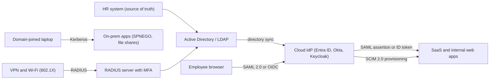
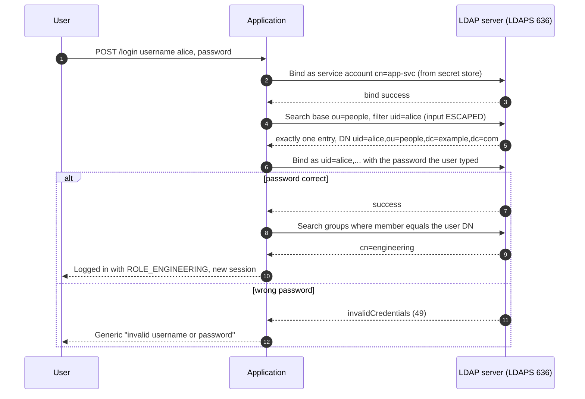
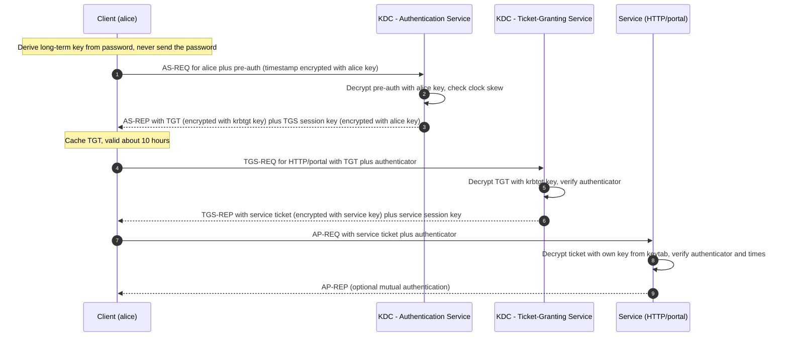
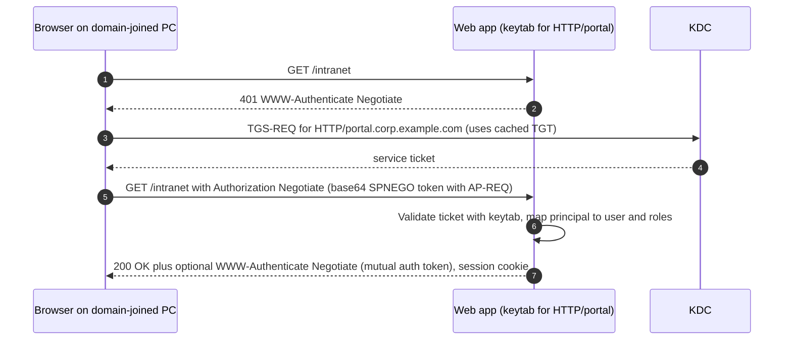
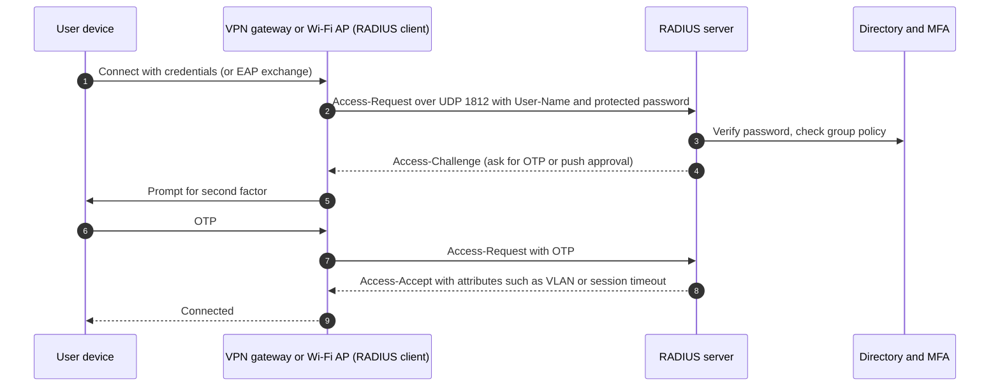
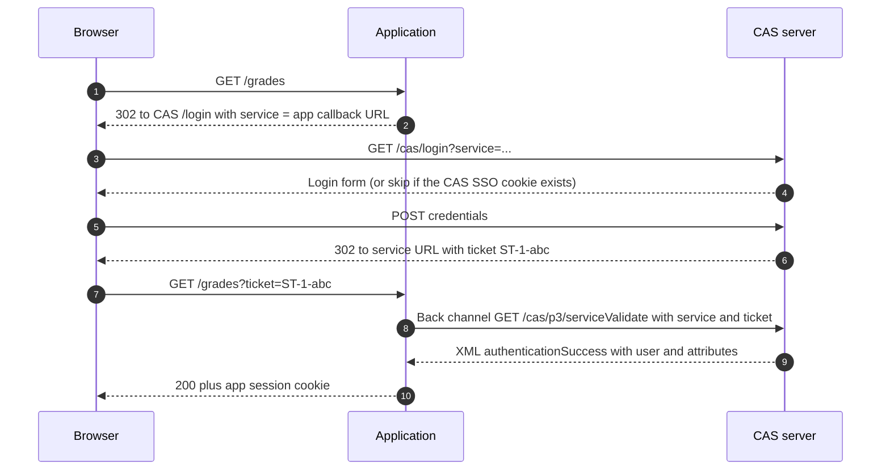
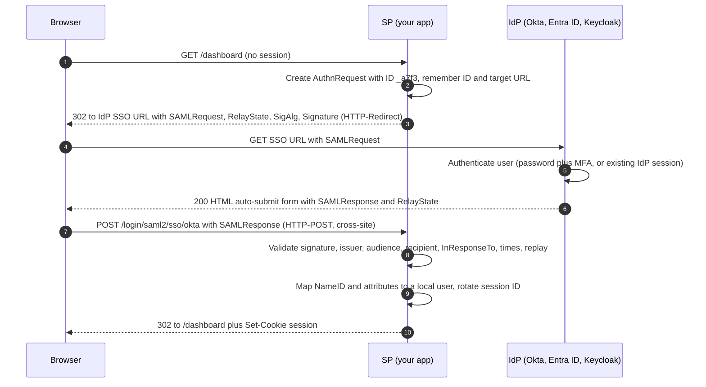
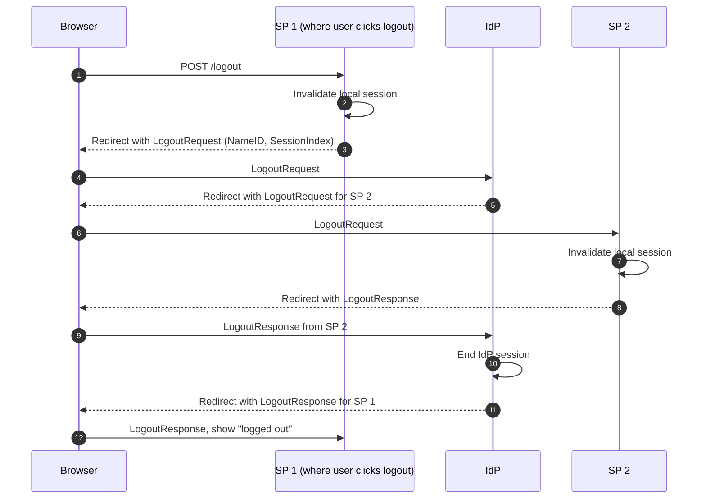
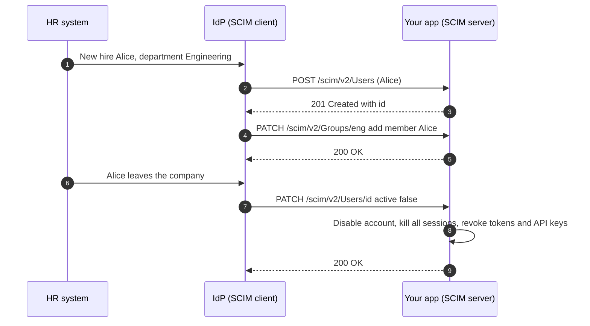

# 05 — Enterprise SSO: LDAP, Kerberos, RADIUS, CAS, SAML 2.0 and SCIM

Inside a company, authentication is not one app with one user table — it is thousands of employees, hundreds of applications, and a constant flow of joiners, movers and leavers. Enterprises solved this long before OAuth existed: a central **directory** (LDAP, Active Directory), network single sign-on with **Kerberos**, web single sign-on and federation with **SAML 2.0**, and today automated provisioning with **SCIM**. This chapter explains each of them, the attacks that target them, and why SAML still runs B2B enterprise SSO even though OpenID Connect is the default for new apps.

> **Where this fits in the evolution**
>
> - **Before:** Every application kept its own user table and passwords. Mainframes had their own security systems, and the ITU X.500 directory standards (1988) were heavy and hard to deploy.
> - **What it solved:** LDAP (1993) gave a lightweight protocol for a **single source of truth** about users and groups. Kerberos (MIT Project Athena, 1980s; v5 as RFC 1510 in 1993) gave **network SSO** without sending passwords. Windows 2000's Active Directory combined LDAP + Kerberos + DNS and put them in nearly every company. On the web, cookies cannot cross domains, so CAS (early 2000s) and then **SAML** (1.0 in 2002, 2.0 in 2005) provided browser-based cross-domain SSO and federation between organizations.
> - **What replaced or extended it:** [OpenID Connect](10-openid-connect.md) (2014) — JSON/JWT on top of [OAuth 2](08-oauth-2.md) — became the default for new web, mobile, and API-centric apps. **SCIM 2.0** (2015) standardized provisioning. Cloud identity providers (Microsoft Entra ID, Okta, Google Workspace, Ping, Keycloak) now speak SAML, OIDC, SCIM, and often LDAP/Kerberos for legacy, acting as the bridge between eras.

---

## Table of contents

1. [The enterprise identity landscape](#1-the-enterprise-identity-landscape)
2. [Directory services and LDAP](#2-directory-services-and-ldap)
3. [Kerberos](#3-kerberos)
4. [RADIUS (briefly)](#4-radius-briefly)
5. [CAS (briefly)](#5-cas-briefly)
6. [SAML 2.0](#6-saml-20)
7. [Why OIDC replaced SAML for new apps, and why SAML still dominates B2B](#7-why-oidc-replaced-saml-for-new-apps-and-why-saml-still-dominates-b2b)
8. [SCIM 2.0 provisioning](#8-scim-20-provisioning)
9. [Production best practices (2026)](#9-production-best-practices-2026)
10. [Common attacks and mistakes](#10-common-attacks-and-mistakes)
11. [Interview questions](#interview-questions)
12. [References](#references)

---

## 1. The enterprise identity landscape

The vocabulary first:

| Term | Meaning |
|---|---|
| **Directory** | A database optimized for reading identity data: users, groups, devices, attributes (LDAP servers, Active Directory). |
| **SSO (single sign-on)** | Log in once, access many applications without re-entering credentials. |
| **Federation** | SSO **across organizational boundaries**: your company's IdP vouches for you to a SaaS vendor's app. |
| **IdP (identity provider)** | The system that authenticates the user and issues assertions or tokens. In SAML also called the **asserting party**. |
| **SP / RP (service provider / relying party)** | The application that trusts the IdP. |
| **Provisioning / deprovisioning** | Creating, updating, and **removing** accounts in downstream applications as people join, change roles, and leave. |

A typical enterprise in 2026 runs several of these protocols at once:



Backend developers meet this landscape in three ways: integrating an app with the corporate directory (LDAP), building an app that enterprise customers want to connect to **their** IdP (SAML, OIDC, SCIM), or securing internal services in a Windows-heavy environment (Kerberos).

---

## 2. Directory services and LDAP

### 2.1 What a directory is

LDAP (Lightweight Directory Access Protocol, LDAPv3 specified in RFC 4510–4519, 2006) is a protocol for reading and writing a **hierarchical tree** of entries (the DIT, Directory Information Tree). Each entry has a **Distinguished Name (DN)** — its full path in the tree — and attributes defined by its `objectClass`.

```text
dc=example,dc=com
├── ou=people
│   ├── uid=alice    (inetOrgPerson)
│   └── uid=bob
├── ou=groups
│   ├── cn=engineering   (groupOfNames, member: uid=alice,...)
│   └── cn=admins
└── ou=services
    └── cn=app-svc       (service account used by applications)
```

```ldif
dn: uid=alice,ou=people,dc=example,dc=com
objectClass: inetOrgPerson
uid: alice
cn: Alice Smith
sn: Smith
mail: alice@example.com
userPassword: {ARGON2}$argon2id$v=19$m=65536,t=3,p=4$...
```

Common servers: Microsoft Active Directory, OpenLDAP, 389 Directory Server / Red Hat Directory Server, and cloud "LDAP-as-a-service" endpoints offered by some IdPs.

### 2.2 Authenticating with an LDAP bind

LDAP authentication is a **bind** operation (RFC 4513):

| Bind type | What it is | Use |
|---|---|---|
| **Simple bind** | DN + password sent to the server | The common case; **only over TLS** (LDAPS or StartTLS) because the password is sent as-is |
| **SASL bind** | Pluggable mechanisms: `EXTERNAL` (client TLS certificate), `GSSAPI` (Kerberos), `SCRAM-SHA-256` | Stronger, used for service accounts and Kerberos-integrated setups |
| **Anonymous bind** | No DN, no password | Reading public data; should be disabled on corporate directories |
| **Unauthenticated bind** | DN **with an empty password** | A trap — see section 2.5 |

Applications usually use the **search-then-bind** pattern, because users type a username (`alice`), not a DN:



Note that the **application never compares passwords itself**: the directory checks them, applies its lockout policy, and keeps the hashes.

### 2.3 Active Directory specifics

| Topic | What to know |
|---|---|
| User naming | `sAMAccountName` (`alice`), `userPrincipalName` (`alice@corp.example.com`). AD accepts a simple bind with the UPN directly — no search needed. |
| Groups | `memberOf` on users; nested groups are common. The matching rule OID `1.2.840.113556.1.4.1941` (`LDAP_MATCHING_RULE_IN_CHAIN`) resolves nesting in one query. |
| Ports | 389 (LDAP + StartTLS), 636 (LDAPS), 3268/3269 (Global Catalog, forest-wide search). |
| Signing and channel binding | Microsoft has pushed LDAP signing and LDAPS channel binding (advisory ADV190023, 2020) to stop relay attacks; newer Windows Server releases tighten defaults. Configure clients to support both. |
| Account state | Check `userAccountControl` flags (disabled, locked, password expired) — a bind already fails for disabled accounts, but group lookups do not. |
| Cloud | Microsoft Entra ID does not expose classic LDAP; it federates with SAML/OIDC and provisions with SCIM. LDAP is mainly an on-premises or hybrid concern. |

### 2.4 Transport security

Simple bind sends the password unencrypted at the LDAP layer, so:

- Use **LDAPS (port 636)** or **StartTLS on 389**, TLS 1.2+, with **certificate validation** (hostname + trusted CA). Disabling certificate checks "just for the internal network" turns LDAPS into an easy man-in-the-middle target.
- Never fall back to plain LDAP if TLS fails.
- Use connection pooling for the service-account connection; never pool connections that have been rebound as end users.

### 2.5 The empty-password trap (unauthenticated bind)

RFC 4513 defines an **unauthenticated bind**: a DN with an **empty password**. Some servers treat it as an anonymous bind and return **success**. An application that does "bind succeeded, so the user is authenticated" then lets anyone log in as any user by leaving the password field empty.

RFC 4513 says servers **should** reject unauthenticated binds by default — but never rely on server configuration. **Reject empty passwords in your application before calling bind.** (Spring Security's LDAP authenticators already reject empty passwords.)

### 2.6 LDAP injection

When user input is concatenated into an LDAP filter, special characters change the filter's logic — the LDAP equivalent of SQL injection.

```text
filter = "(&(uid=" + username + ")(objectClass=person))"

username = "*"
  -> (&(uid=*)(objectClass=person))          matches every person
username = "admin*"
  -> (&(uid=admin*)(objectClass=person))     enumerates accounts starting with "admin"
username = "*)(uid=*))(|(uid=*"
  -> (&(uid=*)(uid=*))(|(uid=*)(objectClass=person))   breaks out of the intended structure
```

Consequences range from account enumeration and data disclosure to authentication bypass in apps that check passwords through filters (`(&(uid=...)(userPassword=...))` — never do this).

**Escape every value** placed in a filter (RFC 4515) or DN (RFC 4514):

| Context | Characters to escape | Encoding |
|---|---|---|
| Search filter (RFC 4515) | `*` `(` `)` `\` NUL | `\2a` `\28` `\29` `\5c` `\00` |
| Distinguished name (RFC 4514) | `,` `+` `"` `\` `<` `>` `;` `=`, plus a leading space or `#` and a trailing space | Backslash-escape (`\,`) or hex (`\2c`) |

In Spring, use parameterized filters (`"(uid={0})"` in `FilterBasedLdapUserSearch` or `LdapBindAuthenticationManagerFactory`, which encode arguments), Spring LDAP's `LdapQueryBuilder` (`query().where("uid").is(input)`), or `LdapEncoder.filterEncode(input)`. Also validate input against an expected pattern (`^[a-zA-Z0-9._-]{1,64}$` for usernames).

### 2.7 Why applications should no longer bind to LDAP directly

LDAP authentication means **your application receives the user's corporate password**. Every such app is a place where that password can be logged, stolen, or phished, and none of them can do modern MFA or passkeys. The 2026 recommendation:

- New apps: **federate** with the corporate IdP via [OIDC](10-openid-connect.md) or SAML. The app never sees the password, and MFA, conditional access, and passkeys come for free.
- Use LDAP for **lookups** (groups, attributes) where SCIM is not available, and for legacy systems.
- If you must authenticate with LDAP, follow sections 2.4–2.6, rate-limit logins, and treat the service account password as a high-value secret (vault, rotation, least privilege — read-only access to the needed subtree).

### 2.8 Spring Security 7 LDAP configuration

```java
@Configuration
@EnableWebSecurity
class LdapSecurityConfig {

    @Bean
    DefaultSpringSecurityContextSource contextSource(@Value("${ldap.bind-password}") String bindPassword) {
        var contextSource = new DefaultSpringSecurityContextSource("ldaps://ldap.example.com:636/dc=example,dc=com");
        contextSource.setUserDn("cn=app-svc,ou=services,dc=example,dc=com");
        contextSource.setPassword(bindPassword);               // injected from a secret manager
        return contextSource;
    }

    @Bean
    LdapAuthoritiesPopulator authorities(BaseLdapPathContextSource contextSource) {
        var populator = new DefaultLdapAuthoritiesPopulator(contextSource, "ou=groups");
        populator.setGroupSearchFilter("(member={0})");        // {0} = user DN, encoded by Spring
        return populator;
    }

    @Bean
    AuthenticationManager ldapAuthenticationManager(BaseLdapPathContextSource contextSource,
                                                    LdapAuthoritiesPopulator authorities) {
        var factory = new LdapBindAuthenticationManagerFactory(contextSource);
        factory.setUserSearchBase("ou=people");
        factory.setUserSearchFilter("(uid={0})");              // {0} = username, encoded by Spring
        factory.setLdapAuthoritiesPopulator(authorities);
        return factory.createAuthenticationManager();
    }

    @Bean
    SecurityFilterChain web(HttpSecurity http) throws Exception {
        http
            .authorizeHttpRequests(auth -> auth.anyRequest().authenticated())
            .formLogin(Customizer.withDefaults());             // sessions and CSRF as in chapter 04
        return http.build();
    }
}
```

For Active Directory, `ActiveDirectoryLdapAuthenticationProvider("corp.example.com", "ldaps://dc1.corp.example.com:636")` binds with the UPN and reads `memberOf`. Session handling, CSRF, and timeouts are the same as in [chapter 04](04-sessions-cookies-and-csrf.md).

---

## 3. Kerberos

### 3.1 The idea

Kerberos was built at MIT (Project Athena) for an open campus network where anyone could sniff traffic. Its goals: users type their password **once per day**, the password **never crosses the network**, and every service can verify users without contacting a central server for each request. Kerberos v5 is specified in RFC 4120 (2005, replacing RFC 1510 from 1993). Windows 2000 made it the default authentication protocol of Active Directory, which is why it is everywhere in enterprises today.

The analogy: an amusement park. You show ID once at the entrance (**AS**) and get a wristband (**TGT**). At each ride you show the wristband at a ticket booth (**TGS**) to get a ride-specific ticket (**service ticket**), which the ride operator checks without calling the entrance.

### 3.2 The players

| Term | Meaning |
|---|---|
| **Realm** | Administrative domain, written in upper case: `CORP.EXAMPLE.COM` (an AD domain). |
| **Principal** | An identity: `alice@CORP.EXAMPLE.COM` (user) or `HTTP/portal.corp.example.com@CORP.EXAMPLE.COM` (service). |
| **KDC** (Key Distribution Center) | Trusted server (an AD domain controller) with two logical parts: **AS** and **TGS**. Shares a long-term secret key with every principal. |
| **AS** (Authentication Service) | Authenticates the user and issues a **TGT**. |
| **TGS** (Ticket-Granting Service) | Exchanges a TGT for **service tickets**. |
| **TGT** (Ticket-Granting Ticket) | Encrypted with the key of the special `krbtgt` account. Proves "the KDC authenticated this user". |
| **Service ticket** | Encrypted with the **service account's** long-term key. Contains the user's identity, a session key, validity times, and (in AD) the **PAC** with group memberships. |
| **SPN** (Service Principal Name) | The name clients request tickets for, e.g. `HTTP/portal.corp.example.com`. Registered on the account that runs the service. |
| **Keytab** | A file holding a service principal's long-term keys, so a Linux/Java service can decrypt tickets without a password prompt. Protect it like a private key. |
| **Authenticator** | A fresh timestamp encrypted with the session key, proving the client holds the session key right now (prevents replay). |

### 3.3 The three exchanges



Why this is clever:

- The password (or rather the key derived from it) is used only locally to decrypt the AS-REP.
- The service validates tickets **offline**, using only its own key — no call to the KDC per request.
- Every ticket is time-limited, and authenticators prevent replay, which is why **clocks must be synchronized** (AD default maximum skew: 5 minutes).

Default AD Kerberos policy: TGT lifetime 10 hours, renewable for up to 7 days, maximum clock skew 5 minutes.

### 3.4 Encryption types

| Encryption type | Status in 2026 |
|---|---|
| `aes256-cts-hmac-sha1-96`, `aes128-cts-hmac-sha1-96` (RFC 3962) | **Standard**; the default for AD accounts |
| `aes256-cts-hmac-sha384-192`, `aes128-cts-hmac-sha256-128` (RFC 8009) | Modern AES-SHA2 types; supported by MIT Kerberos. Active Directory has historically used the RFC 3962 types, so check platform support before relying on them |
| `rc4-hmac` (key = the NT password hash) | **Being removed**. Microsoft's phased hardening for CVE-2026-20833 ran through 2026: audit events from January, AES-SHA1 as the default for accounts without explicit settings from April, and enforcement with the July 2026 update, after which only accounts explicitly configured for RC4 can still use it. Check Microsoft's current guidance for your Windows Server versions. |
| DES | Disabled by default since Windows 7 / Server 2008 R2; must not be used |

### 3.5 Kerberos on the web: SPNEGO and `Negotiate`

Browsers can use Kerberos for intranet web apps through **SPNEGO** (RFC 4178) and the HTTP `Negotiate` scheme (RFC 4559). This gives "it just works" SSO on domain-joined machines.



```http
GET /intranet/ HTTP/1.1
Host: portal.corp.example.com
```

```http
HTTP/1.1 401 Unauthorized
WWW-Authenticate: Negotiate
WWW-Authenticate: Basic realm="portal"
```

```http
GET /intranet/ HTTP/1.1
Host: portal.corp.example.com
Authorization: Negotiate YIIHSgYGKwYBBQUCoIIHPjCCBzqgMDAuBgkqhkiC9xIBAgIGCSqGSIb3EgECAgYKKwYBBAGCNwICHgYK...
```

```http
HTTP/1.1 200 OK
WWW-Authenticate: Negotiate oYG3MIG0oAMKAQChCwYJKoZIgvcSAQICooGf...
Set-Cookie: __Host-SESSION=...; Path=/; Secure; HttpOnly; SameSite=Lax
```

Practical points:

- The SPN must match the **host name the browser uses** (`HTTP/portal.corp.example.com`). CNAMEs and load balancer names are the most common cause of failures; register the SPN for the name users type, on the service account that owns the keytab.
- Browsers only send Kerberos tickets to trusted hosts: Windows "Local intranet" zone for Edge, the `AuthServerAllowlist` policy for Chrome, `network.negotiate-auth.trusted-uris` for Firefox.
- `Negotiate` can fall back to **NTLM** when Kerberos fails. NTLM is deprecated (Microsoft stopped developing it in 2024; NTLMv1 was removed in Windows 11 24H2 and Windows Server 2025) and is vulnerable to relay attacks. Monitor and eliminate NTLM fallback.
- After SPNEGO succeeds, create a normal **session** ([chapter 04](04-sessions-cookies-and-csrf.md)); do not re-run SPNEGO on every request.
- Because Negotiate credentials are ambient (the browser sends them automatically), CSRF protection is required just like with cookies.

**Spring:** Spring Security Kerberos provides a SPNEGO entry point and filter plus a ticket validator backed by a keytab. Starting with Spring Security 7, its modules are published under the main `org.springframework.security` group (`spring-security-kerberos-core`, `spring-security-kerberos-web`) and documented in the Spring Security reference. For new apps, prefer federating with the IdP using OIDC; many IdPs themselves use Kerberos for seamless desktop SSO and then issue OIDC/SAML to your app.

### 3.6 Attacks on Kerberos and Active Directory

| Attack | How it works | Mitigation |
|---|---|---|
| **Kerberoasting** (publicized 2014) | Any domain user can request a service ticket for any SPN. The ticket is encrypted with the service account's password-derived key, so the attacker cracks it **offline**. Weak passwords and RC4 make it fast. | Group Managed Service Accounts (gMSA) with long random, auto-rotated passwords; 25+ character random passwords for any remaining service accounts; AES only (RC4 removal); monitor for unusual volumes of TGS requests (event 4769), especially with RC4 (etype `0x17`). |
| **AS-REP roasting** | Accounts with "Do not require Kerberos preauthentication" return AS-REPs encrypted with the user's key to anyone who asks; crack offline. | Never disable pre-authentication; audit `userAccountControl` for the `DONT_REQ_PREAUTH` flag. |
| **Pass-the-ticket** | Steal tickets from memory (LSASS) on a compromised host and inject them elsewhere. | Credential Guard, limit admin logons to tiered hosts, short ticket lifetimes, EDR. |
| **Overpass-the-hash / pass-the-key** | Use a stolen NT hash or AES key to request a TGT without the password. | Same as above; Protected Users group (no RC4, no NTLM, no delegation, shorter TGT lifetime for members). |
| **Golden ticket** | With the `krbtgt` account's key (from a compromised domain controller), forge TGTs for any user with any groups, valid for as long as the attacker likes. | Protect domain controllers as tier 0; reset the `krbtgt` password **twice** (AD keeps the previous key) after a suspected compromise and periodically; detect TGTs with abnormal lifetimes. |
| **Silver ticket** | With a service account's key, forge service tickets directly for that service, never touching the KDC (stealthier). | gMSA, AES only, PAC validation, service-side monitoring. |
| **Unconstrained delegation abuse** | Servers trusted for unconstrained delegation receive users' TGTs; compromise one and impersonate any user who connected. | Use constrained or resource-based constrained delegation; mark privileged accounts "sensitive and cannot be delegated" or add them to Protected Users. |
| **NTLM relay (via Negotiate fallback)** | Relay an NTLM handshake to another server (LDAP, SMB, HTTP) to act as the victim. | Disable NTLM where possible, require SMB signing, LDAP signing and channel binding, Extended Protection for Authentication (EPA) on HTTP. |

---

## 4. RADIUS (briefly)

**RADIUS** (Remote Authentication Dial-In User Service, RFC 2865, 2000) is the AAA (authentication, authorization, accounting) protocol of **network access**: VPN gateways, Wi-Fi (802.1X with EAP), switches, and dial-up before them. Backend developers rarely implement it, but they meet it when integrating VPN or Wi-Fi with MFA.



What to know:

- Classic RADIUS runs over **UDP** with a **shared secret** between client and server and MD5-based packet authentication and password hiding — 1990s cryptography.
- **BlastRADIUS (CVE-2024-3596, July 2024)**: an on-path attacker can forge an Access-Accept using an MD5 chosen-prefix collision when responses are not protected by the `Message-Authenticator` attribute. Mitigation: require `Message-Authenticator` on all packets, patch servers and clients, and move to TLS transport.
- **RADIUS over TLS** ("RadSec", RFC 6614, experimental) and **RADIUS/1.1** (RFC 9765, April 2025, experimental), which removes MD5 entirely when running over TLS, are the modern direction.
- For Wi-Fi, prefer **EAP-TLS** (certificate-based) over PEAP-MSCHAPv2 (password-based, weak).
- TACACS+ (RFC 8907) is the common alternative for administering network devices.

---

## 5. CAS (briefly)

**CAS (Central Authentication Service)** was created at Yale University in the early 2000s and is maintained today by the Apereo Foundation. It was one of the first practical **web SSO** systems and is still common in universities. Its design directly influenced later protocols: a central login server, a browser redirect, a short-lived one-time ticket, and a back-channel validation call.



```xml
<cas:serviceResponse xmlns:cas="http://www.yale.edu/tp/cas">
  <cas:authenticationSuccess>
    <cas:user>alice</cas:user>
    <cas:attributes>
      <cas:email>alice@example.edu</cas:email>
      <cas:memberOf>cn=staff,ou=groups,dc=example,dc=edu</cas:memberOf>
    </cas:attributes>
  </cas:authenticationSuccess>
</cas:serviceResponse>
```

Security essentials: service tickets are **single-use and short-lived**, validation happens over TLS on the back channel, and the CAS server must keep a **registry of allowed service URLs** (otherwise tickets can be sent to attacker-controlled URLs). Modern CAS servers also speak SAML 2.0 and OpenID Connect, and Spring Security ships a CAS module, but new integrations should use OIDC.

---

## 6. SAML 2.0

### 6.1 History and roles

**SAML (Security Assertion Markup Language)** is an XML-based OASIS standard for exchanging authentication and attribute statements. SAML 1.0 appeared in 2002, 1.1 in 2003, and **SAML 2.0 was approved in March 2005**, merging ideas from the Liberty Alliance (ID-FF) and Shibboleth. Twenty years later it still powers a large share of enterprise and education SSO (for example, research and education federations such as InCommon and eduGAIN).

| Role | Also called | Responsibility |
|---|---|---|
| **Principal** | User / subject | The person logging in, through a browser |
| **Identity Provider (IdP)** | Asserting party | Authenticates the user (password, MFA, Kerberos, passkeys) and issues a **signed assertion** |
| **Service Provider (SP)** | Relying party | Your application; validates the assertion and creates its own session |

### 6.2 The building blocks

| Concept | Meaning | Examples |
|---|---|---|
| **Assertion** | Signed XML statement by the IdP about a subject | `AuthnStatement` (how and when the user authenticated), `AttributeStatement` (email, groups), `AuthzDecisionStatement` (rare) |
| **Protocol** | Request/response messages | `AuthnRequest` / `Response`, `LogoutRequest` / `LogoutResponse`, `ArtifactResolve` |
| **Binding** | How messages travel over HTTP | HTTP-Redirect, HTTP-POST, HTTP-Artifact, SOAP |
| **Profile** | A combination for a use case | **Web Browser SSO Profile**, Single Logout Profile |
| **Metadata** | XML document describing an entity: entity ID, endpoints, certificates | Exchanged once when the IdP and SP are connected |

Bindings in detail:

| Binding | How | Typically used for | Size limit |
|---|---|---|---|
| **HTTP-Redirect** | Message is DEFLATE-compressed, base64-encoded, URL-encoded into the `SAMLRequest` (or `SAMLResponse`) query parameter. Signature is **not** XML: it is sent as `SigAlg` and `Signature` query parameters computed over the query string. | `AuthnRequest`, `LogoutRequest` (small messages) | URL length (keep under a few KB) |
| **HTTP-POST** | Message is base64-encoded into a hidden form field; the IdP returns an HTML page that auto-submits the form to the SP. Signatures are XML Signatures inside the message. | The `Response` with the assertion (large, signed) | None in practice |
| **HTTP-Artifact** | Browser carries a short reference (artifact); the SP fetches the actual message over a back-channel SOAP call | High-security deployments that keep assertions out of the browser | — |
| **SOAP** | Direct server-to-server | Artifact resolution, back-channel logout | — |

### 6.3 SP-initiated Web Browser SSO



**Step 3 — the AuthnRequest** (before encoding):

```xml
<samlp:AuthnRequest
    xmlns:samlp="urn:oasis:names:tc:SAML:2.0:protocol"
    xmlns:saml="urn:oasis:names:tc:SAML:2.0:assertion"
    ID="_a7f3c2e14b5d4e8f9a1b2c3d4e5f6a7b"
    Version="2.0"
    IssueInstant="2026-10-08T12:00:00Z"
    Destination="https://idp.example.com/sso/saml"
    AssertionConsumerServiceURL="https://app.example.com/login/saml2/sso/okta"
    ProtocolBinding="urn:oasis:names:tc:SAML:2.0:bindings:HTTP-POST">
  <saml:Issuer>https://app.example.com/sp</saml:Issuer>
  <samlp:NameIDPolicy Format="urn:oasis:names:tc:SAML:1.1:nameid-format:emailAddress" AllowCreate="true"/>
</samlp:AuthnRequest>
```

Sent with the HTTP-Redirect binding:

```http
HTTP/1.1 302 Found
Location: https://idp.example.com/sso/saml?SAMLRequest=fZFNT8MwDIb%2FSpV7m6Zbt4KqVr...&RelayState=c2f1a8e0&SigAlg=http%3A%2F%2Fwww.w3.org%2F2001%2F04%2Fxmldsig-more%23rsa-sha256&Signature=Wm9vbS1wbGFjZWhvbGRlcg%3D%3D
```

`RelayState` is an opaque value the IdP echoes back. Use it as a **random reference** to state stored server-side (like OAuth's `state`), never as a raw redirect URL — otherwise it becomes an open redirect.

**Step 6 — the IdP's auto-submitting page:**

```http
HTTP/1.1 200 OK
Content-Type: text/html; charset=utf-8
Cache-Control: no-store

<form method="post" action="https://app.example.com/login/saml2/sso/okta">
  <input type="hidden" name="SAMLResponse" value="PHNhbWxwOlJlc3BvbnNlIHhtbG5zOnNhbWxwPSJ1cm46b2FzaXM6...">
  <input type="hidden" name="RelayState" value="c2f1a8e0">
  <noscript><button type="submit">Continue</button></noscript>
</form>
<script>document.forms[0].submit();</script>
```

**Step 7 — the POST to the Assertion Consumer Service (ACS):**

```http
POST /login/saml2/sso/okta HTTP/1.1
Host: app.example.com
Content-Type: application/x-www-form-urlencoded
Origin: https://idp.example.com
Sec-Fetch-Site: cross-site

SAMLResponse=PHNhbWxwOlJlc3BvbnNlIHhtbG5zOnNhbWxwPSJ1cm46b2FzaXM6...&RelayState=c2f1a8e0
```

> **Cookie gotcha:** this is a **cross-site top-level POST**. A session cookie with `SameSite=Lax` or `Strict` is **not sent** on it, so anything the SP stored in the session for this login (the pending AuthnRequest ID used for the `InResponseTo` check, the original URL) is not available. Options: keep that login state in a dedicated short-lived cookie marked `SameSite=None; Secure; HttpOnly` (Spring's `Saml2AuthenticationRequestRepository` is pluggable), or relax only what is needed. Also make sure your CSRF and Fetch Metadata filters allow cross-site POSTs to the ACS path — the SAML signature and `InResponseTo` check protect it instead. The same issue affects OIDC's `response_mode=form_post`.

### 6.4 The Response and Assertion

The decoded `SAMLResponse` (abridged):

```xml
<samlp:Response xmlns:samlp="urn:oasis:names:tc:SAML:2.0:protocol"
                xmlns:saml="urn:oasis:names:tc:SAML:2.0:assertion"
                ID="_resp-5d2e" Version="2.0" IssueInstant="2026-10-08T12:00:05Z"
                Destination="https://app.example.com/login/saml2/sso/okta"
                InResponseTo="_a7f3c2e14b5d4e8f9a1b2c3d4e5f6a7b">
  <saml:Issuer>https://idp.example.com</saml:Issuer>
  <samlp:Status>
    <samlp:StatusCode Value="urn:oasis:names:tc:SAML:2.0:status:Success"/>
  </samlp:Status>
  <saml:Assertion ID="_as-91c4" Version="2.0" IssueInstant="2026-10-08T12:00:05Z">
    <saml:Issuer>https://idp.example.com</saml:Issuer>
    <ds:Signature xmlns:ds="http://www.w3.org/2000/09/xmldsig#">
      <ds:SignedInfo>
        <ds:CanonicalizationMethod Algorithm="http://www.w3.org/2001/10/xml-exc-c14n#"/>
        <ds:SignatureMethod Algorithm="http://www.w3.org/2001/04/xmldsig-more#rsa-sha256"/>
        <ds:Reference URI="#_as-91c4">
          <ds:Transforms>
            <ds:Transform Algorithm="http://www.w3.org/2000/09/xmldsig#enveloped-signature"/>
            <ds:Transform Algorithm="http://www.w3.org/2001/10/xml-exc-c14n#"/>
          </ds:Transforms>
          <ds:DigestMethod Algorithm="http://www.w3.org/2001/04/xmlenc#sha256"/>
          <ds:DigestValue>3q2+7w...</ds:DigestValue>
        </ds:Reference>
      </ds:SignedInfo>
      <ds:SignatureValue>Kx9f...</ds:SignatureValue>
    </ds:Signature>
    <saml:Subject>
      <saml:NameID Format="urn:oasis:names:tc:SAML:1.1:nameid-format:emailAddress">alice@example.com</saml:NameID>
      <saml:SubjectConfirmation Method="urn:oasis:names:tc:SAML:2.0:cm:bearer">
        <saml:SubjectConfirmationData InResponseTo="_a7f3c2e14b5d4e8f9a1b2c3d4e5f6a7b"
                                      Recipient="https://app.example.com/login/saml2/sso/okta"
                                      NotOnOrAfter="2026-10-08T12:05:05Z"/>
      </saml:SubjectConfirmation>
    </saml:Subject>
    <saml:Conditions NotBefore="2026-10-08T11:59:35Z" NotOnOrAfter="2026-10-08T12:05:05Z">
      <saml:AudienceRestriction>
        <saml:Audience>https://app.example.com/sp</saml:Audience>
      </saml:AudienceRestriction>
    </saml:Conditions>
    <saml:AuthnStatement AuthnInstant="2026-10-08T12:00:03Z" SessionIndex="_sess-9f2c">
      <saml:AuthnContext>
        <saml:AuthnContextClassRef>urn:oasis:names:tc:SAML:2.0:ac:classes:PasswordProtectedTransport</saml:AuthnContextClassRef>
      </saml:AuthnContext>
    </saml:AuthnStatement>
    <saml:AttributeStatement>
      <saml:Attribute Name="groups">
        <saml:AttributeValue>engineering</saml:AttributeValue>
      </saml:Attribute>
    </saml:AttributeStatement>
  </saml:Assertion>
</samlp:Response>
```

What each part is for:

| Element | Purpose | SP must check |
|---|---|---|
| `Response/@Destination` | Where the IdP meant to send it | Equals your ACS URL |
| `Response/@InResponseTo` | Links to your AuthnRequest | Matches an outstanding request ID (SP-initiated) |
| `Issuer` | Who issued it | Equals the configured IdP entity ID |
| `ds:Signature` | Integrity and authenticity | Valid, made with the IdP key **from metadata**, covering the assertion you will use |
| `NameID` | The user identifier | Map to a local account using a stable, unique attribute (an immutable IdP user ID is better than an email that can change) |
| `SubjectConfirmationData` | Bearer confirmation: `Recipient`, `NotOnOrAfter`, `InResponseTo` | Recipient = ACS URL, not expired |
| `Conditions` | Validity window and `AudienceRestriction` | Current time within `NotBefore`/`NotOnOrAfter` (small skew), Audience = your SP entity ID |
| `AuthnStatement` | When and how the user authenticated; `SessionIndex` for logout | Optionally enforce `AuthnContextClassRef` (for example require MFA) |
| `AttributeStatement` | Email, name, groups | Map to roles; never trust attributes from an unsigned part |

### 6.5 IdP-initiated SSO

In **IdP-initiated** SSO the user starts at the IdP portal ("My Apps"), clicks your app, and the IdP sends an **unsolicited** `Response` with no `InResponseTo`.

| | SP-initiated | IdP-initiated |
|---|---|---|
| Starts at | Your app | IdP dashboard |
| `InResponseTo` binding | Yes — the response must match your request | **None** |
| Replay / injection resistance | Stronger | Weaker: a stolen or captured response can be posted to the ACS by anyone within its validity window; login CSRF is possible |
| UX | Deep links work naturally | Convenient app launcher |

If you must support IdP-initiated SSO: keep assertion lifetimes short (minutes), enforce one-time use via an assertion ID replay cache, and consider handling it by **immediately starting an SP-initiated flow** (the "IdP-initiated to SP-initiated" bounce) so that the session is created from a solicited response.

### 6.6 Metadata

Metadata is how an IdP and SP learn about each other: entity IDs, endpoint URLs, bindings, and **certificates**.

```xml
<md:EntityDescriptor xmlns:md="urn:oasis:names:tc:SAML:2.0:metadata"
                     entityID="https://idp.example.com">
  <md:IDPSSODescriptor WantAuthnRequestsSigned="true"
                       protocolSupportEnumeration="urn:oasis:names:tc:SAML:2.0:protocol">
    <md:KeyDescriptor use="signing">
      <ds:KeyInfo xmlns:ds="http://www.w3.org/2000/09/xmldsig#">
        <ds:X509Data><ds:X509Certificate>MIIDqDCCApCgAwIBAgIG...</ds:X509Certificate></ds:X509Data>
      </ds:KeyInfo>
    </md:KeyDescriptor>
    <md:SingleLogoutService Binding="urn:oasis:names:tc:SAML:2.0:bindings:HTTP-Redirect"
                            Location="https://idp.example.com/slo/saml"/>
    <md:NameIDFormat>urn:oasis:names:tc:SAML:1.1:nameid-format:emailAddress</md:NameIDFormat>
    <md:SingleSignOnService Binding="urn:oasis:names:tc:SAML:2.0:bindings:HTTP-Redirect"
                            Location="https://idp.example.com/sso/saml"/>
  </md:IDPSSODescriptor>
</md:EntityDescriptor>
```

Production rules:

- **Pin trust to the metadata certificates.** Never trust a certificate embedded in the incoming message's `KeyInfo` just because it is there — attackers can sign with their own key and include their own certificate.
- **Certificate rotation without downtime**: the IdP publishes the **new** certificate alongside the old one in metadata, SPs refresh metadata (automatically, for example daily, verifying the metadata's own signature when it is signed), then the IdP switches signing keys, then removes the old certificate. Track expiry dates — expired IdP certificates are a classic cause of company-wide login outages.
- Fetch metadata over HTTPS from a URL you configured, not from a URL inside a message.

### 6.7 Signing and encryption

| Decision | Recommendation |
|---|---|
| What the IdP signs | Sign the **assertion** (required by most SPs) and preferably the response too. The SP must verify the signature that covers the **assertion it actually uses**. |
| Signature algorithm | RSA-SHA256 (`rsa-sha256`) or ECDSA-SHA256; reject SHA-1 (`rsa-sha1`) |
| Key size | RSA 2048-bit minimum, 3072-bit for keys with multi-year lifetimes |
| AuthnRequest signing | Sign when the IdP requires it (`WantAuthnRequestsSigned`); it prevents tampering with the requested ACS URL and NameID policy |
| Assertion encryption | Use when assertions carry sensitive attributes or pass through intermediaries: `EncryptedAssertion` with **AES-GCM** for content and **RSA-OAEP** for key transport. Avoid AES-CBC and RSA PKCS#1 v1.5 key transport, both of which have practical attacks against XML Encryption. |
| SP keys | Separate signing and decryption key pairs; store private keys in a secret manager or HSM-backed keystore, not in the Git repository |

### 6.8 Validation checklist for an SP

A well-maintained library (Spring Security with OpenSAML, Shibboleth SP, python3-saml, and so on) does most of this. Know the list so you can configure and review it:

1. Decode, then parse with a **hardened XML parser**: DTDs and external entities disabled (no XXE), no network access during parsing.
2. Schema-validate the message; reject unexpected structure (for example **more than one assertion**).
3. Verify the XML signature using **only** the IdP's key from metadata, with an algorithm allowlist; confirm the signed element (resolved by its ID) is the **same element** your code reads.
4. Check `Issuer` equals the IdP entity ID.
5. Check `Destination` and `Recipient` equal your ACS URL.
6. Check `InResponseTo` matches an outstanding AuthnRequest you issued (and consume it).
7. Check `Audience` contains your SP entity ID.
8. Check time conditions with a small clock skew (a few minutes at most); assertion validity itself should be short (around 5 minutes).
9. Reject reused assertion IDs (replay cache until `NotOnOrAfter`).
10. Check `Status` is `Success`.
11. Decrypt `EncryptedAssertion` if used, then repeat the checks on the decrypted content.
12. Map the subject to a local user, **rotate the session ID**, and create an SP session whose lifetime is bounded by your own policy (optionally `SessionNotOnOrAfter`).

### 6.9 XML Signature Wrapping (XSW) and other XML attacks

XML Signature references the signed element **by ID** (`Reference URI="#_as-91c4"`). The SAML library's signature check and the application's "which assertion do I read?" logic are two different pieces of code. If they can be made to look at **different elements**, the signature is valid but the data is forged.

```text
Original (valid)                          Wrapped (attack)
----------------                          ----------------
Response                                  Response
└── Assertion ID="_as-91c4"               ├── Assertion ID="_evil"           <- app reads the FIRST assertion
    ├── Signature (Reference _as-91c4)    │   └── Subject: admin@example.com    (unsigned, attacker-made)
    └── Subject: alice@example.com        └── Extensions
                                              └── Assertion ID="_as-91c4"    <- signature check finds this
                                                  ├── Signature (valid)          by ID: VALID
                                                  └── Subject: alice@example.com
```

The attacker needs only **one** legitimately signed assertion (for example, from their own low-privilege account) and can then impersonate anyone. This is not theoretical:

- The 2012 USENIX Security paper "On Breaking SAML: Be Whoever You Want to Be" (Somorovsky et al.) found XSW vulnerabilities in **11 of 14** major SAML frameworks.
- In 2018, several SAML libraries were found to mishandle **XML comments** during canonicalization: a NameID like `alice@example.com<!---->.evil.com` could be signed for one value and read as another.
- In 2024–2025, **ruby-saml** had critical signature-bypass flaws (CVE-2024-45409, and CVE-2025-25291 / CVE-2025-25292, which came from a **parser differential**: two XML parsers in the same library disagreeing about the document). GitLab, which uses the library, shipped emergency fixes.

Mitigations:

| Mitigation | Why |
|---|---|
| Use a mature, maintained library and **keep it patched** | XSW variants keep being found; you will not out-implement OpenSAML or Shibboleth |
| Process only the element that the signature validation **returned** as signed | Closes the "verify one, use another" gap |
| Reject responses with multiple assertions, unexpected elements, or DTDs | Removes the hiding places for wrapped content |
| Schema validation and strict ID handling (unique IDs, no duplicates) | Prevents ID confusion |
| Use one XML parser for everything | Avoids parser differentials |
| Require the assertion (not only the response) to be signed | Prevents unsigned assertions inside a signed envelope from being trusted, or vice versa |

**Golden SAML**: if an attacker steals the IdP's **token-signing private key** (for example from an on-premises AD FS server), they can mint valid assertions for any user and any app, bypassing passwords and MFA. CyberArk documented the technique in 2017, and it was used in the SolarWinds campaign discovered in December 2020. Protect IdP signing keys in HSMs, treat IdP servers as tier 0, monitor for assertions that have no matching IdP login event, and rotate keys after any suspected compromise.

### 6.10 Single Logout (SLO)

SAML defines **Single Logout**: logging out of one SP should end the IdP session and the sessions at every other SP the user visited in that IdP session.



Why SLO is fragile in practice: it is a **chain of browser redirects** — if any SP is down, slow, or returns an error, the chain breaks and later SPs stay logged in. Front-channel variants based on hidden iframes are increasingly broken by third-party cookie restrictions. Many organizations therefore implement local logout plus IdP session termination, keep SP sessions short, and rely on deprovisioning (SCIM) and short sessions for real revocation. If you implement SLO, sign logout messages, validate `NameID` and `SessionIndex`, and make your SP's handler tolerant (always answer with a `LogoutResponse`).

### 6.11 Spring Security 7: `saml2Login`

Spring Security's SAML 2.0 service provider support (module `spring-security-saml2-service-provider`) is built on **OpenSAML 5** in Spring Security 7 (OpenSAML 4 support was removed).

```yaml
# application.yml
spring:
  security:
    saml2:
      relyingparty:
        registration:
          okta:                                    # registrationId, appears in URLs
            entity-id: https://app.example.com/sp
            signing:
              credentials:
                - private-key-location: file:/run/secrets/saml-sp-signing.key
                  certificate-location: file:/run/secrets/saml-sp-signing.crt
            singlelogout:
              url: "{baseUrl}/logout/saml2/slo"
            assertingparty:
              metadata-uri: https://idp.example.com/app/abc123/sso/saml/metadata
```

```java
@Configuration
@EnableWebSecurity
class SamlSecurityConfig {

    @Bean
    SecurityFilterChain saml(HttpSecurity http) throws Exception {
        http
            .authorizeHttpRequests(auth -> auth
                .requestMatchers("/error").permitAll()
                .anyRequest().authenticated())
            .saml2Login(Customizer.withDefaults())      // AuthnRequest + ACS at /login/saml2/sso/{registrationId}
            .saml2Logout(Customizer.withDefaults())     // SAML Single Logout at /logout/saml2/slo
            .saml2Metadata(Customizer.withDefaults());  // publishes this SP's metadata for the IdP admin
        return http.build();
    }
}
```

What you get: AuthnRequest generation (the login starts at `/saml2/authenticate/{registrationId}`), the ACS endpoint at `/login/saml2/sso/{registrationId}`, signature and condition validation by OpenSAML 5, and a `Saml2Authentication` in the security context with the assertion's attributes. To map a `groups` attribute to authorities, customize the response authentication converter on `OpenSaml5AuthenticationProvider` and register it as the provider for `saml2Login`. Keep session, CSRF, and timeout rules from [chapter 04](04-sessions-cookies-and-csrf.md), and remember the cross-site POST cookie gotcha in section 6.3.

---

## 7. Why OIDC replaced SAML for new apps, and why SAML still dominates B2B

| Aspect | SAML 2.0 | OpenID Connect |
|---|---|---|
| Published | 2005 (OASIS) | 2014 (OpenID Foundation) |
| Data format | XML, XML Signature, XML Encryption | JSON, JWT/JWS/JWE ([chapter 06](06-tokens-and-jwt.md)) |
| Built on | Its own protocols and bindings | [OAuth 2.0](08-oauth-2.md) |
| Browser flow | Redirect + auto-submitted POST form | Redirects + back-channel token request (authorization code + PKCE) |
| Mobile, SPA, CLI, device | Awkward (designed for browsers) | First-class (native apps, BFF, device flow) |
| API access | Not part of SSO (OAuth's SAML bearer assertion grant, RFC 7522, bridges it) | The same flow yields OAuth access tokens for APIs |
| Discovery and keys | Metadata XML exchanged manually; certificate rotation coordinated by humans | `/.well-known/openid-configuration` + JWKS with automatic key rotation |
| Library complexity | XML canonicalization and signature validation are hard (XSW history) | JOSE is simpler, though JWT has its own pitfalls (algorithm confusion) |
| Logout | SLO (fragile) | RP-initiated, front-channel, and back-channel logout specs (also imperfect) |
| Typical use in 2026 | Enterprise SSO into SaaS, government, higher education federations, legacy apps | Consumer login, mobile, new internal apps, new SaaS integrations, workforce IdPs |

**Why new apps choose OIDC:** JSON and JWT are native to modern stacks, one flow covers login **and** API access, it works for mobile and SPAs (through a BFF), discovery and key rotation are automatic, and libraries are simpler and less error-prone.

**Why SAML still dominates B2B enterprise SSO:**

- **Installed base**: every enterprise IdP (Entra ID, Okta, Ping, AD FS, Google Workspace, Shibboleth) supports SAML, and thousands of existing app integrations use it. IT teams know how to configure it.
- **Procurement checklists**: enterprise customers ask "Do you support SAML SSO?" — SaaS vendors that only offer OIDC lose deals or need exceptions.
- **Federations**: research and education federations (InCommon, eduGAIN) and many government programs are built on SAML metadata aggregates.
- **It works**: for "employee clicks app, lands logged in", SAML has been solving the problem since 2005.

**Practical advice for SaaS builders:** support **both** SAML 2.0 and OIDC per tenant (most auth platforms and brokers — Keycloak, Auth0, Okta, WorkOS, and others — can normalize both into one internal identity), add **SCIM** for provisioning, and let enterprise admins enforce "SSO only" for their domain. Internally, convert whatever comes in into your own session ([chapter 04](04-sessions-cookies-and-csrf.md)) or tokens ([chapter 06](06-tokens-and-jwt.md)).

---

## 8. SCIM 2.0 provisioning

### 8.1 Why SSO alone is not enough

SSO answers "who is this user right now?" It does **not** answer "which accounts should exist?". With **just-in-time (JIT) provisioning**, an account is created at first SAML/OIDC login — but nothing tells your app when the person **leaves**. Their account, API keys, and long-lived sessions may survive for months. Offboarding is the security-critical half of identity lifecycle.

**SCIM** (System for Cross-domain Identity Management) is a REST + JSON standard that lets the IdP **push** create, update, and **deactivate** operations to applications:

- RFC 7642 — definitions, overview, concepts and requirements
- RFC 7643 — core schema (User, Group, EnterpriseUser extension)
- RFC 7644 — protocol (endpoints, filtering, PATCH, bulk)

All three were published in September 2015.



### 8.2 Endpoints

| Endpoint | Purpose |
|---|---|
| `/Users`, `/Users/{id}` | Create (POST), read (GET), replace (PUT), modify (PATCH), delete (DELETE) users; list with `filter`, paging (`startIndex`, `count`) |
| `/Groups`, `/Groups/{id}` | Same for groups and memberships |
| `/Me` | The authenticated subject's own resource (optional) |
| `/Bulk` | Many operations in one request (optional) |
| `/.search` | Search via POST (keeps filters out of URLs) |
| `/ServiceProviderConfig` | Which features you support (PATCH, bulk, filter, auth schemes) |
| `/ResourceTypes`, `/Schemas` | Discovery of resource types and attribute schemas |

### 8.3 Raw HTTP examples

Create a user:

```http
POST /scim/v2/Users HTTP/1.1
Host: app.example.com
Authorization: Bearer <token issued to this tenant's IdP connector>
Content-Type: application/scim+json

{
  "schemas": ["urn:ietf:params:scim:schemas:core:2.0:User"],
  "externalId": "00u1abcd2EFGH3ijk4l5",
  "userName": "alice@example.com",
  "name": { "givenName": "Alice", "familyName": "Smith" },
  "emails": [{ "value": "alice@example.com", "type": "work", "primary": true }],
  "active": true
}
```

```http
HTTP/1.1 201 Created
Content-Type: application/scim+json
Location: https://app.example.com/scim/v2/Users/2819c223-7f76-453a-919d-413861904646
ETag: W/"1"

{
  "schemas": ["urn:ietf:params:scim:schemas:core:2.0:User"],
  "id": "2819c223-7f76-453a-919d-413861904646",
  "externalId": "00u1abcd2EFGH3ijk4l5",
  "userName": "alice@example.com",
  "active": true,
  "meta": {
    "resourceType": "User",
    "created": "2026-10-08T12:00:00Z",
    "lastModified": "2026-10-08T12:00:00Z",
    "location": "https://app.example.com/scim/v2/Users/2819c223-7f76-453a-919d-413861904646",
    "version": "W/\"1\""
  }
}
```

Find a user (the IdP does this before creating, to avoid duplicates):

```http
GET /scim/v2/Users?filter=userName%20eq%20%22alice%40example.com%22 HTTP/1.1
Host: app.example.com
Authorization: Bearer <token>
Accept: application/scim+json
```

Deactivate a user (the most important call):

```http
PATCH /scim/v2/Users/2819c223-7f76-453a-919d-413861904646 HTTP/1.1
Host: app.example.com
Authorization: Bearer <token>
Content-Type: application/scim+json

{
  "schemas": ["urn:ietf:params:scim:api:messages:2.0:PatchOp"],
  "Operations": [{ "op": "replace", "path": "active", "value": false }]
}
```

Error format:

```http
HTTP/1.1 409 Conflict
Content-Type: application/scim+json

{
  "schemas": ["urn:ietf:params:scim:api:messages:2.0:Error"],
  "status": "409",
  "scimType": "uniqueness",
  "detail": "userName already exists"
}
```

### 8.4 Implementing a SCIM server securely

| Concern | Recommendation |
|---|---|
| Authentication | One credential **per tenant connection**: a long random bearer token (stored hashed, like an API key — [chapter 03](03-http-basic-digest-and-api-keys.md#5-api-keys-done-right)) or OAuth client credentials with short-lived tokens. Rotate; show once. |
| Tenant isolation | The token determines the tenant; a SCIM client must never read or modify users of another tenant. |
| Deactivation | `active: false` must **immediately** disable login, invalidate all sessions ("log out everywhere", [chapter 04](04-sessions-cookies-and-csrf.md)), revoke refresh tokens and API keys, and stop notifications. Prefer **soft delete** for audit and data retention; handle `DELETE` as deactivate-then-purge per your data policy. |
| Identity matching | Store `externalId` (the IdP's stable ID) and match on it; emails and usernames change. |
| Authorization mapping | Map SCIM groups to roles explicitly; never grant admin just because a group name says "admin" without tenant admin approval. |
| Robustness | Support filtering on `userName` and `externalId`, PATCH semantics (IdPs differ in how they send PATCH), ETags for concurrency, idempotent behavior on retries, rate limits with `429`. |
| Audit | Log every SCIM operation (who, what, when, from which connection). |
| Network | Optionally allowlist the IdP's published egress IP ranges. |

Combined with SSO, SCIM gives the complete enterprise package customers expect: **SSO for login, SCIM for lifecycle, and enforced deprovisioning within minutes of an HR termination.**

---

## 9. Production best practices (2026)

| Area | Recommendation |
|---|---|
| LDAP transport | LDAPS (636) or StartTLS, TLS 1.2+, full certificate validation; no plaintext fallback |
| LDAP bind | Reject empty passwords; search-then-bind with escaped filters (RFC 4515); generic login errors; rate limiting |
| LDAP service account | Read-only, scoped to needed subtrees, password in a secret manager, rotated |
| New app auth | Federate with the IdP via OIDC or SAML instead of collecting corporate passwords |
| Kerberos crypto | AES only; RC4 removed (Microsoft enforcement from July 2026); DES never |
| Kerberos accounts | gMSA for services; 25+ character random passwords otherwise; no pre-auth exemptions; Protected Users for admins |
| Kerberos infrastructure | Domain controllers as tier 0; time sync within 5 minutes; reset `krbtgt` twice after suspected compromise and periodically; monitor 4768/4769 events |
| SPNEGO | SPN matches the user-facing host name; keytab protected like a private key; eliminate NTLM fallback; create a session after success |
| RADIUS | Require `Message-Authenticator`; patch for BlastRADIUS; prefer RADIUS over TLS; EAP-TLS for Wi-Fi |
| SAML assertions | Signed with RSA-SHA256 or ECDSA (no SHA-1), RSA keys >= 2048 bits, validity about 5 minutes, small clock skew, replay cache |
| SAML validation | Mature library, kept patched; pinned IdP certificates from metadata; issuer, audience, destination, recipient, InResponseTo checks; single assertion; hardened XML parser |
| SAML operations | Automated metadata refresh, certificate rotation with overlap, expiry monitoring, SP-initiated flows preferred, `RelayState` as an opaque reference |
| SAML encryption | AES-GCM + RSA-OAEP when encryption is needed |
| IdP keys | HSM-backed signing keys, IdP servers as tier 0, alert on assertions without a matching IdP login (Golden SAML) |
| SCIM | Per-tenant credentials, `externalId` matching, deactivation that kills sessions and tokens immediately, audit logging |
| B2B SaaS | Offer SAML and OIDC per tenant, SCIM provisioning, domain verification, and "SSO required" enforcement |

---

## 10. Common attacks and mistakes

| Attack / mistake | What goes wrong | Mitigation |
|---|---|---|
| LDAP injection | Filter logic altered: enumeration, data disclosure, auth bypass | Escape per RFC 4515/4514, parameterized filters, input validation |
| Empty password bind accepted | Unauthenticated bind treated as success, so anyone logs in as anyone | Reject empty passwords before binding |
| Plain LDAP or unchecked LDAPS certificates | Passwords captured by man-in-the-middle | LDAPS/StartTLS with certificate validation |
| Apps collecting corporate passwords | Each app becomes a phishing and leak target; no MFA | Federation via OIDC/SAML |
| Kerberoasting | Service account passwords cracked offline | gMSA, long random passwords, AES only, monitoring |
| AS-REP roasting | Accounts without pre-auth cracked offline | Require pre-authentication everywhere |
| Golden / silver tickets | Forged Kerberos tickets give persistent access | Tier-0 protection of DCs, `krbtgt` double reset, gMSA, PAC validation |
| Unconstrained delegation | Compromised server harvests users' TGTs | Constrained / resource-based delegation; sensitive accounts not delegable |
| NTLM fallback and relay | Credentials relayed to other services | Disable NTLM, SMB and LDAP signing, channel binding, EPA |
| SPN / host name mismatch | SPNEGO silently falls back to NTLM or fails | Register SPN for the exact host name users use |
| BlastRADIUS | Forged Access-Accept on path | Require `Message-Authenticator`, RADIUS over TLS |
| XML Signature Wrapping | Signed assertion verified, forged assertion used | Maintained library, process only the signed element, reject multiple assertions, patch promptly |
| Trusting `KeyInfo` certificate in the message | Attacker signs with their own key | Validate only against IdP certificates from configured metadata |
| Missing audience / recipient / destination checks | Assertion for another SP accepted by yours | Validate all three against your configuration |
| Missing `InResponseTo` and replay checks | Captured responses replayed; login CSRF | Track outstanding requests; assertion ID replay cache; short validity |
| Unsolicited (IdP-initiated) responses accepted blindly | Replay and injection without request binding | Short lifetimes, replay cache, bounce to SP-initiated |
| XXE in SAML parsing | File disclosure, SSRF via external entities | Disable DTDs and external entities |
| `RelayState` used as redirect URL | Open redirect after login | Opaque random reference to server-side state; allowlist targets |
| SHA-1 signatures or RSA-1024 keys | Forgeable signatures | RSA-SHA256+, RSA >= 2048 bits |
| Expired IdP certificate | Company-wide login outage | Metadata refresh, overlap rotation, expiry alerts |
| Golden SAML | Stolen IdP signing key mints assertions for anyone, bypassing MFA | HSM-protected keys, IdP as tier 0, correlate assertions with IdP logins |
| Session cookie `SameSite=Lax` breaks SAML ACS | Login fails because pending request state is missing on the cross-site POST | Dedicated `SameSite=None; Secure; HttpOnly` cookie for login state |
| JIT provisioning without deprovisioning | Former employees keep access via sessions, tokens, API keys | SCIM deactivation that revokes sessions, tokens, and keys |
| SCIM token shared across tenants | One tenant's IdP can modify another tenant's users | Per-tenant credentials and strict tenant scoping |

---

## Interview questions

**1. How does LDAP authentication work in a typical application?**
The app binds with a service account, searches for the user's entry with an escaped filter such as `(uid=alice)`, then binds as the found DN with the user's password. If that bind succeeds, the user is authenticated; group membership is read with another search. All of this must run over LDAPS or StartTLS, and empty passwords must be rejected first.

**2. What is LDAP injection and how do you prevent it?**
User input concatenated into an LDAP filter can change its logic, for example `*` matching every user or `*)(uid=*))(|(uid=*` breaking the filter structure. Prevent it by escaping filter values per RFC 4515 (and DNs per RFC 4514), using parameterized filters, and validating input.

**3. Walk through Kerberos at a high level.**
The client proves knowledge of its password-derived key to the Authentication Service and receives a TGT encrypted with the `krbtgt` key. It presents the TGT to the Ticket-Granting Service to get a service ticket encrypted with the target service's key. It sends that ticket plus a fresh authenticator to the service, which validates it offline with its keytab. The password never crosses the network.

**4. What is Kerberoasting and how do you defend against it?**
Any domain user can request service tickets for accounts with SPNs; those tickets are encrypted with the service account's password-derived key, so they can be cracked offline. Defend with gMSAs or very long random passwords, AES-only encryption (RC4 removal), and monitoring for unusual TGS request patterns.

**5. What is a golden ticket?**
A TGT forged with the stolen `krbtgt` key. It lets the attacker impersonate any user with any group memberships. Recovery requires resetting the `krbtgt` password twice and treating domain controllers as tier-0 assets.

**6. Explain the SAML Web Browser SSO flow and its bindings.**
The SP sends an AuthnRequest to the IdP, usually with the HTTP-Redirect binding (deflated, base64, in a query parameter with a query-string signature). The IdP authenticates the user and returns a signed Response containing an assertion via the HTTP-POST binding (an auto-submitted form to the SP's ACS URL). The SP validates it and creates its own session.

**7. What must an SP validate in a SAML response?**
The XML signature against the IdP certificate from metadata (covering the assertion actually used), issuer, destination and recipient, audience, `InResponseTo` for SP-initiated flows, time conditions with small skew, status, and assertion ID replay. Parse with DTDs disabled and reject multiple assertions.

**8. What is XML Signature Wrapping?**
An attack where a validly signed element is moved within the document and a forged, unsigned element is placed where the application looks. The signature check (by ID) passes, but the application reads the forged data. Mitigate with mature, patched libraries that hand the application only the verified element, schema validation, and rejecting multiple assertions.

**9. Why did OIDC replace SAML for new applications, and why is SAML still everywhere in B2B?**
OIDC uses JSON/JWT on OAuth 2, works for mobile and SPAs, yields API access tokens, and has automatic discovery and key rotation. SAML remains because every enterprise IdP and thousands of existing integrations use it, procurement checklists demand it, and education and government federations are built on it.

**10. What problem does SCIM solve that SSO does not?**
SSO handles login; it does not create or remove accounts. SCIM lets the IdP push user and group changes, most importantly deactivation when someone leaves, so the app can disable the account and revoke sessions, tokens, and API keys immediately instead of waiting for an unused account to be noticed.

---

## References

- RFC 4510 — LDAP: Technical Specification Road Map (LDAPv3 series RFC 4510–4519): https://www.rfc-editor.org/rfc/rfc4510
- RFC 4511 — LDAP: The Protocol: https://www.rfc-editor.org/rfc/rfc4511
- RFC 4513 — LDAP: Authentication Methods and Security Mechanisms: https://www.rfc-editor.org/rfc/rfc4513
- RFC 4514 — LDAP: String Representation of Distinguished Names: https://www.rfc-editor.org/rfc/rfc4514
- RFC 4515 — LDAP: String Representation of Search Filters: https://www.rfc-editor.org/rfc/rfc4515
- RFC 4120 — The Kerberos Network Authentication Service (V5): https://www.rfc-editor.org/rfc/rfc4120
- RFC 1510 — The Kerberos Network Authentication Service (V5), 1993 (historical): https://www.rfc-editor.org/rfc/rfc1510
- RFC 3962 — AES Encryption for Kerberos 5: https://www.rfc-editor.org/rfc/rfc3962
- RFC 8009 — AES Encryption with HMAC-SHA2 for Kerberos 5: https://www.rfc-editor.org/rfc/rfc8009
- RFC 4178 — SPNEGO: The Simple and Protected GSS-API Negotiation Mechanism: https://www.rfc-editor.org/rfc/rfc4178
- RFC 4559 — SPNEGO-based Kerberos and NTLM HTTP Authentication in Microsoft Windows: https://www.rfc-editor.org/rfc/rfc4559
- RFC 2865 — Remote Authentication Dial In User Service (RADIUS): https://www.rfc-editor.org/rfc/rfc2865
- RFC 6614 — Transport Layer Security (TLS) Encryption for RADIUS: https://www.rfc-editor.org/rfc/rfc6614
- RFC 9765 — RADIUS/1.1: Leveraging ALPN to Remove MD5: https://www.rfc-editor.org/rfc/rfc9765
- RFC 8907 — The TACACS+ Protocol: https://www.rfc-editor.org/rfc/rfc8907
- Apereo CAS Protocol Specification: https://apereo.github.io/cas/development/protocol/CAS-Protocol-Specification.html
- OASIS SAML 2.0 Core, Bindings, Profiles, Metadata (SAML V2.0 standard set): https://docs.oasis-open.org/security/saml/v2.0/
- OASIS SAML V2.0 Technical Overview: https://docs.oasis-open.org/security/saml/Post2.0/sstc-saml-tech-overview-2.0.html
- W3C XML Signature Syntax and Processing Version 1.1: https://www.w3.org/TR/xmldsig-core1/
- W3C XML Encryption Syntax and Processing Version 1.1: https://www.w3.org/TR/xmlenc-core1/
- RFC 7522 — SAML 2.0 Profile for OAuth 2.0 Client Authentication and Authorization Grants: https://www.rfc-editor.org/rfc/rfc7522
- Somorovsky et al., "On Breaking SAML: Be Whoever You Want to Be", USENIX Security 2012: https://www.usenix.org/conference/usenixsecurity12/technical-sessions/presentation/somorovsky
- RFC 7642 — SCIM: Definitions, Overview, Concepts, and Requirements: https://www.rfc-editor.org/rfc/rfc7642
- RFC 7643 — SCIM: Core Schema: https://www.rfc-editor.org/rfc/rfc7643
- RFC 7644 — SCIM: Protocol: https://www.rfc-editor.org/rfc/rfc7644
- OpenID Connect Core 1.0: https://openid.net/specs/openid-connect-core-1_0.html
- OWASP LDAP Injection Prevention Cheat Sheet: https://cheatsheetseries.owasp.org/cheatsheets/LDAP_Injection_Prevention_Cheat_Sheet.html
- OWASP SAML Security Cheat Sheet: https://cheatsheetseries.owasp.org/cheatsheets/SAML_Security_Cheat_Sheet.html
- OWASP XML External Entity Prevention Cheat Sheet: https://cheatsheetseries.owasp.org/cheatsheets/XML_External_Entity_Prevention_Cheat_Sheet.html
- Microsoft — Upcoming changes to NTLMv1 in Windows 11, version 24H2 and Windows Server 2025: https://support.microsoft.com/help/5066470
- Microsoft — ADV190023, LDAP channel binding and LDAP signing: https://msrc.microsoft.com/update-guide/vulnerability/ADV190023
- BlastRADIUS (CVE-2024-3596) research site: https://www.blastradius.fail/
- Spring Security reference — LDAP Authentication: https://docs.spring.io/spring-security/reference/servlet/authentication/passwords/ldap.html
- Spring Security reference — SAML 2.0 Login: https://docs.spring.io/spring-security/reference/servlet/saml2/login/overview.html
- Spring Security reference — Kerberos: https://docs.spring.io/spring-security/reference/servlet/authentication/kerberos/introduction.html
