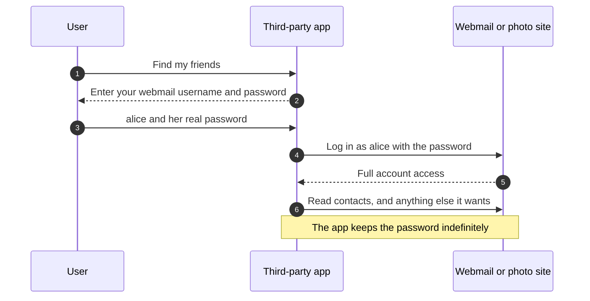
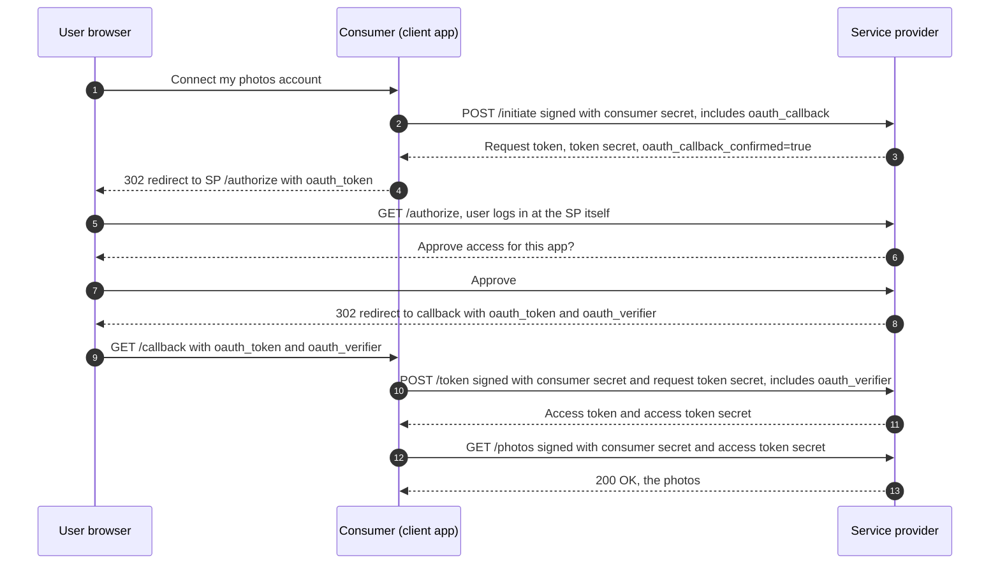
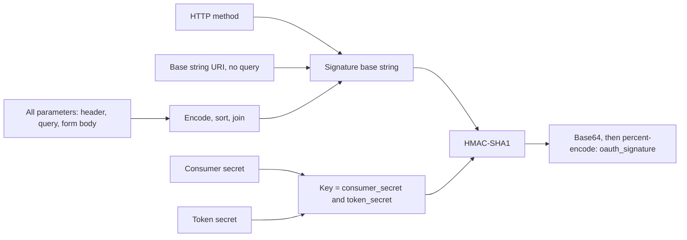
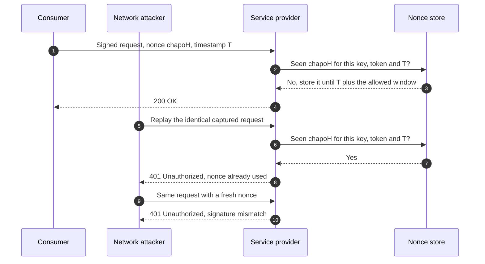
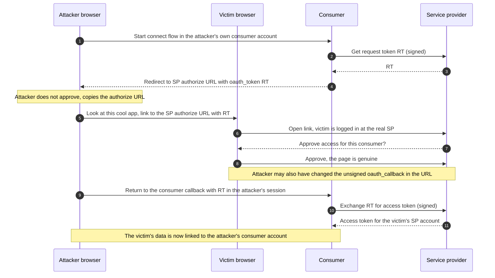
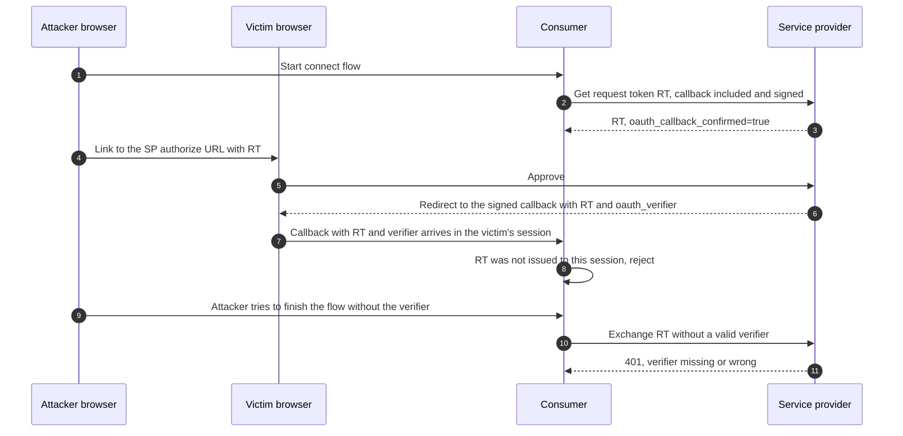
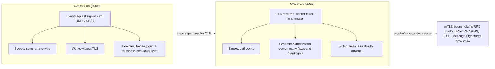

# 07 — OAuth 1.0 and 1.0a

OAuth began as a fix for a specific, widespread bad habit: third-party websites asking users for their passwords to other services. **OAuth 1.0** (December 2007) let a user approve access at the service itself, after which the application received a revocable **token** instead of the password, and every API request was **cryptographically signed**. A session fixation flaw found in April 2009 led to **OAuth 1.0a**, which the IETF documented as **RFC 5849** in 2010. OAuth 1.0a is rarely chosen for new systems today, but it explains why [OAuth 2.0](08-oauth-2.md) looks the way it does, and it still runs behind a few well-known APIs.

> **Where this fits in the evolution**
>
> - **Before:** Applications collected users' passwords to other sites (the **password anti-pattern**), or used one of several incompatible proprietary delegation schemes: Flickr's authentication API, Google AuthSub and Yahoo BBAuth, among others. Login itself was moving to [OpenID](01-evolution-of-authentication.md) (2005-2007), which did not help applications call APIs.
> - **What it solved:** One open, interoperable protocol for **delegated, scoped, revocable API access** without sharing passwords, with request signatures that protected requests even without TLS.
> - **What replaced it:** Signature complexity and a poor fit for mobile and JavaScript clients led to OAuth WRAP (2009) and then **OAuth 2.0** (RFC 6749 and RFC 6750, October 2012), which traded per-request signatures for **TLS plus bearer tokens**. RFC 6749 formally obsoletes RFC 5849. Proof-of-possession later returned in a different form: mTLS-bound tokens (RFC 8705), DPoP (RFC 9449) and HTTP Message Signatures (RFC 9421). See [modern OAuth](09-modern-oauth-2.1-and-extensions.md).

---

## Table of contents

1. [The password anti-pattern](#1-the-password-anti-pattern)
2. [The predecessors and the birth of OAuth](#2-the-predecessors-and-the-birth-of-oauth)
3. [Roles and credentials](#3-roles-and-credentials)
4. [The three-legged flow, step by step](#4-the-three-legged-flow-step-by-step)
5. [Signatures in depth](#5-signatures-in-depth)
6. [Nonces, timestamps and replay protection](#6-nonces-timestamps-and-replay-protection)
7. [Two-legged OAuth and other variants](#7-two-legged-oauth-and-other-variants)
8. [The April 2009 session fixation attack](#8-the-april-2009-session-fixation-attack)
9. [OAuth 1.0a: the fix](#9-oauth-10a-the-fix)
10. [RFC 5849 (2010)](#10-rfc-5849-2010)
11. [Why OAuth 1.0 was painful](#11-why-oauth-10-was-painful)
12. [Why OAuth 2.0 traded signatures for TLS and bearer tokens](#12-why-oauth-20-traded-signatures-for-tls-and-bearer-tokens)
13. [Where OAuth 1.0a is still seen](#13-where-oauth-10a-is-still-seen)
14. [OAuth 1.0a vs OAuth 2.0](#14-oauth-10a-vs-oauth-20)
15. [Production guidance for legacy integrations (2026)](#15-production-guidance-for-legacy-integrations-2026)
16. [Common attacks and mistakes](#16-common-attacks-and-mistakes)
17. [Java 21: computing an OAuth 1.0a signature](#17-java-21-computing-an-oauth-10a-signature)
18. [Interview questions](#interview-questions)
19. [References](#references)

---

## 1. The password anti-pattern

In the mid-2000s, web applications started to combine data from other services: import your webmail contacts to find friends, post updates to your microblog, print your online photos. There was no standard way for an application to act on a user's behalf, so the common solution was simple and terrible: **ask the user for their username and password to the other service**, then log in as them.



What was wrong with it:

| Problem | Consequence |
|---|---|
| **Full access** | The app could read all mail, change settings, delete data or change the password. There was no way to grant "read contacts only". |
| **No revocation per app** | The only way to cut off one app was to change the password, which cut off every app. |
| **Password stored by third parties** | Every app that stored passwords became a breach target, and a breach exposed the user's main account. |
| **Trains users to be phished** | Users learned that typing a password for site X into site Y is normal, which is exactly what phishing relies on. |
| **Breaks with stronger login** | Anything beyond a password (a second factor, a CAPTCHA, an unusual-login challenge) broke the integration. |
| **No audit** | The service could not tell the user's own activity from the app's activity. |

The goal of OAuth was to replace this with **delegation**: the user authenticates at the service itself and approves a specific app for specific access; the app receives a token that is limited, attributable and revocable on its own.

---

## 2. The predecessors and the birth of OAuth

### 2.1 Proprietary delegation schemes

Several large providers had already solved the problem for their own APIs, each differently:

| Scheme | Provider | Idea |
|---|---|---|
| Flickr authentication API | Flickr (Yahoo) | The app sends the user to Flickr to approve, receives a short-lived "frob", and exchanges it for a token. Requests are signed with an MD5 hash over the parameters and a shared secret. |
| AuthSub | Google | The app redirects the user to Google to approve access to a specific service (for example Calendar); Google returns a token to the app's callback URL. |
| BBAuth (Browser-Based Authentication) | Yahoo | The app redirects the user to Yahoo to log in and approve; Yahoo returns a token used to obtain credentials for API calls. |
| Others | AOL OpenAuth, Amazon Web Services, Facebook | Similar redirect-and-token ideas, or signed requests with application keys. |

They shared the right idea (send the user to the provider, get a token back) but were mutually incompatible. Every application and every library had to implement each one separately.

### 2.2 From Twitter's API to an open standard

- **Late 2006:** Blaine Cook, working on Twitter's OpenID implementation, looked for a way to let users delegate Twitter API access without giving third-party apps their passwords. He worked with Chris Messina, Larry Halff (Ma.gnolia) and David Recordon, and they found that no open standard for API access delegation existed.
- **April 2007:** A Google group formed to write an open protocol. Blaine Cook's April 5, 2007 message summed up the goal: something like Flickr Auth, Google AuthSub and Yahoo BBAuth, published as an open standard with common libraries. DeWitt Clinton (Google) and Eran Hammer-Lahav joined the effort.
- **October 2007:** The final draft of OAuth Core 1.0 was published (RFC 5849 describes the protocol as stabilized at version 1.0 in October 2007).
- **December 4, 2007:** OAuth Core 1.0 was formally released as a community specification, outside any standards body.
- **2008-2010:** Adoption grew (Google, Yahoo, Twitter, MySpace, Netflix and others). Twitter turned off password (HTTP Basic) authentication for its API on **August 31, 2010** and required OAuth for all third-party apps, an event developers nicknamed the "OAuthcalypse".

---

## 3. Roles and credentials

OAuth Core 1.0 and RFC 5849 use different names for the same things. You will see both in old code and documentation.

| OAuth Core 1.0 / 1.0a | RFC 5849 | OAuth 2.0 equivalent | Meaning |
|---|---|---|---|
| **User** | Resource owner | Resource owner | The person whose data is accessed |
| **Consumer** | Client | Client | The third-party application |
| **Service Provider** | Server | Authorization server + resource server | The service holding the data (one role in OAuth 1.0) |
| Consumer key + consumer secret | Client credentials | `client_id` + `client_secret` | Identify (and authenticate) the application |
| Request token + token secret | Temporary credentials | Authorization code (roughly) | Short-lived credentials for one authorization attempt |
| Access token + token secret | Token credentials | Access token | Long-term credentials for API calls on the user's behalf |

Two things stand out compared with OAuth 2.0:

1. **Every token comes with a secret.** The token identifies the grant; the token secret is never sent over the wire and is used only as part of the signing key. With the HMAC and RSA methods, a captured access token alone is useless: HMAC also needs the token secret and consumer secret, and RSA needs the consumer's private key (PLAINTEXT is the exception, because it sends the secrets).
2. **One "service provider" role.** OAuth 1.0 did not separate the authorization server from the resource server. OAuth 2.0's split is what made central identity providers and many independent APIs practical.

---

## 4. The three-legged flow, step by step

"Three-legged" refers to the three parties: user, consumer and service provider. The flow has three steps: get a request token, have the user authorize it, exchange it for an access token. The diagram shows the **1.0a** version, which is the one implemented everywhere today.



The raw HTTP below uses the example from RFC 5849 Section 1.2: a printing service (`printer.example.com`) accessing a user's private photos at `photos.example.net`. The client credentials are `dpf43f3p2l4k3l03` / `kd94hf93k423kf44`. All three signatures are real HMAC-SHA1 values for these inputs. As in the RFC, steps 1 and 3 are sent over HTTPS, so their signature base strings use `https://photos.example.net/...`; the scheme is part of what is signed.

### Step 1: obtain temporary credentials (request token)

The consumer makes a signed request. There is no token yet, so the signing key is `consumer_secret&` (note the trailing `&` with an empty token secret).

```http
POST /initiate HTTP/1.1
Host: photos.example.net
Authorization: OAuth realm="Photos",
    oauth_consumer_key="dpf43f3p2l4k3l03",
    oauth_signature_method="HMAC-SHA1",
    oauth_timestamp="137131200",
    oauth_nonce="wIjqoS",
    oauth_callback="http%3A%2F%2Fprinter.example.com%2Fready",
    oauth_signature="74KNZJeDHnMBp0EMJ9ZHt%2FXKycU%3D"
```

(Line breaks inside the `Authorization` header are for readability.) The server verifies the signature, records the callback, and returns form-encoded temporary credentials:

```http
HTTP/1.1 200 OK
Content-Type: application/x-www-form-urlencoded

oauth_token=hh5s93j4hdidpola&oauth_token_secret=hdhd0244k9j7ao03&oauth_callback_confirmed=true
```

`oauth_callback_confirmed=true` tells the consumer the server implements 1.0a (Section 9).

### Step 2: resource owner authorization

The consumer redirects the user's browser to the service provider. Only the request token travels in the URL; the token secret stays with the consumer.

```http
HTTP/1.1 302 Found
Location: https://photos.example.net/authorize?oauth_token=hh5s93j4hdidpola
```

The user logs in **at the service provider** (the consumer never sees the password), reviews the request and approves. The provider redirects back to the callback registered in step 1, adding a **verifier**:

```http
HTTP/1.1 302 Found
Location: http://printer.example.com/ready?oauth_token=hh5s93j4hdidpola&oauth_verifier=hfdp7dh39dks9884
```

### Step 3: obtain token credentials (access token)

The consumer exchanges the request token, proving possession of the request token secret (it is part of the signing key) and presenting the verifier:

```http
POST /token HTTP/1.1
Host: photos.example.net
Authorization: OAuth realm="Photos",
    oauth_consumer_key="dpf43f3p2l4k3l03",
    oauth_token="hh5s93j4hdidpola",
    oauth_signature_method="HMAC-SHA1",
    oauth_timestamp="137131201",
    oauth_nonce="walatlh",
    oauth_verifier="hfdp7dh39dks9884",
    oauth_signature="gKgrFCywp7rO0OXSjdot%2FIHF7IU%3D"
```

```http
HTTP/1.1 200 OK
Content-Type: application/x-www-form-urlencoded

oauth_token=nnch734d00sl2jdk&oauth_token_secret=pfkkdhi9sl3r4s00
```

The request token is now spent. The consumer stores the access token and its secret (encrypted) for future calls.

### Step 4: access protected resources

Every API call is signed with `consumer_secret&access_token_secret`:

```http
GET /photos?file=vacation.jpg&size=original HTTP/1.1
Host: photos.example.net
Authorization: OAuth realm="Photos",
    oauth_consumer_key="dpf43f3p2l4k3l03",
    oauth_token="nnch734d00sl2jdk",
    oauth_signature_method="HMAC-SHA1",
    oauth_timestamp="137131202",
    oauth_nonce="chapoH",
    oauth_signature="MdpQcU8iPSUjWoN%2FUDMsK2sui9I%3D"
```

In the RFC example this request is made over plain HTTP. The signature still prevents tampering and replay, which was a deliberate design goal in 2007, when many APIs were not served over TLS. It does **not** provide confidentiality: anyone on the network can read the photos.

**Where the protocol parameters can go.** RFC 5849 allows the `oauth_*` parameters in the `Authorization: OAuth` header (preferred), in a form-encoded request body, or in the query string. The header keeps them out of URLs and logs.

---

## 5. Signatures in depth

### 5.1 Why sign every request?

OAuth 1.0 was designed so that a request intercepted on an unencrypted connection could not be **modified** or **replayed**, and so that the long-term secrets never crossed the network. The signature proves three things: the request comes from a holder of the consumer secret (and token secret), its method, URL and parameters were not changed, and (with the nonce and timestamp) it has not been seen before.

### 5.2 Signature methods

| Method | Key | Signature value | Notes |
|---|---|---|---|
| **HMAC-SHA1** | `encode(consumer_secret) + "&" + encode(token_secret)` | Base64 of HMAC-SHA1 over the signature base string | By far the most common. HMAC-SHA1 is not broken by SHA-1 collision attacks, but SHA-1 is being retired (NIST plans to phase it out by the end of 2030), so some providers offer HMAC-SHA256 as a non-standard extension. |
| **RSA-SHA1** | The consumer's RSA private key; the provider holds the matching public key | Base64 of RSASSA-PKCS1-v1_5 with SHA-1 over the base string | The token secret is **not** used. Used for registered server-to-server integrations. No shared secret to leak from the provider. |
| **PLAINTEXT** | None | `encode(consumer_secret) + "&" + encode(token_secret)` sent as is | Secrets travel in every request, so it **requires TLS**. No tamper or replay protection beyond TLS. Effectively an early form of the bearer model. |

### 5.3 Building the signature base string

The **signature base string** is a canonical, byte-exact representation of the request. Client and server must build exactly the same string, or the signatures will not match.

```text
base string = UPPERCASE(HTTP method) & encode(base string URI) & encode(normalized parameters)
```

Step by step, for the protected resource request in step 4:

**1. HTTP method**, uppercase: `GET`

**2. Base string URI**: scheme and host in lowercase, port omitted when it is the default (80 for `http`, 443 for `https`), path included, **no query string, no fragment**:

```text
http://photos.example.net/photos
```

**3. Collect parameters** from all sources: the `Authorization` header (excluding `realm` and `oauth_signature`), the query string, and the body only when it is `application/x-www-form-urlencoded`:

| Name | Value |
|---|---|
| `file` | `vacation.jpg` |
| `size` | `original` |
| `oauth_consumer_key` | `dpf43f3p2l4k3l03` |
| `oauth_token` | `nnch734d00sl2jdk` |
| `oauth_signature_method` | `HMAC-SHA1` |
| `oauth_timestamp` | `137131202` |
| `oauth_nonce` | `chapoH` |

**4. Normalize**: percent-encode every name and value (RFC 3986 rules; see Section 5.4 below), sort by encoded name, then by encoded value for duplicate names, and join as `name=value` pairs with `&`:

```text
file=vacation.jpg&oauth_consumer_key=dpf43f3p2l4k3l03&oauth_nonce=chapoH&oauth_signature_method=HMAC-SHA1&oauth_timestamp=137131202&oauth_token=nnch734d00sl2jdk&size=original
```

**5. Concatenate** the three parts with `&`, percent-encoding the URI and the normalized parameter string (so their own `&` and `=` become `%26` and `%3D`):

```text
GET&http%3A%2F%2Fphotos.example.net%2Fphotos&file%3Dvacation.jpg%26oauth_consumer_key%3Ddpf43f3p2l4k3l03%26oauth_nonce%3DchapoH%26oauth_signature_method%3DHMAC-SHA1%26oauth_timestamp%3D137131202%26oauth_token%3Dnnch734d00sl2jdk%26size%3Doriginal
```

**6. Sign** with the key `kd94hf93k423kf44&pfkkdhi9sl3r4s00` (consumer secret, `&`, access token secret):

```text
HMAC-SHA1 -> Base64 -> MdpQcU8iPSUjWoN/UDMsK2sui9I=
```

**7. Percent-encode** it for the header: `oauth_signature="MdpQcU8iPSUjWoN%2FUDMsK2sui9I%3D"`.

The server repeats steps 1-6 from the request it received, using the secrets it stores for that consumer key and token, and compares the result to `oauth_signature` with a **constant-time** comparison.



### 5.4 Percent-encoding rules (where most bugs lived)

RFC 5849 Section 3.6 requires strict RFC 3986 encoding:

- Encode the string as UTF-8 first.
- Leave only the **unreserved** characters unencoded: `A-Z a-z 0-9 - . _ ~`.
- Encode everything else as `%XX` with **uppercase** hex digits.
- A space is `%20`, never `+`.

Most standard library "URL encoders" implement HTML form encoding instead, which differs in exactly the places that break signatures. Java's `URLEncoder`, for example, turns a space into `+`, leaves `*` unencoded and encodes `~` as `%7E`, so OAuth code must fix all three (see Section 17).

### 5.5 What the signature does not cover

- **Non-form request bodies.** JSON or XML bodies are not part of the base string. An attacker who could intercept and modify a request (without TLS) could change a JSON body without breaking the signature. The community "OAuth Request Body Hash" extension (`oauth_body_hash`) added a hash of the body to fix this; not every provider supported it.
- **Most headers**, including `Content-Type`.
- **The response.** Nothing authenticates the server's reply; only TLS does.

---

## 6. Nonces, timestamps and replay protection

A valid signed request could be captured and sent again. OAuth 1.0 prevents that with two parameters:

- `oauth_timestamp`: seconds since the Unix epoch when the request was made.
- `oauth_nonce`: a random string, unique for every request with the same timestamp, consumer key and token.

The server rejects any request whose nonce it has already seen for that consumer, token and timestamp, and may reject requests whose timestamp is too old. The RFC does not set a window; providers typically allow a few minutes of clock difference.



The attacker cannot change the nonce or timestamp without invalidating the signature, because both are part of the signed base string. The cost is **server-side state**: a nonce store (for example Redis keys with a TTL equal to the timestamp window) shared by all API nodes. Clock drift on clients (especially phones and desktops) was a constant support issue.

---

## 7. Two-legged OAuth and other variants

| Variant | How it works | Typical use |
|---|---|---|
| **Three-legged** | User, consumer and provider; the full flow in Section 4 | Delegated access to a user's data |
| **Two-legged** | No user and no token: the consumer signs requests with its consumer secret only (empty token secret) | Server-to-server API calls; effectively signed API keys (compare with OAuth 2.0 client credentials) |
| **Out-of-band (`oob`)** | The consumer cannot receive a redirect (desktop app, device, CLI), so it sets `oauth_callback=oob`; the provider displays the verifier to the user, who types it into the app | Desktop and command-line clients (X calls this "PIN-based OAuth") |
| **Session extension** | Some providers (notably Yahoo) issued short-lived access tokens plus a session handle used to renew them | An early version of what OAuth 2.0 later standardized as refresh tokens |

---

## 8. The April 2009 session fixation attack

On **April 23, 2009**, the OAuth community published **Security Advisory 2009.1**, describing a session fixation attack against the OAuth Core 1.0 authorization flow. It was a protocol flaw, not an implementation bug: every correct implementation was vulnerable.

### 8.1 Why it worked

In OAuth Core 1.0, the consumer passed `oauth_callback` as an **unsigned query parameter on the authorization URL** (step 2), and nothing tied the person who **approved** the request token to the person who **completed** the flow at the consumer.



The attacker never learned the victim's password or any secret. They simply got the victim to approve a request token that the attacker's session at the consumer was waiting on. Because the authorization page was the real provider's page, the usual "check the address bar" advice did not help.

### 8.2 What the attacker gained

Access to the victim's data through the consumer application, under the attacker's consumer account: for example, the victim's photos imported into the attacker's printing account, or the ability to post as the victim through the attacker's session in a social app.

---

## 9. OAuth 1.0a: the fix

**OAuth Core 1.0 Revision A** was published on **June 24, 2009**. It made three changes:

| Change | Where | Effect |
|---|---|---|
| `oauth_callback` moved to the **request token request** | Step 1 (signed) | The callback can no longer be altered in the authorization URL. The consumer must send it; `oob` if it cannot receive redirects. |
| `oauth_callback_confirmed=true` in the request token response | Step 1 response | Lets the consumer detect that the provider implements 1.0a |
| **`oauth_verifier`** | Added to the callback redirect (step 2) and **required** in the access token request (step 3) | Only the browser that actually approved receives the verifier. The attacker, waiting in their own session, never sees it and cannot complete the exchange. |



Note the consumer-side check in the diagram: a robust consumer binds each request token to the browser session that started the flow and rejects callbacks arriving in a different session. That is the same idea as the `state` parameter and PKCE in [OAuth 2.0](08-oauth-2.md), which bind the authorization response to the client instance that started the request.

Interestingly, the protocol version string did not change: 1.0a requests still send `oauth_version="1.0"` (the parameter is optional). The presence of `oauth_callback_confirmed` and `oauth_verifier` is what distinguishes 1.0a.

---

## 10. RFC 5849 (2010)

In **April 2010**, the IETF published **RFC 5849, *The OAuth 1.0 Protocol***, edited by Eran Hammer-Lahav, as an **Informational** RFC. It:

- documents OAuth Core 1.0 Revision A (it is 1.0a, despite the title);
- renames the roles (consumer to client, service provider to server, user to resource owner) and the credentials (request token to temporary credentials, access token to token credentials);
- fixes errata and clarifies the signature and encoding rules.

The IETF OAuth working group, formed in 2009 to take OAuth into the standards process, was by then already working on OAuth 2.0. **RFC 6749 (October 2012) obsoletes RFC 5849.** OAuth 1.0a is not deprecated in the sense of being insecure when implemented correctly, but it is a closed chapter: no new work happens on it.

---

## 11. Why OAuth 1.0 was painful

OAuth 1.0a achieved its security goals. It failed on usability for developers and on fit for new kinds of clients.

| Pain point | Details |
|---|---|
| **Signature canonicalization bugs** | Client and server had to produce byte-identical base strings. Typical mismatches: `+` versus `%20`, lowercase hex, `~` and `*` handling, non-ASCII characters, parameter sorting with duplicate names, forgetting to include query or body parameters, default ports (`:443`), host case, and proxies or load balancers that rewrote the URL or scheme (the server then signs `http://...` while the client signed `https://...`). |
| **Opaque failures** | A mismatch produced a bare `401`. The developer could not see which part of the base string differed, and many providers did not echo the expected base string. |
| **Heavy client libraries** | Every language needed a correct OAuth library; hand-rolled implementations were common and buggy. A simple `curl` call was impossible without a helper. |
| **No real client secrets on devices** | Desktop and mobile apps had to embed the consumer secret, where it could be extracted. The "secret" identified the app but did not prove the app was genuine. Browser JavaScript could not keep one at all. |
| **Clumsy flows for non-web clients** | The redirect-based flow suited server-side web apps. Devices and desktop apps used the `oob` PIN workaround. |
| **No standard token lifetime or refresh** | Many providers issued access tokens that never expired; renewal was a provider-specific extension. |
| **No standard scopes** | The core protocol had no `scope` parameter; providers added their own. |
| **Server state and clocks** | Nonce storage across nodes, timestamp windows and client clock drift. |
| **One role for everything** | The service provider was both the token issuer and the API, which did not fit central identity providers protecting many APIs. |
| **Bodies not covered** | Only form-encoded bodies were signed, so JSON APIs needed the body hash extension. |
| **SHA-1** | The main method was tied to SHA-1, which the industry was moving away from. |

---

## 12. Why OAuth 2.0 traded signatures for TLS and bearer tokens

By 2009-2010, two things had changed. **TLS had become cheap and normal** for APIs, and **mobile apps and JavaScript clients** had become first-class. OAuth 1.0's main reason for signatures (protecting requests over plain HTTP) mattered less, and its costs mattered more.

**OAuth WRAP** (Web Resource Authorization Profiles, version 0.9.7.2 dated November 2009, by authors from Microsoft, Google and Yahoo) made the trade explicitly: drop request signatures, require TLS, and use short-lived **bearer tokens** issued by a separate **authorization server**. WRAP was contributed to the IETF and became the basis for OAuth 2.0.



What OAuth 2.0 (RFC 6749 and RFC 6750, October 2012) changed:

- **TLS everywhere** instead of message signatures; bearer tokens sent as `Authorization: Bearer <token>`.
- **Separate authorization server and resource server** roles.
- **Client types** (confidential and public) and multiple **grant types** (authorization code, implicit, password, client credentials) for web, mobile, JavaScript and server clients.
- **Short-lived access tokens and refresh tokens** in the core specification.
- A **`scope`** parameter in the core.
- A **framework** rather than a complete protocol, leaving many choices (token format, validation) to implementers.

The cost was real. Eran Hammer, lead author of the OAuth 1.0 specification and long-time editor of the OAuth 2.0 drafts, resigned as editor in mid-2012 and explained why in a July 2012 blog post, criticizing OAuth 2.0 as a complex, under-specified framework whose security depended heavily on implementers getting TLS and many options right. Some of his concerns proved accurate: the implicit grant leaked tokens, redirect URI handling was abused, and bearer tokens were stolen and replayed. The fixes came over the next decade: PKCE (RFC 7636, 2015), the Security BCP (RFC 9700, 2025), and **sender-constrained tokens** that bring back proof-of-possession without OAuth 1.0's canonicalization problems: certificate-bound tokens (RFC 8705), DPoP (RFC 9449, 2023) and HTTP Message Signatures (RFC 9421, 2024). See [OAuth 2](08-oauth-2.md) and [modern OAuth](09-modern-oauth-2.1-and-extensions.md); request signing is covered in [chapter 03](03-http-basic-digest-and-api-keys.md).

---

## 13. Where OAuth 1.0a is still seen

As of 2026 you will still meet OAuth 1.0a (or OAuth 1.0-style signatures) in a few places:

| Where | What to know |
|---|---|
| **X (formerly Twitter) API** | X still documents **OAuth 1.0a User Context** (three-legged and PIN-based flows) alongside OAuth 2.0 with PKCE, and some endpoints have required it. New integrations should prefer OAuth 2.0 where X supports it for the endpoints they need. |
| **Flickr API** | Uses OAuth 1.0a for user authorization. |
| **E-commerce and ERP platforms** | Adobe Commerce (Magento) integrations use OAuth 1.0a; WooCommerce's REST API uses one-legged OAuth 1.0a signatures when called over plain HTTP; Oracle NetSuite's Token-Based Authentication uses OAuth 1.0-style signed requests (with HMAC-SHA256). |
| **Older enterprise integrations** | Server-to-server "application links" and partner integrations built around 2010 with RSA-SHA1. |

If you must integrate with one of these:

- Use a well-tested library, not hand-written signing code. In Java, ScribeJava supports OAuth 1.0a, but its last release (8.3.3) was in November 2022, so check its maintenance status (or use the provider's own SDK) before adopting it.
- Use HTTPS anyway; OAuth 1.0a over TLS is a reasonable combination.
- Store access tokens **and token secrets** encrypted at rest, treat them like passwords, and support revocation.
- Keep client clocks synchronized (NTP), and log the base string on signature failures in non-production environments.

Spring Security has no OAuth 1.0a support: the legacy Spring Security OAuth project, which included it, is end-of-life, and Spring Security 7 supports OAuth 2.0 and OpenID Connect only. For **new** APIs, there is no reason to choose OAuth 1.0a: use OAuth 2.0 with the authorization code flow and PKCE, short-lived tokens, and sender-constraining where needed ([OAuth 2](08-oauth-2.md), [../examples/03-oauth2-oidc/](../examples/03-oauth2-oidc/)).

---

## 14. OAuth 1.0a vs OAuth 2.0

| Aspect | OAuth 1.0a (RFC 5849) | OAuth 2.0 (RFC 6749 + RFC 9700 today) |
|---|---|---|
| Published | Community spec 2007, revision A 2009, RFC 5849 (Informational) 2010 | RFC 6749 and RFC 6750 (Proposed Standard) 2012; OAuth 2.1 still an Internet-Draft in 2026 |
| Nature | A complete protocol | A framework with many extensions |
| Transport security | Signatures protect integrity without TLS | TLS required for everything |
| Request protection | Every request signed (HMAC-SHA1, RSA-SHA1, PLAINTEXT) | Bearer tokens by default; optional proof-of-possession (mTLS, DPoP) |
| Token secrets | Each token has a secret that never leaves the client | Bearer token alone is enough (unless sender-constrained) |
| Roles | Consumer and service provider | Client, authorization server, resource server, resource owner |
| Client types | Effectively one (web server apps); others used `oob` | Confidential and public clients; web, SPA, mobile, device, machine |
| Flows | One three-legged flow (plus two-legged and `oob` variants) | Authorization code + PKCE, client credentials, device code, refresh token, token exchange (implicit and password grants deprecated) |
| CSRF / injection defense | `oauth_verifier` + callback in the signed request (1.0a) | `state`, PKCE, exact redirect URI matching |
| Token lifetime and refresh | Not standardized; tokens often never expired | Short-lived access tokens, refresh tokens with rotation |
| Scopes | Not in the core | `scope` parameter in the core |
| Token format | Opaque | Opaque or JWT (RFC 9068) |
| Identity / login | Not provided | Not provided by OAuth; added by OpenID Connect |
| Developer experience | Hard: canonicalization, libraries required | Easy to call; hard to configure securely without following the BCP |
| Status in 2026 | Legacy; obsoleted by RFC 6749 | The industry standard |

---

## 15. Production guidance for legacy integrations (2026)

If you operate or consume an OAuth 1.0a API:

| Area | Recommendation |
|---|---|
| Transport | HTTPS only, even though the protocol does not require it; HSTS on the provider |
| Signature method | HMAC-SHA1 or RSA-SHA1 as the provider dictates; prefer a provider's HMAC-SHA256 option where offered; **never PLAINTEXT without TLS** |
| Secrets | Consumer secrets in a secret manager, never in client-side code you ship; access tokens and token secrets encrypted at rest |
| Timestamps | Accept a small window (a few minutes, for example 5) and keep clocks in sync with NTP |
| Nonces | Store per consumer key and token for at least the timestamp window, in a store shared by all nodes |
| Verification (providers) | Rebuild the base string from the received request, compare signatures in constant time, reject unknown or revoked tokens, require `oauth_verifier` |
| Callbacks (providers) | Require pre-registered callback URLs and match them exactly; reject unconfirmed callbacks |
| Request tokens | Single use, short-lived (minutes), bound to the consumer that requested them |
| Consumers | Bind each request token to the browser session that started the flow; reject callbacks in a different session |
| Token lifetime | Support user-initiated revocation and expire tokens unused for long periods |
| Migration | Offer OAuth 2.0 (authorization code + PKCE) alongside, and plan the sunset of 1.0a endpoints |

---

## 16. Common attacks and mistakes

| Attack / mistake | What goes wrong | Mitigation |
|---|---|---|
| **Session fixation (OAuth 1.0, pre-a)** | Attacker gets a victim to approve the attacker's request token; attacker's consumer session receives access to the victim's account | Implement 1.0a: signed `oauth_callback`, `oauth_callback_confirmed`, mandatory `oauth_verifier`; bind request tokens to the initiating session |
| **Request replay** | Captured signed request is resent | Nonce + timestamp checks with a shared nonce store; reject old timestamps |
| **Non-constant-time signature comparison** | Timing differences can leak how many bytes of a forged signature are correct | Compare with `MessageDigest.isEqual` or an equivalent constant-time function |
| **PLAINTEXT over HTTP** | Consumer secret and token secret are visible to anyone on the network | Never allow PLAINTEXT without TLS; prefer HMAC or RSA methods |
| **Open or unvalidated callback URLs** | Verifier and request token are delivered to an attacker-controlled URL | Pre-register callbacks and match them exactly |
| **Embedded consumer secrets in mobile or desktop apps** | Secret is extracted and used to impersonate the app | Treat such clients as public; do not grant elevated trust based on the consumer secret; migrate to OAuth 2.0 + PKCE |
| **Unsigned bodies tampered with** | JSON body changed in transit when TLS is absent or terminated at an untrusted hop | TLS end to end; body hash extension where supported |
| **Base string built from the wrong URL behind a proxy** | Signature always fails, or (worse) a provider "fixes" it by relaxing verification | Reconstruct the external URL correctly (forwarded headers from trusted proxies only); never disable verification |
| **Hand-rolled encoding with form-encoding functions** | `+` for spaces, `*` and `~` mishandled; intermittent failures for some inputs | Use RFC 3986 encoding (Section 5.4) or a maintained library; test with spaces, `~`, `*`, `/` and non-ASCII values |
| **Logging full Authorization headers** | Logs contain tokens (and with PLAINTEXT, secrets) | Redact OAuth headers; log consumer key, token identifier and failure reason only |
| **Never-expiring tokens** | A token leaked years ago still works | Expire unused tokens, provide a revocation UI and API, rotate on security events |
| **Using OAuth 1.0a tokens as login** | "Sign in with X" built on access tokens alone can be confused by tokens from other consumers | Use OpenID Connect for login where available ([OpenID Connect](10-openid-connect.md)) |

---

## 17. Java 21: computing an OAuth 1.0a signature

This plain-JDK class reproduces the RFC 5849 example exactly. It is for understanding and for debugging integrations; use a maintained library in production.

```java
import javax.crypto.Mac;
import javax.crypto.spec.SecretKeySpec;
import java.net.URLEncoder;
import java.nio.charset.StandardCharsets;
import java.security.MessageDigest;
import java.util.Base64;
import java.util.List;
import java.util.Map;
import java.util.stream.Collectors;

public final class OAuth1Signer {

    /** RFC 5849 Section 3.6: RFC 3986 percent-encoding, not HTML form encoding. */
    static String encode(String value) {
        return URLEncoder.encode(value, StandardCharsets.UTF_8)
                .replace("+", "%20")   // URLEncoder turns spaces into '+'
                .replace("*", "%2A")   // and leaves '*' unencoded
                .replace("%7E", "~");  // and encodes '~', which is unreserved
    }

    static String signatureBaseString(String method, String baseUri, List<Map.Entry<String, String>> params) {
        String normalized = params.stream()
                .map(p -> Map.entry(encode(p.getKey()), encode(p.getValue())))
                .sorted(Map.Entry.<String, String>comparingByKey()
                        .thenComparing(Map.Entry.comparingByValue()))
                .map(p -> p.getKey() + "=" + p.getValue())
                .collect(Collectors.joining("&"));
        return method.toUpperCase() + "&" + encode(baseUri) + "&" + encode(normalized);
    }

    static String hmacSha1(String baseString, String consumerSecret, String tokenSecret) throws Exception {
        String key = encode(consumerSecret) + "&" + encode(tokenSecret == null ? "" : tokenSecret);
        Mac mac = Mac.getInstance("HmacSHA1");
        mac.init(new SecretKeySpec(key.getBytes(StandardCharsets.UTF_8), "HmacSHA1"));
        return Base64.getEncoder().encodeToString(mac.doFinal(baseString.getBytes(StandardCharsets.UTF_8)));
    }

    /** Server side: constant-time comparison of the expected and received signatures. */
    static boolean verify(String expectedSignature, String receivedSignature) {
        return MessageDigest.isEqual(
                expectedSignature.getBytes(StandardCharsets.US_ASCII),
                receivedSignature.getBytes(StandardCharsets.US_ASCII));
    }

    public static void main(String[] args) throws Exception {
        // Protected resource request from RFC 5849 Section 1.2
        List<Map.Entry<String, String>> params = List.of(
                Map.entry("file", "vacation.jpg"),
                Map.entry("size", "original"),
                Map.entry("oauth_consumer_key", "dpf43f3p2l4k3l03"),
                Map.entry("oauth_token", "nnch734d00sl2jdk"),
                Map.entry("oauth_signature_method", "HMAC-SHA1"),
                Map.entry("oauth_timestamp", "137131202"),
                Map.entry("oauth_nonce", "chapoH"));

        String base = signatureBaseString("GET", "http://photos.example.net/photos", params);
        String signature = hmacSha1(base, "kd94hf93k423kf44", "pfkkdhi9sl3r4s00");

        System.out.println(base);
        System.out.println(signature);          // MdpQcU8iPSUjWoN/UDMsK2sui9I=
        System.out.println(encode(signature));  // MdpQcU8iPSUjWoN%2FUDMsK2sui9I%3D
        System.out.println(verify(signature, "MdpQcU8iPSUjWoN/UDMsK2sui9I="));  // true
    }
}
```

Run it with `java OAuth1Signer.java` (Java 21 runs single-file programs directly). Notice how much code and care a single request needs compared with an OAuth 2.0 bearer request, which is one header over TLS. That difference is the story of [chapter 08](08-oauth-2.md).

---

## Interview questions

**1. What problem was OAuth originally created to solve?**
The password anti-pattern: third-party apps asking users for their passwords to other services, which gave them full, unrevocable access and trained users to be phished. OAuth lets the user approve a specific app at the service itself, and the app gets a limited, revocable token instead of the password.

**2. Describe the OAuth 1.0a three-legged flow.**
The consumer gets a request token (temporary credentials) with a signed request that includes its callback. It redirects the user to the provider, who logs in and approves. The provider redirects back with the request token and an `oauth_verifier`. The consumer exchanges the request token plus verifier, in a signed request, for an access token and token secret, which it then uses to sign API calls.

**3. How is an OAuth 1.0a signature computed?**
Build the signature base string: the uppercase HTTP method, the encoded base URI (no query), and the encoded, sorted list of all parameters (OAuth header parameters except the signature and realm, query parameters and form body parameters), joined with `&`. Sign it with HMAC-SHA1 using the key `consumer_secret&token_secret`, Base64-encode the result, and percent-encode it into `oauth_signature`.

**4. What do the nonce and timestamp do?**
They prevent replay. The server rejects a request whose nonce was already used for the same consumer, token and timestamp, and may reject old timestamps. Because both are inside the signed base string, an attacker cannot change them without breaking the signature.

**5. What was the 2009 session fixation attack, and how did 1.0a fix it?**
An attacker started a flow, sent the authorization link with their request token to a victim, and after the victim approved, completed the flow in their own consumer session, gaining access to the victim's account. OAuth 1.0a moved the callback into the signed request token request (confirmed by `oauth_callback_confirmed`) and added an `oauth_verifier` that is delivered only to the approving browser and required in the access token exchange.

**6. Why did OAuth 2.0 drop request signatures?**
Signature canonicalization caused endless interoperability bugs, libraries were mandatory, and mobile and JavaScript clients could not keep secrets anyway. TLS had become universal, so OAuth WRAP and then OAuth 2.0 relied on TLS plus short-lived bearer tokens, which made APIs far easier to call.

**7. What did OAuth 2.0 lose by dropping signatures, and how has that been addressed?**
Bearer tokens can be replayed by anyone who steals them, and integrity depends entirely on TLS. Sender-constrained tokens restore proof-of-possession: mTLS certificate-bound tokens (RFC 8705), DPoP (RFC 9449), and HTTP Message Signatures (RFC 9421) for signing requests.

**8. What are the three OAuth 1.0a signature methods?**
HMAC-SHA1 (shared secrets, most common), RSA-SHA1 (the consumer signs with its private key; the token secret is not used), and PLAINTEXT (the secrets are sent directly and require TLS).

**9. Is OAuth 1.0a insecure? Where is it still used?**
Implemented correctly (1.0a, over TLS), it is not insecure, just complex and obsolete: RFC 6749 obsoletes RFC 5849. It still appears in the X API (OAuth 1.0a User Context), Flickr, and some commerce and ERP platforms such as Adobe Commerce integrations and NetSuite's token-based authentication.

**10. Map OAuth 1.0a terms to OAuth 2.0 terms.**
Consumer to client; service provider to authorization server plus resource server; user to resource owner; consumer key and secret to client ID and secret; request token to (roughly) authorization code; access token plus token secret to access token (with no secret unless sender-constrained).

---

## References

- RFC 5849 — The OAuth 1.0 Protocol (Informational, April 2010): https://www.rfc-editor.org/rfc/rfc5849
- OAuth Core 1.0 (December 2007, obsoleted by Revision A): https://oauth.net/core/1.0/
- OAuth Core 1.0 Revision A (June 2009): https://oauth.net/core/1.0a/
- OAuth Security Advisory 2009.1 (session fixation, April 2009): https://oauth.net/advisories/2009-1/
- RFC 6749 — The OAuth 2.0 Authorization Framework (obsoletes RFC 5849): https://www.rfc-editor.org/rfc/rfc6749
- RFC 6750 — OAuth 2.0 Bearer Token Usage: https://www.rfc-editor.org/rfc/rfc6750
- draft-hardt-oauth-01 — OAuth Web Resource Authorization Profiles (OAuth WRAP): https://datatracker.ietf.org/doc/html/draft-hardt-oauth-01
- RFC 3986 — Uniform Resource Identifier (URI): Generic Syntax (percent-encoding): https://www.rfc-editor.org/rfc/rfc3986
- RFC 2104 — HMAC: Keyed-Hashing for Message Authentication: https://www.rfc-editor.org/rfc/rfc2104
- RFC 7636 — Proof Key for Code Exchange (PKCE): https://www.rfc-editor.org/rfc/rfc7636
- RFC 9700 — Best Current Practice for OAuth 2.0 Security: https://www.rfc-editor.org/rfc/rfc9700
- RFC 8705 — OAuth 2.0 Mutual-TLS Client Authentication and Certificate-Bound Access Tokens: https://www.rfc-editor.org/rfc/rfc8705
- RFC 9449 — OAuth 2.0 Demonstrating Proof of Possession (DPoP): https://www.rfc-editor.org/rfc/rfc9449
- RFC 9421 — HTTP Message Signatures: https://www.rfc-editor.org/rfc/rfc9421
- NIST — NIST Retires SHA-1 Cryptographic Algorithm (December 2022): https://www.nist.gov/news-events/news/2022/12/nist-retires-sha-1-cryptographic-algorithm
- X developer documentation — OAuth 1.0a: https://docs.x.com/fundamentals/authentication/oauth-1-0a/overview
- Eran Hammer — OAuth 2.0 and the Road to Hell (July 2012): https://hueniverse.com/2012/07/oauth-2-0-and-the-road-to-hell/
- ScribeJava (Java OAuth 1.0a and 2.0 client library): https://github.com/scribejava/scribejava
