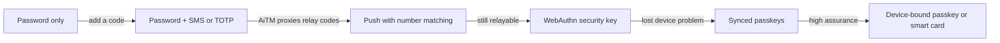
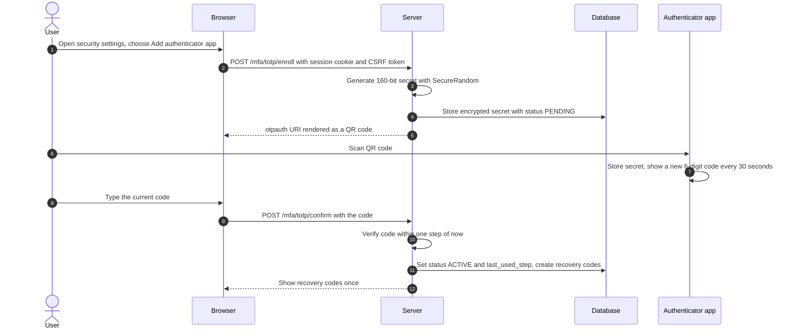
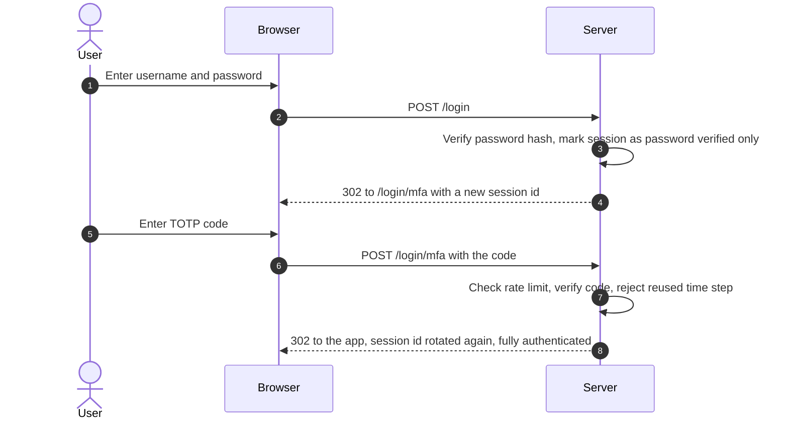
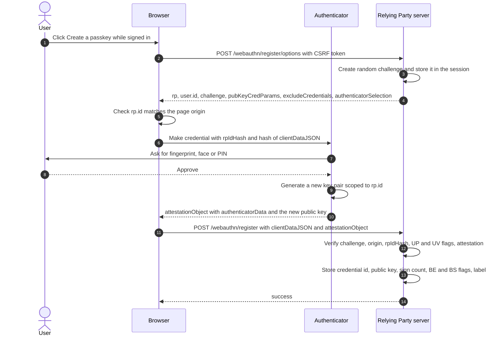
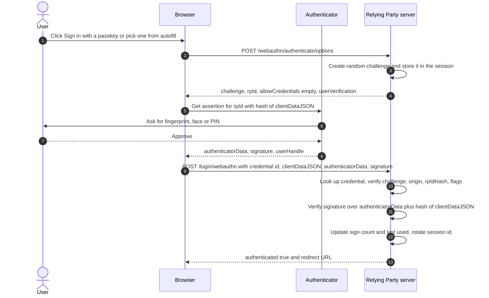
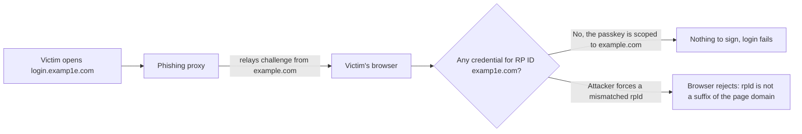
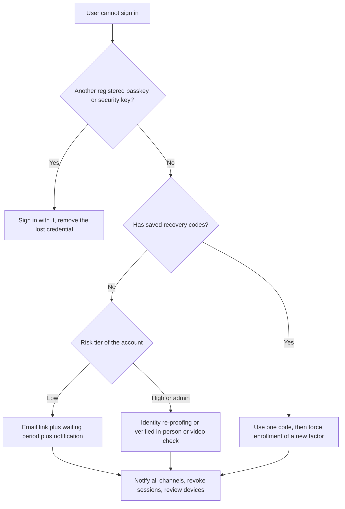
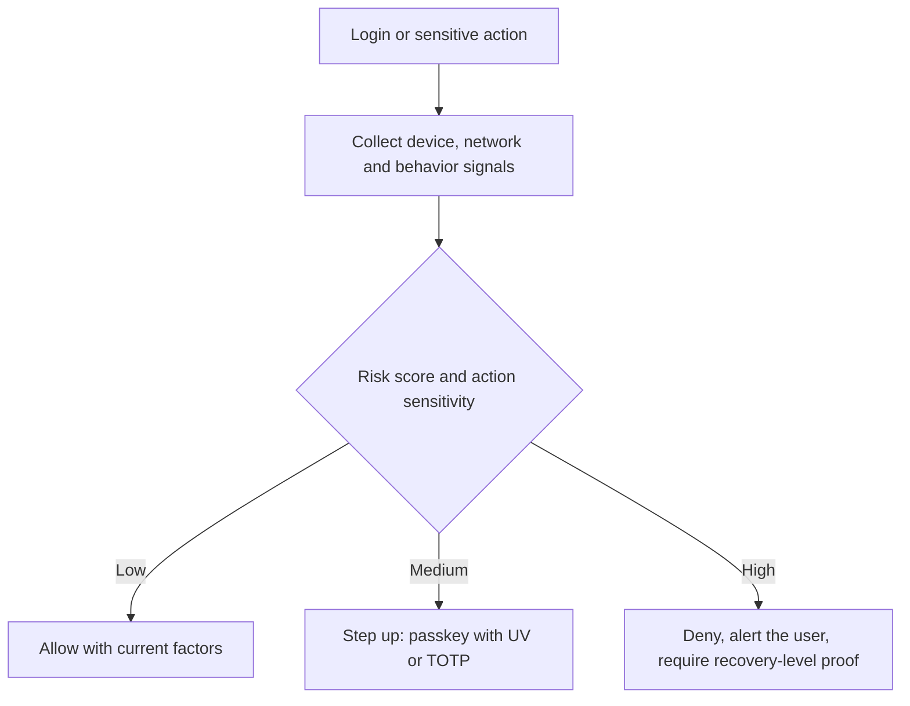

# 11 — MFA, Passwordless and Passkeys

Passwords fail in predictable ways: they are phished, reused, guessed and leaked. **Multi-factor authentication (MFA)** adds a second, independent proof, and **passwordless** methods remove the shared secret altogether. This chapter covers how one-time passwords (HOTP/TOTP) work at the byte level, why SMS is now a *restricted* authenticator, how push and email methods fail, how to design recovery codes, and how **WebAuthn and passkeys** finally deliver phishing resistance by binding the credential to the website's origin. It ends with account recovery, risk-based authentication and Spring Security 7's passkey and MFA support.

> **Where this fits in the evolution**
>
> - **Before:** [Passwords](02-passwords-and-credential-storage.md) checked against a hash, carried forward by [sessions](04-sessions-cookies-and-csrf.md) or [tokens](06-tokens-and-jwt.md). Credential stuffing and phishing made "something you know" alone insufficient.
> - **What it solved:** HOTP (RFC 4226, 2005) and TOTP (RFC 6238, 2011) added a possession factor that needs no network. SMS codes made a second factor available to everyone, but SIM swaps and real-time phishing proxies defeated them. FIDO U2F (2014), then **FIDO2/WebAuthn** (W3C Level 1 in 2019, Level 2 in 2021, **Level 3 a W3C Recommendation in August 2026**) introduced origin-bound public-key credentials. **Passkeys** (2022 onward) made those credentials syncable and usable without a password.
> - **What extends it:** NIST SP 800-63B-4 (2025) requires AAL2 verifiers to *offer* a phishing-resistant option and accepts synced passkeys at AAL2. Risk-based (adaptive) authentication, step-up challenges ([RFC 9470](https://www.rfc-editor.org/rfc/rfc9470)) and shared security signals (OpenID CAEP/SSF) decide *when* to ask for which factor. See the [evolution chapter](01-evolution-of-authentication.md) for the full timeline.

---

## Table of contents

1. [MFA concepts](#1-mfa-concepts)
2. [NIST assurance levels: AAL1, AAL2, AAL3](#2-nist-assurance-levels-aal1-aal2-aal3)
3. [HOTP: HMAC-based one-time passwords (RFC 4226)](#3-hotp-hmac-based-one-time-passwords-rfc-4226)
4. [TOTP: time-based one-time passwords (RFC 6238)](#4-totp-time-based-one-time-passwords-rfc-6238)
5. [SMS and voice OTP](#5-sms-and-voice-otp)
6. [Email OTP and magic links](#6-email-otp-and-magic-links)
7. [Push MFA and MFA fatigue](#7-push-mfa-and-mfa-fatigue)
8. [Recovery codes](#8-recovery-codes)
9. [WebAuthn and FIDO2](#9-webauthn-and-fido2)
10. [Passkeys](#10-passkeys)
11. [Account recovery: the weakest link](#11-account-recovery-the-weakest-link)
12. [Risk-based and adaptive authentication](#12-risk-based-and-adaptive-authentication)
13. [Production best practices (2026)](#13-production-best-practices-2026)
14. [Common attacks and mistakes](#14-common-attacks-and-mistakes)
15. [Spring Boot 4 / Spring Security 7](#15-spring-boot-4--spring-security-7)
16. [Interview questions](#interview-questions)
17. [References](#references)

---

## 1. MFA concepts

### 1.1 Factors

Authentication factors fall into three categories (see [Foundations](00-foundations.md)):

| Factor | Examples | Typical weakness |
|---|---|---|
| **Knowledge** (something you know) | Password, PIN | Phished, guessed, reused, leaked |
| **Possession** (something you have) | Phone with an authenticator app, hardware security key, passkey on a device, smart card | Lost or stolen device; some forms can still be relayed |
| **Inherence** (something you are) | Fingerprint, face | Cannot be changed; on its own NIST does not accept it as an authenticator |

**MFA** means proving factors from **two or more different categories**. A password plus a security question is two knowledge factors, so it is not MFA.

Two terms are often mixed up:

- **Two-step verification (2SV)** describes the *flow* (a second step after the password). The second step may or may not be a different factor.
- A **multi-factor authenticator** is a *single device* that combines two factors. A passkey unlocked with a fingerprint or device PIN is one: the private key is the possession factor, the biometric or PIN is the inherence or knowledge factor, and it is checked locally on the device. This is why a passkey with user verification counts as MFA on its own.

### 1.2 Phishing resistance is the property that matters now

Attackers no longer need to steal a password database. Modern phishing kits run as an **adversary-in-the-middle (AiTM) reverse proxy**: the victim talks to `login.examp1e.com`, the proxy forwards everything to the real `login.example.com` in real time, and it relays the password, the OTP and even the push approval. When the real site sets the session cookie, the proxy keeps it.

NIST SP 800-63B-4 defines phishing resistance as the ability of the authentication protocol to prevent disclosure of secrets and valid authenticator outputs to an impostor verifier *without relying on the vigilance of the user*. In practice that needs cryptography bound to something the attacker cannot fake:

- **Verifier name binding**: the authenticator's output is bound to the verifier's identity (WebAuthn binds signatures to the origin and RP ID).
- **Channel binding**: the output is bound to the specific TLS channel (for example client-certificate authentication with a smart card).

### 1.3 Methods compared

| Method | Factors | Phishing-resistant | Replay-resistant | Main risks | 2026 verdict |
|---|---|---|---|---|---|
| Password only | 1 | No | No | Phishing, stuffing, guessing | Not enough for anything valuable |
| Password + SMS/voice OTP | 2 | No | Yes | SIM swap, SS7, AiTM relay, SMS pumping fraud | NIST *restricted*. Fallback only |
| Password + email OTP / magic link | 1-2 | No | Yes | Email account takeover, link leakage | Low-risk apps and recovery only. NIST forbids email for out-of-band authentication |
| Password + TOTP app | 2 | No | Yes (if you block reuse) | AiTM relay, secret theft from server | Acceptable baseline |
| Password + push approval | 2 | No | Yes | MFA fatigue, AiTM relay | Only with number matching |
| Passkey (synced) with user verification | 2 in one device | **Yes** | Yes | Sync account takeover, recovery flows | **Preferred** for most users (up to AAL2) |
| Device-bound passkey / FIDO2 security key with PIN | 2 in one device | **Yes** | Yes | Loss of the device | Preferred for admins and AAL3 |
| Smart card (PIV/CAC) with PIN | 2 | **Yes** | Yes | Logistics | Government and enterprise |



---

## 2. NIST assurance levels: AAL1, AAL2, AAL3

NIST SP 800-63B-4 (*Authentication and Authenticator Management*, final July 2025) grades the strength of an authentication event as an **Authenticator Assurance Level**. Even if you are not a US federal agency, these levels are the most widely used vocabulary for "how strong is this login".

| Level | What it requires | Phishing resistance | Reauthentication (overall / inactivity) | Typical authenticators |
|---|---|---|---|---|
| **AAL1** | Single-factor or multi-factor authentication | Not required | 30 days overall (recommended) | Password alone, OTP device alone, passkey |
| **AAL2** | Two factors, either two authenticators or one multi-factor authenticator. At least one authenticator must be replay-resistant. **Verifiers SHALL offer at least one phishing-resistant option** | Must be *offered* | SHOULD be at most 24 hours / 1 hour | Password + TOTP, synced passkey with user verification |
| **AAL3** | Multi-factor cryptographic authentication with a **non-exportable** private key (hardware-protected) | **Required** | SHALL be at most 12 hours / SHOULD be at most 15 minutes | Device-bound passkey, FIDO2 security key with PIN, PIV smart card |

NIST's authenticator types map directly onto this chapter: memorized secrets (passwords), **look-up secrets** (recovery codes, section 8), **out-of-band devices** (SMS, push, section 5 and 7), **single-factor and multi-factor OTP** (TOTP, section 4), and **single-factor and multi-factor cryptographic** authenticators (WebAuthn, smart cards, section 9).

Three Revision 4 rules are worth memorizing:

1. **PSTN is the one "restricted" authenticator.** Sending OTPs over the public telephone network (SMS or voice) is still allowed, but a verifier that uses it must offer subscribers at least one unrestricted alternative, tell them about the risks, and assess and plan for moving away from it.
2. **Email SHALL NOT be used for out-of-band authentication.** Email may be reachable with only a password, can be intercepted at intermediate servers, and can be rerouted. (Email is still used in *account recovery*, which is a separate process. See [section 11](#11-account-recovery-the-weakest-link).)
3. **Syncable authenticators** (synced passkeys) can reach AAL2 when the sync service protects keys properly (end-to-end encryption, authenticated access to the sync account). AAL3 still requires a non-exportable key.

For US federal agencies, OMB memorandum M-22-09 (2022) already requires phishing-resistant MFA for staff. For everyone else, "offer passkeys, accept TOTP, tolerate SMS only as a fallback" is the practical reading.

Password-length rules from the same document (15 characters minimum when a password is the only factor, 8 when it is always used with another factor, accept at least 64) are covered in [chapter 02](02-passwords-and-credential-storage.md).

---

## 3. HOTP: HMAC-based one-time passwords (RFC 4226)

### 3.1 The idea

The server and the authenticator share a **secret key K** and a **counter C**. Each time the user presses the button (or the app generates a code), the authenticator computes a code from `HMAC(K, C)` and increments C. The server computes the same thing and compares. A stolen code is useless once it has been used, because the counter has moved on.

RFC 4226 (December 2005) requires the shared secret to be **at least 128 bits** and recommends **160 bits**.

### 3.2 The algorithm

```text
HS   = HMAC-SHA-1(K, C)              // C is an 8-byte big-endian counter, HS is 20 bytes
Sbits = DynamicTruncation(HS)         // 31-bit integer
HOTP = Sbits mod 10^Digits            // Digits = 6 (or 8), left-padded with zeros
```

**Dynamic truncation** turns 20 bytes of HMAC output into a 31-bit number in a way that uses every byte of the hash:

1. Take the **low 4 bits of the last byte** as an offset (0 to 15).
2. Read **4 bytes starting at that offset**.
3. Clear the top bit (mask with `0x7fffffff`) so the result is a positive 31-bit integer on every platform.
4. Reduce modulo 10^6 for six digits.

### 3.3 Worked example (from RFC 4226 section 5.4)

```text
HMAC-SHA-1 result (20 bytes):
  index:  0  1  2  3  4  5  6  7  8  9 10 11 12 13 14 15 16 17 18 19
  byte:  1f 86 98 69 0e 02 ca 16 61 85 50 ef 7f 19 da 8e 94 5b 55 5a

Last byte 0x5a  ->  low 4 bits 0xa = 10  ->  offset = 10
Bytes 10..13    ->  50 ef 7f 19
0x50ef7f19 & 0x7fffffff = 0x50ef7f19 = 1357872921
1357872921 mod 1 000 000 = 872921      <- the 6-digit HOTP value
```

The RFC's test key `12345678901234567890` (ASCII) produces `755224` for counter 0, `287082` for counter 1 and `359152` for counter 2. Use these vectors in your unit tests.

### 3.4 Counter synchronization

Users press the button without logging in, so the device counter runs ahead of the server's. The server therefore checks a **look-ahead window** (for example the next 10 counters), and on a match sets its counter to the matched value plus one. A large window makes guessing easier, so keep it small and rate-limit attempts. HOTP is mostly found in hardware tokens today; apps use TOTP.

---

## 4. TOTP: time-based one-time passwords (RFC 6238)

### 4.1 Replace the counter with time

TOTP (RFC 6238, May 2011) is HOTP with a counter derived from the clock:

```text
T    = floor((UnixTime - T0) / X)     // T0 = 0, X = 30 seconds (the "time step" or "period")
TOTP = HOTP(K, T)
```

Both sides compute T independently, so no counter needs to be synchronized. RFC 6238 also allows HMAC-SHA-256 and HMAC-SHA-512, but in practice authenticator apps overwhelmingly use the defaults: **SHA-1, 6 digits, 30 seconds**. HMAC-SHA-1 is still safe here: the HMAC construction does not depend on SHA-1's collision resistance.

RFC 6238's test vector: with the 20-byte ASCII key `12345678901234567890`, at Unix time 59 the 8-digit SHA-1 TOTP is `94287082`.

### 4.2 Drift windows

Clocks drift and users type slowly. RFC 6238 recommends accepting **at most one time step** of network delay. The common choice is to accept the codes for steps `T-1`, `T` and `T+1`, which is a validity of roughly 60 to 90 seconds. Wider windows give attackers more valid codes to guess at once. Some servers also learn per-user clock skew and store it.

### 4.3 Replay prevention

Inside the window, the same code is valid for up to 90 seconds. An attacker who shoulder-surfs or relays a code could use it a second time. RFC 6238 says the verifier **must not accept the second attempt** of an OTP after the first one was accepted.

Store the **last accepted time step** per user and only accept a strictly greater step. Do it atomically so two concurrent requests with the same code cannot both pass:

```sql
UPDATE mfa_totp
   SET last_used_step = :matchedStep
 WHERE user_id = :userId
   AND last_used_step < :matchedStep;
-- success only if exactly 1 row was updated
```

### 4.4 Enrollment and the otpauth:// URI

Authenticator apps are provisioned with a QR code that encodes a **`otpauth://` URI**. This format is a de facto standard (the "Key Uri Format" published with Google Authenticator), not an RFC:

```text
otpauth://totp/Example%20Bank:alice%40example.com?secret=TGMHSXZVASQLVR3JGSTBAFZCFV5BFLIX&issuer=Example%20Bank&algorithm=SHA1&digits=6&period=30
```

| Part | Meaning |
|---|---|
| `totp` | Type (`hotp` would also need a `counter` parameter) |
| `Example%20Bank:alice%40example.com` | Label shown in the app: issuer prefix and account name, URL-encoded |
| `secret` | The shared key, **Base32-encoded** (RFC 4648) without padding. 32 Base32 characters = 160 bits |
| `issuer` | Issuer name, should match the label prefix |
| `algorithm`, `digits`, `period` | Optional. Many apps ignore non-default values, so use SHA1, 6 and 30 for compatibility |



Illustrative HTTP exchange (endpoint names vary by application; the runnable version is in [../examples/04-mfa-totp/](../examples/04-mfa-totp/)):

```http
POST /mfa/totp/enroll HTTP/1.1
Host: app.example.com
Cookie: SESSION=4c1e7a0d-2b9f-4c55-9a51-0f3c2f7e9b11
X-CSRF-TOKEN: 0b8d4f3e-6a8e-4bd2-9a3f-1f2c6c1e7d55
```

```http
HTTP/1.1 200 OK
Content-Type: application/json
Cache-Control: no-store

{
  "otpauthUri": "otpauth://totp/Example%20Bank:alice%40example.com?secret=TGMHSXZVASQLVR3JGSTBAFZCFV5BFLIX&issuer=Example%20Bank&algorithm=SHA1&digits=6&period=30",
  "qrCodePng": "iVBORw0KGgoAAAANSUhEUgAA...",
  "status": "PENDING"
}
```

```http
POST /mfa/totp/confirm HTTP/1.1
Host: app.example.com
Cookie: SESSION=4c1e7a0d-2b9f-4c55-9a51-0f3c2f7e9b11
X-CSRF-TOKEN: 0b8d4f3e-6a8e-4bd2-9a3f-1f2c6c1e7d55
Content-Type: application/x-www-form-urlencoded

code=492039
```

```http
HTTP/1.1 200 OK
Content-Type: application/json
Cache-Control: no-store

{
  "status": "ACTIVE",
  "recoveryCodes": ["L4CY-IO5D-I4QG-YW42", "RJQS-UFKI-4KWD-74ZB", "JZ4Z-DIM3-J4BR-ES7F", "..."]
}
```

Enrollment rules:

- **Require the user to be freshly authenticated** before adding or removing a factor (re-enter password or use an existing factor), otherwise a stolen session can add the attacker's authenticator.
- **Do not activate** the factor until the user proves the app works by entering a valid code. Otherwise a mis-scanned QR code locks them out.
- **Show the secret once.** Never let the user re-display the QR code later. To move to a new phone they re-enroll.
- Send `Cache-Control: no-store` on every response containing a secret or recovery codes.
- Notify the user (email or in-app) whenever a factor is added or removed.

### 4.5 Logging in with TOTP



The key design point is the **partially authenticated state** between the two steps. The session after step 1 must not grant access to anything except the MFA page. Spring Security 7 models this directly with factor authorities (see [section 15](#15-spring-boot-4--spring-security-7)).

### 4.6 Verifying a code in Java 21

```java
import java.nio.ByteBuffer;
import java.nio.charset.StandardCharsets;
import java.security.GeneralSecurityException;
import java.security.MessageDigest;
import java.time.Instant;
import javax.crypto.Mac;
import javax.crypto.spec.SecretKeySpec;

public final class Totp {

    private static final long STEP_SECONDS = 30;
    private static final int WINDOW = 1;            // accept T-1, T, T+1

    /**
     * Returns the matched time step, or -1 if the code is invalid or was already used.
     * The caller must then persist the step atomically (see the UPDATE above).
     */
    public static long verify(byte[] secret, String code, Instant now, long lastUsedStep) {
        if (code == null || !code.matches("\\d{6}")) {
            return -1;
        }
        long current = Math.floorDiv(now.getEpochSecond(), STEP_SECONDS);
        byte[] given = code.getBytes(StandardCharsets.US_ASCII);
        long matched = -1;
        for (long step = current - WINDOW; step <= current + WINDOW; step++) {
            byte[] expected = hotp(secret, step).getBytes(StandardCharsets.US_ASCII);
            // Constant-time comparison, and keep looping so timing does not reveal which step matched.
            if (MessageDigest.isEqual(expected, given) && step > lastUsedStep) {
                matched = step;
            }
        }
        return matched;
    }

    static String hotp(byte[] secret, long counter) {
        try {
            Mac mac = Mac.getInstance("HmacSHA1");
            mac.init(new SecretKeySpec(secret, "HmacSHA1"));
            byte[] h = mac.doFinal(ByteBuffer.allocate(8).putLong(counter).array());
            int offset = h[h.length - 1] & 0x0f;                  // dynamic truncation
            int binary = ((h[offset] & 0x7f) << 24)
                       | ((h[offset + 1] & 0xff) << 16)
                       | ((h[offset + 2] & 0xff) << 8)
                       |  (h[offset + 3] & 0xff);
            return String.format("%06d", binary % 1_000_000);
        } catch (GeneralSecurityException e) {
            throw new IllegalStateException(e);
        }
    }
}
```

In production use a maintained library for Base32 and QR generation, keep the verification logic small like this, and test it with the RFC vectors.

### 4.7 Encrypting TOTP secrets at rest

Passwords are **hashed** because the server only needs to compare. A TOTP secret cannot be hashed: the server needs the raw key to compute the HMAC. So it must be **encrypted**, and the encryption key must live somewhere other than the database.

| Approach | How | Notes |
|---|---|---|
| **Envelope encryption with a KMS** (recommended) | A data key from AWS KMS, Google Cloud KMS, Azure Key Vault or Vault Transit encrypts the secrets with AES-256-GCM. The KMS key never leaves the KMS | Supports key rotation and audit logs. A database dump alone is useless |
| **Application key from a secret manager** | AES-256-GCM key loaded at startup from a secret manager | Simpler. Rotation means re-encrypting rows |
| **HSM-backed OTP validation** | The HSM stores the secrets and validates codes | Highest assurance, highest cost |

Implementation details that are easy to get wrong:

- Use **AES-GCM with a fresh random 96-bit nonce** per encryption. Never reuse a nonce with the same key.
- Pass the **user ID as additional authenticated data (AAD)**. Then an attacker who can write to the database cannot copy their own encrypted secret into the victim's row.
- Store a **key version** with each ciphertext so you can rotate keys gradually.
- Never log secrets, otpauth URIs or QR images.

---

## 5. SMS and voice OTP

SMS became one of the most widespread second factors because every phone can receive it and users need nothing to install. It is also the weakest common second factor.

| Risk | What happens |
|---|---|
| **SIM swap / port-out fraud** | The attacker convinces or bribes carrier staff to move the victim's number to a new SIM or carrier, then receives every code. No malware or phishing needed |
| **SS7 and signaling attacks** | Weaknesses in the telephone signaling network let well-resourced attackers redirect or intercept SMS |
| **No encryption** | SMS is not end-to-end encrypted. Anyone with access to the carrier network can read it. In December 2024, after telecom intrusions, CISA's mobile communications guidance told high-value targets: "Do not use SMS as a second factor for authentication" |
| **Real-time phishing** | The user types the SMS code into the phishing proxy, which relays it within seconds |
| **Number recycling** | Carriers reassign abandoned numbers. The new owner receives the old owner's codes |
| **Malware and notification previews** | Codes show up on lock screens and are readable by malicious apps |
| **SMS pumping (toll fraud)** | Bots trigger thousands of SMS sends to premium numbers that share revenue with the attacker. This is a cost attack on *you* |

NIST lists PSTN-based out-of-band authentication as **restricted** (section 2). Voice calls have the same weaknesses.

When SMS is still acceptable:

- As a **fallback** for low-to-medium-risk consumer accounts while you migrate users to passkeys or TOTP.
- Never as the only factor for administrators, finance operations or anything at AAL3.
- Never as the **recovery** path for an account protected by passkeys, because then the account is only as strong as SMS.

Mitigations if you must send SMS: rate-limit sends per account, per IP and per destination prefix; block premium-rate and high-fraud country prefixes you do not serve; expire codes after 5-10 minutes; allow 3-5 attempts per code; include the domain in the message so OS autofill can bind it (`@app.example.com #123456` is the WebOTP/origin-bound SMS format supported by some browsers and phone OSes); and watch for signs of a recent SIM change if your SMS provider exposes them.

---

## 6. Email OTP and magic links

### 6.1 Where email fits

Email codes and **magic links** (a single-use login URL) are popular for low-friction passwordless sign-in. Be clear about what they prove: control of an email account, which is usually protected by... a password. NIST SP 800-63B-4 says email **SHALL NOT** be used for out-of-band authentication. Use email for:

- Low-risk consumer apps where the alternative is a weak password.
- Verifying an email address at sign-up.
- **Account recovery** (NIST calls this an *issued recovery code* sent to an address of record), combined with other checks.

Do not count an email code as the "second factor" for a high-value account.

### 6.2 Design rules for magic links and email codes

| Rule | Why |
|---|---|
| Generate at least 128 bits of randomness for link tokens, or 6-8 digits for typed codes with strict attempt limits | Unguessable links. Typed codes rely on rate limiting |
| Single use, expire in 5-15 minutes | A token in an old email or a log is useless |
| Store only a **hash** of the token if it lives longer than a few minutes or in a shared store | A database read leak does not yield valid tokens |
| **GET shows a confirmation page, POST consumes the token** | Corporate email scanners and link-preview bots fetch URLs. If GET logs the user in, the scanner consumes the token (or worse, establishes a session) |
| Build the link from a **configured base URL**, never from the request's `Host` header | Host-header injection would send the victim a link to the attacker's domain |
| Same response whether or not the account exists | Prevents user enumeration |
| Rate-limit requests per account and per IP | Prevents email bombing and cost abuse |
| Optionally bind the link to the requesting browser (a cookie set when the link was requested) | Stops a forwarded or intercepted link from working on another device. Trade-off: users often open email on a different device |
| `Referrer-Policy: no-referrer` on the landing page | The token in the URL must not leak to third-party resources |
| Rotate the session ID after login | Session fixation protection, same as password login |

Spring Security has built-in **one-time token (OTT) login** for exactly this pattern: `POST /ott/generate` creates a token (default lifetime 5 minutes), your handler delivers it, `GET /login/ott` shows a submit page and `POST /login/ott` consumes it. See [section 15.3](#153-magic-links-with-one-time-token-login).

---

## 7. Push MFA and MFA fatigue

### 7.1 How push works

The user's phone runs the provider's app, which holds a device key registered with the server. On login, the server sends a push notification. The user taps **Approve**, and the app signs the approval with its device key. It is convenient and resists replay, but it is **not phishing-resistant**: an AiTM proxy that triggers the push in real time gets the user's approval for the attacker's session.

### 7.2 MFA fatigue (push bombing)

An attacker who already has the password triggers login after login, sending a stream of prompts, often at night, until the user approves one to make it stop, or approves after a fake "IT support" call. The September 2022 Uber breach is the textbook case: after repeated push prompts, an attacker posing as IT support persuaded a contractor to approve one. Groups such as Lapsus$ used the same technique against several large companies in 2022.

### 7.3 Defenses

| Defense | How it helps |
|---|---|
| **Number matching** | The login screen shows a 2-3 digit number that the user must type into the app. A blind tap no longer works, and the user must be looking at the login page. Microsoft made number matching mandatory for Microsoft Authenticator push from May 8, 2023 |
| **Context in the prompt** | Show application, approximate location, device and time. Users can spot "Sign-in from another country at 3 a.m." |
| **Prompt rate limiting** | For example at most 3 prompts per 10 minutes per account, then a cooldown |
| **"This wasn't me" button** | Denying with a report locks further prompts and alerts security |
| **Short expiry** | Push requests expire in about 60 seconds |
| **Move to passkeys** | The only complete fix for real-time relay |

---

## 8. Recovery codes

Recovery codes (NIST: *saved recovery codes*, a kind of look-up secret) are printed or saved by the user at MFA enrollment and used once each when the second factor is unavailable.

### 8.1 Generation

- Issue **8-10 codes** at enrollment.
- NIST SP 800-63B-4 requires at least **64 bits** of randomness from an approved random bit generator. Using 80 bits (16 Base32 characters) costs nothing and adds margin. Format them for humans: `L4CY-IO5D-I4QG-YW42`.
- Use an alphabet that avoids confusable characters (Base32 has no `0`, `1`, `8` or `9`; Crockford Base32 avoids `I`, `L`, `O`, `U`). Normalize input: strip dashes and spaces, uppercase.

### 8.2 Storage and use

| Rule | Detail |
|---|---|
| **Hash, never encrypt** | Unlike TOTP secrets, codes only need comparison. With 80 bits of entropy, a keyed hash (HMAC-SHA-256 with a server-side pepper) is sufficient; a password hash (Argon2id, bcrypt) also works if you prefer one primitive everywhere |
| **Single use** | Mark a code consumed atomically in the same transaction that authenticates the user |
| **Throttle** | Same attempt limits as other factors. NIST's absolute ceiling is 100 consecutive failures per authenticator before it is disabled. Use far lower limits (for example 5 failures, then exponential backoff) |
| **Regenerate = invalidate** | Generating a new set deletes all old codes |
| **Notify** | Email the user whenever a recovery code is used or a new set is generated |
| **Warn when running low** | Prompt to regenerate when 2-3 codes remain |
| **Treat use as a security event** | After a recovery-code login, ask the user to enroll a new factor and review active sessions |

```sql
CREATE TABLE mfa_recovery_code (
    id          BIGSERIAL PRIMARY KEY,
    user_id     BIGINT      NOT NULL REFERENCES app_user(id),
    code_hash   BYTEA       NOT NULL,          -- HMAC-SHA-256(pepper, normalizedCode)
    used_at     TIMESTAMPTZ,                   -- NULL until consumed
    created_at  TIMESTAMPTZ NOT NULL DEFAULT now(),
    UNIQUE (user_id, code_hash)
);

-- consume atomically
UPDATE mfa_recovery_code
   SET used_at = now()
 WHERE user_id = :userId AND code_hash = :hash AND used_at IS NULL;
```

---

## 9. WebAuthn and FIDO2

### 9.1 The big idea

WebAuthn replaces shared secrets with **public-key cryptography scoped to a website**:

- At registration, the user's authenticator generates a **new key pair for this site only**. The server stores the **public key**. The private key never leaves the authenticator (or the user's encrypted sync fabric for passkeys).
- At login, the server sends a random **challenge**. The authenticator signs it, together with data the browser adds about the **origin**. The server verifies the signature with the stored public key.

Consequences: the server stores nothing worth stealing, each site gets a different key (no reuse), and the browser refuses to use a credential on the wrong website (phishing resistance).

**FIDO2** is the umbrella name for two specifications:

| Spec | Owner | Covers |
|---|---|---|
| **WebAuthn** (Web Authentication API) | W3C. Level 3 became a Recommendation on 25 August 2026 | The JavaScript API (`navigator.credentials.create/get`) and how relying parties verify results |
| **CTAP** (Client to Authenticator Protocol) | FIDO Alliance | How the browser or OS talks to an authenticator over USB, NFC, BLE or the hybrid (phone-as-authenticator) transport |

### 9.2 Vocabulary

| Term | Meaning |
|---|---|
| **Relying Party (RP)** | Your application (server plus web front end) |
| **RP ID** | A domain the credential is scoped to, for example `example.com`. It must equal the page's effective domain or be a registrable suffix of it: a page on `https://login.example.com` may use `login.example.com` or `example.com`, never `com` or `other.com` |
| **Authenticator** | The thing holding private keys. **Platform** authenticators are built into the device (Windows Hello, Apple Touch ID or Face ID, Android). **Roaming** (cross-platform) authenticators are external (USB/NFC security keys, a phone over hybrid transport) |
| **Credential ID** | Opaque identifier of one credential, chosen by the authenticator |
| **User handle (`user.id`)** | RP-chosen opaque ID for the account, at most 64 bytes. Use random bytes, **never the email or username** |
| **Challenge** | Random value from the server, at least 16 bytes, single use |
| **`clientDataJSON`** | JSON created by the browser: `type`, `challenge`, `origin`, `crossOrigin`. The authenticator signs its hash |
| **`authenticatorData`** | Binary structure from the authenticator: SHA-256 of the RP ID, flags, signature counter, and at registration the new public key |
| **Flags** | **UP** user present (touched), **UV** user verified (PIN or biometric), **BE** backup eligible, **BS** backed up (synced), **AT** attested credential data included, **ED** extensions included |
| **Signature counter** | Increments per use on some authenticators. Synced passkeys usually report 0 |
| **AAGUID** | 16-byte identifier of the authenticator *model* |
| **Attestation** | Optional statement, signed by the authenticator vendor, about the authenticator model |
| **COSE algorithm** | Signature algorithm identifiers: `-7` ES256, `-8` EdDSA, `-257` RS256 |

Layout of `authenticatorData`:

```text
| rpIdHash (32 bytes) | flags (1) | signCount (4) | attestedCredentialData (registration only) | extensions (optional) |
                                                   = AAGUID (16) | credIdLength (2) | credentialId | credentialPublicKey (COSE)
```

### 9.3 Registration ceremony



Raw HTTP, using Spring Security's default endpoints (registration must happen in an authenticated session):

```http
POST /webauthn/register/options HTTP/1.1
Host: example.com
Cookie: SESSION=9d2c3a51-6e0f-4a7b-8f0c-2b8e6c7d1a90
X-CSRF-TOKEN: 4bfd1575-3ad1-4d21-96c7-4ef2d9f86721
```

```http
HTTP/1.1 200 OK
Content-Type: application/json

{
  "rp": { "name": "Example Bank", "id": "example.com" },
  "user": {
    "name": "alice@example.com",
    "id": "qF_Vt33B5pcDuRxu_V9MHCOwfLdIdAfXA4pYAvmJt-Q",
    "displayName": "Alice"
  },
  "challenge": "iAiiG_PU-IoN2EugEQxxf718Wc4t-PrSvS1LXwDu-O4",
  "pubKeyCredParams": [
    { "type": "public-key", "alg": -8 },
    { "type": "public-key", "alg": -7 },
    { "type": "public-key", "alg": -257 }
  ],
  "timeout": 300000,
  "excludeCredentials": [],
  "authenticatorSelection": { "residentKey": "required", "userVerification": "preferred" },
  "attestation": "none",
  "extensions": { "credProps": true }
}
```

The browser base64url-decodes the binary fields, calls `navigator.credentials.create({ publicKey })`, base64url-encodes the result and posts it:

```http
POST /webauthn/register HTTP/1.1
Host: example.com
Cookie: SESSION=9d2c3a51-6e0f-4a7b-8f0c-2b8e6c7d1a90
X-CSRF-TOKEN: 4bfd1575-3ad1-4d21-96c7-4ef2d9f86721
Content-Type: application/json

{
  "publicKey": {
    "credential": {
      "id": "pVD4S2ywSA7bNWZFJexqAQ",
      "rawId": "pVD4S2ywSA7bNWZFJexqAQ",
      "type": "public-key",
      "response": {
        "attestationObject": "o2NmbXRkbm9uZWdhdHRTdG10oGhhdXRoRGF0YVi...",
        "clientDataJSON": "eyJ0eXBlIjoid2ViYXV0aG4uY3JlYXRlIiwiY2hhbGxlbmdlIjoi...",
        "transports": ["internal", "hybrid"]
      },
      "clientExtensionResults": { "credProps": { "rk": true } },
      "authenticatorAttachment": "platform"
    },
    "label": "Alice's laptop"
  }
}
```

Decoded `clientDataJSON`:

```json
{
  "type": "webauthn.create",
  "challenge": "iAiiG_PU-IoN2EugEQxxf718Wc4t-PrSvS1LXwDu-O4",
  "origin": "https://example.com",
  "crossOrigin": false
}
```

What the server must verify (a good library does all of this; never hand-roll it):

1. `type` is `webauthn.create`, and `challenge` equals the one stored in this session (then delete it).
2. `origin` is in your **allowlist of exact origins**.
3. `rpIdHash` in `authenticatorData` equals SHA-256 of your RP ID.
4. **UP** is set, and **UV** is set if you required user verification.
5. The algorithm is one you offered. Parse the COSE public key.
6. The attestation statement is valid for its format, if you requested attestation.
7. The credential ID is not already registered (to any user).
8. Store: credential ID, public key, sign count, transports, **BE/BS flags**, AAGUID, creation time, and a user-visible label.

### 9.4 Authentication ceremony



```http
POST /webauthn/authenticate/options HTTP/1.1
Host: example.com
Cookie: SESSION=0a6f2e0c-58c4-4f0e-8a5e-7d6a0e1b2c3d
X-CSRF-TOKEN: 7c1d9b2e-0f4a-4e8b-9d3c-5a6b7c8d9e0f
```

```http
HTTP/1.1 200 OK
Content-Type: application/json

{
  "challenge": "EvYhng-N_xtX8kvKZAPYXg",
  "timeout": 300000,
  "rpId": "example.com",
  "allowCredentials": [],
  "userVerification": "preferred",
  "extensions": {}
}
```

```http
POST /login/webauthn HTTP/1.1
Host: example.com
Cookie: SESSION=0a6f2e0c-58c4-4f0e-8a5e-7d6a0e1b2c3d
X-CSRF-TOKEN: 7c1d9b2e-0f4a-4e8b-9d3c-5a6b7c8d9e0f
Content-Type: application/json

{
  "id": "pVD4S2ywSA7bNWZFJexqAQ",
  "rawId": "pVD4S2ywSA7bNWZFJexqAQ",
  "type": "public-key",
  "response": {
    "authenticatorData": "o3mm9u6vuaVeN4wRgDTidR5oL6ufLTCrE9ISVYbOGUcdAAAAAA",
    "clientDataJSON": "eyJ0eXBlIjoid2ViYXV0aG4uZ2V0IiwiY2hhbGxlbmdlIjoiRXZZaG5n...",
    "signature": "MEUCIQDu2b8X0kq2...",
    "userHandle": "qF_Vt33B5pcDuRxu_V9MHCOwfLdIdAfXA4pYAvmJt-Q"
  },
  "clientExtensionResults": {},
  "authenticatorAttachment": "platform"
}
```

```http
HTTP/1.1 200 OK
Content-Type: application/json
Set-Cookie: SESSION=5b0e1c2d-3f4a-4b5c-8d6e-7f8a9b0c1d2e; Path=/; Secure; HttpOnly; SameSite=Lax

{ "authenticated": true, "redirectUrl": "/" }
```

The signature covers `authenticatorData || SHA-256(clientDataJSON)`, so the origin, the challenge and the RP ID hash are all inside what was signed.

### 9.5 Why WebAuthn is phishing-resistant

Three independent checks defeat the AiTM proxy:

1. **The browser enforces the RP ID.** On `https://login.examp1e.com`, the browser will only use credentials whose RP ID is `login.examp1e.com` or `examp1e.com`. The victim's credential for `example.com` is simply not available. No user judgment is involved.
2. **The origin is signed.** Even if an attacker somehow obtained an assertion, `clientDataJSON.origin` would say `https://login.examp1e.com`, and the real server rejects origins outside its allowlist.
3. **The RP ID hash is signed by the authenticator.** `authenticatorData.rpIdHash` proves which RP the key was used for.



Contrast with TOTP: a six-digit number carries no information about *where* it was typed, so the proxy can relay it.

Cross-device sign-in (scanning a QR code with your phone to log in on a laptop, the **hybrid** transport) keeps this property: the phone and the laptop must prove **Bluetooth proximity** before the encrypted tunnel is used, so a remote attacker cannot simply send the victim a QR code.

### 9.6 Attestation

Attestation lets the RP learn *what kind* of authenticator created the credential, via a statement signed by the vendor and identified by the AAGUID.

| `attestation` value | Meaning | Use when |
|---|---|---|
| `none` (default) | No attestation statement | **Consumer apps.** You care that the user has a key, not which brand |
| `indirect` | Client may anonymize the attestation | Rarely needed |
| `direct` | Full vendor attestation | You must restrict to certified authenticators (regulated industries, AAL3) |
| `enterprise` | Attestation that may uniquely identify the device, for managed fleets | Enterprise deployments with pre-approved RP IDs |

If you require attestation, validate it against the **FIDO Metadata Service (MDS)**, which lists authenticator models, their certification level and any known compromises. Synced passkeys usually provide no attestation, so requiring it excludes most consumer passkeys.

### 9.7 User presence vs user verification

- **User presence (UP)**: someone touched the key or clicked. Proves a human is there, not who.
- **User verification (UV)**: the authenticator verified a PIN, fingerprint or face **locally**. The biometric never leaves the device; the server only sees the UV flag.

| `userVerification` | Use when |
|---|---|
| `required` | **Passwordless login** (the passkey is the only credential), sensitive step-up |
| `preferred` | Default in many libraries. Check the UV flag on the server and decide what assurance the login has |
| `discouraged` | Security key used purely as a second factor after a password |

A passkey login with UV = multi-factor (possession + inherence or knowledge). Without UV it is single-factor.

### 9.8 Discoverable credentials and usernameless login

A **discoverable credential** (formerly "resident key") stores the user handle and account name on the authenticator. The RP can then call `navigator.credentials.get` with an **empty `allowCredentials`** list, the authenticator offers the accounts it has for that RP ID, and the assertion's `userHandle` tells the server who logged in. Benefits:

- No username field required (usernameless), or autofill (section 10.3).
- No account enumeration: the server never reveals which credential IDs belong to a username.

Request them with `authenticatorSelection.residentKey: "required"`. Passkeys are, by definition, discoverable credentials.

---

## 10. Passkeys

### 10.1 What a passkey is

"Passkey" is the user-facing name, adopted by Apple, Google, Microsoft and the FIDO Alliance in 2022, for a **discoverable FIDO credential that can replace a password**. Passkeys are usually synced by a credential manager (platform managers such as iCloud Keychain and Google Password Manager, or third-party managers such as 1Password and Bitwarden).

| | Synced passkey | Device-bound passkey |
|---|---|---|
| Where the private key lives | Credential manager, end-to-end encrypted across the user's devices | One device: security key, TPM or secure enclave, not exportable |
| Survives losing a phone | **Yes** | No (register several) |
| Flags | BE = 1, BS = 1 once backed up | BE = 0 |
| Attestation | Usually none | Available on security keys |
| Signature counter | Usually always 0 | Usually increments |
| NIST AAL | Up to **AAL2** (syncable authenticator) | **AAL3** possible |
| Typical users | Consumers, most employees | Administrators, high-risk roles, regulated environments |
| Main risk | Takeover of the sync account (for example the Apple or Google account) | Loss, cost, logistics |

Use the **BE/BS flags** to make policy decisions: for example accept any passkey for normal login, but require a device-bound one (BE = 0, attested) for production admin access.

### 10.2 Signature counter and clone detection

The spec lets RPs detect cloned authenticators when a counter goes backwards. Synced passkeys legitimately report `0` forever, because the same key lives on several devices. Treat a counter of 0 as "not supported", and only flag a regression when a non-zero counter decreases. Never lock out users solely on counter anomalies for synced credentials.

### 10.3 Conditional UI (passkey autofill)

**Conditional mediation** lets the browser show passkeys in the username field's autofill dropdown, next to saved passwords. The user signs in without clicking a separate "Sign in with passkey" button, and sites can keep the password form during migration.

```html
<form method="post" action="/login">
  <input type="text" name="username" autocomplete="username webauthn" />
  <input type="password" name="password" autocomplete="current-password" />
  <button type="submit">Sign in</button>
</form>
```

```javascript
// Start conditional UI on page load. Spring Security's default endpoints shown.
async function startPasskeyAutofill() {
  if (!window.PublicKeyCredential?.isConditionalMediationAvailable ||
      !(await PublicKeyCredential.isConditionalMediationAvailable())) {
    return; // fall back to the password form
  }
  const csrf = document.querySelector('meta[name="_csrf"]').content;
  const optionsJson = await (await fetch('/webauthn/authenticate/options', {
    method: 'POST', headers: { 'X-CSRF-TOKEN': csrf }
  })).json();

  // WebAuthn Level 3 JSON helpers decode the base64url fields for you.
  const publicKey = PublicKeyCredential.parseRequestOptionsFromJSON(optionsJson);
  const credential = await navigator.credentials.get({ publicKey, mediation: 'conditional' });

  const response = await fetch('/login/webauthn', {
    method: 'POST',
    headers: { 'Content-Type': 'application/json', 'X-CSRF-TOKEN': csrf },
    body: JSON.stringify(credential.toJSON())
  });
  const result = await response.json();
  if (result.authenticated) window.location.href = result.redirectUrl;
}
startPasskeyAutofill();
```

Recent browsers also support **conditional create**: right after a successful password login, the site can ask the credential manager to create a passkey automatically, without an extra dialog, if the user already uses that manager. This is the smoothest migration path.

### 10.4 Newer platform features (WebAuthn Level 3 era)

| Feature | What it does |
|---|---|
| **JSON helpers** (`parseCreationOptionsFromJSON`, `parseRequestOptionsFromJSON`, `toJSON()`) | Remove hand-written base64url conversion code |
| **`getClientCapabilities()`** | Feature detection: conditional create and get, hybrid transport, related origins, signal methods |
| **Signal API** (`signalUnknownCredential`, `signalAllAcceptedCredentials`, `signalCurrentUserDetails`) | The RP tells the credential manager that a credential was deleted or the user's name changed, so users stop seeing dead passkeys |
| **Related Origin Requests** | A JSON file at `https://example.com/.well-known/webauthn` lists other origins (for example `example.co.uk`) allowed to use credentials for RP ID `example.com` |
| **`hints`** | Advises the browser which UI to favor: `security-key`, `client-device` or `hybrid` |
| **Credential exchange** | FIDO's Credential Exchange Format (CXF) reached Proposed Standard in 2025. The transfer protocol (CXP) was still a draft in 2026. Together they let users move passkeys between credential managers |

### 10.5 Rolling out passkeys

1. **Offer, do not force.** After a password login, prompt "Create a passkey for faster sign-in" (or use conditional create).
2. Let users register **several passkeys** (phone, laptop, security key), name them, see when each was last used, and delete them.
3. Require **recent authentication** to add or remove a passkey.
4. Keep a fallback (password + TOTP, recovery codes) and decide deliberately whether a passkey-only user can still use the fallback. Every fallback is an attack path (section 11).
5. Track adoption and login success rate per method.
6. Once most of an account's logins use passkeys, offer **"remove my password"**.

---

## 11. Account recovery: the weakest link

An account is only as strong as its **easiest** path in. If a passkey-protected account can be recovered by answering a security question or receiving an SMS, its real assurance is that of the security question or SMS. Attackers know this: help-desk social engineering ("I lost my phone, please reset my MFA") is a well-documented technique of groups such as Scattered Spider, and was reportedly the entry point of the 2023 MGM Resorts breach.

NIST SP 800-63B-4 has a dedicated account recovery section. It lists four families of methods: **saved recovery codes**, **issued recovery codes** (sent to an address of record, such as a verified email or postal address), **recovery contacts** (trusted people), and **repeated identity proofing**. It also requires that subscribers be **notified** of recovery events.



Design rules:

- **Register more than one strong factor.** Two passkeys (or a passkey and a security key) make recovery rare.
- **Never downgrade silently.** Recovery should not make SMS or email the effective strongest factor for a passkey-protected account.
- **Add friction proportional to risk:** waiting periods (for example 24-72 hours before a recovered account can change security settings or withdraw funds), notifications to every registered channel, and the ability for the real owner to cancel.
- **Revoke sessions and tokens** after recovery, and require the user to enroll a new factor.
- **Script and audit the help desk.** Agents must not reset MFA based on knowledge questions or caller ID. Use identity verification tools or manager approval, and log every reset.
- Do not use **knowledge-based authentication** (mother's maiden name, past addresses). The answers are often public or in breach data.
- Apply the same rate limits and anomaly detection to recovery endpoints as to login.

---

## 12. Risk-based and adaptive authentication

Not every request deserves the same friction. **Risk-based (adaptive) authentication** evaluates context and decides whether to allow, challenge with a stronger factor (**step-up**), or deny.

Common signals:

| Signal | Examples |
|---|---|
| Device | Known device cookie or device-bound credential, OS and browser fingerprint, managed device posture |
| Network | IP reputation, anonymizing proxies and Tor, ASN, new country |
| Behavior | Impossible travel (geo-velocity), time of day, typing speed, failed attempts |
| Credential | Password found in a breach corpus, recently changed factor, recovery just used |
| Action | Reading data vs changing email, adding a payee, exporting data, admin actions |



Standards that help:

- **OpenID Connect `acr` and `amr`**: the RP asks for an authentication context with `acr_values` and `max_age`, and the ID token reports what happened (`amr` values from RFC 8176 such as `pwd`, `otp`, `hwk`, `mfa`). See [OpenID Connect](10-openid-connect.md).
- **OAuth 2.0 Step-Up Authentication Challenge (RFC 9470, 2023)**: a resource server answers `401` with `error="insufficient_user_authentication"` and the required `acr_values` or `max_age`, and the client sends the user back to the authorization server.

  ```http
  HTTP/1.1 401 Unauthorized
  WWW-Authenticate: Bearer error="insufficient_user_authentication", error_description="A recent passkey authentication is required", acr_values="urn:example:acr:phishing-resistant", max_age="300"
  ```

- **Shared Signals Framework, CAEP and RISC** (OpenID Final Specifications, September 2025): identity providers, device-management tools and apps exchange security events ("session revoked", "credential compromised", "device non-compliant") in near real time, so a session can be terminated when risk changes rather than when it expires.

Keep the risk engine explainable, log every decision, and make sure that "medium risk" leads to a stronger factor, not to a weaker fallback.

---

## 13. Production best practices (2026)

| Area | Recommendation | Concrete numbers |
|---|---|---|
| Strategy | Passkeys first, TOTP as the baseline alternative, SMS only as a restricted fallback | AAL2 for accounts with personal or financial data, AAL3 for production admins |
| TOTP | RFC 6238 defaults, block reuse, encrypt secrets with a KMS | 160-bit secret, SHA-1, 6 digits, 30 s step, accept T-1..T+1, AES-256-GCM with user ID as AAD |
| OTP attempts | Throttle per account and per IP | For example 5 failures then exponential backoff. NIST ceiling: 100 consecutive failures per authenticator |
| SMS | Rate-limit sends, block premium prefixes, short expiry | 6 digits, 5-10 min expiry, 3-5 attempts per code, at most a few sends per hour per account |
| Email links and codes | Single use, POST to consume, configured base URL | 128-bit link tokens, 5-15 min expiry (Spring OTT default 5 min) |
| Push | Number matching, context, rate limiting | 2-3 digit match, about 60 s expiry, for example at most 3 prompts per 10 min |
| Recovery codes | Hashed, single use, regenerate invalidates | 8-10 codes, at least 64 bits each (80 recommended) |
| WebAuthn registration | Discoverable credentials, no attestation for consumers | `residentKey: required`, `attestation: none`, algorithms -7, -8, -257, `user.id` = random 32-64 bytes, challenge at least 16 random bytes, single use, timeout about 5 min |
| WebAuthn login | Empty `allowCredentials`, conditional UI | `userVerification: required` for passwordless |
| Origins | Exact allowlist | `https://example.com`, never wildcards |
| Factor management | Re-authenticate before adding or removing a factor, notify on change | Re-auth within the last 5-15 minutes |
| Sessions | Rotate the session ID after each factor, cap lifetimes per AAL | AAL2: at most 24 h overall, 1 h idle. AAL3: at most 12 h overall, 15 min idle |
| Remember this device | Optional, short, bound | At most 30 days, HttpOnly + Secure + SameSite cookie, revocable list in the account settings |
| Step-up | Fresh factor for sensitive actions | Factor issued within the last 5-15 minutes |
| Monitoring | Alert on factor changes, recovery use, push denials, OTP brute force | Every factor change and recovery event notifies the user |

---

## 14. Common attacks and mistakes

| Attack / mistake | What goes wrong | Mitigation |
|---|---|---|
| Real-time phishing proxy (AiTM) | Password, OTP and push approval are relayed, session cookie stolen | Passkeys/WebAuthn (origin-bound). Short sessions, alert on new devices |
| MFA fatigue / push bombing | User approves one of many prompts | Number matching, context, prompt rate limits, "this wasn't me" lockout |
| SIM swap | Attacker receives SMS codes | No SMS for high-value accounts. Passkeys or TOTP. Carrier account PIN for users |
| OTP brute force | 10^6 possibilities, guessable without throttling | Per-account and per-IP rate limits, lockout with backoff, alerting |
| TOTP replay within the window | A relayed or observed code works twice | Store `last_used_step`, accept only greater steps, atomic update |
| TOTP secrets stored in plaintext | A database leak yields every user's second factor | Envelope encryption with a KMS, AAD = user ID |
| Factor activated without confirmation | Mis-scanned QR code locks the user out | Require a valid code before activation |
| Adding a factor with only a session | Stolen session adds the attacker's authenticator or passkey | Fresh re-authentication before factor changes, notification |
| Partially authenticated session treated as logged in | Password-only session reaches protected endpoints | Explicit partial state (Spring factor authorities), deny everything except the MFA step |
| MFA not enforced on every path | Password reset, mobile API, legacy protocols or "remember me" skip MFA | Enforce MFA centrally, including reset flows and APIs. Disable legacy password-only protocols |
| Recovery downgrade | Passkey account recovered via SMS or email alone | Recovery proportional to account risk, waiting periods, notifications |
| Help-desk social engineering | Agent resets MFA for an attacker | Scripted identity verification, approvals, audit logs |
| Magic link consumed by scanners | Link scanners log in or burn the token | GET shows confirmation, POST consumes |
| Magic link built from the Host header | Victim receives a link to the attacker's host | Configured absolute base URL |
| WebAuthn verification done by hand | Missing origin, challenge, rpIdHash or flag checks | Use a maintained library (Spring Security, webauthn4j, SimpleWebAuthn, py_webauthn) |
| Challenge reuse | Old assertions can be replayed | Single-use challenge bound to the session, short timeout |
| Using email as `user.id` | PII stored on authenticators, account linking problems | Random opaque user handle |
| Hard-failing on sign count 0 | Synced passkey users are locked out | Treat 0 as unsupported, only flag decreases of non-zero counters |
| Requiring attestation for consumers | Most synced passkeys rejected | `attestation: none` unless you truly need model restrictions |
| Session fixation after MFA | Attacker-set session ID becomes fully authenticated | Rotate the session ID after each factor |
| Long-lived "trusted device" cookies | Stolen cookie bypasses MFA for months | At most 30 days, bound, revocable, listed in the UI |

---

## 15. Spring Boot 4 / Spring Security 7

Spring Security 7 has three building blocks for this chapter:

1. **Passkeys** via `http.webAuthn(...)` (module `spring-security-webauthn`, which uses webauthn4j).
2. **One-time token login** via `http.oneTimeTokenLogin(...)` for magic links and email codes.
3. **Multi-factor authorization**: every authentication mechanism adds a `FactorGrantedAuthority` such as `FACTOR_PASSWORD`, `FACTOR_WEBAUTHN` or `FACTOR_OTT`, and authorization rules can require several of them, optionally issued within a time window.

There is no built-in TOTP mechanism. The runnable [../examples/04-mfa-totp/](../examples/04-mfa-totp/) project implements password + TOTP with recovery codes and replay protection. A custom TOTP provider can add its own factor authority, for example `FactorGrantedAuthority.fromFactor("TOTP")` (authority `FACTOR_TOTP`), and rules can require it with `RequiredFactor.withAuthority("FACTOR_TOTP")`.

### 15.1 Passkeys with the webAuthn DSL

Dependency (version managed by the Spring Boot 4.1 BOM):

```xml
<dependency>
    <groupId>org.springframework.security</groupId>
    <artifactId>spring-security-webauthn</artifactId>
</dependency>
```

```java
import org.springframework.context.annotation.Bean;
import org.springframework.context.annotation.Configuration;
import org.springframework.jdbc.core.JdbcOperations;
import org.springframework.security.config.Customizer;
import org.springframework.security.config.annotation.web.builders.HttpSecurity;
import org.springframework.security.config.annotation.web.configuration.EnableWebSecurity;
import org.springframework.security.web.SecurityFilterChain;
import org.springframework.security.web.webauthn.management.JdbcPublicKeyCredentialUserEntityRepository;
import org.springframework.security.web.webauthn.management.JdbcUserCredentialRepository;

@Configuration
@EnableWebSecurity
class PasskeySecurityConfig {

    @Bean
    SecurityFilterChain web(HttpSecurity http) {
        http
            .authorizeHttpRequests(auth -> auth
                .requestMatchers("/login", "/error", "/css/**").permitAll()
                .anyRequest().authenticated())
            .formLogin(Customizer.withDefaults())             // password remains as a fallback during migration
            .webAuthn(webAuthn -> webAuthn
                .rpName("Example Bank")                       // shown by the authenticator
                .rpId("example.com")                          // domain the passkeys are scoped to
                .allowedOrigins("https://example.com", "https://www.example.com")); // exact origins only
        return http.build();
    }

    // Persist users' WebAuthn identities and credentials (default is in-memory).
    @Bean
    JdbcPublicKeyCredentialUserEntityRepository userEntities(JdbcOperations jdbc) {
        return new JdbcPublicKeyCredentialUserEntityRepository(jdbc);
    }

    @Bean
    JdbcUserCredentialRepository userCredentials(JdbcOperations jdbc) {
        return new JdbcUserCredentialRepository(jdbc);
    }
}
```

What this gives you:

| Endpoint | Purpose |
|---|---|
| `GET /webauthn/register` | Default page to register and list passkeys (disable with `disableDefaultRegistrationPage(true)`) |
| `POST /webauthn/register/options` | Registration options for the logged-in user (CSRF token required) |
| `POST /webauthn/register` | Verify and store a new credential |
| `DELETE /webauthn/register/{id}` | Delete one of the user's credentials |
| `POST /webauthn/authenticate/options` | Authentication options (challenge) |
| `POST /login/webauthn` | Verify the assertion and log the user in |

The default login page gains a "Sign in with a passkey" button. The table definitions for the JDBC repositories ship in `spring-security-web` as `org/springframework/security/user-entities-schema.sql` and `user-credentials-schema.sql` (the credential table stores the BE and BS flags, sign count, transports, label and last-used time). Challenges are kept in the HTTP session by default; for a cluster use Spring Session or a custom `PublicKeyCredentialCreationOptionsRepository`.

### 15.2 Requiring multiple factors and step-up

Passkey alone, or password plus an emailed one-time token, for the account area. A passkey used within the last 10 minutes for security settings:

```java
import java.time.Duration;
import org.springframework.security.authorization.AllRequiredFactorsAuthorizationManager;
import org.springframework.security.authorization.AuthorizationManagerFactories;
import org.springframework.security.authorization.DefaultAuthorizationManagerFactory;
import org.springframework.security.config.annotation.authorization.EnableMultiFactorAuthentication;

@Configuration
@EnableWebSecurity
@EnableMultiFactorAuthentication(authorities = {})   // turn on MFA support without a global factor rule
class MfaSecurityConfig {

    @Bean
    SecurityFilterChain web(HttpSecurity http) {
        var passkey = AllRequiredFactorsAuthorizationManager.<Object>builder()
                .requireFactor(f -> f.webauthnAuthority())
                .build();
        var passwordAndOtt = AllRequiredFactorsAuthorizationManager.<Object>builder()
                .requireFactor(f -> f.passwordAuthority())
                .requireFactor(f -> f.ottAuthority())
                .build();
        var mfa = new DefaultAuthorizationManagerFactory<Object>();
        mfa.setAdditionalAuthorization(AllRequiredFactorsAuthorizationManager.anyOf(passkey, passwordAndOtt));

        var recentPasskey = AuthorizationManagerFactories.multiFactor()
                .requireFactor(f -> f.webauthnAuthority().validDuration(Duration.ofMinutes(10)))
                .build();

        http
            .authorizeHttpRequests(auth -> auth
                .requestMatchers("/login", "/ott/sent", "/error").permitAll()
                .requestMatchers("/account/security/**").access(recentPasskey.authenticated()) // step-up
                .requestMatchers("/account/**").access(mfa.authenticated())
                .anyRequest().authenticated())
            .formLogin(Customizer.withDefaults())
            .oneTimeTokenLogin(Customizer.withDefaults())
            .webAuthn(webAuthn -> webAuthn
                .rpName("Example Bank")
                .rpId("example.com")
                .allowedOrigins("https://example.com"));
        return http.build();
    }
}
```

`@EnableMultiFactorAuthentication` matters even with an empty `authorities` list: it switches the authentication filters into MFA mode, so a second login by the **same user** adds its factor to the existing `Authentication` instead of replacing it. Without it, logging in with a one-time token after a password would discard `FACTOR_PASSWORD`. When a factor is missing or too old, Spring Security sends the user to the login mechanism that can supply it. For an application-wide rule, `@EnableMultiFactorAuthentication(authorities = { FactorGrantedAuthority.PASSWORD_AUTHORITY, FactorGrantedAuthority.WEBAUTHN_AUTHORITY })` also publishes an `AuthorizationManagerFactory` that adds the factor requirement to every rule; adding `when = MultiFactorCondition.WEBAUTHN_REGISTERED` applies it only to users who have registered a passkey (this needs the two WebAuthn repository beans).

### 15.3 Magic links with one-time token login

```java
import java.io.IOException;
import jakarta.servlet.ServletException;
import jakarta.servlet.http.HttpServletRequest;
import jakarta.servlet.http.HttpServletResponse;
import org.springframework.security.authentication.ott.OneTimeToken;
import org.springframework.security.web.authentication.ott.OneTimeTokenGenerationSuccessHandler;
import org.springframework.security.web.authentication.ott.RedirectOneTimeTokenGenerationSuccessHandler;
import org.springframework.stereotype.Component;
import org.springframework.web.util.UriComponentsBuilder;

@Component
class MagicLinkSender implements OneTimeTokenGenerationSuccessHandler {

    private static final String BASE_URL = "https://app.example.com";   // configured, never from the Host header

    private final UserEmailLookup emails;   // your repository: username -> verified email
    private final MagicLinkMailer mailer;   // your mail adapter
    private final OneTimeTokenGenerationSuccessHandler sent =
            new RedirectOneTimeTokenGenerationSuccessHandler("/ott/sent");

    MagicLinkSender(UserEmailLookup emails, MagicLinkMailer mailer) {
        this.emails = emails;
        this.mailer = mailer;
    }

    @Override
    public void handle(HttpServletRequest request, HttpServletResponse response, OneTimeToken token)
            throws IOException, ServletException {
        String link = UriComponentsBuilder.fromUriString(BASE_URL + "/login/ott")
                .queryParam("token", token.getTokenValue())
                .toUriString();
        // Send only if the account exists, but always give the same response (no user enumeration).
        emails.findVerifiedEmail(token.getUsername()).ifPresent(email -> mailer.send(email, link));
        sent.handle(request, response, token);
    }
}
```

With `.oneTimeTokenLogin(Customizer.withDefaults())` the user submits a username to `POST /ott/generate`, the link opens `GET /login/ott` (a page with a submit button, so link scanners do not consume it), and `POST /login/ott` logs the user in and adds `FACTOR_OTT`. Tokens expire after 5 minutes by default. `JdbcOneTimeTokenService` stores tokens in a `one_time_tokens` table as-is; that is reasonable for 5-minute single-use tokens, and a custom `OneTimeTokenService` can store hashes instead if your policy requires it.

---

## Interview questions

1. **What makes an authentication method phishing-resistant? Give one example that is and one that is not.**
   The protocol itself prevents secrets or valid outputs from reaching an impostor, without relying on the user noticing the fake site. WebAuthn is: the browser only uses a credential on its RP ID and the origin is signed. TOTP is not: a six-digit code can be typed into any site and relayed in real time.

2. **Explain HOTP dynamic truncation.**
   Compute HMAC-SHA-1 of the 8-byte counter. Take the low 4 bits of the last byte as an offset, read 4 bytes from that offset, clear the top bit to get a 31-bit integer, and reduce it modulo 10^6. It uses a data-dependent offset so every part of the hash contributes.

3. **How do you prevent TOTP replay, and why is it needed if codes expire?**
   A code stays valid for the whole acceptance window (up to about 90 seconds with a one-step window). Store the last accepted time step per user and accept only strictly greater steps, using an atomic conditional update.

4. **Why are TOTP secrets encrypted rather than hashed?**
   The server must recompute the HMAC with the raw key, so it needs the plaintext. Encrypt with AES-GCM under a KMS-managed key, with the user ID as AAD. Recovery codes, which are only compared, are hashed.

5. **Why does NIST call SMS "restricted"? What do you do instead?**
   SMS can be redirected by SIM swaps and signaling attacks, is unencrypted, and is relayable by phishing proxies. Offer passkeys or TOTP, keep SMS only as a fallback with rate limits, and never as the recovery path for stronger factors.

6. **What is MFA fatigue and how does number matching help?**
   Attackers with a password spam push prompts until the user approves one. Number matching makes the user type a number shown on the real login screen, so blind approvals fail. It does not stop real-time phishing, which needs passkeys.

7. **Walk through what a WebAuthn relying party verifies during authentication.**
   Challenge matches the stored one and is consumed, `type` is `webauthn.get`, origin is in the allowlist, `rpIdHash` matches, UP (and UV if required) is set, the credential belongs to the user identified by `userHandle`, the signature over `authenticatorData || SHA-256(clientDataJSON)` verifies with the stored public key, then the sign count and last-used time are updated and the session ID rotated.

8. **Synced vs device-bound passkeys: trade-offs?**
   Synced passkeys survive device loss and are easy for consumers, but depend on the security of the sync account and reach at most AAL2. Device-bound passkeys keep the key in non-exportable hardware (AAL3), can be attested, but must be registered on several devices to avoid lockout. The BE/BS flags tell the server which kind it has.

9. **What is a discoverable credential and why does it matter?**
   The authenticator stores the account (user handle) for the RP, so the server can request an assertion with an empty `allowCredentials` list. This enables usernameless login and autofill and avoids revealing which credentials an account has.

10. **Why is account recovery called the weakest link, and how do you design it?**
    The account's real strength is that of its easiest path in. Encourage multiple strong factors, use hashed single-use recovery codes, add waiting periods and notifications for weaker recovery paths, revoke sessions after recovery, and harden the help desk against social engineering.

---

## References

- RFC 4226, *HOTP: An HMAC-Based One-Time Password Algorithm* (2005): https://www.rfc-editor.org/rfc/rfc4226
- RFC 6238, *TOTP: Time-Based One-Time Password Algorithm* (2011): https://www.rfc-editor.org/rfc/rfc6238
- RFC 4648, *The Base16, Base32, and Base64 Data Encodings*: https://www.rfc-editor.org/rfc/rfc4648
- RFC 8176, *Authentication Method Reference Values* (`amr`): https://www.rfc-editor.org/rfc/rfc8176
- RFC 9470, *OAuth 2.0 Step Up Authentication Challenge Protocol* (2023): https://www.rfc-editor.org/rfc/rfc9470
- W3C, *Web Authentication: An API for accessing Public Key Credentials, Level 3* (Recommendation, August 2026): https://www.w3.org/TR/webauthn-3/
- W3C, *Web Authentication Level 2* (Recommendation, 2021): https://www.w3.org/TR/webauthn-2/
- FIDO Alliance specifications (CTAP, Metadata Service, Credential Exchange): https://fidoalliance.org/specifications/
- Key Uri Format (`otpauth://`), Google Authenticator wiki: https://github.com/google/google-authenticator/wiki/Key-Uri-Format
- NIST SP 800-63B-4, *Authentication and Authenticator Management* (2025): https://pages.nist.gov/800-63-4/sp800-63b.html
- NIST SP 800-63-4, *Digital Identity Guidelines*: https://pages.nist.gov/800-63-4/
- OMB M-22-09, *Moving the U.S. Government Toward Zero Trust Cybersecurity Principles* (2022): https://www.whitehouse.gov/wp-content/uploads/2022/01/M-22-09.pdf
- CISA, *Mobile Communications Best Practice Guidance* (December 2024): https://www.cisa.gov/sites/default/files/2024-12/guidance-mobile-communications-best-practices.pdf
- OpenID Shared Signals Framework 1.0: https://openid.net/specs/openid-sharedsignals-framework-1_0-final.html
- OpenID Continuous Access Evaluation Profile (CAEP) 1.0: https://openid.net/specs/openid-caep-1_0-final.html
- OWASP Multifactor Authentication Cheat Sheet: https://cheatsheetseries.owasp.org/cheatsheets/Multifactor_Authentication_Cheat_Sheet.html
- OWASP Forgot Password Cheat Sheet: https://cheatsheetseries.owasp.org/cheatsheets/Forgot_Password_Cheat_Sheet.html
- OWASP Authentication Cheat Sheet: https://cheatsheetseries.owasp.org/cheatsheets/Authentication_Cheat_Sheet.html
- Spring Security reference, Passkeys: https://docs.spring.io/spring-security/reference/servlet/authentication/passkeys.html
- Spring Security reference, Multi-Factor Authentication: https://docs.spring.io/spring-security/reference/servlet/authentication/mfa.html
- Spring Security reference, One-Time Token Login: https://docs.spring.io/spring-security/reference/servlet/authentication/onetimetoken.html
- Related chapters: [Foundations](00-foundations.md), [Passwords](02-passwords-and-credential-storage.md), [Sessions and CSRF](04-sessions-cookies-and-csrf.md), [OpenID Connect](10-openid-connect.md), [Production checklist](14-production-architecture-and-checklist.md). Runnable example: [../examples/04-mfa-totp/](../examples/04-mfa-totp/)
