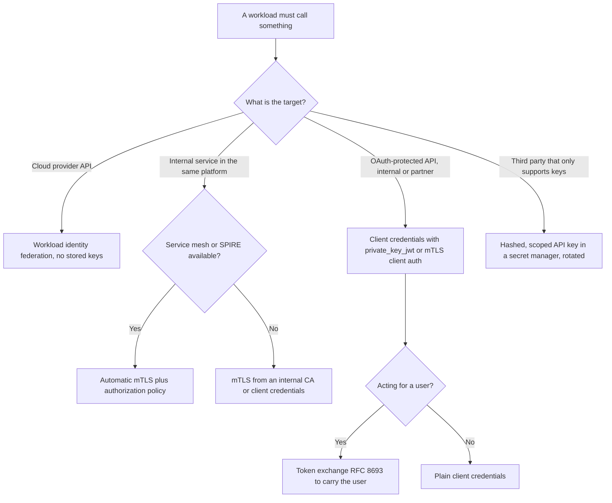
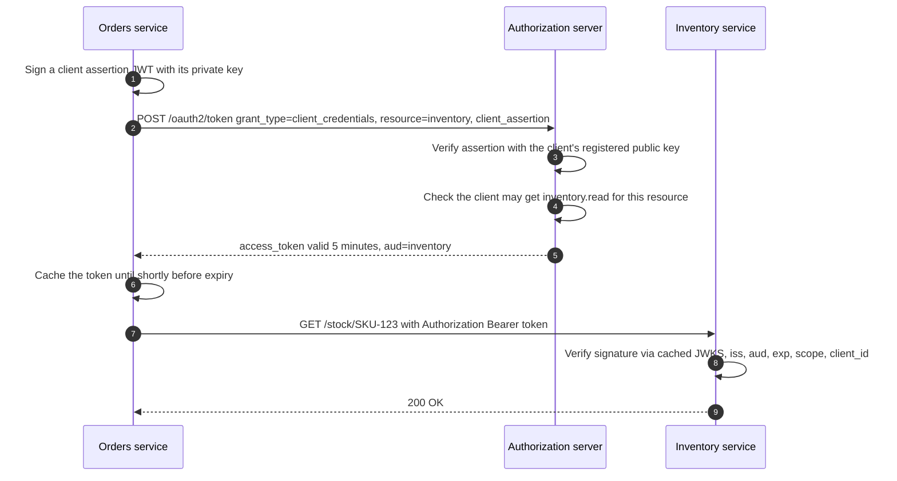
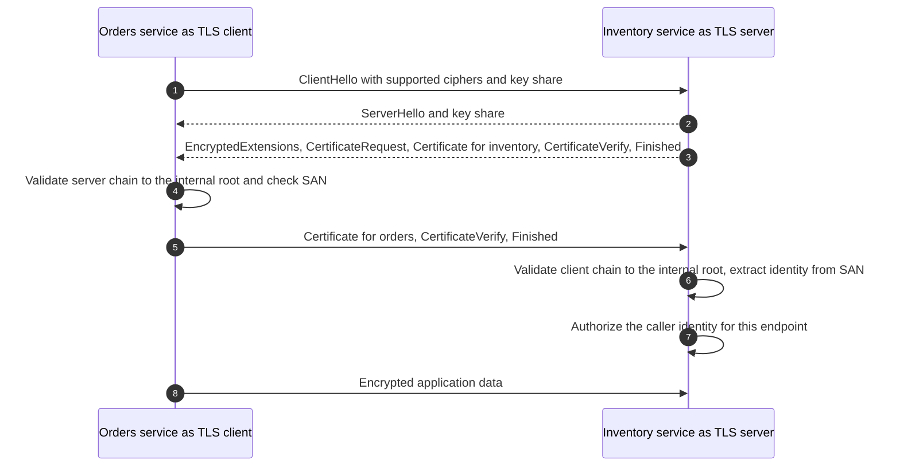
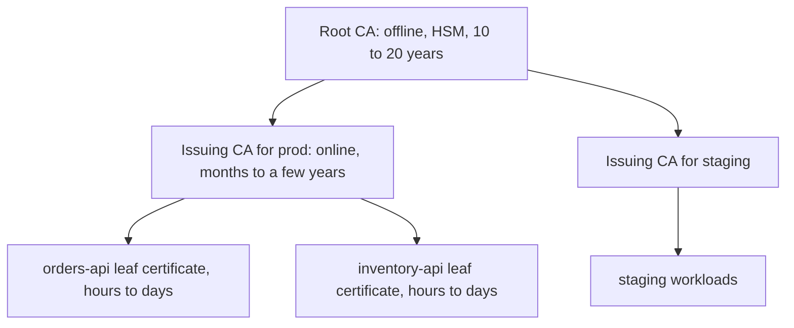
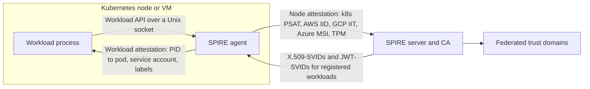
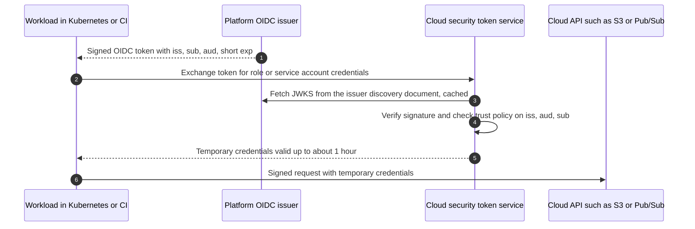
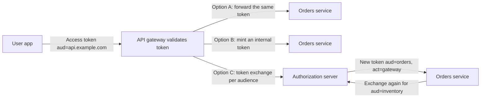
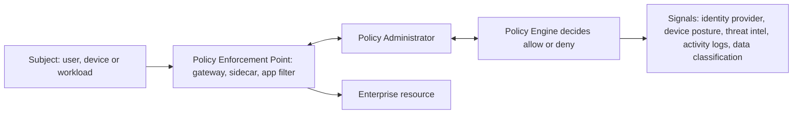
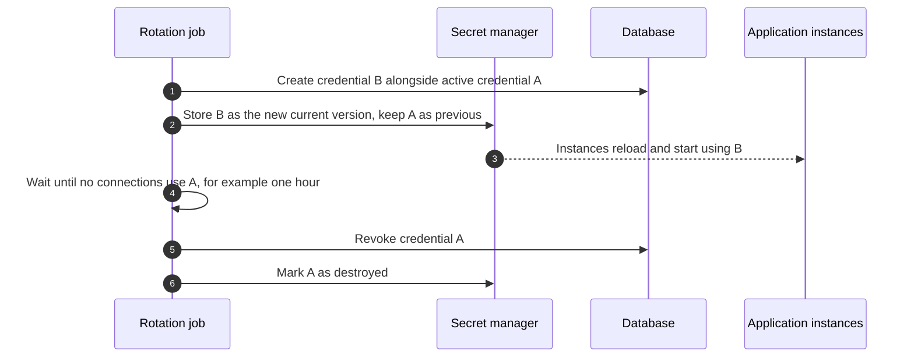

# 12 — Service-to-Service Authentication and Zero Trust

Most authentication in a modern backend happens between machines: an orders service calling inventory, a batch job reading a database, a CI pipeline deploying to the cloud. These workloads cannot type passwords or tap a phone, so their identity has to come from cryptographic credentials that are issued automatically, live briefly and rotate without humans. This chapter compares API keys, OAuth client credentials, mutual TLS and workload identity (SPIFFE, service meshes, cloud federation); shows how an API gateway should propagate user identity to internal services; explains zero trust as NIST defines it; and closes with secrets management and Spring Boot 4 code.

> **Where this fits in the evolution**
>
> - **Before:** Services trusted each other because they shared a network ("inside the firewall"), or they used long-lived shared secrets: database passwords in config files, static [API keys](03-http-basic-digest-and-api-keys.md), Kerberos service tickets in Windows domains ([chapter 05](05-enterprise-sso-ldap-kerberos-saml.md)).
> - **What it solved:** Breaches showed that the perimeter does not hold and that leaked static secrets are a frequent way in. The [OAuth 2.0](08-oauth-2.md) client credentials grant gave services short-lived, audience-restricted tokens. Mutual TLS (RFC 8705 for OAuth) and SPIFFE (CNCF graduated in 2022) gave every workload a certificate-based identity. Cloud providers added **workload identity federation** (AWS IRSA in 2019, GitHub Actions OIDC in 2021, EKS Pod Identity in 2023) so code can obtain cloud credentials without any stored secret. NIST SP 800-207 (2020) named the overall model **zero trust**.
> - **What extends it:** Token exchange (RFC 8693) and the drafts for **transaction tokens** and **cross-domain identity chaining** carry user context safely through call chains. The IETF WIMSE working group is standardizing workload-to-workload authentication (drafts as of 2026). Sender-constrained tokens ([DPoP and mTLS](09-modern-oauth-2.1-and-extensions.md)) stop stolen tokens from being replayed.

---

## Table of contents

1. [Machine identity](#1-machine-identity)
2. [The options compared](#2-the-options-compared)
3. [OAuth client credentials with JWT access tokens](#3-oauth-client-credentials-with-jwt-access-tokens)
4. [Mutual TLS with an internal CA](#4-mutual-tls-with-an-internal-ca)
5. [SPIFFE and SPIRE](#5-spiffe-and-spire)
6. [Service meshes: automatic mTLS](#6-service-meshes-automatic-mtls)
7. [Cloud workload identity federation](#7-cloud-workload-identity-federation)
8. [API gateways and identity propagation](#8-api-gateways-and-identity-propagation)
9. [Zero trust (NIST SP 800-207)](#9-zero-trust-nist-sp-800-207)
10. [Secrets management](#10-secrets-management)
11. [Production best practices (2026)](#11-production-best-practices-2026)
12. [Common attacks and mistakes](#12-common-attacks-and-mistakes)
13. [Spring Boot 4 / Spring Security 7](#13-spring-boot-4--spring-security-7)
14. [Interview questions](#interview-questions)
15. [References](#references)

---

## 1. Machine identity

### 1.1 How workloads differ from users

| | Human user | Workload (service, job, pipeline) |
|---|---|---|
| Can do MFA | Yes | No. There is nobody to tap a phone |
| Lifetime | Years | Containers may live minutes. Thousands of replicas |
| Proves identity by | Something they know, have, are | Something it **holds** (key, certificate, token) and **where it runs** (attested platform) |
| Typical failure | Phishing | Leaked static secret in Git, CI logs, container images, environment dumps |
| Scale | Thousands to millions | Often more identities than humans in large companies |

The best machine identities are derived from **attestation**: the platform (Kubernetes, a cloud hypervisor, a CI system, a TPM) vouches for *what code is running where*, and an issuer turns that into a short-lived credential. Nothing secret has to be copied into the workload by a human.

### 1.2 The "secret zero" problem

To fetch secrets from a vault, a workload must authenticate to the vault. With what? If the answer is "a token in an environment variable", you have just moved the problem. Workload identity solves secret zero by using credentials the platform injects and rotates automatically: a Kubernetes projected service account token, a cloud instance identity document, a SPIFFE SVID, or a GitHub Actions OIDC token.

### 1.3 Properties to aim for

| Property | Meaning | Example |
|---|---|---|
| **Unique per workload** | Each service (and environment) has its own identity | `spiffe://prod.example.com/ns/orders/sa/orders-api`, separate OAuth clients for `orders-prod` and `orders-staging` |
| **Short-lived** | Credentials expire in minutes to hours | 5-minute access token, 1-hour X.509-SVID |
| **Automatically rotated** | No human copies secrets | Agent or sidecar renews before expiry |
| **Attested** | Issued based on verified properties of the platform | Kubernetes service account, AWS instance identity |
| **Least privilege** | Scoped to the APIs and actions the workload needs | Token audience `inventory`, scope `inventory.read` |
| **Revocable and auditable** | You can cut off one workload and see what it did | Per-client logs at the authorization server |

---

## 2. The options compared

| Mechanism | Credential | Typical lifetime | Rotation | Identity granularity | Main weaknesses | Best for |
|---|---|---|---|---|---|---|
| **Static API key** | Random string sent in a header | Months to never | Manual | Per key | Leaks, rarely rotated, bearer | Third-party partners and simple public APIs. See [chapter 03](03-http-basic-digest-and-api-keys.md) and [../examples/05-api-keys-hmac/](../examples/05-api-keys-hmac/) |
| **Client credentials with a client secret** | Shared secret at the token endpoint, then short-lived access tokens | Secret: long. Token: minutes | Secret manual, token automatic | Per client | The secret is still a long-lived shared secret | Getting started, legacy |
| **Client credentials with `private_key_jwt` or mTLS client auth** | Private key signs an assertion (RFC 7523) or a TLS client certificate (RFC 8705) | Key: months, rotatable via JWKS. Token: minutes | Automatic for tokens, key rotation via JWKS | Per client | Key management | Service-to-API calls across trust boundaries, any OAuth-protected API |
| **mTLS with an internal CA** | X.509 certificate and private key on both sides | Hours to days | Automatic (agent, cert-manager, Vault PKI) | Per workload (SAN) | PKI operations, proxies that terminate TLS | East-west traffic inside a platform |
| **SPIFFE / service mesh** | X.509-SVID or JWT-SVID from a local agent | 1 hour (SPIRE default), 24 hours (Istio, Linkerd defaults) | Fully automatic | Per workload, attested | Platform complexity | Kubernetes and multi-cluster microservices |
| **Cloud workload identity federation** | Platform OIDC token exchanged for short-lived cloud credentials | Up to about 1 hour | Fully automatic | Per service account, repository or branch | Over-broad trust policies | Calling cloud APIs from Kubernetes, CI/CD, other clouds |



These mechanisms combine. A common production setup is: mesh mTLS for transport and workload identity, plus OAuth access tokens for application-level authorization and user context, plus workload identity federation for cloud APIs.

---

## 3. OAuth client credentials with JWT access tokens

### 3.1 The flow

The client credentials grant (RFC 6749 section 4.4) lets a service obtain an access token **for itself**, with no user involved. [Chapter 08](08-oauth-2.md) covers the grant and client authentication methods in detail. This section focuses on using it between services.



### 3.2 Token request and response

`private_key_jwt` (RFC 7523) avoids sending any shared secret: the client signs a short JWT with its private key, and the authorization server (AS) verifies it with the public key registered for the client (or published at the client's `jwks_uri`).

```http
POST /oauth2/token HTTP/1.1
Host: auth.internal.example.com
Content-Type: application/x-www-form-urlencoded
Accept: application/json

grant_type=client_credentials
&scope=inventory.read%20inventory.reserve
&resource=https%3A%2F%2Finventory.internal.example.com
&client_id=orders-service
&client_assertion_type=urn%3Aietf%3Aparams%3Aoauth%3Aclient-assertion-type%3Ajwt-bearer
&client_assertion=eyJhbGciOiJFUzI1NiIsImtpZCI6Im9yZGVycy0yMDI2LTA5In0.eyJpc3MiOiJvcmRlcnMtc2VydmljZSIs...
```

(Shown on several lines for readability. On the wire it is one `&`-joined string.)

Decoded client assertion:

```json
{
  "iss": "orders-service",
  "sub": "orders-service",
  "aud": "https://auth.internal.example.com",
  "jti": "ace972a4-8b97-4873-bed2-3db1fbb9617b",
  "iat": 1791460800,
  "exp": 1791460860
}
```

- `iss` and `sub` are the client ID. `aud` identifies the AS: current guidance is to use the AS **issuer identifier** (see [chapter 08](08-oauth-2.md#13-client-authentication-at-the-token-endpoint)).
- Keep `exp` short (60 seconds is a common default) and make the AS reject reused `jti` values.

Response:

```http
HTTP/1.1 200 OK
Content-Type: application/json
Cache-Control: no-store

{
  "access_token": "eyJhbGciOiJFUzI1NiIsInR5cCI6ImF0K2p3dCIsImtpZCI6ImFzLTIwMjYtMTAifQ.eyJpc3Mi...",
  "token_type": "Bearer",
  "expires_in": 300,
  "scope": "inventory.read inventory.reserve"
}
```

Decoded access token in the JWT profile for access tokens (RFC 9068):

```json
{
  "typ": "at+jwt",
  "alg": "ES256",
  "kid": "as-2026-10"
}
```

```json
{
  "iss": "https://auth.internal.example.com",
  "sub": "orders-service",
  "aud": "https://inventory.internal.example.com",
  "client_id": "orders-service",
  "scope": "inventory.read inventory.reserve",
  "iat": 1791460800,
  "exp": 1791461100,
  "jti": "3b9e227a-0f93-4e86-8ed2-a90061edaec2"
}
```

### 3.3 Audience restriction

A token issued for inventory must not be accepted by payments. Otherwise a compromised or malicious inventory service could replay the orders service's token against payments.

- The client asks for a specific audience with the **`resource` parameter** (Resource Indicators, RFC 8707). Some products use a proprietary `audience` parameter instead. Others derive the audience from the requested scopes.
- The AS puts that value in `aud`.
- Every resource server checks that `aud` contains **its own identifier**, and rejects everything else.

### 3.4 Rules for resource servers

| Check | Why |
|---|---|
| Signature with an **allowlisted algorithm** and a key from the AS's JWKS (cached, refreshed on unknown `kid`) | Authenticity. See [JWT](06-tokens-and-jwt.md) |
| `iss` equals the expected issuer | Tokens from another AS are rejected |
| `aud` contains this API | Prevents cross-service replay |
| `exp`, `nbf` with small clock skew (about 60 seconds) | Expired tokens rejected |
| `typ` is `at+jwt` when the AS issues RFC 9068 tokens | ID tokens and other JWTs cannot be used as access tokens |
| `scope` (or roles) per endpoint | Least privilege |
| `client_id` in an allowlist for internal endpoints | Only known callers can reach internal operations |
| Distinguish service tokens from user tokens | `sub` equals the client for client credentials. Do not let a service token pass a "current user" check |

### 3.5 Client-side rules

- **Cache tokens** and reuse them until shortly before expiry (Spring renews 60 seconds before `exp` by default). Fetching a token per request overloads the AS and adds latency.
- **One OAuth client per service per environment.** Never share a client ID between services: you lose auditability and least privilege.
- Request only the scopes and audience needed for the call.
- Prefer `private_key_jwt`, mTLS client authentication, or **federated workload credentials** (some authorization servers accept a SPIFFE JWT-SVID or a Kubernetes service account token as the client assertion) over client secrets. If a secret is unavoidable, use at least 256 bits of randomness, keep it in a secret manager, and rotate with overlap.

---

## 4. Mutual TLS with an internal CA

### 4.1 What mTLS adds

Normal TLS authenticates only the server. **Mutual TLS** adds a client certificate: the server sends a `CertificateRequest`, the client presents its certificate and proves possession of the private key with `CertificateVerify`. Both sides now know which workload is on the other end, and the channel is encrypted.



In TLS 1.3 the server's `CertificateRequest` and the client certificate are sent encrypted, so a passive observer cannot see which client connected.

### 4.2 PKI design



| Decision | Recommendation |
|---|---|
| Root CA | Offline, key in an HSM, used only to sign intermediates. Separate roots (or at least intermediates) per environment |
| Issuing CA | Online in Vault PKI, SPIRE, cert-manager, AWS Private CA, Google CA Service or the mesh control plane |
| Identity encoding | Put the identity in the **Subject Alternative Name**: a URI SAN (`spiffe://...`) or DNS SAN. Do not rely on the Common Name |
| Leaf lifetime | Hours to a few days, renewed automatically at about half of the lifetime |
| Keys | ECDSA P-256 (fast handshakes) or RSA 2048-3072. Private keys generated on the workload, never shipped |
| Protocol | TLS 1.3 internally. TLS 1.2 as the minimum where legacy clients exist |
| Revocation | CRL and OCSP are hard to operate internally. **Short lifetimes** are the practical revocation mechanism |
| Trust bundle rotation | When you rotate a CA, distribute the new root to every trust store first, run both for an overlap period, then remove the old one |

Public TLS certificates are moving the same way: under CA/Browser Forum ballot SC-081, the maximum lifetime dropped to 200 days in March 2026 and falls to 100 days in 2027 and 47 days in 2029. Manual certificate management is ending everywhere.

### 4.3 Practical pitfalls

- **mTLS is authentication, not authorization.** If every workload's certificate comes from the same CA and the server only checks "signed by our CA", then any compromised workload can call any service. Authorize on the extracted identity (allowlist per endpoint).
- **TLS termination at a proxy** (load balancer, ingress) hides the client certificate from the application. Proxies can forward it in a header (Envoy uses `x-forwarded-client-cert`). Only trust that header when the proxy is the **only** way to reach the application, and make the proxy strip any incoming copy.
- **Hot reload.** Short-lived certificates require reloading key material without restarts. Spring Boot SSL bundles support `reload-on-update` for embedded servers (see [section 13.3](#133-mtls-with-ssl-bundles-and-spiffe-ids)).
- **Certificate-bound access tokens** (RFC 8705) combine mTLS with OAuth: the AS puts the SHA-256 thumbprint of the client certificate into the token's `cnf` claim (member `x5t#S256`), and the resource server checks that the presenting connection uses the same certificate. A stolen token is useless without the private key. See [chapter 09](09-modern-oauth-2.1-and-extensions.md).

---

## 5. SPIFFE and SPIRE

### 5.1 SPIFFE: a standard workload identity

**SPIFFE** (Secure Production Identity Framework For Everyone) is a set of specifications; **SPIRE** is its reference implementation. Both graduated in the CNCF in 2022.

| Concept | Meaning |
|---|---|
| **SPIFFE ID** | A URI naming a workload: `spiffe://<trust-domain>/<path>`, for example `spiffe://prod.example.com/ns/payments/sa/payments-api` |
| **Trust domain** | The root of trust, for example one per environment or organization |
| **SVID** (SPIFFE Verifiable Identity Document) | The credential carrying the SPIFFE ID |
| **X.509-SVID** | A certificate whose single URI SAN is the SPIFFE ID. Used for mTLS |
| **JWT-SVID** | A signed JWT with `sub` = SPIFFE ID and a required `aud`. Used where TLS cannot carry identity end to end (through L7 proxies, to cloud STS endpoints) |
| **Trust bundle** | The CA certificates (and JWT signing keys) for a trust domain |
| **Workload API** | A local Unix domain socket where a workload fetches its SVIDs and trust bundles, with **no secret needed to call it** |
| **Federation** | Exchanging trust bundles so workloads in different trust domains can authenticate each other |

### 5.2 How SPIRE issues identities



1. **Node attestation:** the agent proves which node it is running on using platform evidence (a Kubernetes projected service account token, an AWS instance identity document, a TPM quote).
2. **Workload attestation:** when a process connects to the Workload API, the agent asks the kernel for the caller's PID, maps it to a container, pod, namespace and service account, and matches that against **registration entries** on the server.
3. The agent returns SVIDs for the matching identity and **rotates them automatically**. SPIRE's defaults are 1 hour for X.509-SVIDs, 5 minutes for JWT-SVIDs, and 24 hours for its signing CA.

Because identity comes from attestation, no secret is ever copied into the workload. SPIRE can also act as an OIDC issuer for its JWT-SVIDs, which lets workloads use **cloud workload identity federation** (section 7) from any environment.

---

## 6. Service meshes: automatic mTLS

### 6.1 What a mesh does

A service mesh puts a proxy next to (sidecar) or under (node proxy) every workload. The control plane acts as a CA, gives each workload a SPIFFE-style certificate tied to its Kubernetes service account, and the proxies perform mTLS **transparently**. The application keeps speaking plain HTTP to localhost.

| | Istio | Linkerd |
|---|---|---|
| mTLS | Automatic between meshed workloads. `PeerAuthentication` mode `STRICT` rejects plaintext | On by default for meshed pods |
| Identity | `spiffe://<trust-domain>/ns/<namespace>/sa/<service-account>` (default trust domain `cluster.local`) | Based on the pod's service account |
| Workload certificate lifetime (default) | 24 hours, rotated automatically | 24 hours, rotated automatically |
| Data plane | Envoy sidecars, or **ambient mode** (GA in Istio 1.24, November 2024): per-node `ztunnel` for L4 mTLS over HBONE, optional waypoint proxies for L7 | Rust micro-proxy sidecars |
| Authorization | `AuthorizationPolicy` on principals, namespaces, paths, methods, JWT claims | `Server` and `AuthorizationPolicy` resources |
| Watch out for | Leaving `PERMISSIVE` mode on after migration | The trust anchor (root) is not rotated automatically. Plan its rotation before it expires |

### 6.2 Istio example

```yaml
# Require mTLS for every workload in the namespace.
apiVersion: security.istio.io/v1
kind: PeerAuthentication
metadata:
  name: default
  namespace: inventory
spec:
  mtls:
    mode: STRICT
---
# Only the orders service account may reserve stock.
apiVersion: security.istio.io/v1
kind: AuthorizationPolicy
metadata:
  name: inventory-reservations
  namespace: inventory
spec:
  selector:
    matchLabels:
      app: inventory-api
  action: ALLOW
  rules:
    - from:
        - source:
            principals: ["cluster.local/ns/orders/sa/orders-api"]   # SPIFFE ID without the spiffe:// prefix
      to:
        - operation:
            methods: ["POST"]
            paths: ["/stock/reservations"]
```

### 6.3 What a mesh does not do

- It authenticates **workloads**, not **users**. If inventory must know which customer an order belongs to, that information must travel in a token (section 8), and the application must authorize on it.
- It cannot protect a port that bypasses the proxy. Combine `STRICT` mode with Kubernetes `NetworkPolicy`.
- It does not replace application-level authorization for business rules ("can this user cancel this order").
- Traffic leaving the mesh (to SaaS APIs, databases outside the cluster) needs its own authentication.

---

## 7. Cloud workload identity federation

### 7.1 The pattern

All major clouds now support the same idea: **exchange a short-lived identity token issued by the platform where the code runs for short-lived cloud credentials**, using a trust policy that checks the token's issuer, audience and subject. No access keys are stored anywhere.



| Platform | Mechanism | Notes |
|---|---|---|
| **AWS EKS** | **IRSA** (2019): the cluster is an OIDC provider in IAM, pods get a projected token and the SDK calls `sts:AssumeRoleWithWebIdentity`. **EKS Pod Identity** (November 2023): an agent on each node delivers credentials, roles are associated with service accounts through the EKS API | AWS recommends Pod Identity where available. It avoids per-cluster OIDC providers and edits to role trust policies |
| **AWS outside AWS** | IAM Roles Anywhere (X.509 certificates from your CA), or `AssumeRoleWithWebIdentity` from any OIDC issuer | |
| **Google Cloud** | **Workload Identity Federation** for external identities (AWS, Azure, any OIDC or SAML issuer, GitHub Actions) and Workload Identity Federation for GKE | Attribute conditions restrict which subjects may authenticate |
| **Azure** | **Managed identities** (system- or user-assigned) for Azure resources. **Microsoft Entra Workload ID** with federated identity credentials for AKS, GitHub Actions and other OIDC issuers | |
| **Kubernetes itself** | **Projected service account tokens**: audience-bound, expiring JWTs, refreshed by the kubelet. Since Kubernetes 1.24, long-lived Secret-based service account tokens are no longer created automatically | The cluster publishes an OIDC discovery document and JWKS so external parties can verify the tokens |

### 7.2 GitHub Actions to AWS without access keys

Workflow:

```yaml
name: deploy
on:
  push:
    branches: [main]

permissions:
  id-token: write        # allow the job to request a GitHub OIDC token
  contents: read

jobs:
  deploy:
    runs-on: ubuntu-latest
    environment: production
    steps:
      - uses: actions/checkout@v4
      - uses: aws-actions/configure-aws-credentials@v4   # pin to a full commit SHA in production
        with:
          role-to-assume: arn:aws:iam::123456789012:role/deploy-orders
          aws-region: eu-west-1
      - run: aws s3 sync ./build s3://orders-static-prod
```

IAM role trust policy:

```json
{
  "Version": "2012-10-17",
  "Statement": [{
    "Effect": "Allow",
    "Principal": {
      "Federated": "arn:aws:iam::123456789012:oidc-provider/token.actions.githubusercontent.com"
    },
    "Action": "sts:AssumeRoleWithWebIdentity",
    "Condition": {
      "StringEquals": {
        "token.actions.githubusercontent.com:aud": "sts.amazonaws.com",
        "token.actions.githubusercontent.com:sub": "repo:example-org/orders:environment:production"
      }
    }
  }]
}
```

The `sub` condition is the security boundary. The issuer `token.actions.githubusercontent.com` is shared by **every** GitHub repository, so a trust policy that checks only `aud` lets any repository in the world assume the role. Restrict `sub` to the exact repository and environment (or branch), and protect that environment with required reviewers. GitHub has also introduced subject formats that include immutable owner and repository IDs; check the `sub` value your repository actually emits.

### 7.3 Protect the metadata endpoints

Cloud credentials for VMs and pods are served by an instance metadata service on a link-local address. **Server-side request forgery (SSRF)** against that endpoint has been used to steal cloud credentials in real breaches. Mitigations: AWS **IMDSv2** (session token obtained with a `PUT`, hop limit 1 so containers cannot reach the node's credentials), the required `Metadata-Flavor: Google` and `Metadata: true` headers on GCP and Azure, egress filtering, and URL validation for any feature that fetches user-supplied URLs.

---

## 8. API gateways and identity propagation

### 8.1 Validate at the edge, verify inside

An API gateway (or BFF, see [chapter 06](06-tokens-and-jwt.md)) is the natural place to authenticate external requests: validate the user's access token, enforce rate limits, reject garbage early. But in a zero trust design the internal services **still verify** what they receive. The question is what the gateway forwards.



| Option | How | Pros | Cons |
|---|---|---|---|
| **A. Forward the user's token** | Gateway validates and passes the original JWT through | Simple, no extra infrastructure | The token's audience must cover many services, so any one compromised service can replay it to the others. External token format leaks into every service. Lifetime and scopes were chosen for the client, not for internal calls |
| **B. Mint an internal token** | Gateway validates the external token (often opaque, via introspection) and signs a short-lived internal JWT with only the claims services need ("phantom token" pattern) | External tokens never reach internal services. Internal tokens can be very short-lived (seconds to minutes) and carry normalized claims | The gateway becomes a critical signer. Its key must be protected and published via JWKS |
| **C. Token exchange (RFC 8693)** | Each service exchanges the incoming token for a new one with a narrower audience and scopes, with the acting service recorded in `act` | Least privilege per hop, full delegation chain for audit, policy at the AS decides who may act for whom | AS load and latency (cache exchanged tokens), more moving parts |
| **D. Transaction tokens (IETF draft)** | A trusted service issues a short-lived, signed token describing the user and the transaction, which travels through the whole call chain | Designed for exactly this problem, immutable context across hops | Still an Internet-Draft (draft-ietf-oauth-transaction-tokens, in working group last call in 2026). Limited product support |

Never propagate identity as **plain headers** such as `X-User-Id` that internal services trust blindly. If you must, the gateway must strip any incoming copy, the channel must be authenticated (mTLS), and only the gateway's identity may set it. A signed token is better because every hop can verify it.

### 8.2 The confused deputy problem

If the orders service calls inventory using **its own** client-credentials token while acting for a user, inventory cannot apply user-level rules: it sees only "orders-service", which is usually allowed to do everything. A bug or an attacker who can influence the orders service (for example via a manipulated request parameter) can then act on other users' data. This is a **confused deputy**: a privileged service is tricked into misusing its authority.

The fix is to carry the user context in a verifiable form (options B, C or D above) and let the downstream service authorize on **both** the caller service and the user.

### 8.3 Token exchange step by step

The orders service received a user access token (audience `orders`). It needs to call inventory on the user's behalf.

```http
POST /oauth2/token HTTP/1.1
Host: auth.internal.example.com
Content-Type: application/x-www-form-urlencoded

grant_type=urn%3Aietf%3Aparams%3Aoauth%3Agrant-type%3Atoken-exchange
&subject_token=eyJhbGciOiJFUzI1NiIsInR5cCI6ImF0K2p3dCJ9.eyJzdWIiOiJ1c2VyLThmMTRlNDVmIi...
&subject_token_type=urn%3Aietf%3Aparams%3Aoauth%3Atoken-type%3Aaccess_token
&actor_token=eyJhbGciOiJFUzI1NiIsInR5cCI6ImF0K2p3dCJ9.eyJzdWIiOiJvcmRlcnMtc2VydmljZSIi...
&actor_token_type=urn%3Aietf%3Aparams%3Aoauth%3Atoken-type%3Aaccess_token
&resource=https%3A%2F%2Finventory.internal.example.com
&scope=inventory.read
&client_id=orders-service
&client_assertion_type=urn%3Aietf%3Aparams%3Aoauth%3Aclient-assertion-type%3Ajwt-bearer
&client_assertion=eyJhbGciOiJFUzI1NiIsImtpZCI6Im9yZGVycy0yMDI2LTA5In0...
```

```http
HTTP/1.1 200 OK
Content-Type: application/json
Cache-Control: no-store

{
  "access_token": "eyJhbGciOiJFUzI1NiIsInR5cCI6ImF0K2p3dCIsImtpZCI6ImFzLTIwMjYtMTAifQ...",
  "issued_token_type": "urn:ietf:params:oauth:token-type:access_token",
  "token_type": "Bearer",
  "expires_in": 300,
  "scope": "inventory.read"
}
```

Decoded exchanged token:

```json
{
  "iss": "https://auth.internal.example.com",
  "sub": "user-8f14e45f",
  "aud": "https://inventory.internal.example.com",
  "client_id": "orders-service",
  "scope": "inventory.read",
  "act": { "sub": "orders-service" },
  "iat": 1791460800,
  "exp": 1791461100,
  "jti": "5f0c7c1e-2a6d-4c1b-9e3f-8d7a6b5c4d3e"
}
```

- **Delegation** (with `act`): the token says "orders-service is acting for user-8f14e45f". Inventory can log and authorize both. Prefer this.
- **Impersonation** (no `act`): the new token is indistinguishable from one issued to the user. Simpler, but the audit trail loses the intermediary.
- The AS must enforce **who may exchange what**: which clients may act for users, for which audiences, with which scopes (RFC 8693 defines the `may_act` claim to express this in the subject token). An AS that lets any client exchange any token for any audience turns token exchange into a privilege-escalation service.
- Exchanged tokens should never have broader scopes or a longer lifetime than the subject token.

For calls **across trust domains** (your AS to a partner's AS), the OAuth working group's identity chaining draft combines token exchange with the JWT authorization grant (RFC 7523). As of mid-2026 it was in the RFC Editor queue, not yet an RFC.

---

## 9. Zero trust (NIST SP 800-207)

### 9.1 From perimeter to per-request decisions

The perimeter model trusted anything inside the corporate network or VPN. Once an attacker got in (phished laptop, vulnerable VPN appliance, compromised build server), they could move laterally across flat networks with little resistance. **Zero trust** removes network location as a source of trust: every access request is authenticated, authorized and encrypted, based on identity and context, every time.

Google's **BeyondCorp** papers (from 2014) described running a company this way. NIST formalized it in **SP 800-207, *Zero Trust Architecture*** (August 2020). Its seven tenets, paraphrased:

1. All data sources and computing services are **resources**.
2. All communication is **secured regardless of network location**.
3. Access to individual resources is granted **per session**.
4. Access is determined by **dynamic policy**, including the observable state of the client identity, application and requesting asset, and other behavioral and environmental attributes.
5. The enterprise **monitors and measures the integrity and security posture** of all owned and associated assets.
6. All resource authentication and authorization are **dynamic and strictly enforced** before access is allowed.
7. The enterprise **collects as much information as possible** about assets, network infrastructure and communications and uses it to improve its security posture.

### 9.2 The logical architecture



- **Policy Engine (PE):** makes the decision using policy and signals.
- **Policy Administrator (PA):** establishes or tears down the session (issues tokens, configures the PEP).
- **Policy Enforcement Point (PEP):** sits in the data path and enforces the decision. In a backend this is the API gateway, the mesh proxy, or the Spring Security filter chain.

### 9.3 What zero trust means for backend services

| Principle | Concrete practice |
|---|---|
| Identity is the perimeter | Every workload has an attested identity (SPIFFE, mesh, cloud workload identity). Policies refer to identities, not IP ranges |
| Encrypt and authenticate every hop | mTLS between all services, including "internal" ones |
| Authorize every request | Resource servers validate tokens and check scopes, audiences and caller identity on each call. Default deny |
| Least privilege, short-lived credentials | Minutes-long tokens, hour-long certificates, narrowly scoped roles |
| Continuous evaluation | Revoke sessions on risk signals (OpenID CAEP/SSF events, device non-compliance), not only on expiry |
| Assume breach | Segment by identity, log every authorization decision, alert on anomalies, limit blast radius per credential |

Related guidance: NIST **SP 800-207A** (September 2023) applies zero trust to cloud-native applications, with identity-tier policies enforced by service meshes and gateways. CISA's **Zero Trust Maturity Model** (version 2.0, 2023) organizes the journey into five pillars: identity, devices, networks, applications and workloads, and data. US federal agencies were directed to adopt zero trust by OMB M-22-09 (2022).

Zero trust is an architecture and an operating model, not a product you buy. A "zero trust" VPN replacement that still trusts everything behind it is not zero trust.

---

## 10. Secrets management

### 10.1 The hierarchy

Work down this list and stop as early as you can:

1. **Eliminate the secret.** Use workload identity federation, mTLS from a workload CA, or managed identities. No secret to leak or rotate.
2. **Make it dynamic and short-lived.** A secrets engine creates a credential on demand with a lease (for example a database user valid for 1 hour) and deletes it when the lease expires.
3. **Store static secrets centrally with automated rotation.** A secret manager holds the value, access is logged, and rotation is scheduled.
4. **Never** put secrets in source code, container images, Git history, CI logs, or tickets.

### 10.2 Tools

| Tool | What it provides |
|---|---|
| **HashiCorp Vault** (owned by IBM since February 2025, Business Source License since August 2023) and **OpenBao** (Linux Foundation fork from the last open-source Vault release) | Auth methods (Kubernetes, JWT/OIDC, cloud IAM, AppRole), secrets engines (KV, **dynamic database credentials**, **PKI** for short-lived certificates, **Transit** encryption as a service), leases, policies, audit logs |
| **Cloud secret managers** (AWS Secrets Manager, Google Secret Manager, Azure Key Vault) | Managed storage, IAM-based access, versioning, rotation hooks, audit logs |
| **Cloud KMS and HSMs** | Keys that never leave the hardware, used for **envelope encryption**: a data key encrypts your data, and the KMS key encrypts the data key |
| **Kubernetes Secrets** | Base64-encoded, **not encrypted** in etcd by default. Enable encryption at rest with a KMS provider, restrict RBAC on `secrets`, or sync from an external manager (External Secrets Operator, Secrets Store CSI Driver) |
| **Secret scanning** | Pre-commit hooks, CI scanners, and repository push protection to catch leaks before they ship |

### 10.3 Delivery to the application

- Prefer **files on an in-memory volume** (tmpfs) or **direct SDK fetches** with workload identity over environment variables. Environment variables leak through process listings (`/proc/<pid>/environ`), crash dumps, child processes and debug endpoints.
- In Spring Boot, do not expose Actuator's `env` and `configprops` endpoints publicly (Boot masks values by default; keep it that way).
- Never log configuration at startup.
- Load secrets at startup and **refresh them on rotation** (watch the file, or re-fetch on a lease or schedule).

### 10.4 Rotation without downtime

The universal technique is **two valid credentials during an overlap window**:



The same pattern applies to JWT signing keys (publish the new public key in the JWKS before signing with it, see [chapter 06](06-tokens-and-jwt.md)), OAuth client keys (`jwks_uri` with two keys), API keys (issue a new key, let the client switch, revoke the old) and CA roots (trust both during the overlap). When a secret leaks, **rotate immediately**: deleting it from Git history does not un-leak it.

---

## 11. Production best practices (2026)

| Area | Recommendation | Concrete numbers |
|---|---|---|
| Service access tokens | Client credentials, JWT (RFC 9068) or opaque with introspection, audience-restricted | 5-15 minutes lifetime, refresh about 60 s before expiry, `aud` = one API |
| Client authentication | `private_key_jwt` or mTLS. No shared secrets for new services | Assertion `exp` about 60 s, `jti` replay cache at the AS, EC P-256 keys rotated at least yearly via JWKS overlap |
| Resource servers | Validate signature (algorithm allowlist), `iss`, `aud`, `exp`, `nbf`, `typ`, scopes, caller allowlist | Clock skew at most 60 s, JWKS cached, refetch on unknown `kid` at most every few minutes |
| Workload certificates | Short-lived, automatically renewed, identity in SAN | 1-24 hours, renew at about 50% of lifetime |
| CA hierarchy | Offline root in an HSM, online issuing intermediates per environment | Root 10-20 years, intermediates months to a few years |
| JWT-SVIDs and other workload JWTs | Always audience-bound | 5 minutes (SPIRE default) |
| Cloud credentials | Workload identity federation, least-privilege roles, restrictive trust conditions on `sub` | Session credentials at most 1 hour |
| Mesh | `STRICT` mTLS, default-deny authorization policies | Rotate the mesh root before it expires, alert 30+ days ahead |
| Gateway | Validate at the edge, strip internal headers, forward a narrow token | Internal tokens seconds to minutes |
| Token exchange | AS policy on who may act for whom, `act` claim for delegation | Exchanged token lifetime at most that of the subject token |
| Static secrets (unavoidable) | Secret manager, automated rotation with overlap | Rotate at least every 90 days and immediately on suspicion, 256-bit random |
| Metadata services | IMDSv2 only, hop limit 1 for containers | Block IMDSv1 account-wide |
| Monitoring | Per-workload identity in logs, alert on new callers and denied requests | Every authorization decision logged with caller identity |

---

## 12. Common attacks and mistakes

| Attack / mistake | What goes wrong | Mitigation |
|---|---|---|
| Long-lived shared secret leaked (Git, CI logs, image layers) | Attacker authenticates as the service for months | Workload identity or `private_key_jwt`, secret scanning, automatic rotation |
| One OAuth client shared by many services | No least privilege, no audit trail, one leak compromises all | One client per service per environment |
| Tokens without audience restriction | A compromised service replays tokens to other services | `resource` parameter, `aud` validation everywhere |
| Service token accepted where a user token is expected | Service bypasses user-level authorization | Distinguish by `sub`/`client_id`, separate scopes, explicit checks |
| Trusting `X-User-Id` style headers | Any caller that can reach the service can impersonate any user | Signed tokens. If headers are unavoidable, strip at the edge and require mTLS from the gateway |
| mTLS without authorization | Any workload with a certificate from the CA can call any endpoint | Authorize on the SPIFFE ID or SAN per endpoint, mesh `AuthorizationPolicy` |
| Identity in the certificate CN, shared or wildcard certificates | Weak or ambiguous identities, one key used by many workloads | URI SAN with a SPIFFE ID, one key per workload |
| Long-lived certificates with manual renewal | Outages on expiry, stolen keys stay valid | Hours-to-days lifetimes, automated renewal, hot reload |
| Mesh root or trust anchor expires | Mesh-wide outage | Monitor expiry, documented rotation procedure |
| Mesh left in permissive mode | Plaintext and unauthenticated traffic accepted | `STRICT` mode plus `NetworkPolicy` |
| SSRF to the instance metadata service | Cloud credentials stolen | IMDSv2, hop limit 1, egress filtering, URL validation |
| Federated trust policy without a `sub` condition | Any GitHub repository (or any pod in the cluster) can assume the role | Exact `sub` match on repository and environment or service account |
| Over-broad cloud roles for workloads | Small compromise becomes full account compromise | Least privilege per workload, permission boundaries, access analyzers |
| Forwarding the user's broad token to every service | One compromised service can act as the user everywhere | Internal token minting or token exchange with narrow audiences |
| Confused deputy | Service uses its own powerful credentials for a user-driven action | Carry user context (token exchange, transaction tokens) and authorize on both |
| Token exchange without policy | Any client can obtain tokens for any audience as any user | AS policy, `may_act`, scope and lifetime never broadened |
| Fetching a new token for every request | AS overload, latency, rate limiting | Cache tokens until shortly before expiry |
| Secrets in environment variables and Actuator `env` | Leak through dumps, logs, debug endpoints | Files or SDK fetch, Actuator endpoints not exposed |
| Kubernetes Secrets unencrypted, broad RBAC | Anyone with `get secrets` or etcd access reads them | Encryption at rest with KMS, tight RBAC, external secret manager |

---

## 13. Spring Boot 4 / Spring Security 7

Dependencies (versions from the Spring Boot 4.1 BOM): `spring-boot-starter-security-oauth2-client` and `spring-boot-starter-restclient` for the calling service, `spring-boot-starter-security-oauth2-resource-server` for the called service. The multi-module [../examples/03-oauth2-oidc/](../examples/03-oauth2-oidc/) project contains a runnable authorization server and resource server; [../examples/05-api-keys-hmac/](../examples/05-api-keys-hmac/) shows the API-key alternative.

### 13.1 Calling another service with client credentials and RestClient

`application.yml` of the orders service:

```yaml
spring:
  security:
    oauth2:
      client:
        registration:
          inventory:
            provider: corp
            client-id: orders-service
            client-authentication-method: private_key_jwt   # no shared secret
            authorization-grant-type: client_credentials
            scope: inventory.read,inventory.reserve
        provider:
          corp:
            issuer-uri: https://auth.internal.example.com    # token endpoint discovered from metadata
```

Configuration:

```java
import java.util.List;
import java.util.Map;
import com.nimbusds.jose.jwk.JWK;
import org.springframework.context.annotation.Bean;
import org.springframework.context.annotation.Configuration;
import org.springframework.security.oauth2.client.AuthorizedClientServiceOAuth2AuthorizedClientManager;
import org.springframework.security.oauth2.client.OAuth2AuthorizedClientManager;
import org.springframework.security.oauth2.client.OAuth2AuthorizedClientProviderBuilder;
import org.springframework.security.oauth2.client.OAuth2AuthorizedClientService;
import org.springframework.security.oauth2.client.endpoint.NimbusJwtClientAuthenticationParametersConverter;
import org.springframework.security.oauth2.client.endpoint.OAuth2ClientCredentialsGrantRequest;
import org.springframework.security.oauth2.client.endpoint.RestClientClientCredentialsTokenResponseClient;
import org.springframework.security.oauth2.client.registration.ClientRegistrationRepository;
import org.springframework.security.oauth2.client.web.client.OAuth2ClientHttpRequestInterceptor;
import org.springframework.security.oauth2.client.web.client.RequestAttributePrincipalResolver;
import org.springframework.util.LinkedMultiValueMap;
import org.springframework.web.client.RestClient;

@Configuration
class ServiceClientConfig {

    // Audience (RFC 8707 resource indicator) requested for each client registration.
    private static final Map<String, String> RESOURCES =
            Map.of("inventory", "https://inventory.internal.example.com");

    @Bean
    OAuth2AuthorizedClientManager authorizedClientManager(
            ClientRegistrationRepository registrations,
            OAuth2AuthorizedClientService authorizedClients,
            JWK serviceSigningKey) {           // EC private JWK from a keystore or KMS, public part registered at the AS

        var tokenClient = new RestClientClientCredentialsTokenResponseClient();

        // private_key_jwt: sign a 60-second client assertion with the service's key.
        var assertion = new NimbusJwtClientAuthenticationParametersConverter<OAuth2ClientCredentialsGrantRequest>(
                registration -> serviceSigningKey);
        assertion.setJwtClientAssertionCustomizer(ctx -> ctx.getClaims().audience(List.of(
                ctx.getAuthorizationGrantRequest().getClientRegistration().getProviderDetails().getIssuerUri())));
        tokenClient.addParametersConverter(assertion);

        // Ask for an audience-restricted token.
        tokenClient.addParametersConverter(grant -> {
            var params = new LinkedMultiValueMap<String, String>();
            String resource = RESOURCES.get(grant.getClientRegistration().getRegistrationId());
            if (resource != null) {
                params.add("resource", resource);
            }
            return params;
        });

        var provider = OAuth2AuthorizedClientProviderBuilder.builder()
                .clientCredentials(cc -> cc.accessTokenResponseClient(tokenClient))   // caches, renews 60 s before expiry
                .build();

        // Works outside HTTP requests too (schedulers, message listeners).
        var manager = new AuthorizedClientServiceOAuth2AuthorizedClientManager(registrations, authorizedClients);
        manager.setAuthorizedClientProvider(provider);
        return manager;
    }

    @Bean
    RestClient inventoryRestClient(RestClient.Builder builder, OAuth2AuthorizedClientManager manager) {
        var oauth2 = new OAuth2ClientHttpRequestInterceptor(manager);
        // Client-credentials tokens belong to this service, not to whichever user triggered the call.
        oauth2.setPrincipalResolver(new RequestAttributePrincipalResolver());
        return builder
                .baseUrl("https://inventory.internal.example.com")
                .requestInterceptor(oauth2)
                .build();
    }
}
```

Using it:

```java
import static org.springframework.security.oauth2.client.web.client.RequestAttributeClientRegistrationIdResolver.clientRegistrationId;
import static org.springframework.security.oauth2.client.web.client.RequestAttributePrincipalResolver.principal;

@Service
class StockGateway {

    private final RestClient inventory;

    StockGateway(RestClient inventoryRestClient) {
        this.inventory = inventoryRestClient;
    }

    StockLevel stock(String sku) {
        return inventory.get()
                .uri("/stock/{sku}", sku)
                .attributes(clientRegistrationId("inventory"))   // which registration supplies the token
                .attributes(principal("orders-service"))         // cache the token per service, not per user
                .retrieve()
                .body(StockLevel.class);
    }
}
```

**Alternative: declarative HTTP service clients.** Spring Framework 7 HTTP interfaces plus Spring Security's `@ClientRegistrationId` remove the per-call attributes:

```java
@HttpExchange("/stock")
@ClientRegistrationId("inventory")          // every method uses this registration
interface InventoryClient {

    @GetExchange("/{sku}")
    StockLevel stock(@PathVariable String sku);

    @PostExchange("/reservations")
    Reservation reserve(@RequestBody ReservationRequest request);
}

@Configuration
@ImportHttpServices(group = "inventory", types = InventoryClient.class)
class InventoryClientConfig {

    @Bean
    OAuth2RestClientHttpServiceGroupConfigurer oauth2Clients(OAuth2AuthorizedClientManager manager) {
        return OAuth2RestClientHttpServiceGroupConfigurer.from(manager);
    }
}
```

```yaml
spring:
  http:
    serviceclient:
      inventory:
        base-url: https://inventory.internal.example.com
```

### 13.2 Resource server: accept only the right tokens from the right callers

```java
import java.util.Set;
import org.springframework.context.annotation.Bean;
import org.springframework.context.annotation.Configuration;
import org.springframework.http.HttpMethod;
import org.springframework.security.config.Customizer;
import org.springframework.security.config.annotation.web.builders.HttpSecurity;
import org.springframework.security.config.annotation.web.configuration.EnableWebSecurity;
import org.springframework.security.config.annotation.web.configurers.AbstractHttpConfigurer;
import org.springframework.security.config.http.SessionCreationPolicy;
import org.springframework.security.oauth2.jose.jws.SignatureAlgorithm;
import org.springframework.security.oauth2.jwt.*;
import org.springframework.security.web.SecurityFilterChain;

@Configuration
@EnableWebSecurity
class InventoryApiSecurity {

    private static final String ISSUER = "https://auth.internal.example.com";
    private static final String AUDIENCE = "https://inventory.internal.example.com";
    private static final Set<String> ALLOWED_CALLERS = Set.of("orders-service", "fulfilment-service");

    @Bean
    JwtDecoder jwtDecoder() {
        NimbusJwtDecoder decoder = NimbusJwtDecoder.withIssuerLocation(ISSUER)
                .jwsAlgorithm(SignatureAlgorithm.ES256)            // algorithm allowlist
                .build();                                          // JWKS discovered and cached
        decoder.setJwtValidator(JwtValidators.createDefaultWithValidators(
                new JwtTypeValidator("at+jwt"),                    // RFC 9068 access tokens only
                new JwtIssuerValidator(ISSUER),
                new JwtAudienceValidator(AUDIENCE),                // reject tokens minted for other APIs
                new JwtClaimValidator<String>("client_id", ALLOWED_CALLERS::contains)));
        return decoder;                                            // exp and nbf are checked by default
    }

    @Bean
    SecurityFilterChain api(HttpSecurity http) {
        http
            .authorizeHttpRequests(auth -> auth
                .requestMatchers(HttpMethod.GET, "/stock/**").hasAuthority("SCOPE_inventory.read")
                .requestMatchers(HttpMethod.POST, "/stock/reservations").hasAuthority("SCOPE_inventory.reserve")
                .anyRequest().denyAll())                           // default deny
            .oauth2ResourceServer(rs -> rs.jwt(Customizer.withDefaults()))
            .sessionManagement(s -> s.sessionCreationPolicy(SessionCreationPolicy.STATELESS))
            .csrf(AbstractHttpConfigurer::disable);                // bearer tokens only, no cookies
        return http.build();
    }
}
```

Defining your own `JwtDecoder` replaces the one Spring Boot builds from `spring.security.oauth2.resourceserver.jwt.issuer-uri` and `audiences`; if you only need issuer, audience and an algorithm allowlist, those properties (plus `jws-algorithms`) are enough. If your authorization server emits `typ: JWT` instead of `at+jwt`, adjust the type validator rather than dropping the other checks.

### 13.3 mTLS with SSL bundles and SPIFFE IDs

Serve and call over mTLS using SVIDs written to disk by a SPIFFE helper or a mesh agent:

```yaml
spring:
  ssl:
    bundle:
      pem:
        workload:
          reload-on-update: true                      # pick up rotated certificates without a restart
          keystore:
            certificate: file:/run/spiffe/svid.pem
            private-key: file:/run/spiffe/svid_key.pem
          truststore:
            certificate: file:/run/spiffe/bundle.pem
  http:
    serviceclient:
      inventory:
        base-url: https://inventory.internal.example.com:8443
        ssl:
          bundle: workload                            # outbound calls present the same identity
server:
  port: 8443
  ssl:
    bundle: workload
    client-auth: need                                 # handshake fails without a valid client certificate
```

Map the caller's SPIFFE ID (URI SAN) to authorities and authorize on it:

```java
import java.security.cert.CertificateParsingException;
import java.security.cert.X509Certificate;
import java.util.List;
import java.util.Map;
import java.util.Optional;
import org.springframework.context.annotation.Bean;
import org.springframework.context.annotation.Configuration;
import org.springframework.http.HttpMethod;
import org.springframework.security.authentication.BadCredentialsException;
import org.springframework.security.config.annotation.web.builders.HttpSecurity;
import org.springframework.security.config.annotation.web.configuration.EnableWebSecurity;
import org.springframework.security.config.annotation.web.configurers.AbstractHttpConfigurer;
import org.springframework.security.config.http.SessionCreationPolicy;
import org.springframework.security.core.userdetails.User;
import org.springframework.security.core.userdetails.UserDetailsService;
import org.springframework.security.core.userdetails.UsernameNotFoundException;
import org.springframework.security.web.SecurityFilterChain;
import org.springframework.security.web.authentication.preauth.x509.X509PrincipalExtractor;

final class SpiffeIdExtractor implements X509PrincipalExtractor {

    private static final int URI_SAN = 6;

    @Override
    public Object extractPrincipal(X509Certificate certificate) {
        try {
            var sans = certificate.getSubjectAlternativeNames();
            if (sans != null) {
                for (List<?> san : sans) {
                    if (Integer.valueOf(URI_SAN).equals(san.get(0))
                            && san.get(1) instanceof String uri && uri.startsWith("spiffe://")) {
                        return uri;
                    }
                }
            }
        } catch (CertificateParsingException e) {
            throw new BadCredentialsException("Unreadable client certificate", e);
        }
        throw new BadCredentialsException("Client certificate has no SPIFFE ID");
    }
}

@Configuration
@EnableWebSecurity
class InternalMtlsSecurity {

    // Which workloads may call this service, and with which authorities.
    private static final Map<String, List<String>> CALLERS = Map.of(
            "spiffe://prod.example.com/ns/orders/sa/orders-api", List.of("CALLER_orders"));

    @Bean
    UserDetailsService spiffeCallers() {
        return spiffeId -> Optional.ofNullable(CALLERS.get(spiffeId))
                .map(authorities -> User.withUsername(spiffeId)
                        .password("")                                   // not used: the TLS handshake authenticated the caller
                        .authorities(authorities.toArray(String[]::new))
                        .build())
                .orElseThrow(() -> new UsernameNotFoundException(spiffeId));
    }

    @Bean
    SecurityFilterChain internal(HttpSecurity http, UserDetailsService spiffeCallers) {
        http
            .authorizeHttpRequests(auth -> auth
                .requestMatchers(HttpMethod.POST, "/stock/reservations").hasAuthority("CALLER_orders")
                .anyRequest().denyAll())
            .x509(x509 -> x509
                .x509PrincipalExtractor(new SpiffeIdExtractor())
                .userDetailsService(spiffeCallers))
            .sessionManagement(s -> s.sessionCreationPolicy(SessionCreationPolicy.STATELESS))
            .csrf(AbstractHttpConfigurer::disable);
        return http.build();
    }
}
```

If a mesh sidecar terminates mTLS, the application never sees the certificate; enforce caller identity in the mesh's `AuthorizationPolicy` instead, or in the application from a forwarded-certificate header that only the sidecar can set.

### 13.4 Token exchange on behalf of the current user

In a resource server, the incoming `JwtAuthenticationToken` carries the user's token. `TokenExchangeOAuth2AuthorizedClientProvider` uses it as the `subject_token` by default:

```yaml
spring:
  security:
    oauth2:
      client:
        registration:
          inventory-on-behalf:
            provider: corp
            client-id: orders-service
            client-authentication-method: private_key_jwt
            authorization-grant-type: urn:ietf:params:oauth:grant-type:token-exchange
            scope: inventory.read
```

```java
var provider = OAuth2AuthorizedClientProviderBuilder.builder()
        .clientCredentials(cc -> cc.accessTokenResponseClient(tokenClient))
        .provider(new TokenExchangeOAuth2AuthorizedClientProvider())   // subject_token = current user's JWT
        .build();
```

Configure its token response client (`RestClientTokenExchangeTokenResponseClient`) with the same `private_key_jwt` and `resource` parameter converters as in section 13.1, and call with `.attributes(clientRegistrationId("inventory-on-behalf"))` **without** overriding the principal, so the exchanged token is cached per user. With the default in-memory `OAuth2AuthorizedClientService`, entries accumulate per user; use `JdbcOAuth2AuthorizedClientService` or a bounded cache in production. Spring Authorization Server (part of Spring Security 7) supports the token exchange grant on the server side, including delegation with the `act` claim.

---

## Interview questions

1. **Why are long-lived shared secrets a problem for service-to-service authentication, and what replaces them?**
   They leak (Git, logs, images), are rarely rotated, and cannot be tied to where code runs. Replace them with attested, short-lived credentials: workload identity federation, SPIFFE SVIDs or mesh certificates, and `private_key_jwt` or mTLS client authentication for OAuth.

2. **What does the `aud` claim protect against in service tokens?**
   Cross-service replay. A token minted for inventory must be rejected by payments, otherwise any service that receives a token can reuse it against others. Request the audience with RFC 8707 `resource` and validate it on every resource server.

3. **mTLS authenticates both sides. Is that enough?**
   No. It proves *which* workload is calling, not whether it is *allowed*. Authorize on the extracted identity (SPIFFE ID or SAN) per endpoint, and use short-lived certificates because revocation is impractical.

4. **What are SPIFFE, an SVID and the Workload API?**
   SPIFFE standardizes workload identity as a URI (`spiffe://trust-domain/path`). An SVID is the credential carrying it, as an X.509 certificate (URI SAN) or a JWT. The Workload API is a local socket where workloads obtain SVIDs without any secret; the agent attests the caller from kernel and orchestrator metadata.

5. **How does GitHub Actions deploy to AWS without access keys, and what is the classic misconfiguration?**
   The job requests a GitHub OIDC token, and AWS STS exchanges it via `AssumeRoleWithWebIdentity` under a role trust policy. Forgetting the `sub` condition lets any repository on GitHub assume the role, because the issuer is shared.

6. **Compare forwarding the user's JWT, minting an internal token at the gateway, and token exchange.**
   Forwarding is simple but needs broad audiences and lets any compromised service replay the token. Minting keeps external tokens out and allows very short internal tokens, but makes the gateway a critical signer. Token exchange gives least privilege per hop with an `act` chain for audit, at the cost of AS calls and policy management.

7. **What is the confused deputy problem in microservices?**
   A privileged service calls another using its own powerful credentials while acting for a user, so the downstream service cannot enforce user-level rules and can be tricked into acting on other users' data. Carry verifiable user context (token exchange, transaction tokens) and authorize on both caller and user.

8. **Summarize zero trust according to NIST SP 800-207.**
   No implicit trust from network location. Every request to every resource is authenticated, authorized per session by dynamic policy (identity, device or workload posture, context), and encrypted. A policy engine decides, a policy administrator sets up the session, and a policy enforcement point enforces it.

9. **How do you rotate a secret without downtime?**
   Run two valid credentials during an overlap: create the new one, distribute it, wait until nothing uses the old one, then revoke it. The same applies to JWKS signing keys, OAuth client keys, API keys and CA roots.

10. **Why do you cache client-credentials tokens, and how long?**
    Fetching per request overloads the authorization server and adds latency. Cache until shortly before expiry (Spring renews 60 seconds early) and keep tokens short-lived (5-15 minutes), one cache entry per service and audience.

---

## References

- RFC 6749, *The OAuth 2.0 Authorization Framework*, section 4.4 Client Credentials Grant: https://www.rfc-editor.org/rfc/rfc6749#section-4.4
- RFC 7523, *JWT Profile for OAuth 2.0 Client Authentication and Authorization Grants*: https://www.rfc-editor.org/rfc/rfc7523
- RFC 8705, *OAuth 2.0 Mutual-TLS Client Authentication and Certificate-Bound Access Tokens*: https://www.rfc-editor.org/rfc/rfc8705
- RFC 8693, *OAuth 2.0 Token Exchange*: https://www.rfc-editor.org/rfc/rfc8693
- RFC 8707, *Resource Indicators for OAuth 2.0*: https://www.rfc-editor.org/rfc/rfc8707
- RFC 9068, *JSON Web Token (JWT) Profile for OAuth 2.0 Access Tokens*: https://www.rfc-editor.org/rfc/rfc9068
- RFC 7662, *OAuth 2.0 Token Introspection*: https://www.rfc-editor.org/rfc/rfc7662
- RFC 9449, *OAuth 2.0 Demonstrating Proof of Possession (DPoP)*: https://www.rfc-editor.org/rfc/rfc9449
- RFC 9700, *Best Current Practice for OAuth 2.0 Security*: https://www.rfc-editor.org/rfc/rfc9700
- RFC 8446, *The Transport Layer Security (TLS) Protocol Version 1.3*: https://www.rfc-editor.org/rfc/rfc8446
- RFC 5280, *Internet X.509 Public Key Infrastructure Certificate and CRL Profile*: https://www.rfc-editor.org/rfc/rfc5280
- Internet-Draft, *Transaction Tokens* (draft-ietf-oauth-transaction-tokens): https://datatracker.ietf.org/doc/draft-ietf-oauth-transaction-tokens/
- Internet-Draft, *OAuth Identity and Authorization Chaining Across Domains* (draft-ietf-oauth-identity-chaining): https://datatracker.ietf.org/doc/draft-ietf-oauth-identity-chaining/
- IETF WIMSE working group (workload identity drafts): https://datatracker.ietf.org/wg/wimse/about/
- SPIFFE specifications: https://github.com/spiffe/spiffe/tree/main/standards and https://spiffe.io/docs/latest/spiffe-about/overview/
- SPIRE server configuration reference: https://spiffe.io/docs/latest/deploying/spire_server/
- Istio security concepts: https://istio.io/latest/docs/concepts/security/
- Linkerd automatic mTLS: https://linkerd.io/2-edge/features/automatic-mtls/
- NIST SP 800-207, *Zero Trust Architecture* (2020): https://csrc.nist.gov/pubs/sp/800/207/final
- NIST SP 800-207A, *A Zero Trust Architecture Model for Access Control in Cloud-Native Applications in Multi-Location Environments* (2023): https://csrc.nist.gov/pubs/sp/800/207/a/final
- CISA, *Zero Trust Maturity Model* v2.0: https://www.cisa.gov/zero-trust-maturity-model
- OMB M-22-09 (2022): https://www.whitehouse.gov/wp-content/uploads/2022/01/M-22-09.pdf
- AWS, IAM roles for service accounts and EKS Pod Identity: https://docs.aws.amazon.com/eks/latest/userguide/service-accounts.html
- Google Cloud, Workload Identity Federation: https://cloud.google.com/iam/docs/workload-identity-federation
- Microsoft, Managed identities and workload identity federation: https://learn.microsoft.com/entra/workload-id/workload-identity-federation
- GitHub, OpenID Connect in GitHub Actions: https://docs.github.com/en/actions/reference/security/oidc
- Kubernetes, Service account tokens: https://kubernetes.io/docs/concepts/security/service-accounts/
- HashiCorp Vault documentation: https://developer.hashicorp.com/vault/docs and OpenBao: https://openbao.org/
- OWASP Secrets Management Cheat Sheet: https://cheatsheetseries.owasp.org/cheatsheets/Secrets_Management_Cheat_Sheet.html
- OWASP Microservices Security Cheat Sheet: https://cheatsheetseries.owasp.org/cheatsheets/Microservices_Security_Cheat_Sheet.html
- Spring Security reference, OAuth2 Authorized Clients (RestClient integration): https://docs.spring.io/spring-security/reference/servlet/oauth2/client/authorized-clients.html
- Spring Security reference, HTTP Service Clients integration: https://docs.spring.io/spring-security/reference/features/integrations/rest/http-service-client.html
- Spring Security reference, X.509 authentication: https://docs.spring.io/spring-security/reference/servlet/authentication/x509.html
- Related chapters: [HTTP auth and API keys](03-http-basic-digest-and-api-keys.md), [JWT](06-tokens-and-jwt.md), [OAuth 2](08-oauth-2.md), [Modern OAuth](09-modern-oauth-2.1-and-extensions.md), [Authorization](13-authorization-rbac-abac-rebac.md), [Production checklist](14-production-architecture-and-checklist.md)
