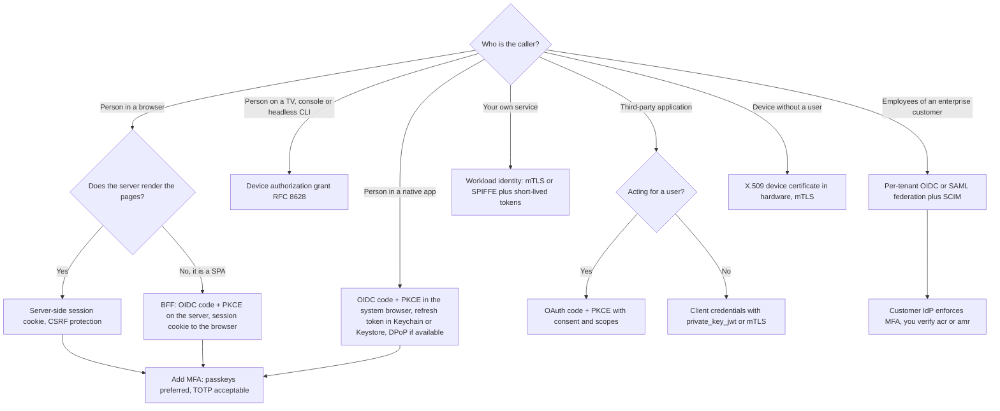
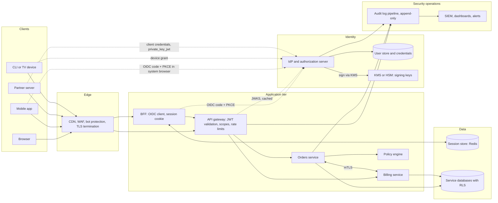
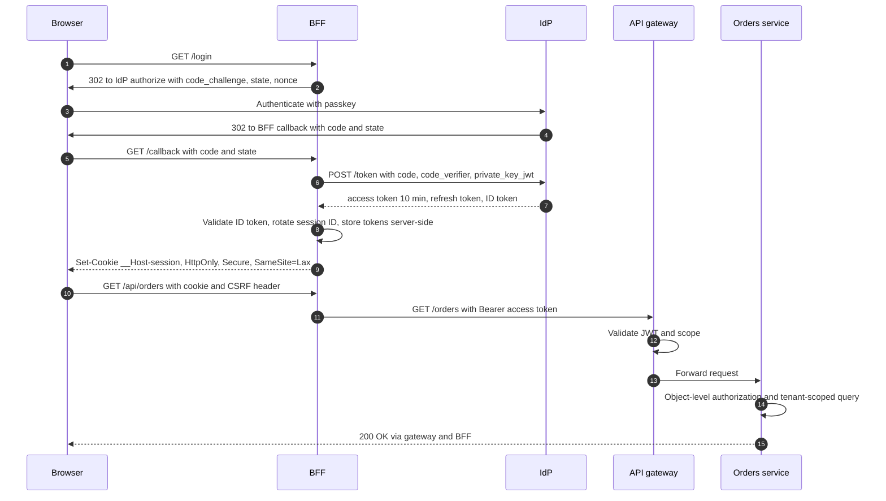
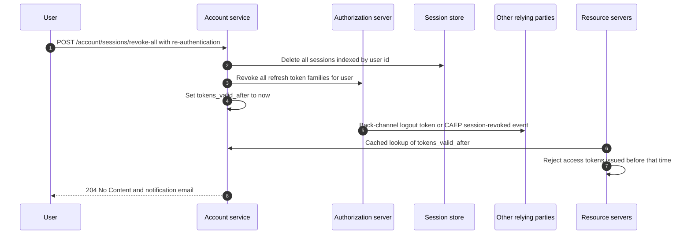
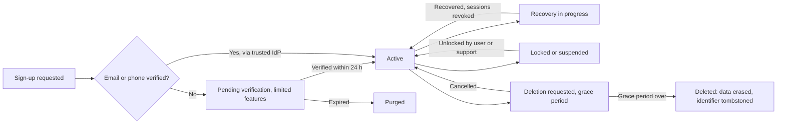

# 14 — Production Architecture and Checklist

The previous chapters explain each mechanism on its own. Production systems combine them: a browser app, a mobile app, partner integrations and internal services all share one identity provider, one set of signing keys, one audit trail and one incident process. This chapter is the decision guide and operations manual: which authentication to use for which kind of system, whether to build or buy the identity provider, a reference architecture, key management, token and session lifetimes, logout and revocation, account lifecycle, abuse protection, logging, monitoring, security headers, OWASP ASVS, incident playbooks, and a checklist of more than 70 items to review before go-live.

> **Where this fits in the evolution**
>
> - **Before:** Each era solved one problem: [hashed passwords](02-passwords-and-credential-storage.md), [sessions](04-sessions-cookies-and-csrf.md), [enterprise SSO](05-enterprise-sso-ldap-kerberos-saml.md), [tokens](06-tokens-and-jwt.md), [OAuth](08-oauth-2.md) and its [hardening](09-modern-oauth-2.1-and-extensions.md), [OpenID Connect](10-openid-connect.md), [passkeys](11-mfa-passwordless-and-passkeys.md), [workload identity](12-service-to-service-and-zero-trust.md) and [fine-grained authorization](13-authorization-rbac-abac-rebac.md).
> - **What this chapter solves:** Picking the right combination and running it safely: keys rotate without outages, logout actually logs people out, attacks are detected, and incidents have a rehearsed playbook.
> - **What is changing now (2026):** Browser apps follow the BFF pattern (RFC 10017, August 2026), OAuth 2.1 is still an Internet-Draft, passkeys are mainstream (WebAuthn Level 3 became a W3C Recommendation in August 2026), sessions are revoked across vendors with the OpenID Shared Signals Framework and CAEP (final in September 2025), and public TLS certificates are limited to 200 days (falling to 47 days by 2029).

---

## Table of contents

1. [How to use this chapter](#1-how-to-use-this-chapter)
2. [Decision guide: which authentication for which system](#2-decision-guide-which-authentication-for-which-system)
3. [Build vs buy an identity provider](#3-build-vs-buy-an-identity-provider)
4. [Reference architecture](#4-reference-architecture)
5. [Key management and rotation](#5-key-management-and-rotation)
6. [JWKS caching and clock skew](#6-jwks-caching-and-clock-skew)
7. [Recommended token and session lifetimes](#7-recommended-token-and-session-lifetimes)
8. [Logout and global session revocation](#8-logout-and-global-session-revocation)
9. [Account lifecycle](#9-account-lifecycle)
10. [Rate limiting and bot protection](#10-rate-limiting-and-bot-protection)
11. [Logging and auditing](#11-logging-and-auditing)
12. [Monitoring and alerts](#12-monitoring-and-alerts)
13. [Security headers and TLS](#13-security-headers-and-tls)
14. [OWASP ASVS 5.0](#14-owasp-asvs-50)
15. [Incident response playbooks](#15-incident-response-playbooks)
16. [Production checklist](#16-production-checklist)
17. [Common attacks and mistakes](#17-common-attacks-and-mistakes)
18. [Spring Boot 4 / Spring Security 7 production configuration](#18-spring-boot-4--spring-security-7-production-configuration)
19. [Interview questions](#interview-questions)
20. [References](#references)

---

## 1. How to use this chapter

- **Designing a new system:** read sections 2-4, then use the lifetimes table (section 7) and the checklist (section 16) as acceptance criteria.
- **Reviewing an existing system:** go through the checklist area by area and the "common mistakes" table; map gaps to OWASP ASVS 5.0 requirements (section 14).
- **Preparing for on-call:** read sections 11, 12 and 15. Rehearse the playbooks before you need them.
- **Preparing for interviews:** sections 2, 3, 7 and 8 answer the most common system-design questions. [Chapter 15](15-interview-questions.md) has full model answers.

---

## 2. Decision guide: which authentication for which system

### 2.1 Summary table

| System | Recommended authentication | Where credentials live | Avoid | Details |
|---|---|---|---|---|
| **Server-rendered web app** (first-party) | Login form or OIDC login to your IdP; **server-side session** after login | Random session ID in an `HttpOnly; Secure; SameSite=Lax` cookie; state in Redis or the database | JWTs in cookies as a session replacement without revocation; tokens in `localStorage` | [04](04-sessions-cookies-and-csrf.md), [10](10-openid-connect.md) |
| **Single-page app (SPA)** | **BFF pattern**: a backend component runs OIDC authorization code + PKCE as a confidential client and keeps tokens server-side (RFC 10017) | Browser holds only a session cookie; tokens in the BFF's session store | Implicit flow; access or refresh tokens in `localStorage` or `sessionStorage` | [06](06-tokens-and-jwt.md#111-the-backend-for-frontend-bff-pattern), [09](09-modern-oauth-2.1-and-extensions.md) |
| **Native mobile or desktop app** | OIDC authorization code + PKCE through the **system browser** (RFC 8252: `ASWebAuthenticationSession`, Android Custom Tabs); passkeys | Refresh token in iOS Keychain or Android Keystore-backed storage; DPoP-bound where supported | Embedded web views for login; the password grant; secrets compiled into the app | [09](09-modern-oauth-2.1-and-extensions.md), [11](11-mfa-passwordless-and-passkeys.md) |
| **Public API for third-party developers** | OAuth 2 authorization code + PKCE (user-delegated access with consent); **client credentials** with `private_key_jwt` or mTLS (server-to-server); API keys only for low-risk identification and metering | Client keys in the developer's secret store; tokens 5-15 min | Long-lived bearer API keys for user data; the password grant | [03](03-http-basic-digest-and-api-keys.md), [08](08-oauth-2.md) |
| **Internal microservices** | **Workload identity**: mTLS (service mesh, SPIFFE) and short-lived client-credentials tokens; token exchange (RFC 8693) to carry the end user | Certificates and tokens issued automatically, lifetimes of minutes to hours | Shared static secrets, "trusted network" with no authentication | [12](12-service-to-service-and-zero-trust.md) |
| **B2B enterprise SaaS** | Per-tenant **federation** (OIDC or SAML 2.0 to the customer's IdP), SCIM provisioning, verified email domains, organization-scoped tokens | Your IdP brokers the customer's IdP; your sessions and tokens as above | Matching users across tenants by email alone; unverified domain claims | [05](05-enterprise-sso-ldap-kerberos-saml.md), [13](13-authorization-rbac-abac-rebac.md#12-multi-tenancy-and-tenant-isolation) |
| **CLI tools** | Authorization code + PKCE with a **loopback redirect** (`http://127.0.0.1:{port}/callback`, RFC 8252), or the device grant on headless machines | Refresh token in the OS keychain | Asking users to paste passwords or long-lived personal tokens | [08](08-oauth-2.md#7-device-authorization-grant-rfc-8628) |
| **TVs, consoles, IoT with a user** | **Device authorization grant** (RFC 8628): show a code, user approves on a phone | Refresh token on the device, revocable per device | Typing passwords with a remote control | [08](08-oauth-2.md#7-device-authorization-grant-rfc-8628) |
| **IoT devices without a user** | **X.509 device certificates** provisioned at manufacturing (ideally in a secure element or TPM), mTLS to the backend | Private key in hardware | One shared secret for the whole fleet | [12](12-service-to-service-and-zero-trust.md) |
| **Webhooks you send** | **HMAC-signed requests** with timestamp and replay protection, or HTTP Message Signatures (RFC 9421) | Per-endpoint 256-bit secret | Unsigned webhooks; static IP allowlists as the only control | [03](03-http-basic-digest-and-api-keys.md), [../examples/05-api-keys-hmac/](../examples/05-api-keys-hmac/) |

### 2.2 Decision flowchart



### 2.3 Rules that apply to every row

- **One identity provider** issues identities for all user-facing channels, so a user has one account, one MFA setup and one place to revoke.
- **OpenID Connect for login**, never "the access token worked, so the user is X" ([chapter 10](10-openid-connect.md)).
- **Authorization code + PKCE for every client type**. Implicit and resource-owner-password grants are deprecated (RFC 9700).
- **Exact redirect URI matching**, `state` (or PKCE) against CSRF, `nonce` for OIDC.
- **Access tokens 5-15 minutes**, refresh tokens rotated with reuse detection and stored hashed, sender-constrained (DPoP or mTLS) where the risk justifies it.
- **Phishing-resistant MFA** (passkeys) for administrators, and offered to everyone.

---

## 3. Build vs buy an identity provider

### 3.1 What "the identity provider" includes

Building login is not one form. A production IdP includes: sign-up and verification, password storage and breach checks, MFA and passkeys, recovery, OIDC/OAuth endpoints with discovery and JWKS, key rotation, consent, session management and logout propagation, social and enterprise federation (OIDC, SAML), SCIM, admin console, audit logs, rate limiting and bot defense, and OpenID certification. Every item has its own attack history.

### 3.2 Options

| Option | Type and license | Strengths | Trade-offs | Good fit |
|---|---|---|---|---|
| **Keycloak** | Open source (Apache 2.0), self-hosted; CNCF incubating project since 2023 | Full OIDC and SAML, LDAP/AD federation, identity brokering, MFA and WebAuthn, organizations, no per-user fees | You run it: upgrades, clustering, database, backups, patching; customization through Java SPIs and themes | Teams with platform capacity; on-premises or sovereignty requirements |
| **Auth0** (Okta) | Managed SaaS (Okta acquired Auth0 in 2021) | Fast integration, many SDKs, extensibility hooks (Actions), B2B organizations, bot and breached-password detection | Price grows with monthly active users and enterprise connections; vendor lock-in for hooks and rules | Customer identity (CIAM) where time-to-market matters |
| **Okta Workforce Identity** | Managed SaaS | Employee SSO, lifecycle management, large app catalog | Workforce focus, licensing per employee | Internal workforce SSO |
| **Amazon Cognito** | Managed (AWS); feature tiers (Lite, Essentials, Plus) | Low cost at scale, AWS integration (API Gateway, ALB, IAM identity pools), managed login pages | Customization limits; some user pool settings cannot change after creation; password hashes cannot be exported, so leaving needs lazy migration or resets | AWS-centric products with standard needs |
| **Microsoft Entra ID** and **Entra External ID** | Managed (Microsoft) | Default workforce identity for Microsoft-centric organizations; Conditional Access; External ID for customer-facing apps (Azure AD B2C has not been sold to new customers since May 2025) | Licensing tiers for advanced features; multi-tenant validation details ([chapter 10](10-openid-connect.md)) | Workforce SSO; enterprises on Microsoft 365 and Azure |
| **Firebase Authentication** / **Google Cloud Identity Platform** | Managed (Google) | Very simple client SDKs for web and mobile, anonymous and social login; Identity Platform adds SAML/OIDC providers, multi-tenancy, MFA and blocking functions | Client-SDK centric; fewer enterprise controls in the basic tier | Mobile-first consumer apps, Firebase or GCP stacks |
| **Zitadel** | Open source (core under AGPL-3.0 since v3 in 2025, commercial license available) plus managed cloud | Built-in multi-tenancy (instances and organizations), passkeys, event-sourced audit trail, OIDC and SAML | AGPL obligations if you modify and offer it as a service; smaller ecosystem | B2B SaaS needing tenant self-service |
| **Ory** (Kratos, Hydra, Keto, Oathkeeper) | Open source (Apache 2.0) plus managed Ory Network | Headless, API-first components; Hydra is an OpenID Certified OAuth 2 and OIDC server; Keto is a Zanzibar-style permission server | You build the UI; several components to operate | Teams wanting fully custom UX on standard protocols |
| **Supabase Auth** | Open source, part of the Supabase platform | JWTs that plug directly into PostgreSQL row-level security; email, social, phone, SAML SSO on paid plans | Tied to the Supabase platform; fewer enterprise IAM features | Apps already built on Supabase |
| **Spring Authorization Server** | Framework (part of Spring Security 7) | Full control, OIDC-compliant core in your JVM stack | You build login UI, MFA, recovery, admin, user management and operations | Identity is core to your product, or unusual protocol needs; see [../examples/03-oauth2-oidc/](../examples/03-oauth2-oidc/) |

### 3.3 Decision criteria

| Criterion | Questions to ask |
|---|---|
| **Standards** | OpenID Certified? PKCE, PAR, DPoP or mTLS, back-channel logout, SAML, SCIM, passkeys, `acr`/step-up support? |
| **B2B needs** | Organizations, per-tenant SSO connections, domain verification, delegated admin? |
| **Security features** | Breached-password detection, bot protection, anomaly detection, phishing-resistant MFA policies, admin MFA enforcement? |
| **Compliance** | Data residency regions, certifications (SOC 2, ISO 27001), audit log export, retention? |
| **Operations** | SLA, status history, rate limits, staging environments, configuration as code (Terraform)? |
| **Extensibility** | Hooks at sign-up, login and token issuance; custom claims; custom UI? |
| **Migration** | Can you import existing hashes (bcrypt, Argon2id, PBKDF2) or migrate lazily at login? Can you export users and hashes if you leave? |
| **Cost** | Price per monthly active user, per enterprise connection, per feature tier; cost at 10× today's users |

### 3.4 Recommendation

- **Buy or run an established IdP** unless identity is your product. The protocol surface is large and the failure modes are subtle; established products have been attacked and fixed for years.
- **Build the integration, not the IdP**: your apps should depend only on standard OIDC (issuer URL, discovery, JWKS, standard claims). Keep your own `users` table keyed by (`iss`, `sub`) so a provider switch does not change your internal user IDs.
- **If you build**, build on a framework (Spring Authorization Server, Ory Hydra), get OpenID certification tests passing, and budget for MFA, recovery, admin tooling and on-call, not just the token endpoint.
- **Plan the exit on day one**: hash export, user export, configuration as code, and a lazy-migration path (verify the password against the old provider at first login, then store the hash in the new one).

---

## 4. Reference architecture

### 4.1 Components



Design notes:

- **The browser never sees OAuth tokens.** The BFF stores them in the session store and forwards API calls with the access token attached.
- **The gateway validates JWTs** (signature, `iss`, `aud`, `exp`, `nbf`, `typ`) and enforces coarse scopes; **services re-validate** (defense in depth, and because internal traffic can bypass the gateway) and enforce object-level authorization ([chapter 13](13-authorization-rbac-abac-rebac.md)).
- **Private signing keys never leave the KMS/HSM.** The IdP calls the KMS sign operation; resource servers only fetch public keys from JWKS.
- **Service-to-service calls use mTLS** (mesh-issued certificates) plus, where the user context matters, a token obtained by token exchange.
- **Every security event flows to an append-only audit pipeline** separate from application logs.

### 4.2 Request lifecycle: SPA through the BFF



---

## 5. Key management and rotation

### 5.1 Key inventory

Know every key, what it protects, where it lives and how it rotates.

| Key | Algorithm and size | Where it lives | Rotation | Notes |
|---|---|---|---|---|
| **Token signing** (ID and access tokens) | ES256 (P-256), RS256 or PS256 (RSA 2048 minimum, 3072 for keys used beyond 2030), EdDSA (Ed25519) where all verifiers support it | KMS or HSM, non-exportable | Scheduled (for example every 90 days) and immediately on suspicion | Publish via JWKS with `kid` |
| **Public TLS certificates** | ECDSA P-256 or RSA 2048+ | Load balancer or ingress | Automated with ACME (RFC 8555); maximum validity 200 days since March 15, 2026, 100 days from March 2027, 47 days from March 2029 | Alert 30 days before expiry |
| **Workload mTLS certificates** | ECDSA P-256 | Issued by the mesh or SPIFFE/SPIRE to each workload | 1-24 hours, automatically | No manual handling at all |
| **Client authentication keys** (`private_key_jwt`) | ES256 or RS256 | Client's KMS or secret store; public key registered (or JWKS URL) | 6-12 months with overlap | Prefer over client secrets |
| **Client secrets** (if unavoidable) | 256-bit random | Secret manager | 90-365 days with two valid secrets during overlap | Store hashed at the AS |
| **Session or cookie encryption keys** | AES-256-GCM or HMAC-SHA-256 | Secret manager | Yearly or on incident, with a key ring (decrypt with old, encrypt with new) | Only if you use encrypted or signed cookies |
| **Password pepper** | 256-bit secret for HMAC | KMS or HSM | Rarely; version-tag hashes so you can introduce a new pepper and re-hash at login | Losing it locks everyone out; back it up securely |
| **Field encryption keys** (TOTP seeds, recovery data) | AES-256-GCM, envelope encryption: data key per record or table, key-encryption key in KMS | KMS holds the key-encryption key | Rotate the key-encryption key yearly; re-wrap data keys | Never store TOTP seeds in plaintext |
| **Webhook HMAC secrets** | 256-bit random per endpoint | Secret manager | On demand, with two secrets valid during overlap | See [../examples/05-api-keys-hmac/](../examples/05-api-keys-hmac/) |
| **API keys** (yours, issued to customers) | 256-bit random, stored as hashes | Hash in your DB | Expiry 90 days to 1 year; customer-driven rotation with overlap | Prefix for secret scanning (for example `sk_live_`) |

### 5.2 Rotating a signing key without downtime

Verifiers cache JWKS, so a new key must be **published before it is used**, and an old key must stay **published until every token it signed has expired**.

| Phase | Action | Wait before the next phase |
|---|---|---|
| 1. Pre-publish | Create key `2026-11-a` in the KMS. Add its public key to the JWKS. Keep signing with `2026-10-a` | At least the maximum JWKS cache lifetime of any verifier (for example 24 hours) |
| 2. Switch | Start signing new tokens with `2026-11-a`. Both keys stay in the JWKS | The longest lifetime of any token signed with the old key (ID tokens, access tokens, logout tokens), plus clock skew and a margin |
| 3. Retire | Remove `2026-10-a` from the JWKS | Keep the key disabled (not deleted) for the audit retention period |
| 4. Destroy | Schedule key deletion in the KMS | — |

What the JWKS looks like during phase 2:

```http
GET /oauth2/jwks HTTP/1.1
Host: auth.example.com
```

```http
HTTP/1.1 200 OK
Content-Type: application/json
Cache-Control: public, max-age=3600, stale-if-error=86400

{
  "keys": [
    { "kty": "EC", "crv": "P-256", "kid": "2026-11-a", "use": "sig", "alg": "ES256",
      "x": "WbbaSStuWHUgIj2BLfuVDCpP1Ce_OHyN_FUqUrfxtOw", "y": "c8d7S7Nb4pI5FUeF6pqyZwpCMIo0h3qAnZk3iRzgeVU" },
    { "kty": "EC", "crv": "P-256", "kid": "2026-10-a", "use": "sig", "alg": "ES256",
      "x": "3l3wRYdGgsXL0r9-LhJ0c3dHQz2wbT7Q8bD1KQ-1ltw", "y": "Hzq5nZ4sUQ1u8n5FaKKwWm6z1R2b8mJxk4mPwp0V2yA" }
  ]
}
```

### 5.3 Practices

- **Non-exportable keys in a KMS or HSM** (AWS KMS, Google Cloud KMS, Azure Key Vault, or an on-premises HSM). Signing calls go to the KMS; the private key never exists in application memory or backups. Check KMS request quotas and latency against your token issuance rate.
- **Least privilege on the key**: only the IdP's workload identity may call `Sign`; alert on any other principal touching it.
- **Automate rotation** and rehearse it in staging every quarter; an untested rotation path fails during the incident.
- **One key, one purpose**: separate keys for access tokens, ID tokens, and cookie encryption; never reuse a TLS key for token signing.
- **No secrets in code, images or CI logs**. Use a secret manager, short-lived credentials from workload identity, and secret scanning on every repository (with push protection).

---

## 6. JWKS caching and clock skew

### 6.1 Verifier caching rules

| Rule | Why |
|---|---|
| Cache the JWKS, honoring `Cache-Control` (typically 5 minutes to 24 hours) | Fetching on every request adds latency and makes the IdP a single point of failure |
| On an **unknown `kid`**, refetch once, **rate-limited** (for example at most once per 30-60 seconds) | Picks up newly rotated keys quickly without letting attackers force a fetch per request by spraying random `kid` values |
| Keep using cached keys if the IdP is unreachable (`stale-if-error`) | An IdP outage should not break every API immediately |
| Pre-fetch at startup and alert on fetch failures | Avoids cold-start failures and silent staleness |
| Fetch only from the configured issuer's JWKS URI over TLS | Never from a `jku` or `x5u` header in the token ([chapter 06](06-tokens-and-jwt.md)) |
| Provide an operational "flush JWKS cache" action | Needed after an emergency key removal (section 15.1) |

In Spring Security 7.1, `NimbusJwtDecoder` caches the JWK set (the Nimbus library default is 5 minutes) and refetches when a token carries an unknown `kid`. Spring's builder turns Nimbus's own refetch rate limiter off, so if you expect hostile traffic, rate-limit unauthenticated junk at the gateway or supply your own `JWKSource`. You can also pass a Spring `Cache` to `NimbusJwtDecoder.withIssuerLocation(...).cache(...)` to share the JWKS across instances.

### 6.2 Clock skew

Token validation compares `exp`, `nbf` and `iat` with the verifier's clock. Clocks drift.

- Run NTP (for example `chrony`) on every host and container node; alert when offset exceeds 1 second.
- Allow **at most 60 seconds** of skew (Spring's `JwtTimestampValidator` default is 60 seconds; 30 seconds is a good tighter value).
- Do not "fix" skew errors by raising the tolerance to minutes: a 10-minute tolerance on a 10-minute token doubles its lifetime.
- Reject tokens whose `iat` is far in the future; they indicate a misconfigured issuer or forgery.

---

## 7. Recommended token and session lifetimes

These values are consistent with the rest of this guide. Shorten them for high-risk systems (banking, admin consoles, healthcare); never lengthen access tokens to "fix" refresh problems.

| Artifact | Recommended lifetime | Notes |
|---|---|---|
| Access token (JWT or opaque) | **5-15 minutes** (10 is a common default) | 5 minutes for high-risk APIs; sender-constrain where justified |
| ID token | 5-10 minutes | Validated once at login; not used for API calls |
| Refresh token, web (BFF) | Rotated on every use; idle 1-7 days, absolute 7-30 days | Revoke on logout, password change, MFA reset |
| Refresh token, mobile | Rotated on every use; idle 7-30 days, absolute up to about 90 days for consumer apps when device-bound (DPoP) | Shorter for privileged or financial apps |
| Refresh token, privileged users and admin tools | Idle hours, absolute 8-12 hours | Re-authenticate daily |
| Server-side session, business web app | Idle 15-30 minutes, absolute 8-12 hours | Both enforced server-side ([chapter 04](04-sessions-cookies-and-csrf.md)) |
| Server-side session, high-value app | Idle 2-5 minutes (OWASP), absolute 4-8 hours | Banking and admin consoles |
| NIST SP 800-63B-4 reauthentication | AAL2: idle at most 1 hour, overall at most 24 hours; AAL3: idle at most 15 minutes, overall at most 12 hours | Recommended maximums |
| "Remember me" / persistent login | Up to 30 days | Re-authenticate before sensitive actions |
| Re-authentication for sensitive actions | Fresh factor within the last 5-15 minutes | Use OIDC `max_age` and check `auth_time`, or step-up (RFC 9470) |
| IdP SSO session | Workforce: one working day (8-12 hours); consumer: days to weeks with risk checks | Controls how often users see the login page |
| Authorization code | 30-60 seconds, single use | RFC 6749 recommends at most 10 minutes |
| `state`, `nonce`, PKCE verifier | One login transaction, at most 10 minutes | Bound to the browser session |
| Device code (RFC 8628) | 10-15 minutes | Polling interval at least 5 seconds |
| Email verification link | Up to 24 hours, single use | Hash stored server-side |
| Password reset token | 15-60 minutes, single use, one active per user | Revoke sessions after reset ([chapter 02](02-passwords-and-credential-storage.md)) |
| Magic link / email OTP | 5-15 minutes, single use | Spring's one-time token default is 5 minutes |
| SMS OTP (if used at all) | 5-10 minutes, 3-5 attempts | Discouraged; NIST "restricted" |
| TOTP code | 30-second step, accept ±1 step, reject reuse | [../examples/04-mfa-totp/](../examples/04-mfa-totp/) |
| Signing keys | Rotate every 90 days to 1 year; immediately on suspicion | Overlap per section 5.2 |
| JWKS cache at verifiers | 5 minutes to 24 hours | Refetch on unknown `kid`, rate-limited |
| Clock skew tolerance | At most 60 seconds | NTP everywhere |
| API keys | Expire after 90 days to 1 year | Warn owners before expiry |
| Workload certificates | 1-24 hours (SPIRE default 1 hour; Istio and Linkerd 24 hours) | Automated issuance and rotation ([chapter 12](12-service-to-service-and-zero-trust.md)) |
| Public TLS certificates | At most 200 days (2026 rule); renew automatically around two-thirds of lifetime | 100 days from March 2027 |

---

## 8. Logout and global session revocation

### 8.1 What "logged out" has to mean

A user can be "logged in" in several places at once. Real logout ends all of them:

| Layer | State | How to end it |
|---|---|---|
| App session | Server-side session (or BFF session) | Invalidate the session server-side; expire the cookie; `Clear-Site-Data` |
| Refresh tokens | Rows in the AS's token store | Revoke (RFC 7009) the token and its rotation family |
| Access tokens | Self-contained JWTs held by clients | Expire within 5-15 minutes; for immediate effect, a per-user "valid after" timestamp or introspection |
| IdP session | SSO cookie at the IdP | RP-Initiated Logout to the `end_session_endpoint` |
| Other apps sharing the IdP session | Their own sessions | OIDC Back-Channel Logout from the IdP; across organizations, CAEP `session-revoked` events over the Shared Signals Framework |
| Mobile apps | Refresh token in Keychain or Keystore | Revoke at the AS, delete locally |

### 8.2 "Log out everywhere"

Users expect a "sign out of all devices" button, and security events need the same mechanism. Triggers: password change, MFA reset, account recovery, suspected compromise, role removal, account deletion, administrator action.

Implementation:

1. **Index sessions by user.** Spring Session's `FindByIndexNameSessionRepository` finds all sessions by principal name; delete them all.
2. **Revoke all refresh-token families** for the user at the authorization server.
3. **Set `tokens_valid_after = now`** on the user record; resource servers reject access tokens with `iat` before it (cache the value for a few seconds), or simply accept up to one access-token lifetime of delay for low-risk systems.
4. **Notify relying parties**: back-channel logout tokens from the IdP; CAEP `session-revoked` or RISC `credential-compromise` events to partners that subscribe through SSF.
5. **Notify the user** by email ("You were signed out of all devices").



### 8.3 Logout endpoint details

- Logout is a **POST with CSRF protection** (a GET logout lets any site log users out).
- Invalidate server-side first, then clear cookies with the **same attributes** (`Path`, `Domain`, `__Host-` prefix) they were set with.
- Send `Clear-Site-Data: "cache", "cookies", "storage"` to clear browser state.
- Redirect to the IdP's `end_session_endpoint` with `id_token_hint` and a **pre-registered** `post_logout_redirect_uri` ([chapter 10](10-openid-connect.md#12-sessions-and-logout)).

---

## 9. Account lifecycle



| Stage | Practices |
|---|---|
| **Sign-up** | Enumeration-safe response ("If this address can be registered, we sent a link"); breached-password check; bot protection on risk; email verification before sensitive features; no account is "active" on an unverified address it does not control |
| **Email verification** | 256-bit single-use token, stored hashed, up to 24 hours; bound to the user and the address; re-verify when the address changes |
| **First login and MFA enrollment** | Offer passkeys first; require MFA for admins and privileged roles; generate recovery codes at enrollment ([chapter 11](11-mfa-passwordless-and-passkeys.md)) |
| **Profile and email change** | Re-authenticate; verify the new address; notify the old address with a "this was not me" link; for high-value accounts, delay the change (for example 24-72 hours) |
| **Password change** | Re-authenticate; revoke other sessions and refresh tokens; notify |
| **Recovery** | Strongest available method; recovery codes or a second passkey before email; notify on every recovery; revoke sessions; consider a waiting period before an MFA reset takes effect on high-value accounts. Recovery is the weakest link |
| **Locking** | Prefer throttling and step-up over hard lockout (lockout is a denial-of-service tool); NIST caps consecutive failures at 100 before the authenticator is disabled |
| **Dormancy** | Workforce: disable after a defined inactivity period (for example 90 days); consumer: notify, then require re-verification |
| **Deprovisioning (B2B)** | SCIM `DELETE` or `active=false` from the customer's IdP; revoke sessions, tokens and API keys within minutes |
| **Deletion** | Re-authenticate; grace period (for example 14-30 days); revoke everything; erase or anonymize personal data (GDPR Article 17), keeping only records the law requires; **never reuse the internal user ID or `sub`**; send RISC `account-purged` to federated partners if you use SSF |

---

## 10. Rate limiting and bot protection

### 10.1 Where to limit

| Layer | Limits | Tools |
|---|---|---|
| Edge (CDN/WAF) | Volumetric floods, known-bad IPs and ASNs, bot fingerprints, JavaScript challenges | Cloud WAF and bot management |
| Gateway | Per IP, per client ID, per API key quotas | API gateway, Envoy rate limiting, Redis token buckets |
| Application | **Per account**, per (IP, account), per destination phone number, per tenant | Bucket4j, Redis counters, database counters |

### 10.2 Concrete limits to start from

Tune with real traffic; these are starting points.

| Endpoint | Suggested limits | On exceeding |
|---|---|---|
| Login (per account) | Progressive delay after 3-5 failures (1 s, 2 s, 4 s ... capped at about 30-60 s); CAPTCHA or step-up after about 10 | Never more than 100 consecutive failures before disabling the authenticator (NIST) |
| Login (per IP) | For example 20-100 attempts per minute, higher for known NAT ranges | 429 with `Retry-After` |
| Distinct usernames per IP | For example more than 10-20 in 10 minutes | Challenge; flag as credential stuffing |
| Password reset / magic link / verification email | 3-5 per hour per account, per IP limits | Same generic response, no send |
| SMS or voice OTP send | 3-5 per hour per account and per number; block unused country prefixes | Protects against SMS pumping (toll fraud) |
| OTP or TOTP verification | 5 attempts per code or per 15 minutes | Invalidate the code |
| Token endpoint | Per client ID, for example 10-50 requests per second | 429; alert on spikes |
| Sign-up | Per IP and per device; disposable-domain checks | Challenge on risk |
| Public API | Per API key or client: quotas per second and per day | 429 with `Retry-After` |

```http
HTTP/1.1 429 Too Many Requests
Retry-After: 30
Content-Type: application/problem+json
Cache-Control: no-store

{"type":"https://example.com/problems/too-many-attempts","title":"Too many attempts","status":429,"detail":"Please wait 30 seconds and try again."}
```

The IETF is standardizing `RateLimit` response header fields (`draft-ietf-httpapi-ratelimit-headers`, still a draft); `Retry-After` (RFC 9110) works today.

### 10.3 Credential stuffing and bots

Credential stuffing uses valid username/password pairs leaked from other sites, spread over many IPs. Per-IP limits alone do not stop it.

- **Breached-password checks** at sign-up, password change and login (k-anonymity range queries against Pwned Passwords send only the first 5 hex characters of the SHA-1 hash).
- **MFA**, ideally passkeys, which make stolen passwords useless.
- **Device recognition**: a signed "device cookie" for browsers that previously logged in successfully lets you throttle unknown devices harder than known ones (OWASP describes this pattern).
- **Risk scoring**: new device, new country, impossible travel, known proxy or hosting ASN, abnormal velocity → step-up instead of block.
- **Bot challenges** only on risk, not for everyone (accessibility and conversion). Privacy-preserving tokens (Privacy Pass, RFC 9576-9578) can replace some CAPTCHAs.
- **Uniform responses and timing** so attackers cannot test which accounts exist.
- **Avoid hard lockouts**; attackers use them to lock out victims.

---

## 11. Logging and auditing

### 11.1 What to log

| Event | Fields beyond the common ones |
|---|---|
| Login success / failure | Method (password, passkey, OIDC), failure reason code, MFA used, risk score |
| MFA challenge, success, failure; factor added or removed | Factor type, authenticator ID (not secret) |
| Password change and reset (requested, completed) | Channel used for reset |
| Account recovery used | Method (recovery code, support), approver |
| Session created, rotated, revoked; logout | Session ID **hash**, reason |
| Token issued, refreshed, revoked | `client_id`, `jti`, scopes, grant type |
| **Refresh-token reuse detected** | Family ID, both client fingerprints |
| Token validation failures | Reason (signature, `aud`, `exp`), `kid`, `iss` |
| Authorization denied | Subject, action, resource, policy version |
| Privileged actions | Role grants, impersonation (`act` claim), break-glass use, config changes |
| Key and secret lifecycle | Key created, rotated, disabled; secret read by an unexpected principal |
| User lifecycle | Sign-up, verification, email change, deletion, SCIM provisioning |

Common fields on every event: UTC timestamp, event type, outcome, user ID, tenant ID, client ID, source IP, user agent, request or trace ID, service name and version.

```json
{
  "ts": "2026-10-08T09:14:03.512Z",
  "event": "authn.login.failure",
  "outcome": "failure",
  "reason": "invalid_credentials",
  "user_id": "u-8f2c1a",
  "tenant_id": "t-acme",
  "client_id": "web-bff",
  "auth_method": "password",
  "ip": "203.0.113.24",
  "user_agent": "Mozilla/5.0 (Macintosh; Intel Mac OS X 15_6) AppleWebKit/605.1.15",
  "request_id": "01JAZ5QH8V5D9W3S1K7T2C4M6N",
  "risk_score": 0.82,
  "service": "auth-server",
  "version": "2026.10.2"
}
```

The OWASP Logging Vocabulary Cheat Sheet proposes standard event names (for example `authn_login_fail`, `authn_token_reuse`, `authz_fail`) that make SIEM rules portable.

### 11.2 Never log

| Never log | Log instead |
|---|---|
| Passwords (including wrong ones), password hashes | Outcome and reason code |
| Usernames typed into the password field by mistake (and vice versa) | For unknown usernames, a hash or truncated value |
| Session IDs, access/refresh/ID tokens, authorization codes, PKCE verifiers | Session ID hash, token `jti`, `client_id` |
| API keys, client secrets, private keys, webhook secrets | Key ID or the non-secret prefix |
| OTP codes, recovery codes, TOTP seeds, reset links | Event and outcome |
| `Authorization`, `Cookie`, `Set-Cookie` headers | Header presence only |
| Full personal data not needed for security | Minimal identifiers |

Enforce this in code, not just policy: redaction filters in the logging framework, request logging that drops sensitive headers, tests that grep logs for token patterns, and secret scanning on log storage.

### 11.3 Integrity and retention

- Ship security events to an **append-only** store in a separate account or project (WORM storage such as object lock), so an attacker with application access cannot erase traces.
- Synchronize clocks (logs are evidence); include time zone (UTC).
- Retain according to regulation: for example PCI DSS v4.0 requires at least 12 months of audit log history with the most recent 3 months immediately available. One year is a sensible default for authentication events.
- Restrict and audit access to the logs themselves; they contain personal data.

---

## 12. Monitoring and alerts

| Signal | Why it matters | Example alert |
|---|---|---|
| Failed logins (rate) | Brute force, stuffing, or a broken release | More than 3× the baseline for 10 minutes |
| Login success ratio | Stuffing shows as many failures with occasional successes | Ratio drops below the 7-day baseline by 30% |
| Distinct usernames per IP or per ASN | Credential stuffing signature | More than 20 per IP in 10 minutes |
| **Refresh-token reuse detected** | Almost always token theft or a client bug | **Every event** to security; page on bursts |
| Token signature or `kid` failures | Forgery attempts, or a broken key rotation | Sustained non-zero rate for 5 minutes |
| JWKS fetch failures | Verifiers running on stale keys | Any failure lasting more than 5 minutes |
| MFA resets, recovery-code use, email changes | Account takeover often goes through recovery | More than 3× baseline per hour; every reset for admins |
| Password reset requests | Enumeration or a takeover campaign | Spike per IP or overall |
| SMS sends and cost | SMS pumping fraud | Spend per hour above a budget threshold |
| Admin role grants, impersonation, break-glass use | Privilege escalation | Every event |
| 403 and 404 per user | BOLA enumeration ([chapter 13](13-authorization-rbac-abac-rebac.md)) | More than 50 per user in 5 minutes |
| New device or country for privileged users | Session theft | Every event for admins |
| KMS key use by unexpected principals | Signing key compromise | Every event, page |
| Certificate expiry | Outage | Less than 30 days: ticket; less than 7 days: page |
| IdP availability and latency | Logins are a critical path | SLO burn-rate alerts |

Dashboards should show logins by method (passkey adoption), MFA coverage, active sessions, token issuance by client, and the top failure reasons.

---

## 13. Security headers and TLS

### 13.1 Headers

| Header | Recommended value | Purpose |
|---|---|---|
| `Strict-Transport-Security` | `max-age=63072000; includeSubDomains; preload` | Forces HTTPS for two years; preload list requires at least one year plus `includeSubDomains` and `preload` |
| `Content-Security-Policy` | Start from `default-src 'self'; script-src 'self' 'nonce-{random}'; object-src 'none'; base-uri 'none'; frame-ancestors 'none'; form-action 'self'` | Limits XSS impact (which steals sessions and tokens) and clickjacking |
| `X-Content-Type-Options` | `nosniff` | Stops MIME sniffing |
| `Referrer-Policy` | `strict-origin-when-cross-origin` (or `no-referrer` on auth pages) | Keeps codes and tokens in URLs from leaking via `Referer` |
| `Permissions-Policy` | `camera=(), microphone=(), geolocation=()` (allow what you use; `publickey-credentials-get` must not be blocked if you use passkeys in iframes) | Disables unneeded browser features |
| `Cross-Origin-Opener-Policy` | `same-origin` (`same-origin-allow-popups` if you use popup-based login) | Isolates your window from cross-origin openers |
| `Cache-Control` | `no-store` on login pages, token responses, account pages and personalized APIs | Keeps secrets out of shared and browser caches |
| `Clear-Site-Data` | `"cache", "cookies", "storage"` on logout | Clears browser state |
| `X-Frame-Options` | `DENY` | Legacy clickjacking protection; CSP `frame-ancestors` supersedes it |
| `X-XSS-Protection` | `0` | The old XSS auditor is removed from browsers and could introduce issues; Spring Security sends `0` by default |

Cookies: `__Host-` prefix, `Secure`, `HttpOnly`, `SameSite=Lax` (or `Strict`), `Path=/`, no `Domain` attribute ([chapter 04](04-sessions-cookies-and-csrf.md)).

### 13.2 TLS

- **TLS 1.3 preferred, TLS 1.2 minimum** with ECDHE key exchange and AEAD ciphers (AES-GCM, ChaCha20-Poly1305). TLS 1.0 and 1.1 are deprecated (RFC 8996).
- Automate certificates with **ACME** (RFC 8555). With the 200-day maximum since March 2026 (100 days from March 2027, 47 days from March 2029), manual renewal is no longer realistic.
- **HSTS** on the apex and all subdomains, then submit to the preload list once every subdomain serves HTTPS.
- **Behind a load balancer**, make the application aware of the original scheme (`X-Forwarded-Proto` or the `Forwarded` header, RFC 7239) so redirects, `Secure` cookies and OIDC redirect URIs use `https`. In Spring Boot: `server.forward-headers-strategy=native` (or `framework`), and only trust forwarded headers from your proxy.
- **Encrypt internal traffic** too (mTLS between services); "inside the VPC" is not a security boundary ([chapter 12](12-service-to-service-and-zero-trust.md)).

---

## 14. OWASP ASVS 5.0

The **OWASP Application Security Verification Standard 5.0.0** (released May 2025) is the most useful checklist for verifying an application's security controls. It has about 350 requirements in 17 chapters and three levels: **L1** (baseline, for all applications), **L2** (most applications handling sensitive data) and **L3** (high-assurance: banking, healthcare, critical infrastructure). Cite requirements with the version, for example `v5.0.0-6.2.1`, because numbering changed from 4.0.3.

| ASVS 5.0 chapter | Covers | Chapters in this guide |
|---|---|---|
| V3 Web Frontend Security | Cookies, headers, browser security | [04](04-sessions-cookies-and-csrf.md), this chapter section 13 |
| V4 API and Web Service | HTTP API security | [03](03-http-basic-digest-and-api-keys.md), [08](08-oauth-2.md) |
| **V6 Authentication** | Passwords, MFA, recovery, credential storage | [02](02-passwords-and-credential-storage.md), [11](11-mfa-passwordless-and-passkeys.md) |
| **V7 Session Management** | Session creation, timeouts, termination | [04](04-sessions-cookies-and-csrf.md) |
| **V8 Authorization** | Documentation, operation- and object-level checks | [13](13-authorization-rbac-abac-rebac.md) |
| **V9 Self-contained Tokens** | JWT integrity, algorithms, claims, expiry | [06](06-tokens-and-jwt.md) |
| **V10 OAuth and OIDC** | Clients, resource servers, authorization servers, OPs | [08](08-oauth-2.md), [09](09-modern-oauth-2.1-and-extensions.md), [10](10-openid-connect.md) |
| V11 Cryptography | Algorithms, key management, randomness | [02](02-passwords-and-credential-storage.md), section 5 |
| V12 Secure Communication | TLS | Section 13.2 |
| V13 Configuration | Secrets, build and deployment configuration | Section 5.3 |
| V16 Security Logging and Error Handling | What to log, protection of logs | Sections 11 and 12 |

The other chapters (V1 Encoding and Sanitization, V2 Validation and Business Logic, V5 File Handling, V14 Data Protection, V15 Secure Coding and Architecture, V17 WebRTC) matter for the whole application. Practical use: pick the target level per application, turn the relevant requirements into tickets and tests, and record evidence for each one.

---

## 15. Incident response playbooks

Write these down, assign owners, and rehearse them (tabletop exercise at least twice a year). Times are targets.

### 15.1 Token signing key compromise

Signs: key material found in a repository, backup or log; KMS access by an unexpected principal; tokens whose `jti` does not appear in your issuance log (forgeries).

| Step | Action | Target |
|---|---|---|
| 1. Declare | Open an incident, page identity and security owners | 15 min |
| 2. New key | Create a new key in the KMS (non-exportable) and start signing with it immediately | 30 min |
| 3. Remove the old key | Remove the compromised `kid` from the JWKS **now**, without the usual overlap. Every token signed with it becomes invalid; users and clients re-authenticate or refresh | 30 min |
| 4. Flush caches | Flush JWKS caches at every gateway and resource server (or restart them); verify that tokens with the old `kid` are rejected | 60 min |
| 5. Revoke derived state | If refresh tokens or sessions could have been obtained with forged tokens (for example forged ID tokens at an RP), revoke refresh tokens and sessions issued during the exposure window | 2 h |
| 6. Hunt | Search logs for tokens with the compromised `kid`, unknown `jti` values, and unusual subjects, scopes or audiences during the exposure window | 24 h |
| 7. Root cause | How did the key leave the HSM, or why was it exportable? Fix the cause | Days |
| 8. Notify | Customers and regulators as required (GDPR Article 33: notify the supervisory authority within 72 hours of becoming aware of a personal data breach) | 72 h |

**Preparation that makes this possible:** non-exportable keys, a logged `jti` for every issued token, an operational JWKS cache flush, and short access-token lifetimes.

### 15.2 Leaked client secret, API key or webhook secret

1. **Revoke** the credential immediately (secret-scanning alerts often arrive within minutes of a public push).
2. **Issue** a replacement and deploy it; use overlap only if the leak is not being exploited.
3. **Review usage** of the old credential from the time of the leak: IPs, endpoints, data accessed.
4. **Rotate neighbors**: other secrets in the same repository, CI system or machine are likely exposed too.
5. **Fix the path**: move to a secret manager, workload identity or `private_key_jwt`; enable push protection.

### 15.3 Password database exposure

1. **Assess** what leaked: hash algorithm and parameters, salts, whether the pepper (stored in KMS/HSM) also leaked.
2. **Contain**: revoke all sessions and refresh tokens; force password reset for affected users (all users if scope is unknown), or require MFA at next login if hashes are strong Argon2id with an unexposed pepper.
3. **Protect users**: notify them clearly; warn about reuse on other sites; offer passkey enrollment.
4. **Watch** for credential stuffing against your own login and enable stricter risk rules for weeks.
5. **Notify** regulators and partners as required.

### 15.4 Refresh-token reuse spike or session theft wave

1. Confirm it is not a client bug (a new app release that retries refresh in parallel triggers false reuse).
2. Revoke affected token families and sessions; force re-authentication with MFA for affected users.
3. Look for a common source: malware family (infostealers), a compromised browser extension, a leaked log store.
4. Accelerate sender-constrained tokens (DPoP) and device-bound sessions for the affected client type.

### 15.5 Account takeover campaign (credential stuffing)

1. Tighten rate limits and enable challenges for unknown devices.
2. Force reset and session revocation for accounts with successful logins from attacker infrastructure.
3. Require step-up for sensitive actions (payout changes, email changes) for all users temporarily.
4. Push MFA and passkey enrollment.

### 15.6 Identity provider outage

1. Existing sessions and unexpired tokens keep working (that is why verifiers cache JWKS with `stale-if-error`).
2. Communicate status; do not disable signature validation or extend token lifetimes ad hoc.
3. Use pre-arranged **break-glass** access for operators (hardware-key protected, audited).

---

## 16. Production checklist

### Identity provider and protocols

- [ ] One IdP for all user-facing channels; applications depend only on standard OIDC (issuer, discovery, JWKS, standard claims)
- [ ] OIDC used for login; ID tokens validated (signature, `iss`, `aud`, `exp`, `nonce`, `azp` where relevant)
- [ ] Authorization code + PKCE (S256) for every client; implicit and password grants disabled
- [ ] Exact redirect URI matching; no wildcards; `post_logout_redirect_uri` pre-registered
- [ ] `state` checked on every callback; issuer identification (`iss` parameter, RFC 9207) checked where multiple IdPs are used
- [ ] Confidential clients authenticate with `private_key_jwt` or mTLS rather than shared secrets
- [ ] PAR and DPoP or mTLS evaluated for high-risk clients (FAPI 2.0 profile for financial-grade APIs)
- [ ] Internal user IDs mapped from (`iss`, `sub`), never from email alone

### Passwords and credentials

- [ ] Argon2id (at least m=19 MiB, t=2, p=1) or bcrypt (cost at least 10) for legacy; hashes upgraded at login (`DelegatingPasswordEncoder`)
- [ ] NIST SP 800-63B-4 length rules: at least 15 characters for password-only accounts, at least 8 when always combined with another factor; accept at least 64
- [ ] No composition rules and no periodic forced rotation; forced change only on evidence of compromise
- [ ] Breached-password check at sign-up, change and (asynchronously) login
- [ ] Optional pepper in KMS/HSM, version-tagged
- [ ] Password managers and paste allowed

### MFA and recovery

- [ ] Passkeys (WebAuthn) offered to all users; required (phishing-resistant) for administrators
- [ ] TOTP supported as a fallback with replay protection; SMS only as a discouraged last resort
- [ ] Recovery codes generated at enrollment, stored hashed, single use
- [ ] Re-authentication required before adding or removing factors, changing email or password
- [ ] Notifications on every factor change and every recovery
- [ ] Recovery flow reviewed as an attack path (support desk social engineering included)

### Sessions and cookies

- [ ] Session IDs at least 128 bits of entropy from a CSPRNG; rotated at login and privilege change (fixation)
- [ ] Cookies: `__Host-` prefix, `Secure`, `HttpOnly`, `SameSite=Lax` or `Strict`
- [ ] Idle and absolute timeouts enforced server-side
- [ ] CSRF protection on every cookie-authenticated state-changing request
- [ ] Logout is POST + CSRF, invalidates server-side, sends `Clear-Site-Data`
- [ ] "Sign out of all devices" implemented and used on password change, MFA reset and recovery

### Tokens and keys

- [ ] Access tokens 5-15 minutes; `typ: at+jwt` validated; audience per API
- [ ] JWT algorithms allowlisted per issuer; `none` rejected; `kid` used only as a lookup key; `jku`/`x5u` ignored
- [ ] Signature, `iss`, `aud`, `exp`, `nbf` validated on every resource server, not only the gateway
- [ ] Refresh tokens opaque, at least 256 bits, stored hashed, rotated on every use with family-wide reuse detection
- [ ] Refresh tokens revoked on logout, password change, MFA reset, account deletion
- [ ] Signing keys non-exportable in KMS/HSM; rotation automated and rehearsed; JWKS pre-publication and overlap
- [ ] JWKS cached with refetch on unknown `kid` (rate-limited) and `stale-if-error`
- [ ] Clock skew at most 60 seconds; NTP on every host
- [ ] Tokens never in URLs, never in `localStorage`, never logged
- [ ] Token endpoint responses carry `Cache-Control: no-store`

### Browser, mobile and API clients

- [ ] SPAs use a BFF; no access or refresh tokens in browser JavaScript
- [ ] Mobile apps use the system browser for login, store tokens in Keychain/Keystore, use DPoP where supported
- [ ] CLIs use loopback redirect + PKCE or the device grant
- [ ] API keys hashed, scoped, expiring, prefixed for secret scanning, revocable per key
- [ ] Webhooks signed (HMAC with timestamp, or RFC 9421) and verified with replay windows of about 5 minutes

### Service-to-service

- [ ] Every internal call authenticated (mTLS or workload tokens); no "trusted network" assumption
- [ ] No long-lived shared secrets; workload identity federation for cloud and CI
- [ ] End-user context propagated with token exchange where downstream decisions depend on it
- [ ] Service accounts least-privileged and inventoried

### Authorization

- [ ] Deny by default at gateway and service
- [ ] Object-level checks on every resource access (BOLA), tenant-scoped queries, 404 for foreign objects
- [ ] Function-level checks on every operation and HTTP method (BFLA)
- [ ] Request and response DTOs; no entity binding (mass assignment, excessive data exposure)
- [ ] Tenant from validated token only; row-level security as a backstop; tenant-aware caches and storage
- [ ] Authorization matrix tests in CI, including cross-tenant negative tests
- [ ] Privileged access is just-in-time, reviewed periodically, and audited

### Account lifecycle

- [ ] Sign-up, reset and login responses do not reveal whether an account exists
- [ ] Email verification and reset tokens single-use, hashed, short-lived
- [ ] Email change notifies the old address and requires re-authentication
- [ ] SCIM or equivalent deprovisioning for B2B customers within minutes
- [ ] Account deletion revokes all credentials, erases personal data, and tombstones the identifier

### Abuse protection

- [ ] Rate limits per IP, per account, per (IP, account), per phone number, per client
- [ ] Progressive delays instead of hard lockouts; NIST 100-failure cap respected
- [ ] Credential stuffing defenses: breached-password checks, device recognition, risk-based step-up, bot challenges on risk
- [ ] SMS pumping controls (per-number limits, blocked prefixes, spend alerts) if SMS is used
- [ ] `429 Too Many Requests` with `Retry-After`

### Logging, monitoring and incident response

- [ ] All authentication, token, authorization-deny and privileged events logged with request IDs
- [ ] Secrets, tokens, session IDs, codes and passwords never logged; redaction tested
- [ ] Security logs append-only, in a separate account, retained at least 12 months
- [ ] Alerts: failed-login spikes, stuffing patterns, refresh-token reuse, signature failures, JWKS fetch failures, MFA resets, admin grants, KMS anomalies, certificate expiry
- [ ] Playbooks for key compromise, secret leaks, password DB exposure, token theft, IdP outage; rehearsed twice a year
- [ ] Every issued token's `jti` logged so forged tokens can be detected

### Transport and headers

- [ ] TLS 1.3 preferred, 1.2 minimum; TLS 1.0/1.1 disabled; certificates automated (ACME)
- [ ] HSTS with `includeSubDomains` (and preload when ready)
- [ ] CSP with nonces, `object-src 'none'`, `frame-ancestors 'none'`
- [ ] `nosniff`, `Referrer-Policy`, `Permissions-Policy`, `Cache-Control: no-store` on sensitive responses
- [ ] Forwarded headers trusted only from your proxy; app generates `https` URLs behind the load balancer

### Verification

- [ ] Target OWASP ASVS 5.0 level chosen per application; V6-V10 requirements tracked with evidence
- [ ] Dependency and container scanning; security patches for the IdP, Spring Security and the JDK applied promptly
- [ ] Penetration test or external review before launch and after major authentication changes

---

## 17. Common attacks and mistakes

| Attack / mistake | What goes wrong | Mitigation |
|---|---|---|
| Building a custom IdP without the surrounding features | Token endpoint works, but recovery, MFA, rotation and logout are weak or missing | Use an established IdP or framework; budget for the full feature list |
| Tokens in `localStorage` for SPAs | Any XSS exfiltrates tokens | BFF pattern; `HttpOnly` cookies; strict CSP |
| Signing key in application config or a repository | Leaked key lets attackers mint any token | KMS/HSM non-exportable keys; secret scanning; rotation drills |
| No key rotation path | Compromise means a long outage, or nobody rotates at all | `kid` + JWKS, pre-publication, automation, emergency removal procedure |
| JWKS fetched on every request, or never refreshed | IdP becomes a single point of failure; or rotated keys break APIs | Cache with TTL, refetch on unknown `kid` with rate limit, `stale-if-error` |
| Raising clock skew to minutes | Expired tokens remain valid much longer | NTP; at most 60 s skew |
| Logout only deletes the cookie | Server session, refresh tokens and IdP session stay alive | Server-side invalidation, refresh-token revocation, RP-initiated and back-channel logout |
| Password change does not revoke sessions | An attacker with a stolen session keeps access | Revoke all other sessions and refresh tokens on credential changes |
| Hard account lockout | Attackers lock out victims at scale | Progressive delays, risk-based challenges |
| Only per-IP rate limits | Credential stuffing from botnets passes | Per-account and per-(IP, account) limits, breached-password checks, MFA |
| Logging tokens or `Authorization` headers | Logs become a credential store | Redaction filters, log only `jti` and hashes, test for it |
| No alert on refresh-token reuse | Token theft goes unnoticed | Alert on every reuse event; revoke the family |
| App unaware of TLS termination | Redirect URIs use `http`, `Secure` cookies not set, OIDC callbacks fail | Forwarded-headers configuration, trusted proxies only |
| Recovery weaker than login | Attackers skip MFA through "forgot password" or the support desk | Recovery codes, notifications, waiting periods, support verification procedures |
| Untested incident playbooks | Rotation, revocation and cache flushes fail when needed | Tabletop exercises and staged drills twice a year |

---

## 18. Spring Boot 4 / Spring Security 7 production configuration

The runnable examples apply these settings in context: [../examples/01-session-auth/](../examples/01-session-auth/) (sessions, CSRF, login throttling), [../examples/02-jwt-auth/](../examples/02-jwt-auth/) (JWKS, rotating refresh tokens), [../examples/03-oauth2-oidc/](../examples/03-oauth2-oidc/) (authorization server, resource server, BFF client).

### 18.1 Properties

```yaml
server:
  forward-headers-strategy: native        # honor X-Forwarded-* from the trusted load balancer
  servlet:
    session:
      timeout: 30m                        # idle timeout; add an absolute timeout (chapter 04)
      cookie:
        name: __Host-SESSION
        secure: true
        http-only: true
        same-site: lax

spring:
  security:
    oauth2:
      resourceserver:
        jwt:
          issuer-uri: https://auth.example.com
          audiences: https://api.example.com
          jws-algorithms: ES256
```

### 18.2 Resource server: explicit validation with 30-second skew

The properties above are enough for most services: Spring Boot builds the decoder and validates issuer, audience, algorithm and timestamps (with 60 seconds of skew). Define your own `JwtDecoder` bean, as below, when you need different validators; Boot's `jwt.*` decoder properties are then not used.

```java
import java.time.Duration;

import org.springframework.beans.factory.annotation.Value;
import org.springframework.context.annotation.Bean;
import org.springframework.context.annotation.Configuration;
import org.springframework.security.oauth2.jose.jws.SignatureAlgorithm;
import org.springframework.security.oauth2.jwt.JwtAudienceValidator;
import org.springframework.security.oauth2.jwt.JwtDecoder;
import org.springframework.security.oauth2.jwt.JwtIssuerValidator;
import org.springframework.security.oauth2.jwt.JwtTimestampValidator;
import org.springframework.security.oauth2.jwt.JwtValidators;
import org.springframework.security.oauth2.jwt.NimbusJwtDecoder;

@Configuration
class JwtDecoderConfig {

    @Bean
    JwtDecoder jwtDecoder(@Value("${auth.issuer}") String issuer,
                          @Value("${auth.audience}") String audience) {
        NimbusJwtDecoder decoder = NimbusJwtDecoder.withIssuerLocation(issuer)   // discovery -> jwks_uri
                .jwsAlgorithm(SignatureAlgorithm.ES256)                          // algorithm allowlist
                .build();
        decoder.setJwtValidator(JwtValidators.createDefaultWithValidators(
                new JwtTimestampValidator(Duration.ofSeconds(30)),               // exp and nbf, 30 s skew
                new JwtIssuerValidator(issuer),
                new JwtAudienceValidator(audience)));
        return decoder;
    }
}
```

For RFC 9068 access tokens (`typ: at+jwt`), `JwtValidators.createAtJwtValidator()` builds a validator that also checks the type, issuer, audience and client ID.

### 18.3 Headers, logout and CSRF for a session-based app

```java
import org.springframework.context.annotation.Bean;
import org.springframework.context.annotation.Configuration;
import org.springframework.security.config.Customizer;
import org.springframework.security.config.annotation.web.builders.HttpSecurity;
import org.springframework.security.config.annotation.web.configuration.EnableWebSecurity;
import org.springframework.security.web.SecurityFilterChain;
import org.springframework.security.web.authentication.logout.HeaderWriterLogoutHandler;
import org.springframework.security.web.header.writers.ClearSiteDataHeaderWriter;
import org.springframework.security.web.header.writers.ClearSiteDataHeaderWriter.Directive;
import org.springframework.security.web.header.writers.ReferrerPolicyHeaderWriter.ReferrerPolicy;
import org.springframework.security.web.header.writers.CrossOriginOpenerPolicyHeaderWriter.CrossOriginOpenerPolicy;

@Configuration
@EnableWebSecurity
class WebSecurityConfig {

    @Bean
    SecurityFilterChain web(HttpSecurity http) {
        http
            .authorizeHttpRequests(auth -> auth
                .requestMatchers("/login", "/error", "/assets/**").permitAll()
                .anyRequest().authenticated())
            .formLogin(Customizer.withDefaults())
            .csrf(Customizer.withDefaults())                                   // on by default; shown for clarity
            .headers(headers -> headers
                .httpStrictTransportSecurity(hsts -> hsts
                    .maxAgeInSeconds(63_072_000)                               // 2 years
                    .includeSubDomains(true)
                    .preload(true))
                .contentSecurityPolicy(csp -> csp.policyDirectives(
                    "default-src 'self'; object-src 'none'; base-uri 'none'; "
                  + "frame-ancestors 'none'; form-action 'self'"))
                .referrerPolicy(ref -> ref.policy(ReferrerPolicy.STRICT_ORIGIN_WHEN_CROSS_ORIGIN))
                .permissionsPolicyHeader(pp -> pp.policy("camera=(), microphone=(), geolocation=()"))
                .crossOriginOpenerPolicy(coop -> coop.policy(CrossOriginOpenerPolicy.SAME_ORIGIN)))
            .logout(logout -> logout
                .addLogoutHandler(new HeaderWriterLogoutHandler(
                    new ClearSiteDataHeaderWriter(Directive.CACHE, Directive.COOKIES, Directive.STORAGE)))
                .deleteCookies("__Host-SESSION"));
        return http.build();
    }
}
```

Spring Security already sends `X-Content-Type-Options: nosniff`, `X-Frame-Options: DENY`, `X-XSS-Protection: 0` and `Cache-Control: no-cache, no-store, max-age=0, must-revalidate` by default, and writes HSTS only on HTTPS requests. A static CSP string cannot contain per-request nonces; for nonce-based CSP, generate the nonce in a filter and write the header yourself, or use a template engine integration.

### 18.4 Security events for the audit log

Spring Boot publishes authentication success and failure events automatically. Authorization denials are published once you register an `AuthorizationEventPublisher`:

```java
import org.springframework.context.ApplicationEventPublisher;
import org.springframework.context.annotation.Bean;
import org.springframework.context.annotation.Configuration;
import org.springframework.context.event.EventListener;
import org.springframework.security.authentication.event.AbstractAuthenticationFailureEvent;
import org.springframework.security.authentication.event.AuthenticationSuccessEvent;
import org.springframework.security.authorization.AuthorizationEventPublisher;
import org.springframework.security.authorization.SpringAuthorizationEventPublisher;
import org.springframework.security.authorization.event.AuthorizationDeniedEvent;
import org.springframework.stereotype.Component;

@Configuration
class SecurityEventsConfig {

    @Bean
    AuthorizationEventPublisher authorizationEventPublisher(ApplicationEventPublisher publisher) {
        return new SpringAuthorizationEventPublisher(publisher);   // publishes denials by default
    }
}

@Component
class SecurityAuditListener {

    private final AuditLog audit;   // writes structured events to the append-only pipeline

    SecurityAuditListener(AuditLog audit) {
        this.audit = audit;
    }

    @EventListener
    void onSuccess(AuthenticationSuccessEvent event) {
        audit.write("authn.login.success", event.getAuthentication().getName(), null);
    }

    @EventListener
    void onFailure(AbstractAuthenticationFailureEvent event) {
        // Never log the submitted credentials; the exception type is the reason code.
        audit.write("authn.login.failure", null, event.getException().getClass().getSimpleName());
    }

    @EventListener
    void onDenied(AuthorizationDeniedEvent<?> event) {
        audit.write("authz.denied", event.getAuthentication().get().getName(), String.valueOf(event.getObject()));
    }
}
```

---

## Interview questions

**1. How do you choose authentication for a SPA?**
Use the BFF pattern (RFC 10017): a server-side component performs OIDC authorization code + PKCE as a confidential client, stores tokens server-side and gives the browser only an `HttpOnly`, `Secure`, `SameSite` session cookie, with CSRF protection. No tokens in `localStorage`.

**2. Would you build your own identity provider?**
Usually not. An IdP includes MFA, recovery, rotation, logout propagation, federation, SCIM, admin and certification, each with attack history. Buy or run an established one (Keycloak, Auth0, Entra ID, Cognito, Zitadel, Ory) and depend only on standard OIDC. Build on a framework such as Spring Authorization Server only when identity is your product or requirements demand full control.

**3. How do you rotate a JWT signing key without downtime?**
Pre-publish the new public key in the JWKS, wait longer than verifiers' cache lifetime, switch signing to the new key, keep the old key published until all tokens it signed have expired, then remove it. Keys live non-exportable in a KMS or HSM.

**4. What happens if the signing key leaks?**
Create a new key, remove the compromised `kid` from the JWKS immediately (accepting forced re-authentication), flush verifier caches, revoke sessions and refresh tokens obtained during the window, hunt for forged tokens (unknown `jti`), fix the root cause and notify as required.

**5. How does "log out everywhere" work?**
Delete all server-side sessions indexed by user, revoke all refresh-token families, set a "tokens valid after" timestamp checked by resource servers (or accept up to one access-token lifetime of delay), propagate via back-channel logout or CAEP events, and notify the user.

**6. Which token and session lifetimes do you use?**
Access tokens 5-15 minutes; refresh tokens rotated on every use with idle 1-7 days and absolute 7-30 days for web; sessions idle 15-30 minutes and absolute 8-12 hours for business apps; authorization codes under a minute; clock skew at most 60 seconds.

**7. What must never appear in logs?**
Passwords, hashes, tokens, session IDs, authorization codes, API keys, client secrets, OTP and recovery codes, reset links, and `Authorization`/`Cookie` headers. Log `jti`, key IDs, session-ID hashes and outcomes instead.

**8. Which alerts matter most for authentication?**
Failed-login spikes and stuffing patterns, refresh-token reuse (every event), token signature failures, JWKS fetch failures, MFA resets and recovery spikes, admin role grants and break-glass use, KMS key access anomalies, and certificate expiry.

**9. Why is per-IP rate limiting not enough?**
Credential stuffing spreads attempts across thousands of IPs with valid leaked pairs. You also need per-account and per-(IP, account) limits, breached-password checks, device recognition, risk-based step-up and MFA.

**10. What is OWASP ASVS and which chapters cover authentication?**
The Application Security Verification Standard; version 5.0.0 (May 2025) has 17 chapters and three levels. V6 Authentication, V7 Session Management, V8 Authorization, V9 Self-contained Tokens and V10 OAuth and OIDC cover this guide's topics.

---

## References

**Specifications and standards**

- [RFC 6749 — The OAuth 2.0 Authorization Framework](https://www.rfc-editor.org/rfc/rfc6749)
- [RFC 7009 — OAuth 2.0 Token Revocation](https://www.rfc-editor.org/rfc/rfc7009)
- [RFC 7662 — OAuth 2.0 Token Introspection](https://www.rfc-editor.org/rfc/rfc7662)
- [RFC 8252 — OAuth 2.0 for Native Apps](https://www.rfc-editor.org/rfc/rfc8252)
- [RFC 8628 — OAuth 2.0 Device Authorization Grant](https://www.rfc-editor.org/rfc/rfc8628)
- [RFC 8693 — OAuth 2.0 Token Exchange](https://www.rfc-editor.org/rfc/rfc8693)
- [RFC 9068 — JWT Profile for OAuth 2.0 Access Tokens](https://www.rfc-editor.org/rfc/rfc9068)
- [RFC 9207 — OAuth 2.0 Authorization Server Issuer Identification](https://www.rfc-editor.org/rfc/rfc9207)
- [RFC 9449 — OAuth 2.0 Demonstrating Proof of Possession (DPoP)](https://www.rfc-editor.org/rfc/rfc9449)
- [RFC 9470 — OAuth 2.0 Step Up Authentication Challenge Protocol](https://www.rfc-editor.org/rfc/rfc9470)
- [RFC 9700 — Best Current Practice for OAuth 2.0 Security](https://www.rfc-editor.org/rfc/rfc9700)
- [RFC 10017 — OAuth 2.0 for Browser-Based Applications](https://www.rfc-editor.org/rfc/rfc10017)
- [The OAuth 2.1 Authorization Framework (Internet-Draft)](https://datatracker.ietf.org/doc/draft-ietf-oauth-v2-1/)
- [RFC 7515](https://www.rfc-editor.org/rfc/rfc7515), [RFC 7517](https://www.rfc-editor.org/rfc/rfc7517), [RFC 7519](https://www.rfc-editor.org/rfc/rfc7519) — JWS, JWK, JWT; [RFC 8725 — JWT Best Current Practices](https://www.rfc-editor.org/rfc/rfc8725)
- [RFC 9421 — HTTP Message Signatures](https://www.rfc-editor.org/rfc/rfc9421)
- [RFC 7643](https://www.rfc-editor.org/rfc/rfc7643) and [RFC 7644](https://www.rfc-editor.org/rfc/rfc7644) — SCIM 2.0
- [RFC 6797 — HTTP Strict Transport Security](https://www.rfc-editor.org/rfc/rfc6797)
- [RFC 8446 — TLS 1.3](https://www.rfc-editor.org/rfc/rfc8446); [RFC 8996 — Deprecating TLS 1.0 and TLS 1.1](https://www.rfc-editor.org/rfc/rfc8996)
- [RFC 8555 — ACME](https://www.rfc-editor.org/rfc/rfc8555)
- [RFC 9110 — HTTP Semantics (`Retry-After`)](https://www.rfc-editor.org/rfc/rfc9110); [RFC 6585 — 429 Too Many Requests](https://www.rfc-editor.org/rfc/rfc6585)
- [RFC 7239 — Forwarded HTTP Extension](https://www.rfc-editor.org/rfc/rfc7239)
- [RFC 9576 — The Privacy Pass Architecture](https://www.rfc-editor.org/rfc/rfc9576)
- [RateLimit header fields for HTTP (Internet-Draft)](https://datatracker.ietf.org/doc/draft-ietf-httpapi-ratelimit-headers/)
- [OpenID Connect Core 1.0](https://openid.net/specs/openid-connect-core-1_0.html)
- [OpenID Connect RP-Initiated Logout 1.0](https://openid.net/specs/openid-connect-rpinitiated-1_0.html) and [Back-Channel Logout 1.0](https://openid.net/specs/openid-connect-backchannel-1_0.html)
- [OpenID Shared Signals Framework 1.0](https://openid.net/specs/openid-sharedsignals-framework-1_0-final.html), [CAEP 1.0](https://openid.net/specs/openid-caep-1_0-final.html), [RISC 1.0](https://openid.net/specs/openid-risc-1_0-final.html)
- [W3C Web Authentication Level 3](https://www.w3.org/TR/webauthn-3/)
- [NIST SP 800-63B-4 — Digital Identity Guidelines: Authentication and Authenticator Management](https://pages.nist.gov/800-63-4/sp800-63b.html)
- [NIST SP 800-207 — Zero Trust Architecture](https://csrc.nist.gov/pubs/sp/800/207/final)
- [CA/Browser Forum Ballot SC-081v3 — certificate validity reduction schedule](https://cabforum.org/2025/04/11/ballot-sc081v3-introduce-schedule-of-reducing-validity-and-data-reuse-periods/)

**OWASP**

- [OWASP Application Security Verification Standard (ASVS) 5.0](https://owasp.org/www-project-application-security-verification-standard/)
- [OWASP Authentication Cheat Sheet](https://cheatsheetseries.owasp.org/cheatsheets/Authentication_Cheat_Sheet.html)
- [OWASP Session Management Cheat Sheet](https://cheatsheetseries.owasp.org/cheatsheets/Session_Management_Cheat_Sheet.html)
- [OWASP Credential Stuffing Prevention Cheat Sheet](https://cheatsheetseries.owasp.org/cheatsheets/Credential_Stuffing_Prevention_Cheat_Sheet.html)
- [OWASP Forgot Password Cheat Sheet](https://cheatsheetseries.owasp.org/cheatsheets/Forgot_Password_Cheat_Sheet.html)
- [OWASP Logging Cheat Sheet](https://cheatsheetseries.owasp.org/cheatsheets/Logging_Cheat_Sheet.html) and [Logging Vocabulary Cheat Sheet](https://cheatsheetseries.owasp.org/cheatsheets/Logging_Vocabulary_Cheat_Sheet.html)
- [OWASP Key Management Cheat Sheet](https://cheatsheetseries.owasp.org/cheatsheets/Key_Management_Cheat_Sheet.html) and [Secrets Management Cheat Sheet](https://cheatsheetseries.owasp.org/cheatsheets/Secrets_Management_Cheat_Sheet.html)
- [OWASP HTTP Headers Cheat Sheet](https://cheatsheetseries.owasp.org/cheatsheets/HTTP_Headers_Cheat_Sheet.html) and [Content Security Policy Cheat Sheet](https://cheatsheetseries.owasp.org/cheatsheets/Content_Security_Policy_Cheat_Sheet.html)
- [OWASP Transport Layer Security Cheat Sheet](https://cheatsheetseries.owasp.org/cheatsheets/Transport_Layer_Security_Cheat_Sheet.html)
- [OWASP Microservices Security Cheat Sheet](https://cheatsheetseries.owasp.org/cheatsheets/Microservices_Security_Cheat_Sheet.html)

**Spring**

- [Spring Security reference](https://docs.spring.io/spring-security/reference/)
- [Spring Security: OAuth 2.0 Resource Server JWT](https://docs.spring.io/spring-security/reference/servlet/oauth2/resource-server/jwt.html)
- [Spring Security: Security HTTP Response Headers](https://docs.spring.io/spring-security/reference/servlet/exploits/headers.html)
- [Spring Security: Authorization Events](https://docs.spring.io/spring-security/reference/servlet/authorization/events.html)
