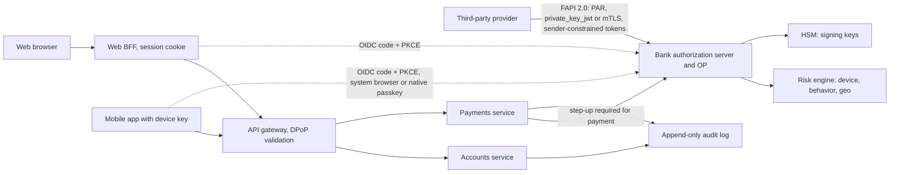
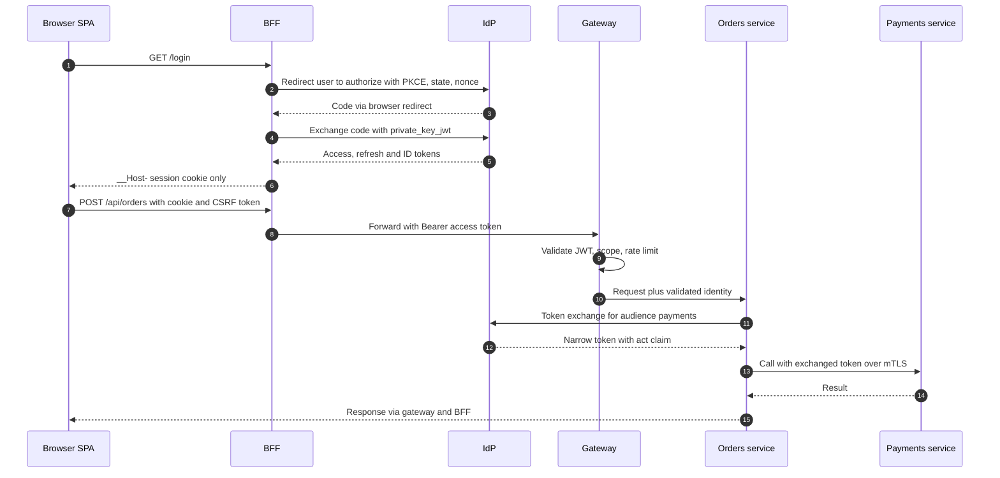
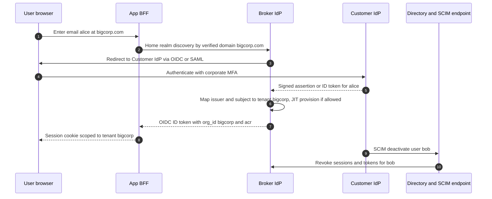
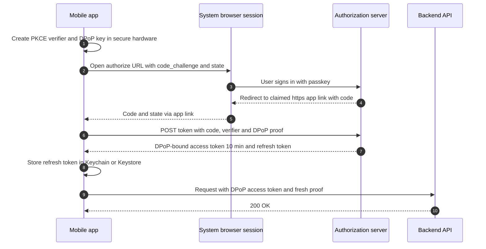
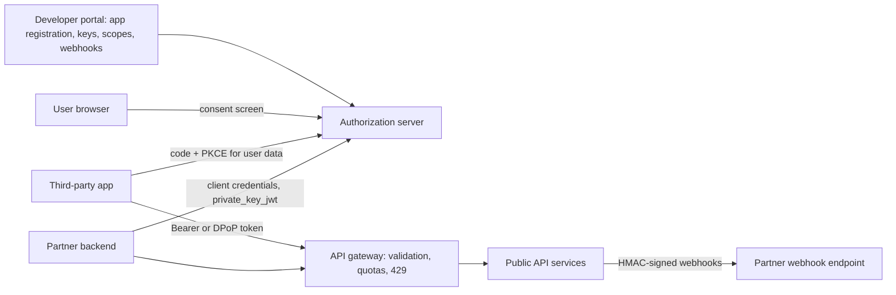
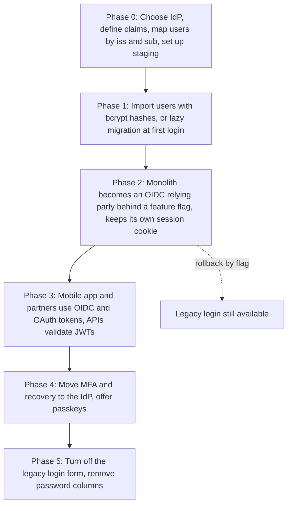

# 15 — Interview Questions and System Design Scenarios

This chapter collects the questions that come up in backend, security and system-design interviews about authentication and authorization, with short, correct answers. Part 1 has 84 questions grouped by topic, from basic to advanced, each group linked to the chapter that explains it in depth. Part 2 has six system-design scenarios with model answers: a banking app, a SPA with microservices, a multi-tenant B2B SaaS with enterprise SSO, a mobile app, a public developer API, and a migration from sessions to OpenID Connect.

> **Where this fits in the evolution**
>
> - **Before:** Chapters [00](00-foundations.md) to [14](14-production-architecture-and-checklist.md) follow authentication from plaintext password files to passkeys, zero trust and fine-grained authorization.
> - **What this chapter adds:** Retrieval practice. Each answer is the short version an interviewer expects; the linked chapter has the long version with diagrams, raw HTTP and code.
> - **What to watch next:** OAuth 2.1 is still an Internet-Draft (`draft-ietf-oauth-v2-1`, revision 16, September 2026); IETF WIMSE (workload identity) and transaction tokens are drafts; AuthZEN (final January 2026) is new. Interviewers like candidates who know what is final and what is not.

---

## Table of contents

**Part 1: Questions by topic**

1. [Foundations and evolution](#1-foundations-and-evolution)
2. [Passwords and credential storage](#2-passwords-and-credential-storage)
3. [HTTP Basic, Digest, API keys and HMAC](#3-http-basic-digest-api-keys-and-hmac)
4. [Sessions, cookies and CSRF](#4-sessions-cookies-and-csrf)
5. [Tokens and JWT](#5-tokens-and-jwt)
6. [OAuth 1.0a](#6-oauth-10a)
7. [OAuth 2.0, OAuth 2.1 and extensions](#7-oauth-20-oauth-21-and-extensions)
8. [OpenID Connect](#8-openid-connect)
9. [Enterprise SSO: LDAP, Kerberos, SAML, SCIM](#9-enterprise-sso-ldap-kerberos-saml-scim)
10. [MFA, passwordless and passkeys](#10-mfa-passwordless-and-passkeys)
11. [Service-to-service and zero trust](#11-service-to-service-and-zero-trust)
12. [Authorization](#12-authorization)
13. [Production operations](#13-production-operations)

**Part 2: System design scenarios**

14. [How to answer an authentication design question](#14-how-to-answer-an-authentication-design-question)
15. [Scenario 1: Authentication for a banking app](#15-scenario-1-authentication-for-a-banking-app)
16. [Scenario 2: A SPA with microservices](#16-scenario-2-a-spa-with-microservices)
17. [Scenario 3: Multi-tenant B2B SaaS with enterprise SSO](#17-scenario-3-multi-tenant-b2b-saas-with-enterprise-sso)
18. [Scenario 4: A mobile app](#18-scenario-4-a-mobile-app)
19. [Scenario 5: A public developer API](#19-scenario-5-a-public-developer-api)
20. [Scenario 6: Migrating from sessions to OIDC](#20-scenario-6-migrating-from-sessions-to-oidc)
21. [Common mistakes in interview answers](#21-common-mistakes-in-interview-answers)
22. [References](#references)

---

# Part 1: Questions by topic

## 1. Foundations and evolution

Chapters: [00 Foundations](00-foundations.md), [01 Evolution](01-evolution-of-authentication.md)

**Q1. What is the difference between identification, authentication, authorization and accounting?**
Identification is claiming an identity ("I am alice"). Authentication proves the claim (password, passkey, certificate). Authorization decides what the authenticated principal may do. Accounting (auditing) records what was done. Failures map to 401 (not authenticated) and 403 or 404 (not authorized).

**Q2. What are authentication factors, and what counts as MFA?**
Something you know (password, PIN), have (phone, security key, private key) or are (biometric). MFA needs factors from **different** categories. A password plus a security question is two knowledge factors, not MFA.

**Q3. Why is every credential sent over HTTP a "bearer" credential, and why does that matter?**
HTTP is stateless, so the client re-sends a credential (password, session ID, token) on every request, and whoever holds it is treated as the user. That is why we need TLS, `HttpOnly` cookies, short token lifetimes and, for high-risk cases, sender-constrained tokens (DPoP, mTLS) that require a private key as well.

**Q4. What does TLS protect, and what does it not?**
It protects confidentiality and integrity in transit and authenticates the server (and the client with mTLS). It does not authenticate the user, does not stop phishing on look-alike domains, and does not protect against XSS, compromised servers or leaked logs.

**Q5. What does "phishing-resistant" mean?**
The authenticator cryptographically binds its response to the real site or channel, so a look-alike site or a relay proxy cannot obtain a usable credential. WebAuthn/passkeys (origin-bound signatures) and PKI client certificates qualify; passwords, OTPs and push approvals do not.

**Q6. Summarize the evolution of authentication in one minute.**
Plaintext password files (1960s) led to hashed and salted passwords (Unix `crypt`, 1979), then memory-hard hashes (Argon2, 2015). Networks brought Kerberos and LDAP. The web added Basic auth, cookies and server-side sessions, then SAML for enterprise SSO (2005). Delegation came with OAuth 1.0a (2009) and OAuth 2.0 (2012), login with OpenID Connect (2014) and JWT (2015). Attacks then drove hardening: PKCE, the Security BCP (RFC 9700, 2025), DPoP, and browser apps moving to the BFF pattern (RFC 10017, 2026). Passwords are being replaced by passkeys (WebAuthn Level 3 became a W3C Recommendation in 2026), and services moved from shared secrets to workload identity and zero trust.

---

## 2. Passwords and credential storage

Chapter: [02 Passwords and credential storage](02-passwords-and-credential-storage.md)

**Q7. Why hash passwords instead of encrypting them?**
Encryption is reversible: whoever gets the key gets every password. A one-way, slow hash lets you verify a login without ever being able to recover the password, so a database leak does not directly reveal passwords.

**Q8. Why not SHA-256, even with a salt?**
SHA-256 is designed to be fast; GPUs compute billions per second, so leaked hashes of human-chosen passwords are cracked quickly. Password hashing needs a deliberately slow, salted, preferably memory-hard function: Argon2id (OWASP minimum m=19 MiB, t=2, p=1), bcrypt (cost at least 10) for legacy systems, PBKDF2 only where FIPS validation is required.

**Q9. What is the difference between a salt and a pepper?**
A salt is random per password, stored next to the hash, and defeats precomputed tables and identical-hash detection. A pepper is a secret shared by all hashes, kept outside the database (KMS or HSM), so a database-only leak cannot be cracked at all. The salt is mandatory; the pepper is defense in depth.

**Q10. What does NIST SP 800-63B-4 (2025) say about password rules?**
At least 15 characters when the password is the only factor, at least 8 when it is only used within MFA; accept at least 64 characters; no composition rules; no periodic forced changes, only on evidence of compromise; check against breached and common passwords; allow paste and password managers; limit consecutive failed attempts to at most 100.

**Q11. How do you migrate from MD5 or SHA-1 password hashes without forcing resets?**
Wrap the old hashes immediately (Argon2id over the old hash), so the database is protected today. Then, at each successful login, re-hash the plaintext with the current algorithm. In Spring, `DelegatingPasswordEncoder` stores an `{id}` prefix per hash and `upgradeEncoding` plus `UserDetailsPasswordService` re-hash on login.

**Q12. What is a known limitation of bcrypt?**
It only uses the first 72 bytes of input, so long passphrases are silently truncated in many implementations (some libraries now reject longer input). It is also not memory-hard. Argon2id avoids both.

**Q13. Compare brute force, password spraying and credential stuffing.**
Brute force tries many passwords against one account (stopped by per-account throttling). Spraying tries a few common passwords against many accounts (stopped by banning common passwords and per-IP or global detection). Stuffing replays leaked username/password pairs from other sites (stopped by breached-password checks, MFA, device recognition and bot detection).

**Q14. How do you design a secure password reset?**
Enumeration-safe response; a 256-bit single-use token stored as a SHA-256 hash, valid 15-60 minutes, one active per user, bound to user and purpose; base URL from configuration (not the `Host` header); after reset, revoke all sessions and refresh tokens and notify the user; rate-limit requests.

---

## 3. HTTP Basic, Digest, API keys and HMAC

Chapter: [03 HTTP Basic, Digest and API keys](03-http-basic-digest-and-api-keys.md)

**Q15. When is HTTP Basic acceptable?**
Only over TLS, and mainly for machine clients with high-entropy, rotatable secrets (internal tools, simple service endpoints). For browsers it has no logout, no MFA, no CSRF story and sends the password on every request.

**Q16. Why did HTTP Digest disappear?**
It was designed to avoid sending passwords in cleartext before TLS was universal, but it relied on MD5, required servers to store password-equivalent values (so no slow hashing), and offered no protection TLS does not give better. TLS plus modern login replaced it.

**Q17. How should a service issue and store API keys?**
Generate 256-bit random keys with a recognizable prefix (for secret scanning), show them once, store only a hash (SHA-256 is fine for high-entropy keys), attach scopes, owner and expiry (90 days to 1 year), support multiple active keys for rotation, and revoke instantly. API keys identify a client; they are not user authentication.

**Q18. How do you verify an HMAC-signed webhook safely?**
Compute HMAC-SHA-256 over the exact raw body plus a timestamp with the per-endpoint secret, compare in constant time, reject timestamps older than about 5 minutes, and store recently seen delivery IDs to reject replays. Support two secrets during rotation. See [../examples/05-api-keys-hmac/](../examples/05-api-keys-hmac/).

---

## 4. Sessions, cookies and CSRF

Chapter: [04 Sessions, cookies and CSRF](04-sessions-cookies-and-csrf.md)

**Q19. How does server-side session authentication work?**
After login the server creates a session record (user ID, auth time, factors) and sends a random, opaque session ID in a cookie. Each request carries the cookie; the server looks up the session. Logout and revocation are instant because the state is on the server.

**Q20. What cookie attributes should a session cookie have?**
`Secure`, `HttpOnly`, `SameSite=Lax` (or `Strict`), `Path=/`, no `Domain`, and the `__Host-` name prefix, which forces `Secure`, `Path=/` and no `Domain` so subdomains cannot overwrite it.

**Q21. What is session fixation?**
The attacker plants a known session ID in the victim's browser before login; if the server keeps that ID after authentication, the attacker shares the logged-in session. Fix: issue a new session ID at login and privilege changes (Spring does this by default), accept IDs only from cookies.

**Q22. What is CSRF, and why does it exist?**
Browsers automatically attach cookies to requests, including requests triggered by another site. A malicious page can submit a form to your app and the victim's session cookie authenticates it. Defenses: synchronizer or masked CSRF tokens on every state-changing request, `SameSite` cookies, and checking `Origin`/`Sec-Fetch-Site`.

**Q23. Is `SameSite=Lax` enough to stop CSRF?**
Not on its own. It still sends cookies on top-level cross-site GET navigations (so state-changing GETs are exposed), it treats sibling subdomains as same-site (a compromised `blog.example.com` can attack `app.example.com`), and older browsers differ. Use CSRF tokens for cookie-authenticated state changes and never change state on GET.

**Q24. Does an API that uses `Authorization: Bearer` headers need CSRF protection?**
No, because browsers do not attach that header automatically; the attacker's page cannot add it. CSRF protection is needed whenever authentication is carried by cookies, including BFF session cookies.

**Q25. When would you choose sessions over JWTs?**
For first-party browser apps: instant revocation, nothing readable by JavaScript, small cookies and fresh authorization data. Tokens fit third-party, mobile and multi-service API access, and browsers should still sit behind a BFF with a session cookie.

---

## 5. Tokens and JWT

Chapter: [06 Tokens and JWT](06-tokens-and-jwt.md)

**Q26. What is a JWT, and is its content secret?**
A JSON Web Token is `base64url(header).base64url(payload).signature` (JWS). The payload is only encoded, not encrypted: anyone holding the token can read it. Use JWE or opaque tokens if claims must stay confidential, and keep payloads minimal.

**Q27. What must a resource server validate in a JWT access token?**
The signature with a key from the trusted issuer's JWKS (selected by `kid`), an allowlisted algorithm (never `none`), `iss` exact match, `aud` contains this API, `exp` and `nbf` with at most 60 seconds of skew, and `typ` (`at+jwt` per RFC 9068). Then scopes and object-level permissions.

**Q28. Explain the `alg: none` and algorithm-confusion attacks.**
With `none`, a library that trusts the header skips verification. With confusion, a verifier configured with an RSA public key accepts an HS256 token that the attacker signed with the public key bytes as the HMAC secret. Fix: choose the algorithm from configuration, bind each key to one algorithm, never trust the header's choice of key or algorithm.

**Q29. HS256 or RS256/ES256?**
HS256 uses one shared secret, so every verifier can also mint tokens. Use asymmetric algorithms (ES256, RS256, EdDSA) whenever more than one service verifies, so verifiers hold only public keys. HS256 is acceptable only when the issuer is the sole verifier, with a 256-bit random key.

**Q30. What are `kid` and JWKS, and how do they enable rotation?**
The issuer publishes public keys at a JWKS URL; each token's header names the key with `kid`. Verifiers cache the JWKS and refetch (rate-limited) on an unknown `kid`. To rotate, pre-publish the new key, switch signing, and remove the old key after all tokens it signed have expired.

**Q31. Opaque tokens or JWTs?**
Opaque tokens are random references; the resource server calls introspection (RFC 7662), so revocation is immediate and contents stay private, at the cost of a network call (usually cached briefly). JWTs are verified locally, scale well, but are hard to revoke before `exp`. Many systems use JWT access tokens plus opaque refresh tokens.

**Q32. How do you revoke a JWT before it expires?**
Keep access tokens short (5-15 minutes) so revocation is mostly about refresh tokens. For immediate effect, add a `jti` denylist or a per-user "tokens valid after" timestamp checked by resource servers, or use introspection for high-risk APIs.

**Q33. Explain refresh-token rotation with reuse detection.**
Each refresh returns a new refresh token and invalidates the old one; all tokens from one login form a family. If an already-used token is presented again, either the client or an attacker holds a stolen copy, so the server revokes the whole family and forces re-login. Store refresh tokens as hashes and bind them to the client.

**Q34. Where should a browser app keep tokens?**
Ideally nowhere: use a BFF that keeps tokens server-side and gives the browser an `HttpOnly`, `Secure`, `SameSite` session cookie (RFC 10017). Not `localStorage` or `sessionStorage`, where any XSS can read them.

**Q35. ID token vs access token?**
The ID token (OIDC) is for the client: it proves who logged in, when and how, with `aud` = the client ID. The access token is for the API: it authorizes calls, with `aud` = the API. Never send ID tokens to APIs as access tokens, and never use access tokens as proof of login.

---

## 6. OAuth 1.0a

Chapter: [07 OAuth 1.0a](07-oauth-1.md)

**Q36. What problem did OAuth originally solve?**
The password anti-pattern: third-party apps asked users for their passwords to other services, gaining full, unrevocable access. OAuth lets users approve a specific app at the provider, and the app receives a limited, revocable token instead.

**Q37. Why did OAuth 2.0 drop OAuth 1.0a's request signatures, and how did proof-of-possession come back?**
Signature base-string canonicalization caused constant interoperability bugs, and TLS had become universal, so OAuth 2.0 used bearer tokens over TLS. Bearer tokens can be replayed if stolen, so sender-constraining returned later: mTLS-bound tokens (RFC 8705), DPoP (RFC 9449) and HTTP Message Signatures (RFC 9421).

---

## 7. OAuth 2.0, OAuth 2.1 and extensions

Chapters: [08 OAuth 2.0](08-oauth-2.md), [09 Modern OAuth](09-modern-oauth-2.1-and-extensions.md)

**Q38. Name the OAuth 2.0 roles.**
Resource owner (the user), client (the app), authorization server (issues tokens), resource server (the API). OAuth delegates the user's access to the client; it does not tell the client who the user is.

**Q39. Walk through the authorization code flow with PKCE.**
The client creates a random `code_verifier` and sends `code_challenge = BASE64URL(SHA-256(verifier))`, `state`, exact `redirect_uri` and scopes to `/authorize`. The user authenticates and consents. The AS redirects back with `code` and `state`. The client checks `state`, then POSTs the code, verifier and client authentication to `/token`, and receives an access token (and optionally a refresh token and, with OIDC, an ID token).

**Q40. What does PKCE protect against, and why use it for confidential clients too?**
It stops a stolen or intercepted authorization code from being redeemed, because only the original client knows the verifier. Confidential clients need it too because client authentication does not stop **code injection** (a stolen code replayed through the attacker's own session at the legitimate client). RFC 9700 makes PKCE a MUST for public clients and RECOMMENDED for confidential ones; the OAuth 2.1 draft requires it by default. Always use S256.

**Q41. Why are the implicit and password grants deprecated?**
Implicit returns tokens in the URL fragment, where they leak through history, `Referer` and scripts, with no way to sender-constrain them. The password grant exposes the user's password to the client, trains users to type passwords into third-party apps, and cannot support MFA or federation. RFC 9700 deprecates both; OAuth 2.1 removes them.

**Q42. What is the `state` parameter for?**
It binds the authorization response to the browser session that started the flow, preventing CSRF on the redirect endpoint (an attacker injecting their own code to log the victim into the attacker's account). PKCE also provides this protection, but `state` remains useful for carrying return-URL references.

**Q43. Why must redirect URIs match exactly?**
Pattern or prefix matching has repeatedly allowed attackers to register or find a URL under the allowed pattern (or an open redirector) and receive codes or tokens. RFC 9700 requires exact string matching (with a port exception for native-app loopback redirects).

**Q44. How does the client credentials grant work, and how should clients authenticate?**
A service exchanges its own credentials for a token for itself, without a user. Prefer `private_key_jwt` (RFC 7523) or mTLS (RFC 8705) over shared client secrets, request a specific audience, and cache the token until shortly before expiry.

**Q45. What is the device authorization grant?**
For input-constrained devices (TVs, CLIs): the device gets a `device_code` and a short `user_code`, shows a URL and code, and polls the token endpoint while the user approves on a phone or laptop. Defined in RFC 8628; watch for phishing that tricks users into approving an attacker's code.

**Q46. What is OAuth 2.1, and is it final?**
A consolidation of OAuth 2.0 plus its security fixes: PKCE required for authorization code, implicit and password grants removed, exact redirect matching, no bearer tokens in query strings, refresh tokens sender-constrained or rotated for public clients. As of October 2026 it is still an Internet-Draft (revision 16), not an RFC.

**Q47. DPoP or mTLS for sender-constrained tokens?**
Both bind the token to a key the client must prove it holds. mTLS (RFC 8705) uses the TLS client certificate and fits server-to-server and FAPI deployments with controlled infrastructure. DPoP (RFC 9449) uses a signed JWT proof per request at the application layer, so it works for public clients (mobile, SPAs) and through TLS-terminating proxies.

**Q48. What are PAR, RAR and token exchange?**
PAR (RFC 9126): the client POSTs the authorization request to the AS first and sends only a reference through the browser, protecting integrity and confidentiality. RAR (RFC 9396): structured `authorization_details` for fine-grained, transaction-level consent. Token exchange (RFC 8693): trade one token for another (different audience, narrower scope, delegation with `act`), used to propagate user context between services.

**Q49. What is a mix-up attack and how is it prevented?**
A client that talks to several authorization servers is tricked into sending a code from an honest AS to an attacker-controlled AS. Defenses: the `iss` parameter in authorization responses (RFC 9207), checked against the expected issuer, or distinct redirect URIs per AS.

---

## 8. OpenID Connect

Chapter: [10 OpenID Connect](10-openid-connect.md)

**Q50. Why not use plain OAuth for login?**
An access token is meant for an API, not for the client; it may be opaque, may not identify the user, and a token issued to another client could be replayed to log in ("confused deputy" login). OIDC adds a signed ID token with `aud` = your client ID, `nonce`, `auth_time` and `acr`/`amr`, so the client can verify who logged in, for this client, in this flow.

**Q51. How do you validate an ID token?**
Signature with the OP's JWKS and allowlisted algorithm; `iss` equals the discovered issuer; `aud` contains your client ID (and `azp` if multiple audiences); `exp`, `iat` within skew; `nonce` equals the one you sent; `auth_time`/`acr` if you requested `max_age` or a specific level. Then map the user by (`iss`, `sub`).

**Q52. `nonce` vs `state`?**
`state` protects the redirect from CSRF and is checked by the client when the browser returns. `nonce` is placed inside the signed ID token and binds the token to the client's session, preventing ID token replay and injection.

**Q53. What do discovery and JWKS give you?**
`/.well-known/openid-configuration` lists the issuer, endpoints, supported algorithms and `jwks_uri`. Clients configure only the issuer URL and pick up endpoint and key changes (including rotation) automatically.

**Q54. How does logout work in OIDC?**
RP-Initiated Logout redirects the user to the OP's `end_session_endpoint` with `id_token_hint` and a registered `post_logout_redirect_uri`. Back-Channel Logout has the OP POST a signed logout token to each RP; Front-Channel Logout uses iframes and is unreliable now that browsers block third-party cookies. Combine RP-initiated with back-channel logout, and revoke refresh tokens.

**Q55. Why is linking accounts by email dangerous?**
Some providers allow unverified or changeable emails, and an attacker can register a victim's address at a provider that does not verify it, then log in to the victim's account. Key accounts by (`iss`, `sub`); link by email only when `email_verified` is true from a provider authoritative for that domain, and preferably after the user proves control of the existing account.

---

## 9. Enterprise SSO: LDAP, Kerberos, SAML, SCIM

Chapter: [05 Enterprise SSO](05-enterprise-sso-ldap-kerberos-saml.md)

**Q56. How does LDAP authentication work, and what is LDAP injection?**
The app binds with a service account, searches for the user's DN with an escaped filter, then binds as that DN with the user's password (over LDAPS or StartTLS, rejecting empty passwords). Injection happens when user input is concatenated into a filter (`*)(uid=*`); escape values per RFC 4515.

**Q57. Explain Kerberos at a high level.**
The client proves knowledge of its password-derived key to the Authentication Service and gets a ticket-granting ticket. It presents the TGT to the Ticket-Granting Service to obtain a service ticket encrypted with the service's key, then sends that ticket plus a fresh authenticator to the service, which validates it with its keytab. The password never crosses the network.

**Q58. What are Kerberoasting and golden tickets?**
Kerberoasting: any domain user can request service tickets for accounts with SPNs and crack the service account's password offline; defend with managed service accounts or long random passwords and AES-only encryption. A golden ticket is a TGT forged with the stolen `krbtgt` key; recovery requires resetting `krbtgt` twice.

**Q59. Describe SAML Web Browser SSO and the main thing an SP must validate.**
The SP redirects the user with an AuthnRequest; the IdP authenticates and POSTs a signed Response with an assertion to the SP's ACS URL. The SP must validate the XML signature on the element it actually uses, plus issuer, audience, destination, `InResponseTo`, time conditions and replay, with DTDs disabled.

**Q60. What is XML Signature Wrapping?**
The attacker moves the validly signed element elsewhere in the document and inserts a forged, unsigned assertion where the application reads data. The signature check passes but the app consumes forged claims. Use mature libraries that return only the verified element, and reject multiple assertions.

**Q61. Why is SAML still everywhere if OIDC is better?**
Every enterprise IdP supports it, thousands of integrations depend on it, and procurement checklists require it. New B2B SaaS products usually support both OIDC and SAML per tenant, often through a broker IdP.

**Q62. What does SCIM add to SSO?**
SSO handles login, not account lifecycle. SCIM (RFC 7643/7644) lets the customer's IdP create, update and, most importantly, deactivate users and groups in your app, so leavers lose access (sessions, tokens, API keys) within minutes.

---

## 10. MFA, passwordless and passkeys

Chapter: [11 MFA, passwordless and passkeys](11-mfa-passwordless-and-passkeys.md)

**Q63. How does TOTP work?**
The server and authenticator share a secret. Every 30 seconds both compute HMAC (SHA-1 by default) over the time-step counter and truncate it to 6 digits (RFC 6238, built on HOTP, RFC 4226). The server accepts a small window (±1 step), rate-limits attempts and rejects reuse of an already-accepted code. See [../examples/04-mfa-totp/](../examples/04-mfa-totp/).

**Q64. Why is SMS OTP discouraged?**
SIM swaps, number porting, SS7 and VoIP interception, malware reading messages, and real-time phishing relays. NIST SP 800-63B-4 classifies PSTN-based authenticators as "restricted". It also costs money and invites SMS-pumping fraud. Offer passkeys or TOTP; keep SMS only as a last-resort fallback, if at all.

**Q65. Why are passkeys phishing-resistant?**
A passkey is a WebAuthn key pair scoped to the relying party ID (the domain). The browser includes the real origin in the signed data and only offers credentials for the matching RP ID, so a look-alike site cannot obtain a valid assertion. There is no shared secret on the server to steal.

**Q66. Synced vs device-bound passkeys?**
Synced passkeys are backed up and synchronized by a platform (iCloud Keychain, Google Password Manager), surviving device loss; NIST SP 800-63B-4 accepts them at AAL2. Device-bound passkeys (security keys, some enterprise authenticators) keep non-exportable keys in hardware and are needed for AAL3.

**Q67. What is MFA fatigue and how do you prevent it?**
Attackers with a stolen password send repeated push prompts until the user approves one. Prevent it with number matching (the user types the number shown on the login screen), prompt rate limits, location and app context in the prompt, a "report fraud" button, and moving to passkeys.

**Q68. Why is account recovery the weakest link, and how do you harden it?**
Attackers skip MFA by attacking "forgot password", email accounts or the support desk. Harden it: prefer recovery codes or a second passkey over email/SMS, notify on every recovery, revoke sessions, add waiting periods for MFA resets on high-value accounts, and give support staff strict verification procedures.

---

## 11. Service-to-service and zero trust

Chapter: [12 Service-to-service and zero trust](12-service-to-service-and-zero-trust.md)

**Q69. Why avoid long-lived shared secrets between services?**
They leak through repositories, images, logs and CI, are rarely rotated, and are not tied to where code runs. Replace them with short-lived, automatically issued credentials: workload identity federation, SPIFFE or mesh certificates, and OAuth client credentials with `private_key_jwt` or mTLS.

**Q70. mTLS or OAuth client credentials?**
mTLS authenticates the workload at the connection level (great with a mesh that issues certificates automatically). Client-credentials tokens carry audience, scopes and claims that APIs can authorize on, and work through proxies. Many platforms use both: mTLS for transport identity and tokens for application-level authorization.

**Q71. How does workload identity federation work, for example GitHub Actions deploying to AWS?**
The CI job requests an OIDC token from the platform's issuer; the cloud's STS verifies it against a trust policy (issuer, audience, and a `sub` condition naming the repository and branch) and returns temporary credentials (about an hour). No stored secret exists. Forgetting the `sub` condition lets any repository assume the role.

**Q72. How should user identity flow through a chain of microservices?**
Avoid forwarding one broad token everywhere. Either mint short-lived internal tokens at the gateway or use token exchange (RFC 8693) per hop, narrowing audience and scopes and recording the caller in `act`. Each service authorizes both the calling workload and the end user, which also prevents confused-deputy problems.

**Q73. What is zero trust (NIST SP 800-207)?**
No implicit trust from network location: every request to every resource is authenticated, authorized per session by dynamic policy (identity, device or workload posture, context) and encrypted. Internal traffic is treated like internet traffic.

---

## 12. Authorization

Chapter: [13 Authorization](13-authorization-rbac-abac-rebac.md)

**Q74. Compare RBAC, ABAC and ReBAC.**
RBAC: permissions grouped into roles; simple and auditable, but roles explode with context. ABAC: policies over subject, resource, action and environment attributes; flexible, but harder to audit and dependent on trustworthy attributes. ReBAC: permissions derived from a relationship graph (Zanzibar, OpenFGA, SpiceDB); ideal for sharing and hierarchies, at the cost of operating a relationship store. Real systems combine them.

**Q75. What is BOLA (IDOR), and how do you prevent it?**
OWASP API1:2023: the API loads whatever object ID the caller supplies without checking ownership or tenant. Authorize every object access server-side, preferably by scoping the query (`findByIdAndTenantId`), return 404 for foreign objects, and add negative tests. Random UUIDs alone do not fix it.

**Q76. BFLA vs BOLA, and what is mass assignment?**
BFLA (API5:2023) is calling an operation you may not use at all (admin endpoints); BOLA is accessing a specific object you may not touch. Mass assignment (part of API3:2023) is binding client JSON onto internal objects so clients can set `role` or `tenantId`; prevent it with request DTOs containing only allowed fields.

**Q77. Are OAuth scopes permissions?**
No. Scopes cap what a client may do on the user's behalf. Effective access is the intersection of the client's scopes, the user's own permissions and resource policy. A token with `orders:read` may only read orders that user can see.

**Q78. What is Google Zanzibar, and what is the "new enemy" problem?**
Google's global authorization system (USENIX ATC 2019): relation tuples (`object#relation@user`), namespace rules that derive permissions, and Check, Read, Write, Expand and Watch APIs. The new enemy problem is evaluating a check against stale data after a permission change, for example showing new content to someone just removed; Zanzibar's zookies (consistency tokens) prevent it.

**Q79. How do you enforce tenant isolation in a pooled multi-tenant database?**
Tenant from the validated token, never from a client header; set once per request; every query filtered by `tenant_id`; PostgreSQL row-level security as a backstop (set per transaction, app role without `BYPASSRLS`); tenant-prefixed caches, storage and search; tenant carried in messages; cross-tenant negative tests in CI.

---

## 13. Production operations

Chapter: [14 Production architecture and checklist](14-production-architecture-and-checklist.md)

**Q80. Build or buy the identity provider?**
Usually buy or run an established IdP (Keycloak, Auth0/Okta, Entra ID, Cognito, Zitadel, Ory), because MFA, recovery, rotation, federation, logout and certification are a large attack surface. Depend only on standard OIDC and key your users by (`iss`, `sub`) so you can switch. Build on a framework (Spring Authorization Server) only when identity is your product.

**Q81. Which token and session lifetimes would you choose?**
Access tokens 5-15 minutes; refresh tokens rotated on every use (web: idle 1-7 days, absolute 7-30 days); business web sessions idle 15-30 minutes, absolute 8-12 hours; authorization codes under a minute; reset tokens 15-60 minutes; clock skew at most 60 seconds; signing keys rotated every 90 days to a year.

**Q82. How do you implement "log out everywhere"?**
Delete all server-side sessions for the user (indexed by principal), revoke all refresh-token families, set a "tokens valid after" timestamp that resource servers check (or accept one access-token lifetime of delay), notify relying parties with back-channel logout or CAEP events, and email the user. Trigger it on password change, MFA reset and recovery.

**Q83. What must never appear in logs, and what should?**
Never: passwords, hashes, tokens, session IDs, authorization codes, API keys, secrets, OTP or recovery codes, reset links, `Authorization` or `Cookie` headers. Always: authentication successes and failures, MFA and credential changes, token issuance and refresh-token reuse, authorization denials and privileged actions, with user, tenant, client, IP, request ID and `jti`.

**Q84. A token signing key leaked. What do you do?**
Create a new non-exportable key and sign with it, remove the compromised `kid` from the JWKS immediately (accepting forced re-authentication), flush verifier JWKS caches, revoke sessions and refresh tokens obtained during the exposure window, hunt for forged tokens (unknown `jti`), fix the root cause and notify as required.

---

# Part 2: System design scenarios

## 14. How to answer an authentication design question

Interviewers look for structure and trade-offs more than product names. A reliable outline:

1. **Clarify actors and assets.** Who logs in (consumers, employees, partners, services, devices)? What is at risk (money, health data, admin power)? Which regulations apply?
2. **Pick assurance levels.** Which actions need MFA, phishing-resistant MFA, or step-up?
3. **Choose the identity provider** and the protocols per client type ([chapter 14, section 2](14-production-architecture-and-checklist.md#2-decision-guide-which-authentication-for-which-system)).
4. **Describe the flows** with the important parameters (PKCE, `state`, `nonce`, exact redirects).
5. **Tokens and sessions:** formats, lifetimes, storage, rotation, revocation.
6. **Authorization:** roles, scopes, object-level checks, tenancy.
7. **Lifecycle:** sign-up, recovery, deprovisioning, deletion.
8. **Operations:** keys, logging, monitoring, rate limiting, incident response.
9. **Threats and trade-offs:** name the top attacks and how the design stops them; say what you would do differently at 10× scale or a higher risk level.

---

## 15. Scenario 1: Authentication for a banking app

**Prompt:** "Design authentication for a retail bank with a web app and mobile apps. Customers view accounts and make payments. Licensed third parties access accounts through an open-banking API."

### Requirements and assumptions

- High-value assets: money movement, personal financial data. Regulations: in the EU, PSD2 strong customer authentication, which requires two independent factors and, for payments, **dynamic linking** of the authentication to the amount and payee. Similar rules exist elsewhere.
- Target assurance: phishing-resistant MFA for login (NIST AAL2 at least, AAL3-like controls for high-risk operations).
- Channels: web, iOS, Android, third-party providers (open banking), call center.

### Architecture

### Authentication

- **Login:** passkeys as the primary method (web and mobile). For customers without passkeys: password plus a bank-app approval with number matching, or TOTP. No SMS for login if avoidable; if regulators or customers force it, only as a fallback with strict limits.
- **Mobile device binding:** at enrollment, the app generates a non-exportable key in the Secure Enclave or Android StrongBox/TEE, registers its public key after strong verification, and uses it for DPoP proofs and transaction signing. App integrity is checked with App Attest or the Play Integrity API as a risk signal.
- **Step-up for payments:** the payments API answers `insufficient_user_authentication` (RFC 9470) when the token's `acr` or `auth_time` is insufficient; the client re-authenticates. For SCA dynamic linking, the user approves a confirmation that shows amount and payee, and the signed approval covers those values (a WebAuthn assertion or device-key signature over a challenge derived from the transaction).
- **Open banking:** third parties use **FAPI 2.0** (PAR, PKCE, `private_key_jwt` or mTLS client authentication, sender-constrained tokens) and RAR (`authorization_details`) for payment consent; customers authenticate at the bank, never at the third party.
- **Call center:** never ask for passwords or OTPs; verify through an in-app push with number matching or a decoupled flow (CIBA).

### Tokens and sessions

| Item | Choice |
|---|---|
| Web | BFF with server-side session; idle 2-5 minutes (OWASP high-value guidance), absolute a few hours; re-authentication for payments and profile changes |
| Access tokens | 5 minutes, audience per API, DPoP-bound (mobile) or held by the BFF (web) |
| Refresh tokens (mobile) | Rotated, DPoP-bound to the device key, absolute lifetime limited (for example 30-90 days) with re-authentication on risk |
| Signing keys | HSM, non-exportable, scheduled rotation |

### Authorization

Account ownership and mandates (joint accounts, business signatories with limits, separation of duty for business payments). Payments checked against limits, payee lists and risk score in a policy engine. Every object access scoped to the customer.

### Threats and mitigations

| Threat | Mitigation |
|---|---|
| Phishing and real-time relay proxies | Passkeys; origin-bound credentials; no OTPs typed into web pages for high-risk actions |
| Malware on the phone, stolen session tokens | Device-bound keys, DPoP, app attestation as a signal, short tokens, step-up per payment |
| Account takeover through recovery | In-branch or document-verified recovery for full resets, waiting periods, notifications, new-device cooling-off limits on payments |
| Social engineering ("bank" calls the customer) | Payment confirmations show payee and amount; warnings on new payees; delayed first payments to new payees |
| Insider abuse | Least privilege, just-in-time access, four-eyes for sensitive operations, immutable audit |

**What interviewers look for:** passkeys and device binding, step-up and transaction signing (dynamic linking), FAPI for third parties, short sender-constrained tokens, and fraud and recovery thinking, not just "use JWT".

---

## 16. Scenario 2: A SPA with microservices

**Prompt:** "We have a React SPA and 20 Spring Boot microservices behind a gateway. Design authentication and authorization."

### Architecture

### Design points

- **BFF** (RFC 10017): the SPA never holds tokens. The BFF is a confidential OIDC client, stores tokens in Redis-backed sessions, refreshes them, and protects its API with CSRF tokens and `SameSite` cookies. Strict CSP limits XSS.
- **Gateway:** validates JWTs (signature, `iss`, `aud`, `exp`, `typ`), enforces coarse scopes per route, rate limits, strips any client-supplied identity headers.
- **Services:** re-validate tokens (defense in depth), enforce function- and object-level authorization with Spring method security, tenant-scoped queries.
- **Service-to-service:** mesh mTLS for transport identity; **token exchange** (or gateway-minted internal tokens) to carry the user with a narrow audience per downstream service, never one broad token replayable everywhere.
- **Lifetimes:** access tokens 5-15 minutes; refresh tokens rotated with reuse detection; BFF session idle 30 minutes, absolute 8-12 hours.
- **Keys:** IdP signs with KMS-held keys; services cache JWKS and refetch on unknown `kid`.
- **Logout:** BFF invalidates the session, revokes the refresh token, redirects to the IdP `end_session_endpoint`; back-channel logout for other apps.
- **Observability:** request IDs across services, audit events for denials and privileged actions, alerts on refresh-token reuse.

**Trade-off to mention:** forwarding the user's token to every service is simpler but widens blast radius; token exchange adds a call per hop (cache exchanged tokens per audience for their lifetime).

---

## 17. Scenario 3: Multi-tenant B2B SaaS with enterprise SSO

**Prompt:** "Design authentication for a B2B SaaS product. Small customers use email and password; enterprise customers require SSO with their own IdP (Okta, Entra ID, ADFS via SAML) and automatic deprovisioning."

### Architecture

### Design points

- **Broker IdP** (Keycloak, Auth0 Organizations, Zitadel, Entra External ID or similar) normalizes customer IdPs (OIDC and SAML) into one OIDC interface for your apps.
- **Home realm discovery** by email domain, but **only for domains the tenant has verified** (DNS TXT record). Otherwise tenant A could configure an IdP that asserts users with tenant B's domain.
- **Identity mapping:** users keyed by (customer IdP issuer, subject) within a tenant; never merge accounts across tenants by email.
- **Provisioning:** SCIM 2.0 endpoint for create/update/deactivate and groups; JIT provisioning as a convenience; deactivation revokes sessions, refresh tokens and API keys within minutes.
- **Tokens:** `org_id` (tenant) in tokens; users in several tenants switch organization and get a new token. Access tokens 5-15 minutes.
- **MFA policy:** enterprises enforce MFA at their IdP; you check `acr`/`amr` (or SAML `AuthnContext`) and can require step-up for admin actions. Password customers get passkeys or TOTP.
- **Authorization:** tenant isolation (tenant from token, scoped queries, row-level security), per-tenant roles (owner, admin, member), groups mapped from the customer's IdP, ReBAC if resources are shared within the tenant.
- **Tenant admin features:** SSO configuration self-service with test mode, "enforce SSO" switch (disables passwords for the domain), audit log export, session lifetime policy.
- **Support access:** separate admin plane, customer-approved, time-limited, audited impersonation (`act` claim).

**Threats:** unverified domain claims, SAML signature wrapping (use a maintained library), stale accounts after leavers (SCIM), cross-tenant BOLA (scoped queries and tests), a tenant's misconfigured IdP (per-tenant certificate pinning from metadata, monitoring).

---

## 18. Scenario 4: A mobile app

**Prompt:** "Design authentication for a consumer iOS and Android app with a backend API."

### Architecture

### Design points

- **Login in the system browser** (`ASWebAuthenticationSession`, Android Custom Tabs) per RFC 8252, never an embedded web view (the app could read the password, and SSO cookies are not shared). Native passkey APIs are also fine when the app uses the same relying party domain (associated domains / Digital Asset Links).
- **Public client with PKCE**: no client secret in the app (it can be extracted).
- **Redirect URI:** claimed HTTPS links (Universal Links, Android App Links) preferred over custom URL schemes, which other apps can register.
- **Token storage:** refresh token in the iOS Keychain or Android Keystore-backed encrypted storage; access token in memory.
- **Sender-constraining:** DPoP with a key in the Secure Enclave or StrongBox so stolen tokens cannot be used elsewhere.
- **Lifetimes:** access tokens about 10 minutes; refresh tokens rotated with reuse detection, idle 7-30 days, absolute up to about 90 days for low-risk consumer apps, shorter for sensitive apps.
- **Biometric unlock:** Face ID or fingerprint can gate local access to the refresh token (a local user-presence check), but it is not server-side authentication on its own; combine it with the device-bound key.
- **App integrity:** App Attest and Play Integrity as risk signals, not as authentication.
- **Logout and device management:** revoke the refresh token (RFC 7009), delete local tokens, show "your devices" so users can revoke lost phones.
- **Push notifications** for login approvals only with number matching and rate limits.

**Threats:** code interception (PKCE), malicious apps claiming the redirect (claimed HTTPS links), token theft from a rooted device (hardware keys, DPoP, short lifetimes), reverse-engineered secrets (none in the app), phishing (passkeys).

---

## 19. Scenario 5: A public developer API

**Prompt:** "Design authentication for a public API that third-party developers use, some acting for our users, some server-to-server."

### Architecture

### Design points

- **Client registration** in a developer portal: client ID, redirect URIs (exact match), allowed grant types, requested scopes, client authentication method (`private_key_jwt` with a registered JWKS URL preferred; client secrets shown once and stored hashed), separate sandbox and production credentials.
- **User-delegated access:** authorization code + PKCE with a clear consent screen, granular scopes (`invoices:read`, `invoices:write`), incremental consent, and a user-facing page to see and revoke connected apps.
- **Server-to-server:** client credentials with `private_key_jwt` or mTLS; tokens scoped to the partner's own resources or tenant.
- **API keys:** only for public, low-risk data or metering, hashed, prefixed, scoped and expiring.
- **Tokens:** access tokens 5-15 minutes with audience = the API; refresh tokens rotated; revocation (RFC 7009) and, for opaque tokens, introspection (RFC 7662) with short caching. Consider DPoP for high-value scopes.
- **Rate limits and quotas** per client and per user, `429` with `Retry-After`, abuse detection, the ability to suspend a client instantly.
- **Webhooks:** HMAC-SHA-256 over timestamp and body, per-endpoint secrets with rotation, replay window about 5 minutes.
- **Security hygiene:** secret scanning partnership (prefixes such as `xyz_live_`), automatic revocation of leaked credentials, metadata (RFC 8414) and protected resource metadata (RFC 9728) for discovery, clear deprecation of old auth methods.
- **Authorization:** effective access = scopes ∩ user permissions ∩ object checks; BOLA tests on every endpoint.

**Trade-off to mention:** JWT access tokens scale without introspection calls but revoke slowly; opaque tokens with introspection give instant revocation for third-party apps. Many public APIs choose opaque tokens externally and JWTs internally.

---

## 20. Scenario 6: Migrating from sessions to OIDC

**Prompt:** "We have a monolith with its own login form, a `users` table with bcrypt hashes and server-side sessions. We are adding a mobile app and partner APIs and splitting into services. How do we migrate to OpenID Connect without disrupting users?"

### Plan

### Design points

- **Keep sessions for the browser.** The monolith becomes an OIDC relying party (authorization code + PKCE, confidential client) but still issues its own server-side session cookie after login. OIDC replaces the login form, not the session model ([chapter 04](04-sessions-cookies-and-csrf.md)).
- **User migration:**
  - **Bulk import** with existing bcrypt hashes if the IdP supports importing them (Keycloak, Auth0 and others do); users notice nothing.
  - **Lazy migration** otherwise: at first login the IdP calls a migration endpoint (or user-storage plugin) that verifies the password against the old hash, then stores a new hash in the IdP. After a cut-off date, remaining users reset their password.
  - Hashes are re-hashed to Argon2id (or the IdP's default) at login when possible.
- **Identity mapping:** add an `identities` table mapping (`iss`, `sub`) to the existing internal user ID, so foreign keys across the database stay unchanged and a future IdP switch is a mapping change.
- **MFA:** re-enroll TOTP in the IdP (or import encrypted seeds if supported), then promote passkeys. Do not silently drop MFA during the migration.
- **Dual running:** a feature flag per user cohort (staff first, then a percentage of users); monitor login success rate, error reasons and support tickets; rollback by flag.
- **Logout:** RP-initiated logout to the IdP plus back-channel logout to the monolith (which deletes the matching session by `sid`).
- **APIs and services:** new services validate JWT access tokens from the IdP; the monolith calls them with tokens obtained in the user's session (or via token exchange). Mobile uses code + PKCE in the system browser.
- **Security during transition:** both login paths have the same rate limits and breached-password checks; the old form is removed as soon as metrics allow; the old password column is dropped (and backups expire) after the cut-off.
- **Communication:** tell users what changes (new login page domain), warn about phishing that imitates the new page, update password manager associations if the domain changes.

**What interviewers look for:** no "big bang" migration, user hashes migrated without mass resets, stable internal user IDs, a rollback plan, sessions kept for browsers, and attention to MFA, logout and phishing during the change.

---

## 21. Common mistakes in interview answers

| Mistake | Better answer |
|---|---|
| "Use JWT" as the whole answer | Name the flow, the token lifetimes, storage, rotation and revocation, and why |
| Tokens in `localStorage` for SPAs | BFF with `HttpOnly` session cookies (RFC 10017) |
| "OAuth for login" | OpenID Connect; validate the ID token; OAuth alone is authorization |
| Implicit flow or password grant | Authorization code + PKCE for every client |
| SMS as the default second factor | Passkeys first, TOTP acceptable, SMS discouraged (NIST "restricted") |
| HS256 shared across services | Asymmetric keys, JWKS, rotation |
| "The gateway does authorization" | Gateway for coarse checks, services for object-level checks, queries scoped by tenant |
| No logout or revocation story | Session invalidation, refresh-token revocation, back-channel logout, "valid after" timestamps |
| Ignoring recovery | Recovery is the weakest link; design it explicitly |
| Calling OAuth 2.1 a finished standard | It is still an Internet-Draft in 2026; RFC 9700 is the published BCP |

---

## References

**Core specifications**

- [RFC 6749 — OAuth 2.0](https://www.rfc-editor.org/rfc/rfc6749), [RFC 6750 — Bearer tokens](https://www.rfc-editor.org/rfc/rfc6750)
- [RFC 7636 — PKCE](https://www.rfc-editor.org/rfc/rfc7636)
- [RFC 9700 — Best Current Practice for OAuth 2.0 Security](https://www.rfc-editor.org/rfc/rfc9700)
- [The OAuth 2.1 Authorization Framework (Internet-Draft)](https://datatracker.ietf.org/doc/draft-ietf-oauth-v2-1/)
- [RFC 8252 — OAuth 2.0 for Native Apps](https://www.rfc-editor.org/rfc/rfc8252)
- [RFC 10017 — OAuth 2.0 for Browser-Based Applications](https://www.rfc-editor.org/rfc/rfc10017)
- [RFC 8628 — Device Authorization Grant](https://www.rfc-editor.org/rfc/rfc8628)
- [RFC 7519 — JWT](https://www.rfc-editor.org/rfc/rfc7519), [RFC 8725 — JWT BCP](https://www.rfc-editor.org/rfc/rfc8725), [RFC 9068 — JWT access tokens](https://www.rfc-editor.org/rfc/rfc9068)
- [RFC 7009 — Token Revocation](https://www.rfc-editor.org/rfc/rfc7009), [RFC 7662 — Token Introspection](https://www.rfc-editor.org/rfc/rfc7662)
- [RFC 7523 — JWT client authentication](https://www.rfc-editor.org/rfc/rfc7523), [RFC 8705 — OAuth mTLS](https://www.rfc-editor.org/rfc/rfc8705), [RFC 9449 — DPoP](https://www.rfc-editor.org/rfc/rfc9449)
- [RFC 9126 — PAR](https://www.rfc-editor.org/rfc/rfc9126), [RFC 9396 — RAR](https://www.rfc-editor.org/rfc/rfc9396), [RFC 8693 — Token Exchange](https://www.rfc-editor.org/rfc/rfc8693), [RFC 9207 — Issuer Identification](https://www.rfc-editor.org/rfc/rfc9207), [RFC 9470 — Step-up](https://www.rfc-editor.org/rfc/rfc9470), [RFC 8414 — AS Metadata](https://www.rfc-editor.org/rfc/rfc8414), [RFC 9728 — Protected Resource Metadata](https://www.rfc-editor.org/rfc/rfc9728)
- [RFC 5849 — OAuth 1.0](https://www.rfc-editor.org/rfc/rfc5849)
- [OpenID Connect Core 1.0](https://openid.net/specs/openid-connect-core-1_0.html), [Back-Channel Logout 1.0](https://openid.net/specs/openid-connect-backchannel-1_0.html), [CIBA Core 1.0](https://openid.net/specs/openid-client-initiated-backchannel-authentication-core-1_0.html)
- [FAPI 2.0 Security Profile](https://openid.net/specs/fapi-security-profile-2_0-final.html)
- [OpenID Shared Signals Framework 1.0](https://openid.net/specs/openid-sharedsignals-framework-1_0-final.html)
- [SAML 2.0 (OASIS)](https://docs.oasis-open.org/security/saml/v2.0/), [RFC 4120 — Kerberos V5](https://www.rfc-editor.org/rfc/rfc4120), [RFC 4511 — LDAP](https://www.rfc-editor.org/rfc/rfc4511), [RFC 4515 — LDAP filters](https://www.rfc-editor.org/rfc/rfc4515)
- [RFC 7643](https://www.rfc-editor.org/rfc/rfc7643) and [RFC 7644](https://www.rfc-editor.org/rfc/rfc7644) — SCIM 2.0
- [RFC 4226 — HOTP](https://www.rfc-editor.org/rfc/rfc4226), [RFC 6238 — TOTP](https://www.rfc-editor.org/rfc/rfc6238)
- [W3C Web Authentication Level 3](https://www.w3.org/TR/webauthn-3/)
- [RFC 9106 — Argon2](https://www.rfc-editor.org/rfc/rfc9106)
- [RFC 9421 — HTTP Message Signatures](https://www.rfc-editor.org/rfc/rfc9421)

**Guidance**

- [NIST SP 800-63B-4 — Authentication and Authenticator Management](https://pages.nist.gov/800-63-4/sp800-63b.html)
- [NIST SP 800-207 — Zero Trust Architecture](https://csrc.nist.gov/pubs/sp/800/207/final)
- [Zanzibar: Google's Consistent, Global Authorization System (USENIX ATC 2019)](https://www.usenix.org/conference/atc19/presentation/pang)
- [OWASP ASVS 5.0](https://owasp.org/www-project-application-security-verification-standard/)
- [OWASP API Security Top 10 2023](https://owasp.org/API-Security/editions/2023/en/0x11-t10/)
- [OWASP Cheat Sheet Series](https://cheatsheetseries.owasp.org/) — Authentication, Password Storage, Session Management, CSRF Prevention, JSON Web Token for Java, OAuth 2.0, Multifactor Authentication, Authorization
