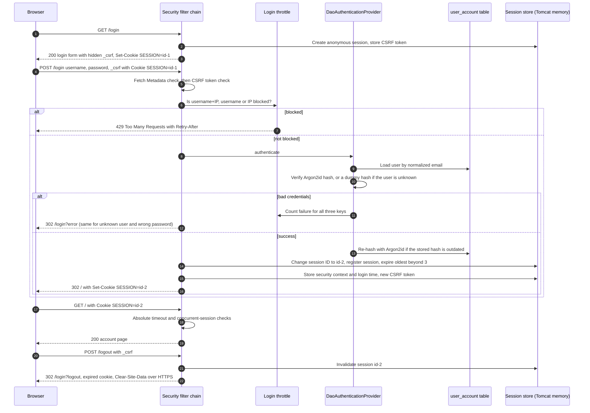

# 01 — Session authentication: form login + server-side sessions

A small server-rendered Spring Boot app showing the classic browser login done right in 2026: a login
form, a server-side session behind an opaque cookie, Argon2id password hashes, CSRF protection,
session fixation protection, idle and absolute timeouts, a limit on concurrent sessions, a real logout,
and login throttling that does not reveal which accounts exist.

**Read with:**

- [Chapter 04 — Server-side sessions, cookies and CSRF](../../docs/04-sessions-cookies-and-csrf.md) (sections 2–7 and 11 are implemented here)
- [Chapter 02 — Passwords and credential storage](../../docs/02-passwords-and-credential-storage.md) (sections 5–8 and 11: NIST rules, breach checks, throttling, enumeration-safe responses, hash upgrades)
- [Chapter 14 — Production architecture and checklist](../../docs/14-production-architecture-and-checklist.md) for what changes when this runs in a cluster

Stack: Java 21, Spring Boot 4.1.1 (Spring Framework 7.0, Spring Security 7.1.1), Thymeleaf, Spring Data JPA, H2.

---

## What it demonstrates

| Security property | How | Where |
|---|---|---|
| Passwords stored as Argon2id | `DelegatingPasswordEncoder`, default id `argon2`, OWASP minimum m=19 MiB, t=2, p=1, Unicode NFC normalization | [`PasswordEncoderConfig`](src/main/java/com/backend/auth/session/password/PasswordEncoderConfig.java) |
| Old hashes upgraded on login | `UserDetailsPasswordService` re-hashes `{bcrypt}`, `{pbkdf2…}` or weaker Argon2 hashes after a successful login | [`AccountUserDetailsService`](src/main/java/com/backend/auth/session/account/AccountUserDetailsService.java) |
| NIST SP 800-63B-4 password policy | At least 15 code points (password-only accounts), up to 128, no composition rules, no rotation, blocklist + optional Have I Been Pwned check, every rejection explained | [`PasswordPolicy`](src/main/java/com/backend/auth/session/password/PasswordPolicy.java), [`PasswordBlocklist`](src/main/java/com/backend/auth/session/password/PasswordBlocklist.java) |
| Registration does not reveal existing accounts | Same redirect for new and existing addresses; the hash is computed in both cases so timing matches too | [`RegistrationService`](src/main/java/com/backend/auth/session/account/RegistrationService.java) |
| Login does not reveal existing accounts | One failure URL (`/login?error`) and one message; Spring runs a dummy hash for unknown users | [`SecurityConfig`](src/main/java/com/backend/auth/session/security/SecurityConfig.java) |
| CSRF protection | Spring's session-backed synchronizer token (masked per response) on every POST, including `/login`, `/register` and `/logout` | `SecurityConfig` |
| Fetch Metadata check (defense in depth) | Unsafe requests labelled `Sec-Fetch-Site: cross-site` are refused even with a valid token | [`CrossSiteRequestBlockingFilter`](src/main/java/com/backend/auth/session/security/CrossSiteRequestBlockingFilter.java) |
| Session fixation protection | `changeSessionId`: the session ID changes at login, so a planted ID stays anonymous | `SecurityConfig` |
| Cookie hardening | `HttpOnly`, `SameSite=Lax`, cookie-only tracking, host-only; in the `prod` profile also `Secure` and the `__Host-` prefix | [`application.yml`](src/main/resources/application.yml) |
| Idle timeout | 30 minutes (`server.servlet.session.timeout`), enforced by the container | `application.yml` |
| Absolute timeout | 8 hours after login, however active the session is | [`AbsoluteSessionTimeoutFilter`](src/main/java/com/backend/auth/session/security/AbsoluteSessionTimeoutFilter.java) |
| Concurrent session limit | At most 3 sessions per user; a 4th login expires the oldest (it never locks the user out) | `SecurityConfig` |
| Real logout | POST only, CSRF-protected, invalidates the session server-side, expires the cookie, sends `Clear-Site-Data` over HTTPS | `SecurityConfig` |
| Login throttling | Counters per username+IP (5), per username (20) and per IP (50); exponential block from 30 s up to 15 min; unknown usernames counted the same way | [`LoginAttemptService`](src/main/java/com/backend/auth/session/security/LoginAttemptService.java), [`LoginThrottleFilter`](src/main/java/com/backend/auth/session/security/LoginThrottleFilter.java) |
| Security headers | Strict CSP, `frame-ancestors 'none'`, `Cache-Control: no-store`, HSTS on HTTPS | `SecurityConfig` |

## The flow



## Project layout

```text
src/main/java/com/backend/auth/session/
├── SessionAuthApplication.java        Boot entry point, Clock bean
├── account/                           user entity, repository, UserDetailsService, registration
├── password/                          Argon2id encoder, NIST password policy, blocklist / HIBP
├── security/                          filter chain, throttling, absolute timeout, Fetch Metadata filter
└── web/                               login, home and registration controllers
src/main/resources/
├── application.yml                    cookie, timeout and throttle settings (+ "prod" profile)
├── schema.sql                         user_account table
├── password-blocklist.txt             DEMO sample of breached passwords
└── templates/, static/css/            Thymeleaf pages (no inline script or style, so CSP stays strict)
```

## Run it

```bash
./mvnw spring-boot:run          # http://localhost:8080
./mvnw test                     # 50 tests, no network needed
```

Open <http://localhost:8080/register>, create an account, then sign in. The database is an in-memory H2
instance, so accounts disappear on restart.

The `prod` profile (`./mvnw spring-boot:run -Dspring-boot.run.profiles=prod`) switches the cookie to
`__Host-SESSION` with `Secure` and turns on the Have I Been Pwned check. Browsers only accept that
cookie over HTTPS, so run it behind a TLS-terminating proxy (see the last section).

## curl walkthrough

The responses below are from a real run, trimmed to the relevant lines. Session IDs and tokens will differ.

```bash
BASE=http://localhost:8080
JAR=$(mktemp)                                     # curl cookie jar = the browser's cookie store
# Fetch a page and print the CSRF token Thymeleaf put in its form
csrf() { curl -s -c "$JAR" -b "$JAR" "$BASE$1" | sed -n 's/.*name="_csrf" value="\([^"]*\)".*/\1/p'; }
```

**1. The account page requires a login.**

```bash
curl -si "$BASE/" | grep -iE '^HTTP|^Location'
```

```http
HTTP/1.1 302
Location: http://localhost:8080/login
```

**2. Registration without a CSRF token is refused.**

```bash
curl -si -c "$JAR" -b "$JAR" -d email=alice@example.com \
     --data-urlencode 'password=plaid otter sings at dawn' "$BASE/register" | head -1
```

```http
HTTP/1.1 403
```

**3. A short password is rejected with a reason** (complexity does not compensate for length).

```bash
TOKEN=$(csrf /register)
curl -si -c "$JAR" -b "$JAR" -d email=alice@example.com --data-urlencode 'password=Tr0ub4dor&3' \
     --data-urlencode "_csrf=$TOKEN" "$BASE/register" | grep -E '^HTTP|class="error"'
```

```http
HTTP/1.1 400
<p class="error">Use at least 15 characters. A few unrelated words make a strong, memorable passphrase.</p>
```

`correct horse battery staple` would be rejected too, with "This password appears in a list of breached or
common passwords".

**4. Register.** Repeating this exact command later gives the same response: the endpoint does not say
whether the address was already registered.

```bash
curl -si -c "$JAR" -b "$JAR" -d email=alice@example.com --data-urlencode 'password=plaid otter sings at dawn' \
     --data-urlencode "_csrf=$TOKEN" "$BASE/register" | grep -iE '^HTTP|^Location'
```

```http
HTTP/1.1 302
Location: http://localhost:8080/login?registered
```

**5. Sign in and watch the session ID change** (session fixation protection).

```bash
TOKEN=$(csrf /login)
echo "before: $(awk '/SESSION/ {print $7}' "$JAR")"
curl -si -c "$JAR" -b "$JAR" -d username=alice@example.com --data-urlencode 'password=plaid otter sings at dawn' \
     --data-urlencode "_csrf=$TOKEN" "$BASE/login" | grep -iE '^HTTP|^Location|^Set-Cookie'
echo "after:  $(awk '/SESSION/ {print $7}' "$JAR")"
```

```http
before: BE116E1FB15BA1BA770E874FFAE4E3DA
HTTP/1.1 302
Set-Cookie: SESSION=1D7B3DE3ACDE27EBB8AE592A0341DBA3; Path=/; HttpOnly; SameSite=Lax
Location: http://localhost:8080/
after:  1D7B3DE3ACDE27EBB8AE592A0341DBA3
```

**6. The new session is authenticated.**

```bash
curl -s -c "$JAR" -b "$JAR" "$BASE/" | grep 'Signed in'
```

```html
<p>Signed in as <strong id="username">alice@example.com</strong>.</p>
```

**7. Log out.** Without the token it is refused; with it, the session is invalidated and the cookie expired.

```bash
OLD_ID=$(awk '/SESSION/ {print $7}' "$JAR")
TOKEN=$(csrf /)
curl -si -c "$JAR" -b "$JAR" -X POST "$BASE/logout" | head -1
curl -si -c "$JAR" -b "$JAR" --data-urlencode "_csrf=$TOKEN" "$BASE/logout" | grep -iE '^HTTP|^Location|^Set-Cookie'
```

```http
HTTP/1.1 403
HTTP/1.1 302
Set-Cookie: SESSION=; Expires=Thu, 01 Jan 1970 00:00:10 GMT; Path=/; SameSite=Lax
Location: http://localhost:8080/login?logout
```

**8. A copy of the old session ID is now worthless** (deleting only the cookie would not achieve this).

```bash
curl -si -b "SESSION=$OLD_ID" "$BASE/" | grep -iE '^HTTP|^Location'
```

```http
HTTP/1.1 302
Location: http://localhost:8080/login
```

**9. Throttling.** Five wrong passwords, then even the correct password is refused for 30 seconds. An
unknown address (`nobody@example.com`) produces exactly the same sequence, so the throttle cannot be used
to discover accounts.

```bash
TOKEN=$(csrf /login)
for i in 1 2 3 4 5; do
  curl -s -o /dev/null -w '%{http_code} %{redirect_url}\n' -c "$JAR" -b "$JAR" \
       -d username=alice@example.com -d password=wrong-password-guess --data-urlencode "_csrf=$TOKEN" "$BASE/login"
done
curl -si -c "$JAR" -b "$JAR" -d username=alice@example.com --data-urlencode 'password=plaid otter sings at dawn' \
     --data-urlencode "_csrf=$TOKEN" "$BASE/login" | grep -iE '^HTTP|^Retry-After|Too many'
```

```http
302 http://localhost:8080/login?error
302 http://localhost:8080/login?error
302 http://localhost:8080/login?error
302 http://localhost:8080/login?error
302 http://localhost:8080/login?error
HTTP/1.1 429
Retry-After: 30
Too many failed sign-in attempts. Please wait 30 seconds and try again.
```

Each further failure after a block doubles it (60 s, 120 s, … up to 15 min). The same user from a different
IP can still sign in: only the per-username counter (20 failures) is shared across IPs.

**10. A cross-site POST is refused even with a valid token** (browsers set `Sec-Fetch-Site`; curl does not,
so we add it by hand).

```bash
TOKEN=$(csrf /register)
curl -si -c "$JAR" -b "$JAR" -H 'Sec-Fetch-Site: cross-site' -d email=mallory@example.com \
     --data-urlencode 'password=plaid otter sings at dawn' --data-urlencode "_csrf=$TOKEN" "$BASE/register" | head -1
```

```http
HTTP/1.1 403
```

## Configuration

| Property | Default | Meaning |
|---|---|---|
| `server.servlet.session.timeout` | `30m` | Idle timeout |
| `server.servlet.session.cookie.name` | `SESSION` (`__Host-SESSION` in `prod`) | Neutral cookie name; the prefix needs HTTPS |
| `server.servlet.session.cookie.secure` | `false` (`true` in `prod`) | Only `false` for `http://localhost` |
| `auth.session.maximum-per-user` | `3` | Concurrent sessions; the oldest is expired |
| `auth.session.absolute-timeout` | `8h` | Maximum session age after login |
| `auth.login-throttle.max-failures-per-user-and-ip` | `5` | Brute force from one client |
| `auth.login-throttle.max-failures-per-user` | `20` | Distributed attack on one account |
| `auth.login-throttle.max-failures-per-ip` | `50` | Password spraying from one IP |
| `auth.login-throttle.initial-block` / `max-block` | `30s` / `15m` | Exponential backoff range |
| `auth.login-throttle.forget-after` | `1h` | Idle counters start over |
| `auth.password.hibp-check-enabled` | `false` (`true` in `prod`) | Have I Been Pwned range API (k-anonymity), fails open |

## How the tests prove it

`./mvnw test` runs 50 tests: MockMvc tests against the full Spring Security filter chain, plain unit tests,
and one test class that starts a real Tomcat on a random port to check the actual `Set-Cookie` headers.

| Property | Test |
|---|---|
| Registration stores an Argon2id hash with the OWASP parameters, never the password | `RegistrationTests.registrationStoresAnArgon2idHashNeverThePassword` |
| Weak and breached passwords are rejected with a reason; length counts code points | `RegistrationTests.shortPasswordIsRejectedWithAReason`, `breachedPasswordIsRejectedWithAReason`, `PasswordPolicyTest` |
| Duplicate registration is indistinguishable and cannot overwrite the account | `RegistrationTests.duplicateRegistrationLooksIdenticalAndDoesNotOverwriteTheAccount` |
| POST without (or with an invalid) CSRF token is rejected | `RegistrationTests.postWithoutCsrfTokenIsRejected`, `postWithInvalidCsrfTokenIsRejected`, `LoginTests.loginWithoutCsrfTokenIsRejected`, `LogoutTests.logoutWithoutCsrfTokenIsRejectedAndTheSessionSurvives` |
| Protected page requires login | `LoginTests.protectedPageRequiresLogin` |
| Login creates an authenticated session and changes the session ID | `LoginTests.loginCreatesAnAuthenticatedSessionWithANewSessionId`, and on real Tomcat `ProductionCookieTests.loginIssuesANewSessionIdAndThePreLoginIdBecomesWorthless` |
| Bad password fails with the generic message; unknown user fails identically | `LoginTests.wrongPasswordFailsWithTheGenericMessage`, `unknownUserFailsExactlyLikeAWrongPassword` |
| Legacy bcrypt hashes are upgraded to Argon2id at login | `LoginTests.legacyBcryptHashIsUpgradedToArgon2idOnLogin`, `PasswordEncoderConfigTest` |
| Logout invalidates the session and deletes the cookie; GET cannot log out | `LogoutTests`, `ProductionCookieTests.logoutExpiresTheCookieWithMatchingAttributesAndClearsSiteData` |
| `__Host-` cookie with `Secure`, `HttpOnly`, `SameSite=Lax`, `Path=/`, no `Domain`; HSTS | `ProductionCookieTests.sessionCookieIsHostPrefixedSecureHttpOnlyAndSameSiteLax` |
| Throttling kicks in after N failures, even for the correct password, and looks the same for unknown users | `LoginThrottleTests` |
| Backoff doubling, cap, per-IP spraying limit, per-account limit, which counters a success resets | `LoginAttemptServiceTest` (with a controllable clock, no sleeps) |
| Oldest session expires when a 4th device logs in | `SessionPolicyTests.loggingInOnOneDeviceTooManyExpiresTheOldestSession` |
| Absolute timeout ends an active session | `SessionPolicyTests.sessionEndsAtTheAbsoluteTimeoutEvenIfActive` |
| Cross-site POST is refused even with a valid CSRF token | `SessionPolicyTests.crossSiteStateChangingRequestIsBlockedEvenWithAValidCsrfToken` |

## What you would change for production

- **Shared session store.** Sessions live in one Tomcat's memory, so a restart logs everyone out and two
  instances do not share them. Add `spring-boot-starter-session-data-redis` with the indexed repository,
  JSON serialization, TLS and ACLs on Redis, and replace `SessionRegistryImpl` with
  `SpringSessionBackedSessionRegistry` so the concurrent-session limit and "log out everywhere" work across
  nodes ([chapter 04, section 11.4](../../docs/04-sessions-cookies-and-csrf.md#114-spring-session-with-redis-concurrent-sessions-and-log-out-everywhere)).
- **Shared throttle state.** Move the counters to Redis with key TTLs. Add what this demo leaves out: the
  NIST hard limit (at most 100 consecutive failures on one account, then recovery), bot challenges, IP
  reputation, and alerts on credential-stuffing spikes.
- **TLS and proxies.** Serve only HTTPS and run with the `prod` profile. It uses
  `server.forward-headers-strategy=native`, so Tomcat accepts `X-Forwarded-*` only from internal proxy
  addresses. Set `server.tomcat.remoteip.internal-proxies` to your load balancer's addresses so the client IP
  used for throttling cannot be spoofed. Consider HSTS `preload`.
- **Real database and migrations.** PostgreSQL (or similar) with Flyway, a unique index on the normalized
  email, and backups. Treat the password-hash column as sensitive data.
- **Account lifecycle.** Email verification at registration (and the "someone tried to register with your
  address" email for duplicates), a password reset flow, password change with re-authentication, and
  "log out of all devices" on password or MFA change. Once a reset flow exists, also check passwords at login
  by exposing a `CompromisedPasswordChecker` bean and sending `CompromisedPasswordException` to the reset page.
- **Breach corpus.** Keep the HIBP check on (or self-host the Pwned Passwords list) and decide deliberately
  whether an outage should fail open (the default here) or closed. Replace the DEMO blocklist file.
- **A second factor.** Passkeys (WebAuthn) or at least TOTP; see [chapter 11](../../docs/11-mfa-passwordless-and-passkeys.md)
  and [`../04-mfa-totp/`](../04-mfa-totp/). With mandatory MFA, NIST allows an 8-character password minimum.
- **Hashing capacity.** Each Argon2id verification here uses 19 MiB of memory. Benchmark on production
  hardware, raise the parameters if latency allows (existing users upgrade automatically at their next login),
  and limit how many hashes run at once so a login flood cannot exhaust memory. Optionally add a pepper kept in
  a KMS or HSM.
- **Re-authentication and visibility.** Ask for the password or passkey again before sensitive actions, rotate
  the session ID on privilege changes, show users their active sessions with a revoke button, and log
  security events (login, failure, lockout, logout, session expiry) without ever logging passwords or session IDs.
