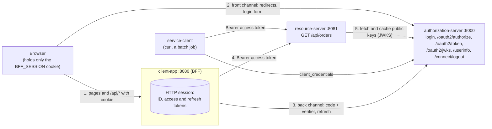
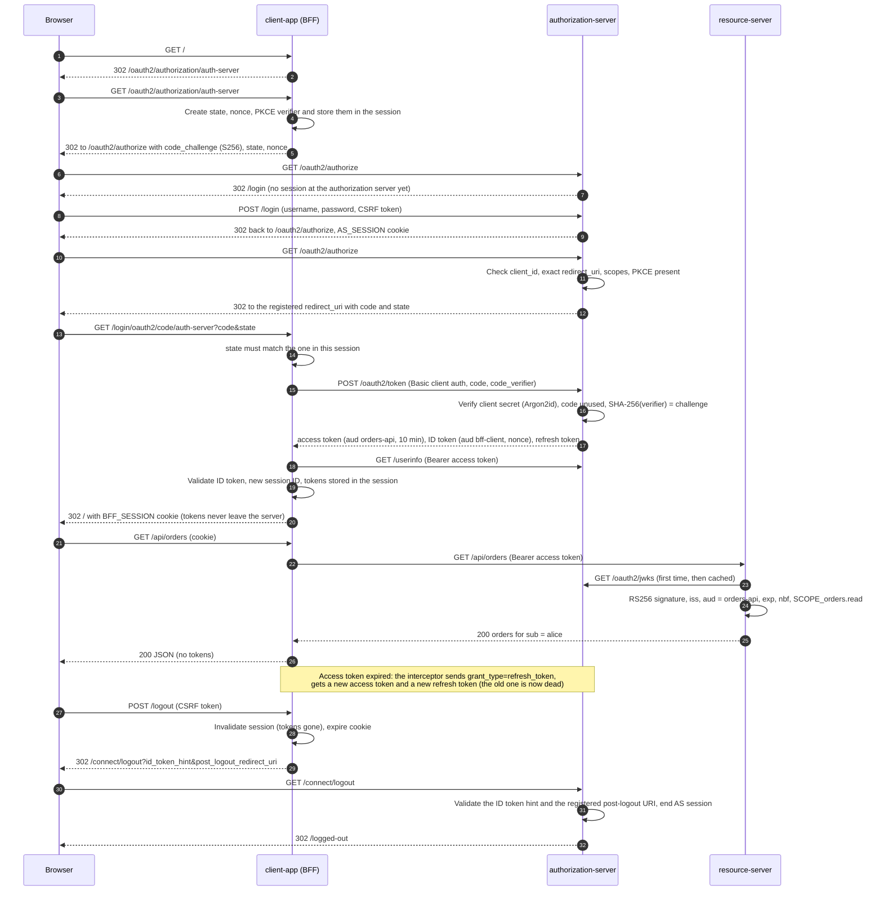

# 03 — OAuth 2.0 and OpenID Connect: authorization server, resource server and BFF

Three small Spring Boot applications that together show the whole modern OAuth 2.0 + OpenID Connect
picture as it is deployed in 2026:

- an **authorization server** (Spring Authorization Server, which is part of Spring Security 7) that
  logs users in, issues signed JWT access tokens, ID tokens and rotating refresh tokens, and publishes
  its keys and metadata;
- a **resource server** (the "orders API") that accepts only access tokens issued for it and enforces
  scopes;
- a **client app** built as a **Backend for Frontend (BFF)**: it logs the user in with OpenID Connect,
  keeps every token on the server, gives the browser nothing but an `HttpOnly` session cookie, and calls
  the orders API on the user's behalf.

There is also a machine client (`service-client`) that uses the client credentials grant with curl.

**Read with:**

- [Chapter 08 — OAuth 2.0](../../docs/08-oauth-2.md): sections 4–6 (code flow, PKCE, client credentials),
  8 (refresh tokens), 9 (deprecated grants), 11–12 (state, exact redirect URIs), 19 (vulnerabilities) and 23 (Spring)
- [Chapter 10 — OpenID Connect](../../docs/10-openid-connect.md): sections 3–5 (ID token and its
  validation), 9–10 (discovery, JWKS), 12.2 (RP-initiated logout) and 18 (Spring)
- [Chapter 09 — Modern OAuth 2.1 and extensions](../../docs/09-modern-oauth-2.1-and-extensions.md):
  section 2 (RFC 9700 rules), 5 (browser apps and the BFF), 12 (JWT access tokens) and 15 (protected resource metadata)
- [Chapter 06 — Tokens and JWT](../../docs/06-tokens-and-jwt.md): sections 7 (validation checklist),
  11 (where to store tokens in browsers) and 12 (kid, JWKS, rotation)
- [Chapter 12 — Service-to-service](../../docs/12-service-to-service-and-zero-trust.md) section 3 for the client credentials part
- [Chapter 14 — Production architecture](../../docs/14-production-architecture-and-checklist.md) for what changes in production

Stack: Java 21, Spring Boot 4.1.1 (Spring Framework 7.0, Spring Security 7.1.1 with its built-in
authorization server), Thymeleaf for two small pages. No database: everything is in memory.

---

## What it demonstrates

| Security property | How | Where |
|---|---|---|
| Authorization code + PKCE for every client | `requireProofKey(true)` on the authorization server **and** on the client registration (Spring adds PKCE automatically only for public clients); S256 only | [`RegisteredClientConfig`](authorization-server/src/main/java/com/backend/auth/authserver/client/RegisteredClientConfig.java), [`OidcClientRegistrationConfig`](client-app/src/main/java/com/backend/auth/clientapp/security/OidcClientRegistrationConfig.java) |
| No implicit, no password grant | Not registered for any client; Spring Authorization Server does not implement them at all (RFC 9700) | `RegisteredClientConfig` |
| Exact redirect URI matching | One registered redirect URI; prefix, extra path, extra query and other hosts are rejected with a 400 page, never a redirect | `RegisteredClientConfig` |
| CSRF on the callback, ID token replay | `state` and `nonce` generated per login, kept in the BFF session, checked on return | Spring Security `oauth2Login()` in [`BffSecurityConfig`](client-app/src/main/java/com/backend/auth/clientapp/security/BffSecurityConfig.java) |
| OIDC for login, not plain OAuth | The BFF's user comes from a validated ID token (`iss`, `aud`, `azp`, `exp`, `nonce`, RS256 signature) | `oauth2Login()` with `issuerUri` set |
| Access token addressed to the API | `aud = orders-api` for tokens carrying `orders.*` scopes (by default it would be the client ID), plus `client_id` (RFC 9068) | [`TokenClaimsCustomizer`](authorization-server/src/main/java/com/backend/auth/authserver/token/TokenClaimsCustomizer.java) |
| Full JWT validation at the API | RS256-only allowlist, signature via JWKS (`kid`), `iss`, `aud`, `exp`, `nbf` (60 s skew), `typ` | [`ResourceServerSecurityConfig`](resource-server/src/main/java/com/backend/auth/resourceserver/security/ResourceServerSecurityConfig.java), [`AccessTokenValidators`](resource-server/src/main/java/com/backend/auth/resourceserver/security/AccessTokenValidators.java) |
| Scope-based authorization, deny by default | `GET /api/orders` needs `SCOPE_orders.read`; every other route is `denyAll()` | `ResourceServerSecurityConfig` |
| No IDOR | Orders are selected by the token's `sub`, never by a request parameter | [`OrdersController`](resource-server/src/main/java/com/backend/auth/resourceserver/orders/OrdersController.java) |
| Short-lived access tokens | 10 minutes; authorization codes 2 minutes and single use | [`application.yml`](authorization-server/src/main/resources/application.yml) |
| Refresh token rotation | `reuseRefreshTokens(false)`: each refresh returns a new refresh token and the old one stops working | `RegisteredClientConfig` |
| Tokens never reach the browser (BFF) | Tokens live in the server-side HTTP session (`HttpSessionOAuth2AuthorizedClientRepository`); the browser gets `BFF_SESSION` (`HttpOnly`, `SameSite=Lax`) | `BffSecurityConfig`, [`application.yml`](client-app/src/main/resources/application.yml) |
| Server-side token use and refresh | `RestClient` + `OAuth2ClientHttpRequestInterceptor` attach the user's token and refresh it when expired; a token the API rejects is dropped | [`OrdersApiClientConfig`](client-app/src/main/java/com/backend/auth/clientapp/orders/OrdersApiClientConfig.java) |
| Logout everywhere | POST + CSRF only; local session invalidated; then RP-initiated logout ends the authorization server session; `post_logout_redirect_uri` must be registered | `BffSecurityConfig` (`OidcClientInitiatedLogoutSuccessHandler`), `RegisteredClientConfig` |
| Client secrets and passwords hashed | Argon2id (OWASP minimum m=19 MiB, t=2, p=1) through a `DelegatingPasswordEncoder`, also used to verify client secrets | [`PasswordEncoderConfig`](authorization-server/src/main/java/com/backend/auth/authserver/security/PasswordEncoderConfig.java) |
| Public keys only in the JWKS | Private RSA parameters never published; `kid` set for rotation | [`SigningKeyConfig`](authorization-server/src/main/java/com/backend/auth/authserver/token/SigningKeyConfig.java) |
| Discoverable API | RFC 9728 metadata at `/.well-known/oauth-protected-resource` names the authorization server and scopes; linked from every 401 | `ResourceServerSecurityConfig` |
| Stable issuer | Issuer configured explicitly, never derived from the request's `Host` header | [`AuthorizationServerSecurityConfig`](authorization-server/src/main/java/com/backend/auth/authserver/security/AuthorizationServerSecurityConfig.java) |

## The flow

### Who talks to whom



### Login, API call, refresh and logout



## Project layout

```text
03-oauth2-oidc/
├── pom.xml                                   parent: Spring Boot 4.1.1, Java 21, three modules
├── authorization-server/                     port 9000, package com.backend.auth.authserver
│   └── src/main/java/.../authserver/
│       ├── AuthServerProperties.java         issuer, clients, token lifetimes, API audiences
│       ├── security/AuthorizationServerSecurityConfig.java   protocol chain + login chain, issuer
│       ├── security/PasswordEncoderConfig.java               Argon2id (users and client secrets)
│       ├── client/RegisteredClientConfig.java                bff-client and service-client
│       ├── token/SigningKeyConfig.java                       RSA key, JWKS source (DEMO: in memory)
│       ├── token/TokenClaimsCustomizer.java                  aud/client_id; profile claims in ID token
│       └── user/DemoUserConfig.java                          alice and bob (DEMO ONLY)
├── resource-server/                          port 8081, package com.backend.auth.resourceserver
│   └── src/main/java/.../resourceserver/
│       ├── security/ResourceServerSecurityConfig.java        rules, JwtDecoder, RFC 9728 metadata
│       ├── security/AccessTokenValidators.java               iss + aud + defaults (shared with tests)
│       └── orders/OrdersController.java                      GET /api/orders for the token's sub
└── client-app/                               port 8080, package com.backend.auth.clientapp
    └── src/main/java/.../clientapp/
        ├── security/OidcClientRegistrationConfig.java        the OIDC client registration (PKCE, issuer)
        ├── security/BffSecurityConfig.java                   oauth2Login, CSRF, logout, token storage
        ├── orders/OrdersApiClientConfig.java                 RestClient + OAuth2 interceptor + refresh
        ├── orders/OrdersApiClient.java                       calls the resource server
        └── web/BffApiController.java, PageController.java    /api/me, /api/orders, /, /logged-out
```

## Run it

You need Java 21. Maven is not required: the wrapper downloads it. Open three terminals in this
directory and start the authorization server first (the others only contact it on first use, so the
order matters less, but it makes the logs easier to follow).

```bash
# Terminal 1: authorization server  -> http://localhost:9000
./mvnw -pl authorization-server spring-boot:run

# Terminal 2: resource server (orders API)  -> http://localhost:8081
./mvnw -pl resource-server spring-boot:run

# Terminal 3: client app (BFF)  -> http://127.0.0.1:8080
./mvnw -pl client-app spring-boot:run
```

Then open **<http://127.0.0.1:8080/>** (with `127.0.0.1`, not `localhost`), sign in as
`alice` / `alice-demo-password` (or `bob` / `bob-demo-password`), and follow the links to `/api/me` and
`/api/orders`. "Sign out" logs you out of both applications: signing in again asks for the password.

Why `127.0.0.1` for the client app but `localhost` for the authorization server? Browsers do not
separate cookies by port, so two apps on `localhost` would see each other's cookies. Different host
names keep the BFF's and the authorization server's sessions apart (each app also uses its own cookie
name). It also has to be `127.0.0.1` because that is the redirect URI registered at the authorization
server, and redirect URIs are matched exactly.

Run all tests (55, no network and no running servers needed):

```bash
./mvnw verify
```

To run on other ports, override the URLs together, for example
`./mvnw -pl authorization-server spring-boot:run -Dspring-boot.run.arguments="--server.port=19000 --authserver.issuer=http://localhost:19000"`
and point `resourceserver.*` and `bff.provider.*` at the same issuer (see [Configuration](#configuration)).

## curl walkthrough

The responses below are from a real run, trimmed to the relevant lines. Keys, tokens, codes and
timestamps will differ.

```bash
AS=http://localhost:9000; RS=http://localhost:8081; BFF=http://127.0.0.1:8080
```

**1. Discovery: everything a client needs, from one URL.**

```bash
curl -s $AS/.well-known/openid-configuration
```

```json
{
  "issuer": "http://localhost:9000",
  "authorization_endpoint": "http://localhost:9000/oauth2/authorize",
  "token_endpoint": "http://localhost:9000/oauth2/token",
  "jwks_uri": "http://localhost:9000/oauth2/jwks",
  "userinfo_endpoint": "http://localhost:9000/userinfo",
  "end_session_endpoint": "http://localhost:9000/connect/logout",
  "response_types_supported": ["code"],
  "grant_types_supported": ["authorization_code", "client_credentials", "refresh_token",
                            "urn:ietf:params:oauth:grant-type:token-exchange"],
  "code_challenge_methods_supported": ["S256"],
  "id_token_signing_alg_values_supported": ["RS256"],
  ...
}
```

Only `code` as a response type (no implicit flow), only `S256` for PKCE. Token exchange is advertised
by default but no client here is registered for it.

**2. The JWKS: public key only, with a `kid`.**

```bash
curl -s $AS/oauth2/jwks
```

```json
{"keys":[{"kty":"RSA","e":"AQAB","use":"sig","kid":"b2e90324-735d-463d-b813-ef37be616ad3","alg":"RS256","n":"x8_alSwf7Kvl..."}]}
```

**3. A machine client gets a token (client credentials).**

```bash
curl -s -u service-client:service-client-demo-secret \
     -d grant_type=client_credentials -d scope=orders.read $AS/oauth2/token
```

```json
{"access_token":"eyJraWQiOiJiMmU5MDMyNC03MzVk...","scope":"orders.read","token_type":"Bearer","expires_in":599}
```

No refresh token (the client can always authenticate again) and no ID token (there is no user).
The access token's payload:

```bash
TOKEN=$(curl -s -u service-client:service-client-demo-secret -d grant_type=client_credentials \
        -d scope=orders.read $AS/oauth2/token | sed 's/.*"access_token":"\([^"]*\)".*/\1/')
echo "$TOKEN" | cut -d. -f2 | tr '_-' '/+' | base64 -d 2>/dev/null; echo
```

```json
{"sub":"service-client","aud":"orders-api","nbf":1791448166,"scope":["orders.read"],
 "iss":"http://localhost:9000","exp":1791448766,"iat":1791448166,"jti":"ac8d9d88-...","client_id":"service-client"}
```

`aud` is the API, not the client. `exp - iat` is 600 seconds.

**4. The API accepts it.** The service owns no orders, but it is authenticated and authorized:

```bash
curl -si -H "Authorization: Bearer $TOKEN" $RS/api/orders
```

```http
HTTP/1.1 200

{"subject":"service-client","clientId":"service-client","orders":[]}
```

**5. No token, a tampered token, a route without a rule.**

```bash
curl -si $RS/api/orders | grep -E '^HTTP|^WWW'
curl -si -H "Authorization: Bearer ${TOKEN%?}x" $RS/api/orders | grep -E '^HTTP|^WWW'
curl -si -H "Authorization: Bearer $TOKEN" $RS/api/admin | grep -E '^HTTP|^WWW'
```

```http
HTTP/1.1 401
WWW-Authenticate: Bearer resource_metadata="http://localhost:8081/.well-known/oauth-protected-resource"

HTTP/1.1 401
WWW-Authenticate: Bearer error="invalid_token", error_description="An error occurred while attempting to decode the Jwt: Signed JWT rejected: Invalid signature", ...

HTTP/1.1 403
WWW-Authenticate: Bearer error="insufficient_scope", ...
```

**6. The API describes itself (RFC 9728).**

```bash
curl -s $RS/.well-known/oauth-protected-resource
```

```json
{"resource":"http://localhost:8081","bearer_methods_supported":["header"],"tls_client_certificate_bound_access_tokens":true,
 "resource_name":"Orders API","authorization_servers":["http://localhost:9000"],"scopes_supported":["orders.read"]}
```

**7. The browser flow through the BFF.** Do it in a browser (see [Run it](#run-it)); this is what
happens, step by step, scripted with curl and one cookie jar standing in for the browser:

```bash
JAR=$(mktemp)
c() { curl -s -c "$JAR" -b "$JAR" -H 'Accept: text/html' "$@"; }      # a page navigation
api() { curl -s -c "$JAR" -b "$JAR" "$@"; }                          # a fetch() from the frontend
loc() { grep -i '^location:' | tr -d '\r' | sed 's/^[Ll]ocation: //'; }
csrf() { grep -o 'name="_csrf"[^>]*' | grep -o 'value="[^"]*"' | sed 's/value="//;s/"$//'; }

L=$(c -D - -o /dev/null $BFF/ | loc);   echo "$L"   # the BFF starts the OIDC login
L=$(c -D - -o /dev/null "$L" | loc);    echo "$L"   # authorization request with PKCE, state, nonce
L=$(c -D - -o /dev/null "$L" | loc);    echo "$L"   # no session at the AS yet: its login page
T=$(c "$L" | csrf)                                   # login form CSRF token
L=$(c -D - -o /dev/null -d username=alice -d password=alice-demo-password --data-urlencode "_csrf=$T" \
      $AS/login | loc);                 echo "$L"   # back to /oauth2/authorize
L=$(c -D - -o /dev/null "$L" | loc);    echo "$L"   # code delivered to the registered redirect URI
L=$(c -D - -o /dev/null "$L" | loc);    echo "$L"   # BFF redeems the code server-side, session ready
api $BFF/api/me; echo
api $BFF/api/orders; echo
grep -c 'eyJ' "$JAR"                                 # 0: no token anywhere in the browser's cookies
```

```text
http://127.0.0.1:8080/oauth2/authorization/auth-server
http://localhost:9000/oauth2/authorize?response_type=code&client_id=bff-client&scope=openid%20profile%20orders.read&state=HdoCtAvk6r-...&redirect_uri=http://127.0.0.1:8080/login/oauth2/code/auth-server&nonce=5Cq9IsQgJZgc...&code_challenge=LTeEQ-vxt8E3...&code_challenge_method=S256
http://localhost:9000/login
http://localhost:9000/oauth2/authorize?response_type=code&client_id=bff-client&...&continue
http://127.0.0.1:8080/login/oauth2/code/auth-server?code=ee7zZUrTgSYg...&state=HdoCtAvk6r-...
http://127.0.0.1:8080/?continue
{"issuer":"http://localhost:9000","subject":"alice","name":"Alice Anderson","preferredUsername":"alice","authenticatedAt":"2026-10-08T08:30:31Z"}
{"subject":"alice","orders":[{"id":"A-1001","item":"Mechanical keyboard","total":129.00},{"id":"A-1002","item":"USB-C dock","total":89.50}]}
0
```

The cookie jar ends up with two cookies, `AS_SESSION` (for `localhost`) and `BFF_SESSION` (for
`127.0.0.1`), both `HttpOnly`, and no tokens.

**8. Logout: CSRF-protected, then RP-initiated logout at the authorization server.**

```bash
api -o /dev/null -w '%{http_code}\n' -X POST $BFF/logout                          # no CSRF token
T=$(c $BFF/ | csrf)
L=$(c -D - -o /dev/null --data-urlencode "_csrf=$T" $BFF/logout | loc); echo "$L"
L=$(c -D - -o /dev/null "$L" | loc); echo "$L"
api -o /dev/null -w '%{http_code}\n' $BFF/api/me
```

```text
403
http://localhost:9000/connect/logout?id_token_hint=eyJraWQiOiJiMmU5...&post_logout_redirect_uri=http://127.0.0.1:8080/logged-out
http://127.0.0.1:8080/logged-out
401
```

Signing in again now shows the authorization server's login form: its session ended too.

## Configuration

| Property | Default | Module |
|---|---|---|
| `authserver.issuer` | `http://localhost:9000` | authorization-server |
| `authserver.bff-client.redirect-uri` / `post-logout-redirect-uri` | `http://127.0.0.1:8080/login/oauth2/code/auth-server` / `http://127.0.0.1:8080/logged-out` | authorization-server |
| `authserver.bff-client.client-secret`, `authserver.service-client.client-secret` | demo values, or env `BFF_CLIENT_SECRET`, `SERVICE_CLIENT_SECRET` | authorization-server |
| `authserver.tokens.access-token-ttl` / `refresh-token-ttl` / `authorization-code-ttl` | `10m` / `8h` / `2m` | authorization-server |
| `authserver.apis[].audience` / `scopes` | `orders-api` / `orders.read` | authorization-server |
| `resourceserver.issuer`, `jwk-set-uri`, `audience` | `http://localhost:9000`, `.../oauth2/jwks`, `orders-api` | resource-server |
| `bff.provider.*` | the authorization server's endpoints | client-app |
| `bff.client.client-secret` | demo value, or env `BFF_CLIENT_SECRET` | client-app |
| `bff.orders-api.base-url`, `connect-timeout`, `read-timeout` | `http://localhost:8081`, `2s`, `5s` | client-app |

Each module has a `prod` profile (`-Dspring-boot.run.profiles=prod`) that makes the session cookies
`Secure` with the `__Host-` prefix and trusts `X-Forwarded-*` only from the proxy.

## Design decisions (the "why")

- **The BFF configures endpoints instead of `issuer-uri`.** With `issuer-uri`, Spring fetches the
  discovery document at startup, so the BFF could not start before the authorization server and its
  tests would need one running. Boot's client properties also cannot set `requireProofKey`. The
  registration is therefore built in Java from the discovery values, and `issuerUri` is still set so
  every ID token's `iss` is checked. In production, discovery is fine if you accept the startup dependency.
- **The resource server builds its own `JwtDecoder`** instead of using
  `spring.security.oauth2.resourceserver.jwt.*`, so the algorithm allowlist and each claim validator
  are visible in one place and the tests reuse exactly the same validators.
- **Audience per API.** By default Spring Authorization Server sets `aud` to the client ID, which makes
  every access token from that client acceptable to every API that only checks the issuer. The
  customizer maps scopes to the API they belong to (`orders.*` to `orders-api`). RFC 8707 resource
  indicators are the standard way to ask for an audience, but Spring Authorization Server 7.1 reads the
  `resource` parameter only in token exchange (RFC 8693), not in the code or client credentials flows,
  so the scope mapping stands in.
- **Tokens in the HTTP session, not in an in-memory map.** Spring's default authorized-client store is
  keyed by user name and outlives logout. The session store disappears with the session.
- **`SameSite=Lax`, not `Strict`.** The OAuth callback is a top-level navigation from the authorization
  server's site, and it needs the BFF session that holds `state`, `nonce` and the PKCE verifier.
  `Lax` still keeps the cookie off cross-site POSTs, and CSRF tokens protect the rest.
- **JSON endpoints answer 401, pages redirect.** A `fetch()` cannot usefully follow a redirect to
  another site's login page; the frontend sees 401 and navigates to `/` instead.
- **Confidential client with PKCE.** The client secret proves which client redeems the code; PKCE proves
  it is the same browser session that started the flow, which stops authorization code injection.

## How the tests prove it

55 tests, all through real HTTP endpoints with MockMvc (plus one loopback fake server on a random port
in the client app). No fixed ports, no network.

| Property | Test |
|---|---|
| Discovery publishes the issuer, endpoints, `code` only, `S256` only, no password/implicit grant, no dynamic registration | `DiscoveryAndJwksTests.openIdDiscoveryDocumentPublishesIssuerEndpointsAndOnlySecureOptions` |
| JWKS holds only public key material (`d`, `p`, `q`, ... absent) | `DiscoveryAndJwksTests.jwksPublishesOnlyThePublicSigningKey` |
| Client credentials: 10-minute token, `aud = orders-api`, `client_id`, no refresh/ID token, `Cache-Control: no-store` | `ClientCredentialsGrantTests.serviceClientGetsAShortLivedAccessTokenForTheOrdersApi` |
| Tokens are signed with the key published in the JWKS (`kid` matches) | `ClientCredentialsGrantTests.accessTokenIsSignedWithTheKeyPublishedInTheJwks` |
| Wrong secret, unregistered scope, unregistered grant type, password grant all refused | `ClientCredentialsGrantTests` (4 tests) |
| Full code flow with PKCE: login, authorize, code, token exchange returns access + ID + refresh tokens; ID token `aud`, `azp`, `nonce`, `sid`, `auth_time`, profile claims; access token audience; UserInfo | `AuthorizationCodeFlowTests.codeFlowWithPkceIssuesAccessTokenIdTokenAndRefreshToken` |
| Wrong `code_verifier` gives `invalid_grant` | `AuthorizationCodeFlowTests.wrongCodeVerifierIsRejected` |
| Authorization request without PKCE is refused | `AuthorizationCodeFlowTests.authorizationRequestWithoutPkceIsRefused` |
| Unregistered redirect URIs (other host, extra path, extra query, `localhost` vs `127.0.0.1`) get a 400 and no redirect | `AuthorizationCodeFlowTests.unregisteredRedirectUriIsRejectedWithoutRedirecting` (4 cases) |
| Implicit flow refused | `AuthorizationCodeFlowTests.implicitFlowIsNotSupported` |
| A reused code is refused and the tokens from its first use are revoked | `AuthorizationCodeFlowTests.reusedAuthorizationCodeIsRejectedAndRevokesTheTokensItIssued` |
| Refresh token rotation: new refresh token each time, old one rejected | `AuthorizationCodeFlowTests.refreshTokenIsRotatedAndTheOldOneStopsWorking` |
| Browser without a session at the AS is sent to its login page | `AuthorizationCodeFlowTests.browserWithoutSessionIsSentToTheLoginPage` |
| RP-initiated logout ends the AS session; unregistered post-logout URI refused | `RpInitiatedLogoutTests` (2 tests) |
| API: 401 with Bearer challenge, 200 with scope, 403 `insufficient_scope` without, deny by default, no session cookie, only the subject's orders | `OrdersApiAuthorizationTests` (`jwt()` post-processor) |
| API publishes RFC 9728 metadata naming the authorization server | `OrdersApiAuthorizationTests.protectedResourceMetadataNamesTheAuthorizationServerAndScopes` |
| Real signed JWTs against the production validators: valid accepted; expired, not-yet-valid, wrong issuer, wrong audience, ID token used as access token, unknown key, HS256 algorithm confusion, `alg: none`, malformed all rejected with `invalid_token` | `AccessTokenValidationTests` (11 tests, test-key decoder) |
| Unauthenticated page request starts the OIDC login; authorization request carries PKCE (S256), state, nonce; fresh values per attempt | `LoginRedirectTests` |
| A callback with a `state` this session did not create is rejected before any token request | `LoginRedirectTests.callbackWithAStateThisSessionDidNotCreateIsRejected` |
| Unauthenticated `/api/*` call gets 401, not a redirect | `LoginRedirectTests.unauthenticatedApiCallGets401InsteadOfARedirect` |
| Signed-in user sees their identity; no token in any response; CSP and CSRF-protected logout form | `SignedInUserTests` (`oidcLogin()`) |
| The BFF calls the API with the user's access token; refreshes an expired one server-side and stores the rotated refresh token; drops a token the API rejects; maps API failures to 502 without leaking the body | `OrdersProxyTests` (fake token endpoint and API) |
| Logout: session invalidated, cookie expired, redirect to `end_session_endpoint` with `id_token_hint` and the registered post-logout URI; POST without CSRF refused; GET only shows a confirmation page | `LogoutTests` |

## What you would change for production

- **Signing keys.** Replace the in-memory RSA key (`SigningKeyConfig`, marked DEMO ONLY) with a key from a
  KMS/HSM or secret store, shared by all instances. Rotate on a schedule: publish the next key in the
  JWKS first, switch signing, keep the old key published until its last token expires. Consider ES256.
- **Persistent stores.** Use `JdbcRegisteredClientRepository`, `JdbcOAuth2AuthorizationService` and
  `JdbcOAuth2AuthorizationConsentService` so clients, codes and refresh tokens survive restarts and
  work across instances. (The in-memory service also keeps every completed authorization until restart.)
- **Users.** Keep users in a database (see [example 01](../01-session-auth/)) or federate to a corporate
  IdP, add MFA, preferably passkeys ([example 04](../04-mfa-totp/), chapter 11), throttle `/login`, and
  check passwords against breach lists.
- **Client authentication.** Load client secrets from a secret manager, or better, use `private_key_jwt`
  or mTLS (`tls_client_auth`) so no shared secret exists. Spring Authorization Server supports both.
- **Refresh token reuse detection and storage.** This server rotates refresh tokens, but a replayed old
  refresh token is only rejected; the newer one stays valid. Revoke the whole token family on reuse
  ([example 02](../02-jwt-auth/) shows how), and revoke the refresh token at logout (RFC 7009 `/oauth2/revoke`).
  Spring's authorization services (in-memory and JDBC) store token values as issued; a custom
  `OAuth2AuthorizationService` can store only their hashes, so a database leak yields no usable tokens.
- **Sender-constrained tokens.** For high-value APIs bind access tokens to the client with DPoP (RFC 9449)
  or mTLS (RFC 8705); Spring Authorization Server and Spring Security 7 resource servers support both.
- **HTTPS everywhere** with the `prod` profiles (`Secure`, `__Host-` cookies, forwarded headers from the
  proxy only) and an `https://` issuer. HSTS at the edge.
- **BFF sessions across instances.** Use Spring Session (Redis or JDBC), encrypt the stored tokens at rest,
  and bound the session lifetime (absolute timeout, as in example 01).
- **Back-channel logout.** Spring Authorization Server 7.1 does not send OIDC Back-Channel Logout tokens.
  If several applications share the login, use an IdP that does (and enable `oidcLogout().backChannel()`
  in the clients), or keep RP sessions short.
- **Consent and third parties.** Turn on `requireAuthorizationConsent(true)` for any client you do not
  own, and consider Pushed Authorization Requests (PAR, `/oauth2/par`) so request parameters do not
  travel through the browser.
- **Access token type.** Set `typ: at+jwt` (RFC 9068) on access tokens and require it at the API, so no
  other JWT from the same issuer can ever be replayed as an access token, independent of `aud`.
- **Revocation-sensitive APIs.** JWTs stay valid until `exp`. Where that is too long, use shorter lifetimes
  or opaque tokens with introspection.
- **Operations.** Rate-limit the token endpoint, log authentication events (never tokens), alert on
  `invalid_grant` spikes and code reuse, and expose health checks without exposing the protocol endpoints.
