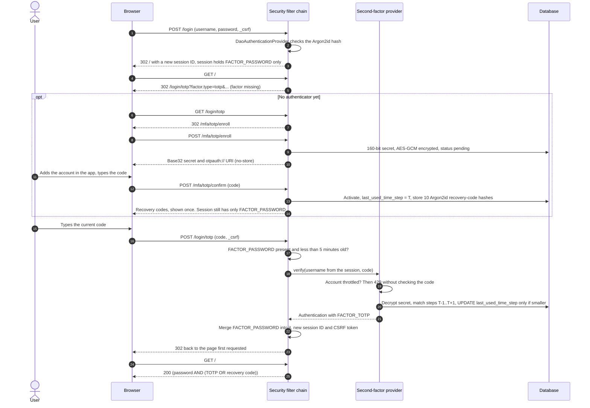

# 04 — MFA with TOTP: password, then an authenticator-app code

A small server-rendered Spring Boot app with a two-step login: a password, then a 6-digit code from an
authenticator app (TOTP, RFC 6238). TOTP is implemented here from scratch with `javax.crypto` and checked against
the RFC test vectors. The example covers the parts that usually go wrong around the algorithm: enrollment, a
partially authenticated session that can reach only the second step, secrets encrypted at rest, a drift window,
replay protection, per-account throttling, and single-use recovery codes stored hashed.

**Read with:**

- [Chapter 11 — MFA, passwordless and passkeys](../../docs/11-mfa-passwordless-and-passkeys.md): sections
  [3–4](../../docs/11-mfa-passwordless-and-passkeys.md#4-totp-time-based-one-time-passwords-rfc-6238) (HOTP/TOTP,
  drift, replay, enrollment, encryption at rest), [8](../../docs/11-mfa-passwordless-and-passkeys.md#8-recovery-codes)
  (recovery codes), [11](../../docs/11-mfa-passwordless-and-passkeys.md#11-account-recovery-the-weakest-link)
  (account recovery) and [15.2](../../docs/11-mfa-passwordless-and-passkeys.md#152-requiring-multiple-factors-and-step-up)
  (Spring Security 7 factor authorities) are implemented here
- [Chapter 04 — Sessions, cookies and CSRF](../../docs/04-sessions-cookies-and-csrf.md) for the session and CSRF
  mechanics both login steps rely on ([01-session-auth](../01-session-auth/) covers them in depth)
- [Chapter 02 — Passwords and credential storage](../../docs/02-passwords-and-credential-storage.md) for the Argon2id
  hashes used for passwords and recovery codes

Stack: Java 21, Spring Boot 4.1.1 (Spring Framework 7.0, Spring Security 7.1.1), Thymeleaf, Spring JDBC, H2.

TOTP is an acceptable second factor, but it is **not phishing-resistant**: a fake login page can ask for the code
and relay it within its 30 seconds. Offer passkeys (WebAuthn) where you can, and keep TOTP as the fallback
(chapter 11, sections 1.2 and 9–10).

---

## What it demonstrates

| Security property | How | Where |
|---|---|---|
| Correct TOTP | HOTP (RFC 4226) dynamic truncation + RFC 6238 time steps, HMAC-SHA1, 6 digits, 30 s; all 18 RFC 6238 Appendix B vectors and the RFC 4226 Appendix D vectors pass | [`Hotp`](src/main/java/com/backend/auth/mfa/otp/Hotp.java), [`Totp`](src/main/java/com/backend/auth/mfa/otp/Totp.java) |
| Enrollment that cannot lock users out | 160-bit secret from `SecureRandom`, Base32 (RFC 4648) and an `otpauth://` URI; the authenticator stays *pending* until the user enters a valid code | [`TotpEnrollmentService`](src/main/java/com/backend/auth/mfa/totp/TotpEnrollmentService.java), [`Base32`](src/main/java/com/backend/auth/mfa/otp/Base32.java), [`OtpAuthUri`](src/main/java/com/backend/auth/mfa/otp/OtpAuthUri.java) |
| Secrets encrypted at rest | AES-256-GCM, fresh 96-bit nonce per encryption, username as associated data (a row copied to another user does not decrypt), key id stored with each ciphertext for rotation; key from configuration | [`SecretEncryptor`](src/main/java/com/backend/auth/mfa/crypto/SecretEncryptor.java) |
| Partially authenticated session | After the password the session holds only `FACTOR_PASSWORD`; every page except the second step (and, without an authenticator, enrollment) requires password AND (TOTP OR recovery code) | [`SecurityConfig`](src/main/java/com/backend/auth/mfa/security/SecurityConfig.java) |
| The half-login expires | The second step must follow the password within 5 minutes (`RequiredFactor.validDuration`) | `SecurityConfig` |
| Drift tolerance | Codes from the previous, current and next 30-second step are accepted, nothing wider | [`Totp.matchingStep`](src/main/java/com/backend/auth/mfa/otp/Totp.java) |
| Replay protection | The last accepted time step is stored; an atomic `UPDATE ... WHERE last_used_time_step < :step` accepts only later steps, so a code works once even if sent twice concurrently. The enrollment code is recorded too | [`TotpCredentialRepository.recordUse`](src/main/java/com/backend/auth/mfa/totp/TotpCredentialRepository.java) |
| Throttling of wrong codes | Per account (not per session or IP): 5 failures, then 30 s, doubling to 15 min; TOTP, recovery codes and enrollment share one budget; 429 + `Retry-After` | [`SecondFactorThrottle`](src/main/java/com/backend/auth/mfa/security/SecondFactorThrottle.java) |
| Recovery codes | 10 codes of 80 bits (`ABCD-EFGH-IJKL-MNOP`), shown once, stored as salted Argon2id hashes, consumed atomically, regenerating invalidates the old set; a recovery-code login gets its own factor `FACTOR_RECOVERY_CODE` and a warning | [`RecoveryCodeService`](src/main/java/com/backend/auth/mfa/recovery/RecoveryCodeService.java) |
| Session fixation at both steps | Session ID and CSRF token change after the password and again after the second factor | [`SecondFactorLoginConfigurer`](src/main/java/com/backend/auth/mfa/security/SecondFactorLoginConfigurer.java) |
| No authenticator swap with a stolen password | Enrollment is open only to accounts without an authenticator (NIST SP 800-63B-4, 4.1.2.1) | `SecurityConfig` |
| CSRF, caching, headers | CSRF token on every POST including `/login/totp`; `Cache-Control: no-store` on pages with secrets or recovery codes; strict CSP | `SecurityConfig` |

## Spring Security 7's built-in MFA: used, plus a custom TOTP step

Spring Security 7 ships multi-factor support (the jar contains `FactorGrantedAuthority`,
`AllRequiredFactorsAuthorizationManager`, `@EnableMultiFactorAuthentication`,
`DelegatingMissingAuthorityAccessDeniedHandler`). It fits this use case well, so the example uses it instead of a
home-made "MFA pending" flag in the session:

- **Factor authorities.** Every successful authentication adds a timestamped `FactorGrantedAuthority`. Form login adds
  `FACTOR_PASSWORD`; this app's second step adds `FACTOR_TOTP` or `FACTOR_RECOVERY_CODE`. The home page lists them.
- **Factor rules.** A `DefaultAuthorizationManagerFactory` bean adds `anyOf(password + TOTP, password + recovery code)`
  to every `authenticated()` / `hasRole(..)` rule. With a single combination,
  `@EnableMultiFactorAuthentication(authorities = {"FACTOR_PASSWORD", "FACTOR_TOTP"})` would be enough.
- **Missing-factor redirect.** When a signed-in user lacks a factor, Spring sends them to the page registered for it
  (`/login/totp`) with `factor.type` and `factor.reason` in the query string, instead of a bare 403.
- **Merging.** In MFA mode, an authentication filter that authenticates the *same user* again copies the session's
  existing factor authorities into the new `Authentication`. `@EnableMultiFactorAuthentication(authorities = {})`
  turns that on for Spring's own filters (the empty list means "no global rule from the annotation").

What Spring Security does **not** ship is a TOTP mechanism (chapter 11, section 15). That part is built here in the
same shape as Spring's own login mechanisms: an `AbstractAuthenticationProcessingFilter`
([`SecondFactorAuthenticationFilter`](src/main/java/com/backend/auth/mfa/security/SecondFactorAuthenticationFilter.java)),
an `AuthenticationProvider` ([`SecondFactorAuthenticationProvider`](src/main/java/com/backend/auth/mfa/security/SecondFactorAuthenticationProvider.java))
whose result type implements `toBuilder()` (needed for the merge), and an `AbstractHttpConfigurer`
([`SecondFactorLoginConfigurer`](src/main/java/com/backend/auth/mfa/security/SecondFactorLoginConfigurer.java)) that
wires them with the same session strategy, security-context repository and saved-request handling that `formLogin()`
uses. One subtlety: authentication filters run *before* URL authorization, so the filter itself checks that the
session holds a recent `FACTOR_PASSWORD`, and it takes the username from the session, never from the request.

## The flow



What each kind of session can reach:

| Request | Anonymous | Password only | Password + TOTP or recovery code |
|---|---|---|---|
| `/login` | yes | yes | yes |
| `/login/totp`, `/login/recovery-code` | redirect to `/login` | yes, for 5 minutes after the password | yes (the page redirects to `/`) |
| `/mfa/totp/enroll`, `/mfa/totp/confirm` | redirect to `/login` | only if the account has no authenticator | 403 if an authenticator exists |
| everything else (`/`, `/mfa/recovery-codes`, ...) | redirect to `/login` | redirect to `/login/totp` | yes |
| `POST /logout` | yes | yes | yes |

## Project layout

```text
src/main/java/com/backend/auth/mfa/
├── MfaTotpApplication.java           Boot entry point, Clock bean
├── otp/                              Hotp, Totp, Base32, OtpAuthUri: the algorithms, no Spring
├── crypto/                           AES-256-GCM encryption of TOTP secrets, key ring
├── totp/                             credential table access, enrollment, login-code verification
├── recovery/                         recovery code generation, hashing and redemption
├── security/                         filter chain, factor rules, second-factor filter/provider/configurer, throttle
├── user/                             DEMO users (in memory), Argon2id password encoder
└── web/                              login, enrollment and account pages
src/main/resources/
├── application.yml                   TOTP, throttle, encryption key (DEMO) and cookie settings (+ "prod" profile)
├── schema.sql                        totp_credential and recovery_code tables
└── templates/, static/css/           Thymeleaf pages (no inline script or style, so the CSP stays strict)
```

## Run it

```bash
./mvnw spring-boot:run          # http://localhost:8084
./mvnw test                     # 114 tests, no network needed
```

Sign in at <http://localhost:8084/login> as `alice` / `alice-demo-passphrase` or `bob` / `bob-demo-passphrase`
(DEMO accounts). Neither has an authenticator yet, so the app walks you through enrollment. Type the shown key into
any authenticator app (Google Authenticator, Microsoft Authenticator, 1Password, Bitwarden, ...), or turn the
`otpauth://` URI into a QR code locally, for example with `qrencode -t ansiutf8 'otpauth://...'`. Never paste a TOTP
secret into an online QR generator: that hands your second factor to a third party. The database is an in-memory H2
instance, so enrollments disappear on restart.

## curl walkthrough

The responses below are from a real run, trimmed to the relevant lines. Session IDs, secrets and codes will differ.

```bash
BASE=http://localhost:8084
JAR=$(mktemp)                                     # curl cookie jar = the browser's cookie store
# Fetch a page and print the CSRF token from its form
csrf() { curl -s -c "$JAR" -b "$JAR" "$BASE$1" | sed -n 's/.*name="_csrf" value="\([^"]*\)".*/\1/p' | head -1; }
# The authenticator app: current code for a Base32 secret (same as: oathtool --totp -b "$1")
totp() { python3 -c 'import base64,hmac,struct,sys,time
k = base64.b32decode(sys.argv[1] + "=" * (-len(sys.argv[1]) % 8))
h = hmac.digest(k, struct.pack(">Q", int(time.time()) // 30), "sha1")
o = h[-1] & 15
print("%06d" % ((int.from_bytes(h[o:o + 4], "big") & 0x7fffffff) % 1000000))' "$1"; }
```

**1. Step 1: the password.** The session ID changes at login (session fixation defense).

```bash
TOKEN=$(csrf /login)
curl -si -c "$JAR" -b "$JAR" -d username=alice -d password=alice-demo-passphrase \
     --data-urlencode "_csrf=$TOKEN" "$BASE/login" | grep -iE '^HTTP|^Location|^Set-Cookie'
```

```http
HTTP/1.1 302
Set-Cookie: SESSION=D18A101156FCC2C3E53A9AEFF6D435BF; Path=/; HttpOnly; SameSite=Lax
Location: http://localhost:8084/
```

**2. A password-only session reaches nothing.** Spring Security names the missing factors in the redirect. Alice has
no authenticator yet, so the second-step page forwards her to enrollment.

```bash
curl -si -c "$JAR" -b "$JAR" "$BASE/" | grep -iE '^HTTP|^Location'
curl -si -c "$JAR" -b "$JAR" "$BASE/login/totp" | grep -iE '^HTTP|^Location'
```

```http
HTTP/1.1 302
Location: http://localhost:8084/login/totp?factor.type=totp&factor.type=recovery_code&factor.reason=missing&factor.reason=missing
HTTP/1.1 302
Location: http://localhost:8084/mfa/totp/enroll
```

**3. Enroll: get a secret.** It is a POST because it creates state. The page carries the Base32 secret and the
`otpauth://` URI a QR code would contain.

```bash
TOKEN=$(csrf /mfa/totp/enroll)
PAGE=$(curl -s -c "$JAR" -b "$JAR" --data-urlencode "_csrf=$TOKEN" "$BASE/mfa/totp/enroll")
SECRET=$(echo "$PAGE" | sed -n 's/.*id="secret">\([A-Z2-7]*\)<.*/\1/p')
echo "$PAGE" | sed -n 's/.*id="otpauth-uri">\([^<]*\)<.*/\1/p' | sed 's/&amp;/\&/g'
```

```text
otpauth://totp/Auth%20Guide%20Demo:alice?secret=5EZD72OIP65YZRX324CM2RLSVAHYGM4I&issuer=Auth%20Guide%20Demo&algorithm=SHA1&digits=6&period=30
```

**4. Confirm with a code from the "app".** Only now does the authenticator become active. The response shows the
10 recovery codes once and must not be cached.

```bash
CONFIRM_CODE=$(totp "$SECRET")
TOKEN=$(echo "$PAGE" | sed -n 's/.*name="_csrf" value="\([^"]*\)".*/\1/p' | head -1)
CODES_PAGE=$(mktemp)
curl -s -c "$JAR" -b "$JAR" -d code=$CONFIRM_CODE --data-urlencode "_csrf=$TOKEN" -D - -o "$CODES_PAGE" \
     "$BASE/mfa/totp/confirm" | grep -iE '^HTTP|^Cache-Control'
RECOVERY_CODES=$(grep -o 'class="recovery-code">[^<]*' "$CODES_PAGE" | cut -d'>' -f2); echo "$RECOVERY_CODES" | head -3
```

```http
HTTP/1.1 200
Cache-Control: no-cache, no-store, max-age=0, must-revalidate
ODSJ-P45D-OCWR-KQ6Y
T3AK-5YBD-6U3C-AGVS
TVF3-FL5D-T66K-GPW3
```

**5. Confirming did not sign Alice in, and the confirmation code cannot be replayed.** The code's time step was
recorded at enrollment.

```bash
curl -si -c "$JAR" -b "$JAR" "$BASE/" | grep -iE '^Location'
TOKEN=$(csrf /login/totp)
curl -si -c "$JAR" -b "$JAR" -d code=$CONFIRM_CODE --data-urlencode "_csrf=$TOKEN" "$BASE/login/totp" | grep -iE '^HTTP|^Location'
```

```http
Location: http://localhost:8084/login/totp?factor.type=totp&factor.type=recovery_code&factor.reason=missing&factor.reason=missing
HTTP/1.1 302
Location: http://localhost:8084/login/totp?error
```

The server log says why (the user only sees the generic "Invalid or already used code"):
`Rejected a reused TOTP code for user alice (time step 59714999)`.

**6. Step 2 with the next code.** Wait for the next 30-second step. The session ID changes again, and Alice lands
on the page she asked for in step 5 (`?continue` marks a saved request).

```bash
sleep $((30 - $(date +%s) % 30 + 1))
curl -si -c "$JAR" -b "$JAR" -d code=$(totp "$SECRET") --data-urlencode "_csrf=$TOKEN" "$BASE/login/totp" \
     | grep -iE '^HTTP|^Location|^Set-Cookie'
curl -s -c "$JAR" -b "$JAR" "$BASE/" | grep -E 'Signed in|<code>FACTOR|recovery-codes-left'
```

```http
HTTP/1.1 302
Set-Cookie: SESSION=D6FDC0C9BD45FA14D6C84F897ACA59A8; Path=/; HttpOnly; SameSite=Lax
Location: http://localhost:8084/?continue
    <p>Signed in as <strong id="username">alice</strong>.</p>
            <code>FACTOR_TOTP</code>
            <code>FACTOR_PASSWORD</code>
    <p><span id="recovery-codes-left">10</span> unused recovery codes left.</p>
```

**7. Sign out, sign in with a recovery code instead.** It is recorded as `FACTOR_RECOVERY_CODE`, and the account page
warns about it.

```bash
TOKEN=$(csrf /); curl -s -o /dev/null -c "$JAR" -b "$JAR" --data-urlencode "_csrf=$TOKEN" "$BASE/logout"
TOKEN=$(csrf /login)
curl -s -o /dev/null -c "$JAR" -b "$JAR" -d username=alice -d password=alice-demo-passphrase \
     --data-urlencode "_csrf=$TOKEN" "$BASE/login"
TOKEN=$(csrf /login/recovery-code)
curl -si -c "$JAR" -b "$JAR" -d code=$(echo "$RECOVERY_CODES" | head -1) --data-urlencode "_csrf=$TOKEN" \
     "$BASE/login/recovery-code" | grep -iE '^HTTP|^Location'
curl -s -c "$JAR" -b "$JAR" "$BASE/" | grep -E 'recovery code\.|<code>FACTOR|recovery-codes-left'
```

```http
HTTP/1.1 302
Location: http://localhost:8084/
    <p class="warning">You signed in with a recovery code. If you lost your authenticator,
            <code>FACTOR_RECOVERY_CODE</code>
            <code>FACTOR_PASSWORD</code>
    <p><span id="recovery-codes-left">9</span> unused recovery codes left.</p>
```

**8. A recovery code works exactly once.**

```bash
TOKEN=$(csrf /); curl -s -o /dev/null -c "$JAR" -b "$JAR" --data-urlencode "_csrf=$TOKEN" "$BASE/logout"
TOKEN=$(csrf /login)
curl -s -o /dev/null -c "$JAR" -b "$JAR" -d username=alice -d password=alice-demo-passphrase \
     --data-urlencode "_csrf=$TOKEN" "$BASE/login"
TOKEN=$(csrf /login/recovery-code)
curl -si -c "$JAR" -b "$JAR" -d code=$(echo "$RECOVERY_CODES" | head -1) --data-urlencode "_csrf=$TOKEN" \
     "$BASE/login/recovery-code" | grep -iE '^HTTP|^Location'
```

```http
HTTP/1.1 302
Location: http://localhost:8084/login/recovery-code?error
```

**9. Throttling.** The failed recovery code above already counted: all second-factor methods share one budget per
account. Four wrong TOTP codes make five failures, and then even the correct code is refused for 30 seconds. Opening
a new session with the password again does not reset it.

```bash
TOKEN=$(csrf /login/totp)
for i in 1 2 3 4; do
  curl -s -o /dev/null -w '%{http_code} %{redirect_url}\n' -c "$JAR" -b "$JAR" -d code=000000 \
       --data-urlencode "_csrf=$TOKEN" "$BASE/login/totp"
done
curl -si -c "$JAR" -b "$JAR" -d code=$(totp "$SECRET") --data-urlencode "_csrf=$TOKEN" "$BASE/login/totp" \
     | grep -iE '^HTTP|^Retry-After|Too many'
```

```http
302 http://localhost:8084/login/totp?error
302 http://localhost:8084/login/totp?error
302 http://localhost:8084/login/totp?error
302 http://localhost:8084/login/totp?error
HTTP/1.1 429
Retry-After: 30
Too many wrong codes. Please wait 30 seconds and try again.
```

## Configuration

| Property | Default | Meaning |
|---|---|---|
| `mfa.totp.issuer` | `Auth Guide Demo` | Name shown in the authenticator app |
| `mfa.totp.allowed-drift-steps` | `1` | Steps accepted on each side of "now"; RFC 6238 recommends at most 1 |
| `mfa.second-factor.timeout` | `5m` | Time allowed between password and second factor (and for enrollment) |
| `mfa.second-factor.max-failures` | `5` | Consecutive wrong codes per account before blocking |
| `mfa.second-factor.initial-block` / `max-block` | `30s` / `15m` | Block length, doubling per further failure |
| `mfa.encryption.active-key-id` | `demo-1` | Key for new encryptions (no default in `prod`) |
| `mfa.encryption.keys.<id>` | one DEMO key | Base64 256-bit AES keys; old ids stay listed until their rows are re-encrypted |
| `demo.users` | `alice`, `bob` | DEMO accounts with Argon2id hashes (not loaded in `prod`) |
| `server.servlet.session.cookie.*` | `SESSION`, `HttpOnly`, `SameSite=Lax` | `prod` switches to `__Host-SESSION` + `Secure` |

## How the tests prove it

`./mvnw test` runs 114 tests: plain unit tests for the algorithms, and MockMvc tests that drive the real Spring
Security filter chain. Integration tests use a controllable clock, so time steps, blocks and timeouts are tested
without sleeping.

| Property | Test |
|---|---|
| TOTP matches RFC 6238 (SHA1, and SHA256/SHA512 too) at all six times, including the time-step values | `TotpRfc6238Test.sha1Vectors`, `sha256Vectors`, `sha512Vectors` |
| HOTP truncation matches RFC 4226; 6-digit codes keep leading zeros | `TotpRfc6238Test.hotpVectorsFromRfc4226`, `sixDigitCodesKeepLeadingZeros` |
| Base32 matches RFC 4648; a 160-bit secret is 32 characters | `Base32Test` |
| otpauth URI format and encoding | `OtpAuthUriTest` |
| Drift window is exactly ±1 step; malformed codes (including non-ASCII digits) never match | `TotpWindowTest` |
| Enrollment: user without authenticator is routed to it; secret is 160-bit Base32 with an otpauth URI; page is `no-store` | `EnrollmentTests.userWithoutAuthenticatorIsSentToEnrollmentAfterThePassword`, `enrollmentShowsA160BitBase32SecretAndAnOtpauthUri` |
| Secret stored encrypted, bound to its owner; tampering, wrong owner, unknown key fail; rotation works | `EnrollmentTests.secretIsStoredEncryptedAndBoundToItsOwner`, `SecretEncryptorTest` |
| Wrong confirmation code does not activate; a valid one activates and issues 10 recovery codes | `EnrollmentTests.wrongConfirmationCodeDoesNotActivateTheAuthenticator`, `validCodeActivatesTheAuthenticatorAndShowsTenRecoveryCodesOnce` |
| Confirming does not sign in, and the confirmation code cannot be replayed at login | `EnrollmentTests.confirmingDoesNotSignTheUserInAndTheConfirmationCodeCannotBeReplayed` |
| A stolen password cannot replace an existing authenticator; enrollment needs the password step and CSRF | `EnrollmentTests.anAccountWithAnAuthenticatorCannotEnrollAnotherWithThePasswordAlone`, `enrollmentRequiresThePasswordStepAndCsrfToken` |
| Password-only session cannot access protected pages; only the second step is open | `TotpLoginTests.passwordOnlySessionCannotReachProtectedPages` |
| A code alone (no password step) does nothing | `TotpLoginTests.anonymousRequestsAreSentToThePasswordStep`, `RecoveryCodeTests.recoveryCodesNeedThePasswordStepFirst` |
| Valid TOTP completes login with both factors and a new session ID; user returns to the saved page | `TotpLoginTests.validCodeCompletesTheLoginWithANewSessionId`, `afterSecondFactorTheUserReturnsToThePageTheyAskedFor` |
| Wrong code fails and the session stays partial | `TotpLoginTests.wrongCodeFailsAndTheSessionStaysPartial` |
| Replayed code rejected; older code rejected after a newer one; ±1 step drift accepted at login | `TotpLoginTests.aCodeIsAcceptedOnlyOnce`, `oneStepOfClockDriftIsToleratedButNotMore` |
| The half-login expires after 5 minutes | `TotpLoginTests.theSecondStepMustFollowThePasswordWithinFiveMinutes` |
| Throttling per account, even for the right code, across sessions; shared by all methods; backoff and cap | `TotpLoginTests.wrongCodesAreThrottledPerAccountNotPerSession`, `EnrollmentTests.enrollmentConfirmationIsThrottled`, `RecoveryCodeTests.recoveryCodesShareTheThrottleWithTotpCodes`, `SecondFactorThrottleTest` |
| CSRF token required for code submission; logout works from a partial session | `TotpLoginTests.codeSubmissionRequiresTheCsrfToken`, `logoutEndsAPartiallyAuthenticatedSession` |
| Recovery code works exactly once, recorded as its own factor | `RecoveryCodeTests.aRecoveryCodeCompletesTheLoginExactlyOnce` |
| Recovery codes stored only as salted Argon2id hashes; input is normalized; codes are per user | `RecoveryCodeTests.codesAreStoredOnlyAsSaltedArgon2idHashes`, `codesAreAcceptedInAnyCaseWithOrWithoutDashes`, `anotherUsersCodeDoesNotWork` |
| A new set invalidates the old codes | `RecoveryCodeTests.generatingNewCodesInvalidatesTheOldOnes` |

## Design notes

- **Why recovery codes are hashed with Argon2id.** Each code has 80 random bits. NIST SP 800-63B-4 requires look-up
  secrets below 112 bits to be stored "salted and hashed using a suitable password hashing scheme" (section 3.1.2.2),
  so a fast hash or HMAC is not enough by that rule. The cost is up to ten Argon2id comparisons per attempt, which the
  throttle bounds. Codes of 112+ bits (23+ Base32 characters) could use a plain SHA-256 lookup instead.
- **Why confirming enrollment does not complete the login.** Only the login filter grants `FACTOR_TOTP`, so there is
  one path to full authentication to get right. The user signs in with the next code, up to 30 seconds later.
- **Why enrollment is allowed with the password alone.** NIST SP 800-63B-4, 4.1.2.1: binding a new authenticator
  requires authentication at the highest level the account already has. An account with only a password is at
  AAL1, so the password is enough for the first authenticator; adding or replacing one later would need both factors.
  The risk: an attacker who knows the password of a not-yet-enrolled account can enroll first. See below.
- **Startup log line.** Spring Security 7.1.1 logs a `BeanPostProcessorChecker` warning about
  `EnableMfaFiltersConfiguration` when `@EnableMultiFactorAuthentication` is present. It comes from the framework's
  own configuration class and is harmless.

## What you would change for production

- **Offer passkeys.** TOTP codes can be phished and relayed in real time. Add WebAuthn (`http.webAuthn(...)`, chapter
  11, section 15.1), make it the default, and keep TOTP as a fallback. Spring's factor rules already support
  `FACTOR_WEBAUTHN` alongside `FACTOR_TOTP`.
- **Keys from a KMS.** Load the AES key from a secret manager, or better use envelope encryption with AWS KMS, Google
  Cloud KMS, Azure Key Vault or Vault Transit so the master key never leaves the KMS. Rotate by adding a key id,
  making it active, re-encrypting rows in a background job, then removing the old id. Use an immutable user ID as the
  associated data, not the username.
- **Shared state.** The throttle and the sessions live in one JVM. Move throttle counters to Redis or the database and
  sessions to Spring Session, as in [01-session-auth](../01-session-auth/). Add NIST's hard limit: after at most 100
  consecutive failures, disable the authenticator and require it to be bound again. Throttle password attempts too
  (01 shows how).
- **Notifications.** Email or push the user, through a channel independent of this session, when an authenticator is
  added, a recovery code is used, or codes are regenerated (NIST SP 800-63B-4, 4.1.2.1, 4.2.1.1 and 4.6). Also alert
  on rejected replays: a reused code may mean someone else saw it.
- **Self-service authenticator management.** Let users replace or remove their authenticator after a *fresh* full MFA
  login (a `RequiredFactor` with `validDuration` of a few minutes), allow more than one authenticator, and after a
  recovery-code login push them to regenerate codes and set up the authenticator again.
- **Safer first enrollment.** Enroll during sign-up, or require an email-link confirmation before the first
  authenticator is bound, so a leaked password alone cannot claim an account that has no second factor yet.
- **Account recovery is the weakest link.** Define what happens when a user loses both the phone and the codes:
  identity verification by support with a waiting period and notifications, never "answer a security question".
  Revoke sessions after recovery (chapter 11, section 11).
- **Operations.** Keep server clocks synchronized with NTP (TOTP depends on it). Generate QR codes server-side with a
  library such as ZXing (allow `img-src data:` in the CSP for an inline image); never call an online QR service with a
  secret. Use a real database with migrations (Flyway) and backups; treat the TOTP table as sensitive even though it is
  encrypted. Log security events (enrollment, success, failure, replay, throttling, recovery-code use) without ever
  logging codes, secrets or otpauth URIs.
- **Step-up for sensitive actions.** Require a recent second factor (for example within 10 minutes) for actions such as
  changing the email address or payout details, with `RequiredFactor.validDuration` (chapter 11, section 15.2).

## References

- RFC 4226 — HOTP: An HMAC-Based One-Time Password Algorithm (Appendix D test values)
- RFC 6238 — TOTP: Time-Based One-Time Password Algorithm (section 5.2 resynchronization and replay, Appendix B test vectors)
- RFC 4648 — The Base16, Base32, and Base64 Data Encodings (section 10 test vectors)
- Google Authenticator "Key Uri Format" (the `otpauth://` URI)
- NIST SP 800-63B-4 — sections 3.1.2 (look-up secrets), 3.1.4 (single-factor OTP), 3.2.2 (rate limiting), 3.2.7
  (replay resistance), 4.1.2.1 (binding an additional authenticator), 4.2.1.1 (saved recovery codes)
- Spring Security 7 reference — Multi-Factor Authentication
